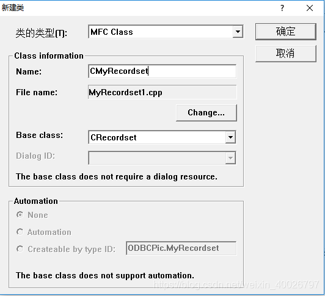

## 1 创建基于对话框的应用程序

1. 工程取名ODBCPic，删除自动创建的程序对话框资源中默认存在的静态文本控件和两个按钮控件。
2. 然后在该对话框资源上摆放两个按钮控件，ID（标题）分别为IDC_ADD_DATA（添加数据）、IDC_READ_DATA（读出数据）。
3. 在FileView里打StdAfx.h里添加头文件 `#include <afxdb.h>`。

## 2 添加类CMyRecordset

CMyRecordset （子类）基于 CRecordSet（父类）实现，如下图所示：




确认后选择需要读写的数据表，VC++6.0会自动导入表中的字段，MyRecordset.h部分代码如下：

```cpp
class CMyRecordset : public CRecordset
{
public:
	CMyRecordset(CDatabase* pDatabase = NULL);
	DECLARE_DYNAMIC(CMyRecordset)
 
// Field/Param Data
	//{{AFX_FIELD(CMyRecordset, CRecordset)
	CString	m_ID;    //数据表中的ID字段，类型为varchar
	CLongBinary m_PIC;  //数据表中的PIC字段，类型为mediumblob
	//}}AFX_FIELD
 
 
// Overrides
	// ClassWizard generated virtual function overrides
	//{{AFX_VIRTUAL(CMyRecordset)
	public:
	virtual CString GetDefaultConnect();    // Default connection string
	virtual CString GetDefaultSQL();    // Default SQL for Recordset
	virtual void DoFieldExchange(CFieldExchange* pFX);  // RFX support
	//}}AFX_VIRTUAL
 
// Implementation
#ifdef _DEBUG
	virtual void AssertValid() const;
	virtual void Dump(CDumpContext& dc) const;
#endif
};
```

## 3 链接并写入数据库

1. 在ODBCPicDlg.cpp文件中添加头文件代码：

```cpp
#include "MyRecordset.h"
#include <io.h>
```

2. 链接数据库并写入图片：

```cpp
void CODBCPicDlg::OnAddData() 
{
	// TODO: Add your control notification handler code here
	CString fileName;
	fileName = "C:\\Users\\Administrator\\Desktop\\1.jpg"; //图片路径
	if ((access(fileName, 0)) != 0)  //判断文件是否存在
	{
		AfxMessageBox("文件不存在！");
		return;
	}
 
	CDatabase db;   //创建数据库对象
	//链接数据库DSN=数据源名称，UID=用户名，PWD=密码，字符编码CharSet=GBK
	db.Open(NULL,FALSE,FALSE,"ODBC;DSN=MySQL;UID=root;PWD=123;CharSet=GBK");
 
	CMyRecordset db_set(&db); //绑定数据库
	CString sql;
	sql = "SELECT * FROM ODBCPic";
	db_set.Open(CRecordset::snapshot,sql);
	db_set.AddNew();
	db_set.m_ID="第一张图片";
	CFile file;
	file.Open("C:\\Users\\Administrator\\Desktop\\1.jpg",CFile::modeRead|CFile::typeBinary);//打开指定文件
	db_set.m_PIC.m_dwDataLength = file.GetLength();//m_blobfile为数据库中blob字段由classwizard映射过来的CLongBinary字段
	HGLOBAL hGlobal = GlobalAlloc(GPTR,db_set.m_PIC.m_dwDataLength);
	db_set.m_PIC.m_hData = GlobalLock(hGlobal);
	file.Read(db_set.m_PIC.m_hData,db_set.m_PIC.m_dwDataLength);
	db_set.SetFieldDirty(&db_set.m_PIC,true);
	db_set.SetFieldNull(&db_set.m_PIC,false);
	GlobalUnlock(hGlobal);
 
	db_set.Update();//更新数据集
	db_set.Close();//关闭数据集
    db.Close();
	file.Close();//关闭文件
}
```

> 备注：由于VC++6.0是32位程序，所以将字符编码设置为GBK：CharSet=GBK，数据表的字符集也必须设置为GBK。

3. 读出图片：

```cpp
void CODBCPicDlg::OnReadData() 
{
	// TODO: Add your control notification handler code here
	CDatabase db;  //创建数据库对象
	//链接数据库DSN=数据源名称，UID=用户名，PWD=密码，字符编码CharSet=GBK
	db.Open(NULL,FALSE,FALSE,"ODBC;DSN=MySQL;UID=root;PWD=123;CharSet=GBK");
	
	CRecordset rs_set(&db);  //绑定数据库
	CString sql;
	sql="select * from ODBCPic where ID = '第一张图片'";
	rs_set.Open(CRecordset::forwardOnly,sql);
	if (rs_set.IsEOF())  //判断光标是否到达数据集尾部
	{
		rs_set.Close();
		db.Close();
		AfxMessageBox("检索结束，目标不存在！");
		return ;
	}
	while (!rs_set.IsEOF())
	{
		//CString PIC;
		CDBVariant CDBVariantPIC;  //创建可变数据
		rs_set.GetFieldValue("PIC",CDBVariantPIC); //用CDBVariantPIC对象来保存字段PIC的值
		int PICBuffLen=(int)CDBVariantPIC.m_pbinary->m_dwDataLength;  //获取文件二进制长度
		if(PICBuffLen>0)
		{
			LPSTR PICtemp = (LPSTR)GlobalLock(CDBVariantPIC.m_pbinary->m_hData); //锁定数据句柄内存
			GlobalUnlock(CDBVariantPIC.m_pbinary->m_hData);  //解锁内存
 
			CString fileName;
			fileName = "C:\\Users\\Administrator\\Desktop\\第一张图片.jpg";
			if ((access(fileName, 0)) != 0)  //判断文件是否存在
			{	
				CFile file;
				if (file.Open(fileName, CFile::modeCreate|CFile::modeWrite|CFile::typeBinary) == FALSE)
				{
					AfxMessageBox("文件出错！");
				}
				else
				{
					file.Write(PICtemp,PICBuffLen);  //写入文件
					file.Flush(); //将缓冲区的内容写入文件，并清空（如果不加文件可能会少一点）
					file.Close();
				}
			}
			break; //如果记录集只有一张图片，写完后跳出循环即可
			//rs_set.MoveNext(); //如果记录集有多张图片，写完一张后将光标下移继续写
			//注：记得修改路径为增量，否则最后一张图片会将前面的图片覆盖
		}
	}
	rs_set.Close();
    db.Close();
}
```
