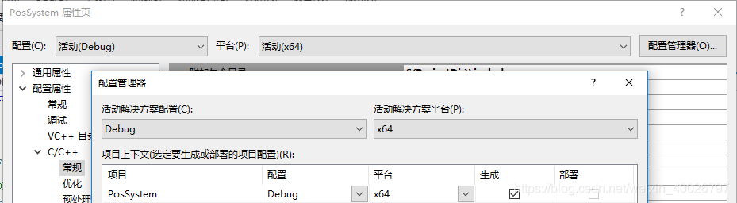

## 1 添加附加包含目录

在VS2012中，"项目"->"属性"->"配置属性"->"C/C++"->"常规"->"附加包含目录"，将mysql 的 `server\include` 绝对路径添加进去，例如：

```bash
C:\Program Files\MySQL\MySQL Server 5.6\include
```

也可以将include文件整个拷贝到工程目录下，然后在VS2012目录里面设置相对路径，例如：

```bash
$(ProjectDir)\include
```

如果将include文件整个拷贝到工程目录下，但不设置附加包含目录，则在使用mysql.h这些头文件的时候采用以下这种方式添加头文件：

```cpp
#include "include\mysql.h"
```

## 2 添加库文件及附加依赖项

1.  将`MySQL Server 5.6/lib` 下的 `libmysql.dll` 和 `libmysql.lib` 复制到我们工程项目文件下。
2.  为工程添加附加依赖项 `wsock32.lib` 和 `libmysql.lib`，一种方式是"工程"->"属性"->"链接器"->"输入"->"附加依赖项"，另一种是在程序开头添加以下代码：

```cpp
#pragma comment(lib,"xxx.lib")
```

## 3 添加头文件

```cpp
//mysql所需的头文件和库文件 
#include <winsock.h>    //注意这两个头文件的次序不能放错
#include "mysql.h"
 
//包含附加依赖项，也可以在工程--属性里面设置
#pragma comment(lib,"libmysql.lib")
```

## 4 连接数据库

```cpp
//以下变量在头文件中定义
MYSQL m_sqlConnect;       //数据源指针
 
//连接数据库函数
bool CPosSystemDlg::ConnectMySQL(void)
{
    mysql_init(&m_sqlConnect);
//主机IP、用户、密码、数据库、端口、套接字、客户端标识、无
if(!mysql_real_connect(&m_sqlConnect,"0.0.0.0","username","password","sql",3306,NULL,0))
	{
		AfxMessageBox(_T("连接数据库失败"));
		CString error(mysql_error(&m_sqlConnect));
		MessageBox(error);
		return false;
	}
	else 
	{
		AfxMessageBox(_T("连接数据库成功"));
		return true;
	}
}
 
//释放资源函数
void CPosSystemDlg::FreeConnect(void)
{
	//释放资源
    mysql_free_result(m_sqlRes);
    mysql_close(&m_sqlConnect);
}
```

## 5 编译报错处理

对于32位只要按照以上代码连接即可。

但是由于系统是32位或者64位的不同，编译时会引起如下错误：

```bash
无法解析的外部符号 _mysql_init@4、_mysql_query......
```

对于64位，有两种方法解决上述错误：

### 5.1 方法一

由于VS建立的项目默认为WIN32 项目，需将平台改为64。设置如下：

1. "项目"—>"属性"—>"配置属性"—>"配置管理器"—>"活动解决方案平台"，下拉选新建，出现一个新的对号框，在键入选择新平台中选择X64，如下图所示：



2. 不是将 `C:\ProgramFiles\MySQL\MySQL Server 5.7\lib`（安装MySql下的lib文件夹）中的 `libmysql.dll` 拷到项目下的Debug文件夹中，而是拷到项目下 `x64\Debug` 中（或者 `C:\Windows\System32` 中）。

### 5.2 方法二

要包含32位的lib文件和dll文件。

1. 首先下载32位的lib文件和dll文件。

> 备注：32/64位MySql（lib、dll）资源：http://download.csdn.net/detail/u010439291/8453041

2. 需要将32位的lib文件拷到 `C:\Program Files\MySQL\MySQL Server 5.7\lib`（安装Mysql下的lib文件夹），拷贝之前需要将原来的 `libmysql.lib` 更名。也可以不改变原来的lib文件名称，而将32位的 `libmysql.lib` 改为 `libmysql32.lib`。

3. 同时在"项目"->"属性"->"连接器"->"输入"->"附加依赖项"：添加 `libmysql32.lib`（名称和之前保持一致）。

4. 编译通过之后，运行还要将32位的 `libmysql.dll` 放在工程目录Debug文件夹中或者System32下。

## 6 增删查改操作

```cpp
//以下变量在头文件中定义
MYSQL_RES *m_sqlRes;      //这个结构代表返回行的一个查询结果集
MYSQL_ROW row;    //读到的数据保存在这个数组里，通过row[0]按列读取
 
//查询数据
bool CPosSystemDlg::SelectData(char sqlstr[])
{
	mysql_query(&m_sqlConnect, "set names gbk"); //设置编码格式，防止中文乱码
	//返回0 查询成功，返回1查询失败
	if(mysql_query(&m_sqlConnect,sqlstr)) //执行sql语句
	{
		CString error(mysql_error(&m_sqlConnect));
		MessageBox(error);
		return false;
	}
	else
	{
		AfxMessageBox(_T("查询成功"));
		//获取结果集
		if (!(m_sqlRes=mysql_store_result(&m_sqlConnect)))    //获得sql语句结束后返回的结果集
		{
			CString error(mysql_error(&m_sqlConnect));
			MessageBox(error);
			return false;
		}
		else
		{
			// 将结果逐行读出直到读完
			row = mysql_fetch_row(m_sqlRes);//得到第一条结果
			while (row!=NULL)
			{		
				CString str=CString(row[0]);
				MessageBox(str);
				row = mysql_fetch_row(m_sqlRes);//取下一条结果
			}
		}
	}
}
```

增删改三项功能直接通过 `mysql_query(&m_sqlConnect,sqlstr)` 语句执行sql语句就OK了。

## 7 附录：MySQL的API接口

```cpp
mysql_affected_rows() 返回被最新的UPDATE, DELETE或INSERT查询影响的行数。  
mysql_close() 关闭一个服务器连接。  
mysql_connect() 连接一个MySQL服务器。该函数不推荐；使用mysql_real_connect()代替。  
mysql_change_user() 改变在一个打开的连接上的用户和数据库。  
mysql_create_db() 创建一个数据库。该函数不推荐；而使用SQL命令CREATE DATABASE。  
mysql_data_seek() 在一个查询结果集合中搜寻一任意行。  
mysql_debug() 用给定字符串做一个DBUG_PUSH。  
mysql_drop_db() 抛弃一个数据库。该函数不推荐；而使用SQL命令DROP DATABASE。  
mysql_dump_debug_info() 让服务器将调试信息写入日志文件。  
mysql_eof() 确定是否已经读到一个结果集合的最后一行。这功能被反对; mysql_errno()或mysql_error()可以相反被使用。  
mysql_errno() 返回最近被调用的MySQL函数的出错编号。  
mysql_error() 返回最近被调用的MySQL函数的出错消息。  
mysql_escape_string() 用在SQL语句中的字符串的转义特殊字符。  
mysql_fetch_field() 返回下一个表字段的类型。  
mysql_fetch_field_direct () 返回一个表字段的类型，给出一个字段编号。  
mysql_fetch_fields() 返回一个所有字段结构的数组。  
mysql_fetch_lengths() 返回当前行中所有列的长度。  
mysql_fetch_row() 从结果集合中取得下一行。  
mysql_field_seek() 把列光标放在一个指定的列上。  
mysql_field_count() 返回最近查询的结果列的数量。  
mysql_field_tell() 返回用于最后一个mysql_fetch_field()的字段光标的位置。  
mysql_free_result() 释放一个结果集合使用的内存。  
mysql_get_client_info() 返回客户版本信息。  
mysql_get_host_info() 返回一个描述连接的字符串。  
mysql_get_proto_info() 返回连接使用的协议版本。  
mysql_get_server_info() 返回服务器版本号。  
mysql_info() 返回关于最近执行得查询的信息。  
mysql_init() 获得或初始化一个MYSQL结构。  
mysql_insert_id() 返回有前一个查询为一个AUTO_INCREMENT列生成的ID。  
mysql_kill() 杀死一个给定的线程。  
mysql_list_dbs() 返回匹配一个简单的正则表达式的数据库名。  
mysql_list_fields() 返回匹配一个简单的正则表达式的列名。  
mysql_list_processes() 返回当前服务器线程的一张表。  
mysql_list_tables() 返回匹配一个简单的正则表达式的表名。  
mysql_num_fields() 返回一个结果集合重的列的数量。  
mysql_num_rows() 返回一个结果集合中的行的数量。  
mysql_options() 设置对mysql_connect()的连接选项。  
mysql_ping() 检查对服务器的连接是否正在工作，必要时重新连接。  
mysql_query() 执行指定为一个空结尾的字符串的SQL查询。  
mysql_real_connect() 连接一个MySQL服务器。  
mysql_real_query() 执行指定为带计数的字符串的SQL查询。  
mysql_reload() 告诉服务器重装授权表。  
mysql_row_seek() 搜索在结果集合中的行，使用从mysql_row_tell()返回的值。  
mysql_row_tell() 返回行光标位置。  
mysql_select_db() 连接一个数据库。  
mysql_shutdown() 关掉数据库服务器。  
mysql_stat() 返回作为字符串的服务器状态。  
mysql_store_result() 检索一个完整的结果集合给客户。  
mysql_thread_id() 返回当前线程的ID。  
mysql_use_result() 初始化一个一行一行地结果集合的检索。 
```
