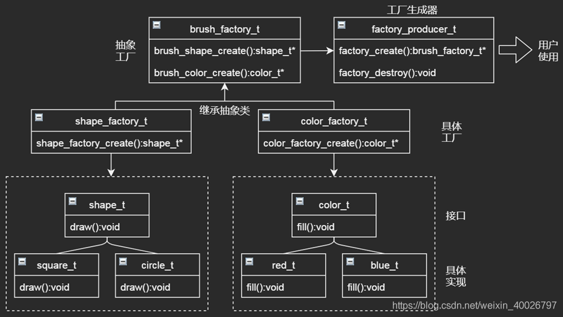

## 1 前言

近期有幸参加了李先静李老师组织的设计模式研讨会，与各位同事共同学习探讨设计模式的相关知识，往后的大多数的博客内容将会围绕设计模式的学习展开。

研讨会内容参考书籍《设计模式——可复用面向对象软件的基础 》，博客中也会大量引用这本书里的定义，但这本书的翻译非常晦涩难读，在博客中我尽量用一些通俗的描述代替，也方便以后自己查阅。

> 李老师博客地址：[http://blog.csdn.net/absurd](http://blog.csdn.net/absurd)。

## 2 抽象工厂模式

抽象工厂模式（Abstract Factory Pattern）是围绕一个超级工厂创建其他工厂。它属于创建型模式，提供了一种比较好的创建对象的方式。

**简单理解**：工厂是对具体产品（对象）的抽象，而抽象工厂则是对这些具体工厂的抽象。工厂提供统一接口创建不同的产品，而抽象工厂提供统一接口创建不同的工厂。

**目的**：抽象工厂模式其实想干的事情就是给用户提供一个创建一系列相关或相互依赖对象的接口，但用户是不需要指定它们的具体类。

通过以上简单的介绍，可以知道抽象工厂模式主要解决的是接口选择的问题，接下来我们来看一个示例。

## 3 示例类图及C语言代码

### 3.1 示例介绍

假如要实现一个画笔功能，可以画不同的形状（shape）、填充不同的颜色（color）。

**形状**：方形（square）、圆形（circle）；
**功能**：绘制（draw）。

**颜色**：红色（red）、蓝色（blue）；
**功能**：填充（fill）。

### 3.2 示例类图

根据以上描述，使用抽象工厂模式的类图如下：



首先需要创建 shape_t 和 color_t 接口和实现这些接口的实体类。下一步是创建抽象工厂类 brush_factory_t。接着定义工厂类 shape_factory_t 和 color_factory_t，这两个工厂类都继承了抽象工厂类 brush_factory_t。然后创建一个工厂生成器 factory_froducer_t ，该接口提供给用户使用。

### 3.3 C语言实现

1. 创建 shape_t 接口并完成具体实现（square_t、circle_t）:

```c
/************************ shape_t *************************/
typedef void(*draw_t)();
typedef struct _shape_t {
	draw_t draw;
}shape_t;

/* square_t implement shape_t */
typedef struct _square_t {
	shape_t shape;
}square_t;

static void square_draw() {
	printf("square_draw!\n");
}

square_t* square_create() {
	square_t* square = malloc(sizeof(square_t));
	square->shape.draw = square_draw;
	return square;
}

/* circle_t implement shape_t */
typedef struct _circle_t {
	shape_t shape;
}circle_t;

static void circle_draw() {
	printf("circle_draw!\n");
}

circle_t* circle_create() {
	circle_t* circle = malloc(sizeof(circle_t));
	circle->shape.draw = circle_draw;
	return circle;
}
```

2. 创建 color_t 接口并完成具体实现（red_t、blue_t）:

```c
/************************* color_t *************************/
typedef void(*fill_t)();
typedef struct _color_t {
	fill_t fill;
}color_t;

/* red_t implement color_t */
typedef struct _red_t {
	color_t color;
}red_t;

static void red_fill() {
	printf("red_fill!\n");
}

red_t* red_create() {
	red_t* red = malloc(sizeof(red_t));
	red->color.fill = red_fill;
	return red;
}

/* blue_t implement color_t */
typedef struct _blue_t {
	color_t color;
}blue_t;

static void blue_fill() {
	printf("blue_fill!\n");
}

red_t* blue_create() {
	blue_t* blue = malloc(sizeof(blue_t));
	blue->color.fill = blue_fill;
	return blue;
}
```

3. 为 shape_t 和 color_t 创建抽象工厂（ brush_factory_t ）来获取具体的工厂：

```c
/************************* brush_factory_t (Abstract Factory) *************************/
typedef shape_t* (*brush_shape_create_t)(char* shape);
typedef void(*brush_shape_destory_t)(shape_t* shape);
typedef color_t* (*brush_color_create_t)(char* color);
typedef void(*brush_color_destroy_t)(color_t* color);

typedef struct _brush_factory_t {
	brush_shape_create_t brush_shape_create;
	brush_shape_destory_t brush_shape_destory;
	brush_color_create_t brush_color_create;
	brush_color_destroy_t brush_color_destroy;
}brush_factory_t;
```

4. 实现具体工厂 shape_factory_t 和 color_factory_t ：

```c
/* shape_factory_t implement brush_factory_t */
typedef struct _shape_factory_t {
	brush_factory_t brush_factory;
}shape_factory_t;

static shape_t* brush_shape_create(char* shape) {
	if (!strcmp(shape, "square")) {
		return square_create();
	} else if (!strcmp(shape, "circle")) {
		return circle_create();
	}
	return NULL;
}

static void brush_shape_destroy(shape_t* shape) {
	free(shape);
}

shape_factory_t* shape_factory_create() {
	shape_factory_t* shape_factory = malloc(sizeof(shape_factory_t));
	shape_factory->brush_factory.brush_shape_create = brush_shape_create;
	shape_factory->brush_factory.brush_shape_destory = brush_shape_destroy;
	shape_factory->brush_factory.brush_color_create = NULL;
	shape_factory->brush_factory.brush_color_destroy = NULL;
	return shape_factory;
}

/* color_factory_t implement brush_factory_t */
typedef struct _color_factory_t {
	brush_factory_t brush_factory;
}color_factory_t;

static color_t* brush_color_create(char* color) {
	if (!strcmp(color, "red")) {
		return red_create();
	} else if (!strcmp(color, "blue")) {
		return blue_create();
	}
	return NULL;
}

static void brush_color_destroy(color_t* color) {
	free(color);
}

color_factory_t* color_factory_create() {
	color_factory_t* color_factory = malloc(sizeof(color_factory_t));
	color_factory->brush_factory.brush_shape_create = NULL;
	color_factory->brush_factory.brush_shape_destory = NULL;
	color_factory->brush_factory.brush_color_create = brush_color_create;
	color_factory->brush_factory.brush_color_destroy = brush_color_destroy;
	return color_factory;
}
```

5. 实现工厂生成器（ factory_producer_t ），提供给用户使用：

```c
/************************* factory_producer_t  *************************/
brush_factory_t* factory_create(char* choice) {
	if (!strcmp(choice, "shape")) {
		return shape_factory_create();
	}
	else if (!strcmp(choice, "color")) {
		return color_factory_create();
	}
	return NULL;
}

void factory_destroy(brush_factory_t* brush_factory) {
	free(brush_factory);
}
```

6. 使用代码如下：

```c
int main(int argc, const char* argv[]) {
	brush_factory_t* shape_factory = factory_create("shape");
	shape_t* shape1 = shape_factory->brush_shape_create("circle");
	shape_t* shape2 = shape_factory->brush_shape_create("square");
	shape1->draw();
	shape2->draw();

	brush_factory_t* color_factory = factory_create("color");
	color_t* color1 = color_factory->brush_color_create("red");
	color_t* color2 = color_factory->brush_color_create("blue");
	color1->fill();
	color2->fill();
	
	shape_factory->brush_shape_destory(shape1);
	shape_factory->brush_shape_destory(shape2);
	color_factory->brush_color_destroy(color1);
	color_factory->brush_color_destroy(color2);
	factory_destroy(shape_factory);
	factory_destroy(color_factory);
	getchar();

	return 0;
}
```


7. 输出效果：

```bash
circle_draw!
square_draw!
red_fill!
blue_fill！
```

## 4 总结

### 4.1 抽象工厂模式的优缺点

- **它分离了具体的类**：用户只使用抽象工厂以及抽象产品的接口，具体工厂和具体品的类不会出现在用户代码中。
- **它有利于切换产品系列（具体工厂）**：具体工厂类只在初始化的时候出现一次，么切换产品系列，只需要修改具体工厂。
- **它有利于产品的一致性**：当一个系列中的产品对象被设计成一起工作时，一个应一次只能使用同一个系列中的对象。
- **难以支持新种类的产品（扩展性较差）**：新增新种类的产品，需要修改抽象工厂类及其所有子类，工作量较大。

### 4.2 抽象工厂模式的适用场景

1. 一个系统要独立于它的产品的创建、组合和表示，即要将具体产品类分离出来；
2. 一个系统要有多个产品系列中的一个来配置，即系统有多个产品系列，但只使用一个产品系列；
3. 要强调一系列相关产品对象的设计以便进行联合使用，即保证具体产品的一致性；
4. 提供一个产品类库，但只想显示它们的接口而不是实现。

### 4.3 简单工厂、抽象工厂和工厂方法之间的区别

最后，通过对抽象工厂模式的学习发现该模式包含了简单工厂模式和工厂方法的某些特性，三者之间的区别如下：

- **简单工厂模式**：一个具体工厂可生产多种具体产品；
- **抽象工厂模式**：一个抽象工厂可生产多种具体工厂，其中每个具体工厂可以生产多种具体产品；
- **工厂方法模式**：一个具体工厂只能生产一种具体产品。
