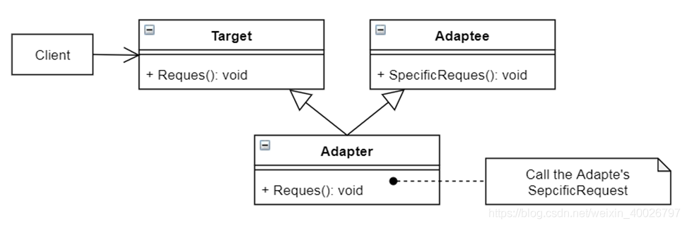

## 1 前言

本周参加了第三次设计模式研讨会，主题是适配器（Adapter）模式，接下来我们来看看该模式的具体内容。

## 2 适配器模式

**Adapter模式**：将一个类的接口转换成用户希望的另一个接口。

**意图**：使得原本由于接口不兼容而不能一起工作的那些类可以一起工作。

**主要解决**：主要解决在软件系统中，常常要将一些“现存的对象”放到新的环境中，而新环境要求的接口是现对象不能满足的，此时可通过适配器来转换接口。

**举个例子**：开发某个模块时，有一个功能点实现起来很费劲，但之前有一个项目的模块实现了一样的功能点，但现在这个模块和之前那个的接口是不一样的，因此需要在中间加一个适配器（ Adapter ）。

**简单理解**：适配器即在不兼容的东西之间搭建一座桥梁，让二者能够一起工作。

## 3 实际例子
有一个绘图编辑器，可画 LineShape、PolygonShape 等基本图像，图形对象的抽象接口为Shape（即具体图像为子类）。

现在想新增一个绘制字符的子类 TextShape，这实现起来相当困难，但是目前项目中存在一个 TextView 类用于显示和编辑文本。

最理想的情况是复用 TextView 类，实现 TextShape 类 ，但之前设计 TextView 类的时候没有考虑到有 Shape 的存在，因此二者接口不兼容。

此时，我们可定义一个 TextShape 类，继承 Shape 类的接口和 TextView 类实现，将 TextView 实例作为 TextShape 的组成部分。

这个 TextShape 类就被称为 适配器（Adapter）。

## 4 结构与参与者

### 4.1 类适配器（多重继承）



类适配器是该设计模式的一种实现形式，Adapter继承自Target和Adapee类，Adapter类需要重写Target类的Request()函数，在Request()函数中做适当处理，调用Adaptee类的SepcificRequest()函数。最终，Target实际调用的是Adaptee类中的SepcificRequest()函数来完成相关操作，达到适配（兼容）的目的。

### 4.2 对象适配器（依赖对象组合）


对象适配器是另一种实现形式，Adapter继承自Target类，且其中有Adaptee类型的成员变量， Adaptee类重写Request()函数时，在Request()函数中使用该成员变量调用的Adaptee类中的SepcificRequest()函数，达到适配（兼容）的目的。

### 4.3 参与者

- Target：定义Client使用的与特定领域相关的接口（Shape）；
- Client：与符合Target接口的对象协同（实际上就是Shape的用户）；
- Adaptee：一个已经存在的接口，这个接口需要适配（TextView）；
- Adapter：对Adaptee的接口与Target接口进行适配（TextShape）；

### 4.4 两种适配器实现的比较

**类适配器的特点**：

- Adapter类直接继承Adaptee类，可以在Adapter类中对Adaptee类的方法进行重定义；
- 在Adaptee类新增抽象方法，Adapter类也要改动，代码耦合度高； 
- 如果Adaptee类有其他子类， Adapter类中无法调用Adaptee子类的方法。

**对象适配器的特点**：

- 有时会发现，构造一个Adaptee 类对象比较困难；
- 在Adaptee类新增抽象方法， Adapter类无需修改，也能正常使用；
- 可以使用多态的方式在Adapter类中调用Adaptee子类的方法。

**总结**：对象适配器耦合度比较低，能使用对象组合的方式，就尽量使用，避免多重继承，但如果构造 Adaptee 对象非常困难，那么可以考虑用类适配器。

## 5 适配器模式在AWTK中的应用

nanovg是一个非常小巧的矢量绘图函数库。相比cairo和skia的数十万行代码，nanovg不足5000行的C语言代码，称为nano也是名副其实了。

nanovg的设计、接口和代码质量都堪称典范，唯一美中不足的就是性能不太理想。由于nanovg本身只有 OpenGL 的实现，在Android的低端机型和大屏幕的机型上，一个简单的界面每秒只能画十几帧。

因此，AWTK 使用 nanovg 矢量绘图功能的前端，虽然其后端实现只有OpenGL，但 AWTK 补充了 AGG 、AGGE、BGFX 的后端实现。这其中便采用了适配器模式，比如兼容 nanovg 和 AGGE 接口的适配器 nanovg_agge。

> AWTK是 [ZLG](http://www.zlg.cn/) 开发的开源 GUI 引擎，前往 [官网](https://www.zlg.cn/index/pub/awtk.html)。

> nanovg仓库：[https://github.com/zlgopen/nanovg](https://github.com/zlgopen/nanovg)。

以 AGGE 为例，结合本文 4.2 中的类图来看，nanovg 即为 Target，AGGE 即为 Adaptee，nanovg_agge 即为适配器Adapter，其中适配器 nanovg_agge 的部分代码如下，感兴趣的朋友可以查看 AWTK 源码。

```cpp
//awtk\3rd\nanovg\agge\nanovg_agge.cpp
void nvgReinitAgge(NVGcontext* ctx, uint32_t w, uint32_t h, uint32_t stride, enum NVGtexture format,
                   uint8_t* data) {
  NVGparams* params = nvgGetParams(ctx);
  AGGENVGcontext* agge = (AGGENVGcontext*)(params->userPtr);

  nvgInitAGGE(agge, params, w, h, stride, format, data);
}

NVGcontext* nvgCreateAGGE(uint32_t w, uint32_t h, uint32_t stride, enum NVGtexture format, uint8_t* data) {
  NVGparams params;
  NVGcontext* ctx = NULL;
  AGGENVGcontext* agge = new AGGENVGcontext();

  if (agge == NULL) goto error;

  memset(&params, 0, sizeof(params));
  params.setLineJoin = aggenvg__setLineJoin;
  params.setLineCap = aggenvg__setLineCap;
  params.renderCreate = aggenvg__renderCreate;
  params.findTexture = aggenvg__renderFindTexture;
  params.renderCreateTexture = aggenvg__renderCreateTexture;
  params.renderDeleteTexture = aggenvg__renderDeleteTexture;
  params.renderUpdateTexture = aggenvg__renderUpdateTexture;
  params.renderGetTextureSize = aggenvg__renderGetTextureSize;
  params.renderViewport = aggenvg__renderViewport;
  params.renderCancel = aggenvg__renderCancel;
  params.renderFlush = aggenvg__renderFlush;
  params.renderDelete = aggenvg__renderDelete;
  params.clearCache = aggenvg__clearCache;
  params.userPtr = agge;
  params.edgeAntiAlias = 1;

  nvgInitAGGE(agge, &params, w, h, stride, format, data);

  ctx = nvgCreateInternal(&params);
  if (ctx == NULL) goto error;

  return ctx;

error:
  if (ctx != NULL) nvgDeleteInternal(ctx);
  return NULL;
}

void nvgDeleteAGGE(NVGcontext* ctx) {
  nvgDeleteInternal(ctx);
}
```

需要注意的是，观察 nanovg_agge 的构造函数 nvgCreateAGGE()，其中构建了一个 AGGE 的对象 AGGENVGcontext* agge ，通过该对象来调用 AGGE 接口中的具体实现，因此 nanovg_agge 是对象适配器。

## 6 总结

**优点**：

- 可以让两个没有关联的类一起运行，协同工作。 
- 提高了类的复用； 
- 增加了类的透明度； 
- 灵活性好；

**缺点**：过多使用适配器，会让系统非常凌乱，比如看到的是A接口，实际上内部被适配成了B接口，这种情况多了，无异于异常灾难，因此如果不是必要情况，尽量不要使用适配器，而是直接对系统进行重构。

**应用场景**：使用一个已经存在的类，如果它的接口和你实际要求不一致时，可以考虑使用适配器模式，需要注意的是最好在调用者和功能提供者双方都不太容易修改的时候再使用适配器模式，而不是一有不同就使用它。

**注意事项**：适配器不是在详细设计时添加的，而是解决正在服役项目的问题。
