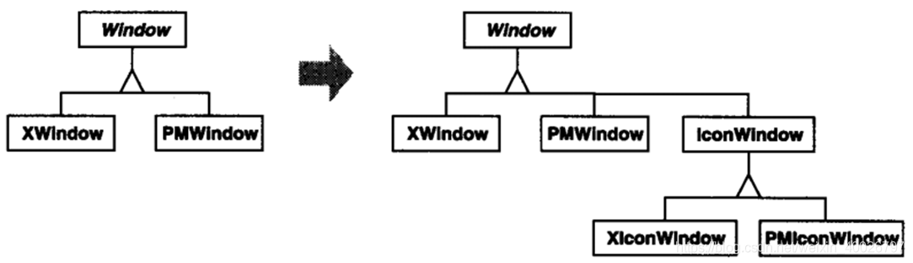
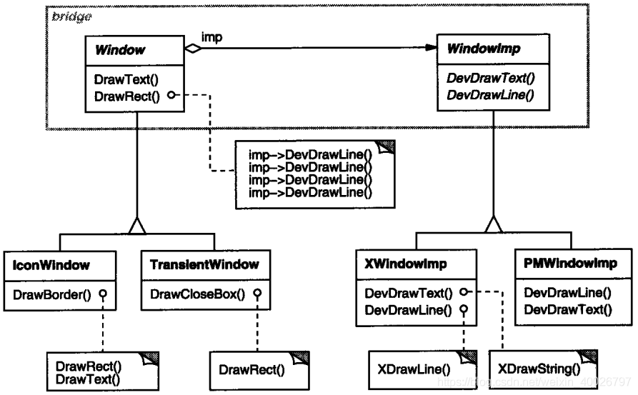
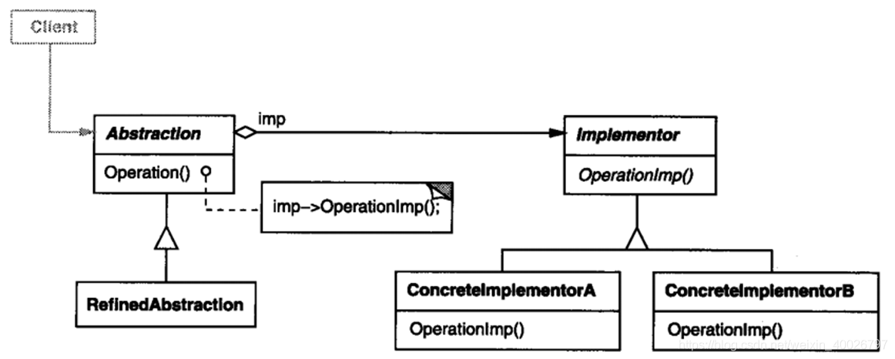

## 1 前言

本周参加了第四次设计模式研讨会，主题是桥接（Bridge）模式，接下来我们来看看该模式的具体内容。

## 2 桥接模式

**Bridge 模式**：将抽象化与实现化解耦，使得二者可以独立变化。

**意图**：将抽象部分与它的实现部分分离，使它们都可以独立地变化。

**主要解决**：在有多种可能会变化的情况下，用继承会造成类爆炸问题，扩展起来不灵活。

**举个例子**：墙上的开关。可以看到的开关是抽象的，不用管里面具体怎么实现。

## 3 实际例子

在一个用户界面工具箱中，有一个可移植的 Window 抽象部分的实现。

例如，这一抽象部分应该允许用户开发一些在 X Window System 和 IBM 的 Presentation Manager(PM)系统中都可以使用的应用程序。

运用继承机制，我们可以定义 Window 抽象类和它的两个子类 X Window 与 PM Window，由它们分别实现不同系统平台上的 Window 界面。

**采用继承机制的不足**：

1. 扩展 Window 抽象使之适用于不同种类的窗口或新的系统平台很不方便。

2. 继承机制使得客户代码与平台相关。

**桥接模式的解决方法**：将 Window 抽象和它的实现分别放在独立的类层次结构中。

## 4 结构与参与者

**Abstraction**：定义抽象类接口，维护Imp对象的执政（Window）；

**RefineAbstraction**：扩充 Window 定义的接口（IconWindow）；

**Implementor**：定义实现类的接口，该接口不一定要与 Abstraction 的接口一致；事实上这两个接口可以完全不同。一般来讲，Implementor接口仅提供基本操作，而 Abstraction 则定义了基于这些基本操作的较高层次的操作；

**ConcreteImplementor** ：实现 Implementor 接口并定义它的具体实现(XwindowImp等)；

## 5 总结

**优点**：

 1. 抽象和实现分离； 
 2. 优秀的扩展能力； 
 3. 实现细节对客户透明。

**缺点**：桥接模式的引入会增加系统的理解与设计难度，由于聚合关联关系建立在抽象层，要求开发者针对抽象进行设计与编程。

**应用场景**：

1. 不希望抽象和它的实现之间建立静态的继承联系（固定绑定），比如程序运行时，实现部分可以被选择或者切换；
2. 适用于那些不希望使用继承或因为多层次继承导致类的个数急剧增加的情况；
3. 一个类存在两个独立变化的维度，且这两个维度都需要进行扩展。

**注意事项**：

1. 对于两个独立变化的维度，使用桥接模式再适合不过了。
2. 桥接模式有一个难点，即抽象接口中，Implementor指针对象的实例化，何时实例化具体的实现类？由于实现细节对客户透明，因此客户不知道具体的实现类，让客户通过具体的实现类去实例化 Implementor 对象并不好，因为这样就会把抽象接口和具体实现绑定，完全背离了桥接模式的意图。因此，Implementor 对象的实例化过程应该放在抽象接口的get_Implementor()方法中，也可以通过工厂模式对其进行实例化。
