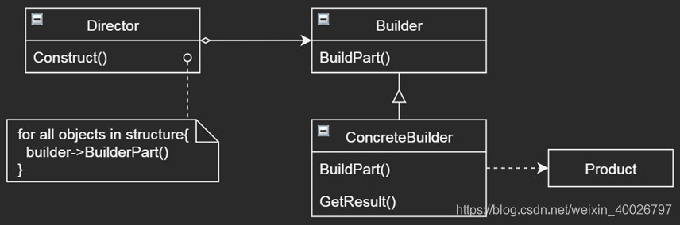

## 1 前言

本周参加了第二次设计模式研讨会，主题是生成器（Builder）模式，接下来我们来看看该模式的具体内容。

## 2 生成器模式

生成器（Builder）模式是一个很常用模式。《设计模式——可复用面向对象软件的基础》书中说，**它的意图是将一个复杂对象的构建与它的表示分离，使得同样的构建过程可以创建不同的表示**。

这句话刚开始看很难理解，**什么是构建、创建、表示**？打个简单的比方：假如我们现在要建房子，房子是一个复杂对象（也就是最终产品），砖头、钢筋和水泥是建筑材料（即复杂对象中包含的子对象），生产这些材料的过程就是所谓的构建，建房子的过程就是创建，房子的风格（比如宫殿、别墅等)就是所谓的表示。抽象点讲：

- **构建**：生成复杂对象中的子对象的过程——造砖、造水泥等；
- **创建**：生成复杂对象的过程——拿砖头造房子；
- **表示**：最终复杂对象表现出来的形式——房子的风格；

也就是说，Builder模式就是让制砖厂和建筑公司分开，由建筑公司决定房子的风格，让同样的砖头可以修建不同的房子，即同样的子对象可以生产不同复杂对象。

**Builder模式主要解决**：在软件系统中，有时候面临着“一个复杂对象”的创建，其通常由各个部分的子对象用一定算法构成；由于需求的变化，这个复杂对象的各个部分经常面临剧烈的变化，但是将它们组合在一起的算法却相对稳定。

简单理解：系统中组成复杂对象的具体子对象易变，相同的子对象又可以参与生成不同的复杂对象，但实际上组合复杂对象的方式是不变的，**Builder模式将变与不变的部分分离开**。

## 3 应用示例

XML是一种广泛使用的文件格式，本身是一个容器，可以存放各种数据。

操作XML文件最简单的方式是SAX（Simple API for XML），该方式采用了Builder模式，它把XML的 **解析** 和 **创建表示** 两个过程分开了，并且只负责 **解析** 过程，由用户自己负责 **创建表示** 的过程。

XML文件是递归结构，由tag和文本等基本元素组成，有始有终，SAX解析器（Parser）会解析出基本元素，但并不把这些元素构成一颗DOM树，而是把这些基本元素交给创建者Builder处理。至于Builder拿这些元素去干什么，SAX解析器是不管的。

可能拿去创建DOM树，可能只是取某个tag的属性，可能转换成pdf文档。

从SAX例子中，可以看出：采用Builder模式，重用了解析器的代码，把变化的部分隔离到Builder里。另外一方面，分离 解析 和 创建 两个过程，实际上也简化了问题的复杂度，解析器部分只负责解析，实现更加容易。且Builder更了解自己的目标，实现会更加专业。

## 4 结构与参与者

Builder模式的结构图：

- Builder：为创建Product的各个部件指定抽象接口（解析器要求提供的接口）；
- ConcreteBuilder：Builder的具体实现，比如创建DOM树；
- Director：构造一个使用Builder接口的对象（解析器Parser）；
- Product：被构造的复杂对象（最终产品）；

## 4 总结

**优点**：隔离变与不变，简化了问题复杂度；Builder独立，易扩展。

**缺点**：产品必须有共同点（组合方式相同）；变化复杂时会有很多Builder 。

**应用场景**：需要生成的对象具有复杂的内部结构；需要生成的对象内部属性本身相互依赖。

如：RTF阅读器、歌词解析、XML文件解析 等各类文本解析但具体表示不同的情况。

与抽象工厂模式相比，生成器模式着重于关注零件的装配，逐步构建复杂对象。

下一周我再尝试使用Builder模式实现一个简单的歌词解析器。
