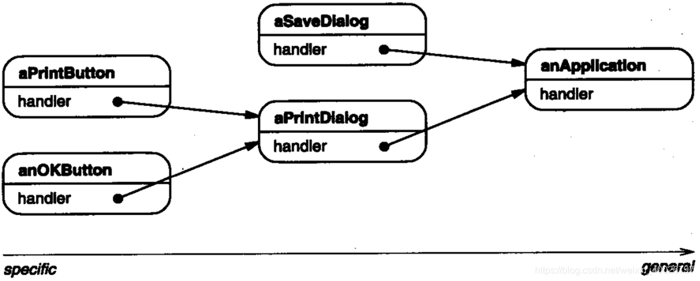
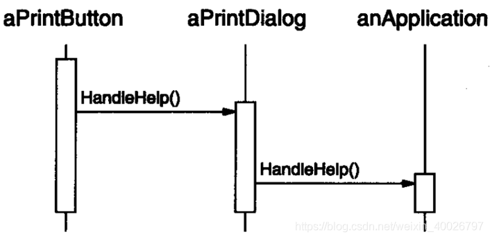
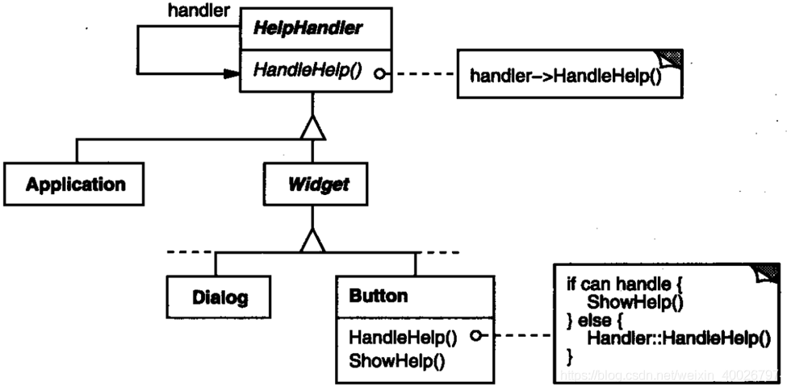
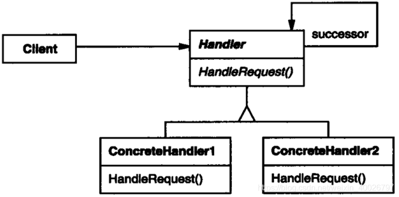
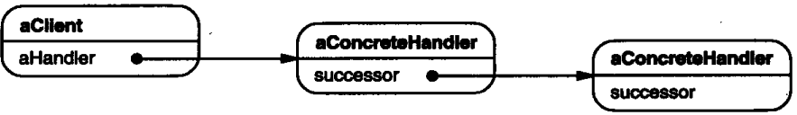

## 1 前言

本周参加了第九次设计模式研讨会，主题是职责链模式，接下来我们来看看该模式的具体内容。

## 2 职责链模式

**职责链模式**：为请求创建了一个接受者对象的链。该模式给予请求的类型，对请求的发送者和接受者进行解耦。

**意图**：使多个对象都有机会处理请求，从而避免请求的发送者和接收者之间的耦合关系。将这些对象连成一条链，并沿着这条链传递该请求，直到有一个对象处理它为止。

**主要解决**：职责链上的处理者负责处理请求，客户只需要将请求发送到职责链上即可，无需关心请求的处理细节和请求的传递，因此职责链将请求的发送者和请求的处理者解耦了。

## 3 示例介绍

例如，在一个图形用户界面中，有上下文相关的帮助机制。用户点击界面上任意位置可得到帮助信息，所提供的帮助依赖于点击的具体位置及其上下文。

简单举例：对话框中按钮的帮助信息和主窗口中类似按钮的帮助信息不同。

如果点击的位置没有特定的帮助信息，那么帮助系统应该显示一个关于当前上下文的较一般（缺省）的帮助信息，比如说，整个对话框。

因此，应根据普遍性，即**从最特殊到最普遍的顺序来组织帮助信息**。而且，在这些用户界面对象中会有一个对象来处理帮助请求，至于是哪一个对象则取决于上下文以及可用的帮助具体到何种程度。

**注意**：提交帮助请求的对象(如按钮)并不明确知道谁是最终提供帮助的对象。职责链模式就是将提交帮助请求的对象与可能提供帮助信息的对象解耦 。

职责链模式给多个对象处理一个请求的机会，该请求沿对象链传递直至其中一个对象处理它。



从第一个对象开始，链中收到请求的对象要么亲自处理它，要么转发给链中的下一个候选者。由于请求发送者并不知道谁将会处理它的请求，因此我们称该请求有一个隐式的接收者。

假设用户在一个标有 ”Print” 的按钮窗口组件上单击帮助，而该按钮包含在一个 PrintDialog 的实例中，该实例知道它所属的应用对象 。



在这个例子中，既不是 aPrintButton 也不是 aPrintDialog 处理该请求 ;它一直被传递给 anApplication，anApplication 处理它或忽略它。提交请求的客户不直接引用最终响应它的对象。

要沿链转发请求，并保证接收者为隐式的，每个在链上的对象都有一致的处理请求和访问链上后继者的接口。

例如，帮助系统可定义一个带有相应的 HandleHelp 操作的 HelpHandler 类。HelpHandler 可为所有候选对象类的父类，或者它可被定义为一个混入（mixin）类。

这样想处理帮助请求的类就可将 HelpHandler 作为其一个父类。

按钮、对话框，应用类都使用 HelpHandler 操作来处理帮助请求。HandleHelp 操作缺省将请求转发给后继。子类可重载这一操作处理请求；否则它们可使用缺省实现转发该请求。



## 4 结构与参与者



以下是一个典型的对象结构。



**Handlery** ：（HelpHandler）

1. 定义一个处理请求的接口。
2. （可选） 实现后继链。

**ConcreteHandler**：（ PrintButton、PrintDialog）

1. 处理它所负责的请求。
2. 可访问它的后继者。
3. 如果可处理该请求，就处理之；否则将该请求转发给它的后继者。

**Client**：

1. 向链上的具体处理者( ConcreteHandler )对象提交请求。

## 5 AWTK中的应用

在 AWTK 中，最典型的职责链模式应用就是消息响应流程，即事件发射器 emitter 的实现，在 emitter_dispatch() 接口中，事件请求将顺着职责链不断传递，当事件类型吻合时进行处理，通过处理函数返回值判断是否继续传递该请求，代码如下：

> AWTK是  [ZLG](http://www.zlg.cn/) 开发的开源 GUI 引擎，前往 [官网](https://www.zlg.cn/index/pub/awtk.html)。
> AWTK 的 GitHub 仓库：[https://github.com/zlgopen/awtk](https://github.com/zlgopen/awtkk)。

```c
//awtk/src/tkc/emitter.c
ret_t emitter_dispatch(emitter_t* emitter, event_t* e) {
  ret_t ret = RET_OK;
  return_value_if_fail(emitter != NULL && e != NULL, RET_BAD_PARAMS);

  if (!(e->time)) {
    e->time = time_now_ms();
  }

  if (e->target == NULL) {
    e->target = emitter;
  }

  if (emitter->enable && emitter->items) {
    emitter_item_t* iter = emitter->items;

    while (iter != NULL) {
      emitter->curr_iter = iter;
      if (iter->type == e->type) {
        ret = iter->handler(iter->ctx, e);
        if (ret == RET_STOP) {
          emitter->curr_iter = NULL;
          if (emitter->remove_curr_iter) {
            emitter->remove_curr_iter = FALSE;
            emitter_remove_item(emitter, iter);
          }
          return ret;
        } else if (ret == RET_REMOVE || emitter->remove_curr_iter) {
          emitter_item_t* next = iter->next;

          emitter->curr_iter = NULL;
          emitter->remove_curr_iter = FALSE;
          emitter_remove_item(emitter, iter);
          iter = next;

          continue;
        }
      }

      iter = iter->next;
    }
  }
  emitter->curr_iter = NULL;
  emitter->remove_curr_iter = FALSE;

  return RET_OK;
}
```

## 6 总结

### 6.1 优缺点

**优点**：

1. 降低耦合度，将请求的发送者和接受者解耦；
2. 简化了对象，使得对象不需要知道链的结构（只需保存后继者的引用）；
3. 增强给对象指派职责的灵活性，通过改变链内的成员或者调动它们的次序，允许动态地新增或者删除责任；
4. 增加新的请求处理类很方便。

**缺点**：

1. 不能保证请求一定被接收，请求可能一直到链的末端都得不到处理，也存在请求异常（配置错误）从而得不到处理的情况；
2. 系统性能将收到一定影响，而且调试不太方便，可能会造成循环调用。
3. 可能不容易观察运行时的特征，有碍于除错。

### 6.2 应用场景

在以下条件下使用 Responsibility 链：

1. 有多个的对象可以处理一个请求，哪个对象处理该请求运行时刻自动确定。
2. 你想在不明确指定接收者的情况下，向多个对象中的一个提交一个请求。
3. 可处理一个请求的对象集合应被动态指定。
