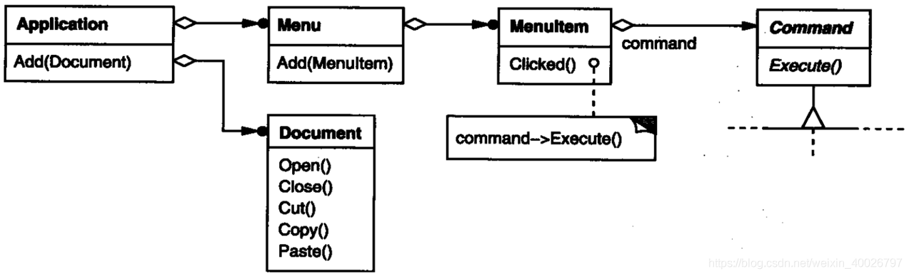
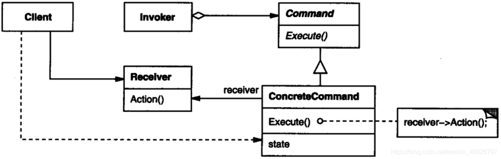

## 1 前言

本周参加了第十次设计模式研讨会，主题是命令模式，接下来我们来看看该模式的具体内容。

## 2 命令模式

**命令模式**：本质是对命令进行封装，将发出命令的责任和执行命令的责任分开。

**意图**：将一个请求封装为一个对象，从而使我们可用不同的请求对客户进行参数化；比如，对请求排队或记录请求日志，以及支持可撤消的操作。

**主要解决**：在某些场合，比如要对行为进行“记录、撤销、事务”等处理，这样将行为使用无法抵御变化的紧耦合设计就不适合，使用命令模式是一种较好的解决方案。

在 AWTK-MVVM 中，基本所有请求都被封装成了 AWTK 中的 object。窗口导航器是典型例子。

比如 navigator_to(“settings”); 发出一个请求，至于做什么，谁来做，调用者是完全不用关心的，它的行为完全由导航器这个插件系统中当前注册的插件决定。

> AWTK是  [ZLG](http://www.zlg.cn/) 开发的开源 GUI 引擎，前往 [官网](https://www.zlg.cn/index/pub/awtk.html)。
> AWTK GitHub 仓库：[http://github.com/zlgopen/awtk-mvvm](http://github.com/zlgopen/awtk-mvvm)

> AWTK-MVVM是一套用C语言开发的，专门为嵌入式平台优化的MVVM框架。它实现了数据绑定、命令绑定和窗口导航等基本功能。
> AWTK-MVVM GitHub 仓库：[http://github.com/zlgopen/awtk-mvvm](http://github.com/zlgopen/awtk-mvvm)

## 3 示例介绍

有时必须向某对象提交请求，但并不知道关于被请求的操作或请求的接受者的任何信息

例如，用户界面工具箱包括按钮和菜单这样的对象，它们执行请求响应用户输入。但工具箱**不能显式的**在按钮或菜单中实现该请求，因为只有使用工具箱的应用知道该由哪个对象做哪个操作。而**工具箱的设计者无法知道请求的接受者或执行的操作**。

命令模式通过将请求本身变成一个对象来使工具箱对象可向未指定的应用对象提出请求。

这个对象可被存储并像其他的对象一样被传递。这一模式的关键是**一个抽象的 Command类**，它定义了一个执行操作的接口。其最简单的形式是一个抽象的 Execute 操作。具体的Command 子类将接收者作为其一个实例变量，并实现 Execute 操作，指定接收者采取的动作。而接收者有执行该请求所需的具体信息。

> 类似 AWTK object 中提供的 exce 抽象接口，子类通过重载该接口执行对应的命令。

用 Command 对象实现菜单（Menu），每一菜单中的选项都是一个菜单项（MenuItem）类的实例。一个Application 类创建这些菜单和菜单项以及其余的用户界面。该 Application 类还跟踪用户已打开的 Document 对象。



该应用为每一个菜单项配置一个具体的 Command 子类的实例。当用户选择了一个菜单项时，该 MenuItem 对象调用它的 Command 对象的 Execute 方法，而 Execute 执行相应操作。

具体到AWTK中，MenuItem 可继承 object_t 类或保存一个 object 对象，从而实现 exec 接口中相关命令的操作。

一个应用如果想让一个菜单与一个按钮代表同一项功能，只需让它们共享相应具体 Command 子类的同一个实例即可。**例如 AWTK-MVVM 中使用同一个命令名称进行绑定**。

我们还可以动态替换 Command 对象，用于实现上下文有关的菜单。我们也可通过将几个命令组成更大的命令的形式来支持**命令脚本** (command scripting)，**例如 AWTK 中的 fscript** 。

实现以上功能的**前提是提交请求的对象仅需知道如何提交，而不需知道该请求将会被如何执行**。

## 4 结构与参与者



**Command** ：（例如 AWTK 中的抽象类 object_t）

1. 声明执行操作的接口。

**ConcreteCommand**：（ Command 子类）

1. 将一个接收者对象绑定于一个动作。
2. 调用接收者相应的操作，以实现Execute 。

**Client**：（Appliction）

1. 创建一个具体命令对象并设定它的接收者。

**Invoker**：（MenuItem）

1. 要求该命令执行这个请求。

**Receiver**：（Document）

1. 知道如何实施与执行一个请求相关的操作。任何类都可能作为一个接收者。

## 5 简单的示例代码

```cpp
// Receiver.h
class Receiver
{
public:
	Receiver();
	virtual ~Receiver();
	void action();
};
```

```cpp
// Receiver.cpp
#include "Receiver.h"
#include <iostream>
using namespace std;

Receiver::Receiver(){
}

Receiver::~Receiver(){
}

void Receiver::action(){
	cout << "receiver action." << endl;
}
```

```cpp
// ConcreteCommand.h
#include "Command.h"
#include "Receiver.h"

class ConcreteCommand : public Command
{
public:
	ConcreteCommand(Receiver * pReceiver);
	virtual ~ConcreteCommand();
	virtual void execute();
private:
	Receiver *m_pReceiver;
};
```

```cpp
// ConcreteCommand.cpp
#include "ConcreteCommand.h"
#include <iostream>
using namespace std;

ConcreteCommand::ConcreteCommand(Receiver *pReceiver){
	m_pReceiver = pReceiver;
}

ConcreteCommand::~ConcreteCommand(){
}

void ConcreteCommand::execute(){
	cout << "ConcreteCommand::execute"  << endl;
	m_pReceiver->action();
}
```

```cpp
// Invoker.h
#include "Command.h"

class Invoker
{
public:
	Invoker(Command * pCommand);
	virtual ~Invoker();
	void call();

private:
	Command *m_pCommand;
};
```

```cpp
// Invoker.cpp
#include "Invoker.h"
#include <iostream>
using namespace std;

Invoker::Invoker(Command * pCommand){
	m_pCommand = pCommand;
}

Invoker::~Invoker(){
}

void Invoker::call(){
	cout << "invoker calling" << endl;
	m_pCommand->execute();
}
```

```cpp
#include <iostream>
#include "ConcreteCommand.h"
#include "Invoker.h"
#include "Receiver.h"
using namespace std;

int main(int argc, char *argv[])
{
	Receiver * pReceiver = new Receiver();
	ConcreteCommand * pCommand = new ConcreteCommand(pReceiver);
	Invoker * pInvoker = new Invoker(pCommand);
	pInvoker->call();
	
	delete pReceiver;
	delete pCommand;
	delete pInvoker;
	return 0;
}
```

输出如下：

```bash
invoker calling
ConcreteCommand::execute
receiver action.
```

## 6 总结

### 6.1 优缺点

**优点**：

1. 降低系统耦合度，将请求的发送者和接受者解耦；
2. 新的命令可以很容易地加入到系统中；
3. 可以比较容易地设计一个命令队列和宏命令（组合命令）；
4. 可以很方便地实现对请求的 Undo 和 Redo。

**缺点**：

1. 使用命令模式可能会导致某些系统有过多的具体命令类。因为针对每一个命令都需要设计一个具体命令类，导致系统中的类增加，影响命令模式的使用

### 6.2 应用场景

在以下情况可以使用命令模式：

- 系统需要将请求调用者和请求接受者解耦，使得调用者和接受者不直接交互。
- 系统需要在不同的时间指定请求，将请求排队和执行请求。
- 系统需要支持命令的撤销（Undo）操作和恢复（Redo）操作。
- 系统需要将一组操作组合在一起，即支持宏命令。
