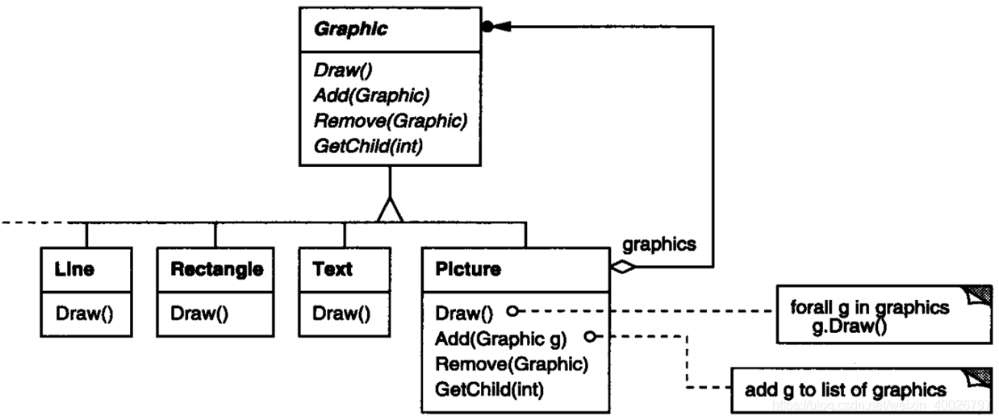
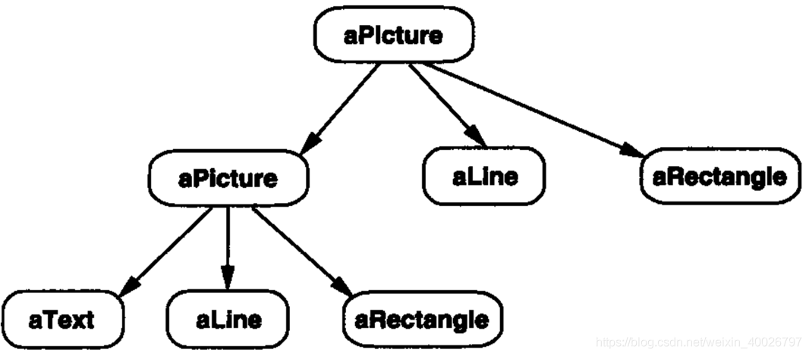
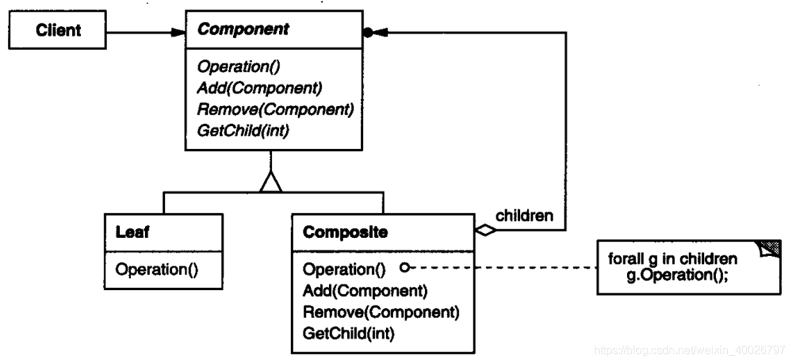
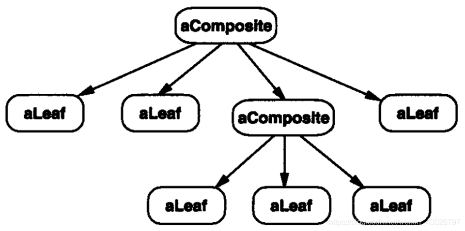

## 1 前言

本周参加了第五次设计模式研讨会，主题是组合（Composite）模式，接下来我们来看看该模式的具体内容。

## 2 组合模式

**Composite 模式**：把一组相似的对象当作一个单一的对象。

**意图**：将对象组合成树形结构以表示“部分-整体”的层次结构。 Composite使得用户对单个对象和组合对象的使用具有一致性。

**主要解决**：它在我们树型结构的问题中，模糊了简单元素和复杂元素的概念，客户程序可以像处理简单元素一样来处理复杂元素，从而使得客户程序与复杂元素的内部结构解耦。

**举个例子**：AWTK中的树状控件结构，button是控件，容器、窗口都是控件。控件和控件组合又可以形成新的控件，例如 list_view 控件由 scroll_view 、scroll_bar 和 list_item 组成，但对于用户来讲 list_view 本身也作为控件使用。

> AWTK是  [ZLG](http://www.zlg.cn/) 开发的开源 GUI 引擎，前往 [官网](https://www.zlg.cn/index/pub/awtk.html)。

## 3 实际例子

在一个绘图编辑器中，用户可以使用简单的组件创建复杂的图表。

例如，用户可以组合多个简单组件形成一些较大的组件，这些组件又可以组合成更大的组件。

**简单的实现方法**：为Text和Line这样的图元定义一些类，然后定义一些类作为这些图元的容器类（Container）。

**该方法存在的问题**：使用这些类的代码必须区别对待图元对象与容器对象，而实际上大多数情况下用户认为它们是一样的。对这些类区别使用，使得程序更加复杂。

Composite 模式描述了如何使用递归组合，使得用户 不必对这些类进行区别。

Composite 模式的关键是一个**抽象类**，它既可代表**图元**，又可代表**图元的容器**。

在绘图编辑器中，这个类就是Graphic，它声明一些与特定图形对象相关的操作，例如 Draw。同时它也声明了所有的组合对象共享的一些操作，例如一些操作用于访问和管理它的子部件。

**子类Line、Rectangle、Text定义了图元对象**。这些类实现Draw，分别用于绘制直线、矩形、文本。由于图元都没有子图形，因此它们都不执行与子类有关的操作。

**子类Picture类定义了Graphic对象的聚合**。其Draw操作是通过对它的子部件调用Draw实现的，Picture还用这种方法实现了一些与其子部件相关的操作。由于Picture接口与Graphic接口是一致的，因此Picture对象可以递归地组合其他Picture对象。

## 4 结构与参与者

**Component**：（Graphic）

1. 为组合中的对象声明接口； 
2. 在适当的情况下，实现所有类共有接口的缺省行为； 
3. 声明一个接口用于访问和管理Component的子组件。
4. 在递归结构中定义用于访问父部件的接口，并在合适的情况下实现它（可选）。

**Leaf**：组合中的叶子节点对象，比如上述示例中的图元（Line、Text等）；

**Composite**：（Picture）

1. 定义包含子部件的聚合部件的行为； 
2. 储存子部件； 
3. 在Component接口中实现与子部件有关的操作；

## 5 总结

**优点**：

1. 定义了包含基本对象和组合对象的类层次结构； 
2. 简化客户代码； 
3. 更容易增加新类型的组件。

**缺点**：

1. 设计较复杂； 
2. 不容易限制容器中的构件； 
3. 不容易用继承的方法来增加构件的新功能；
4. Component类虽然是抽象接口，但是却要实现子部件的相关操作，违反了依赖倒置原则。

**应用场景**：

1. 希望表示对象的 部分-整体 层次结构； 
2. 希望用户忽略组合对象与单个对象的不同，用户将统一地使用组合结构中的所有对象；
