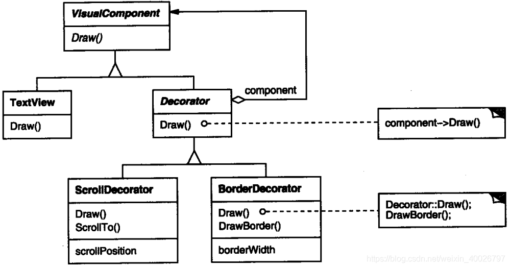
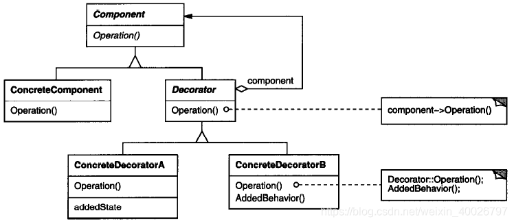

## 1 前言

装饰（Decorator）模式主要是在组合（Composite）模式的基础上扩展，因此并不为其专门开一次研讨会，在闲余时间自行学习，接下来我们来看看该模式的具体内容。

> 组合（Composite）模式的具体内容详见：[设计模式学习（九）：组合模式](./composite.md)。

## 2 装饰模式

**Decorator 模式**：允许向一个现有的对象添加新的功能，同时又不改变其结构。这种类型的设计模式属于结构型模式，它是作为现有的类的一个包装。

**意图**：动态地给一个对象添加一些额外的职责。就增加功能来说， Decorator模式相比生成子类
更为灵活。

具体来说，装饰模式以对客户透明的方式动态地给一个对象附加上更多的责任，换言之，客户端并不会觉得对象在装饰前和装饰后有什么不同。装饰模式可以在不需要创造更多子类的情况下，将对象的功能加以扩展。

**主要解决**：一般的，我们为了扩展一个类经常使用继承方式实现，由于继承为类引入静态特征，并且随着扩展功能的增多，子类的代码也会增多。

**简单理解**：Decorator 模式创建了一个装饰类，用来包装原有的类，并在保持类方法签名完整性的前提下，提供了额外的功能。

## 3 实际例子

有时我们希望给某个对象而不是整个类添加一些功能。例如，一个图形用户界面工具箱允许你对任意一个用户界面组件添加一些特性，例如边框，或是一些行为，例如窗口滚动。

继承是添加功能的有效途径，从其他类继承过来的边框特性可以被多个子类的实例所使用。该方法不够灵活，因为边框的选择是静态的，用户不能控制对组件加边框的方式和时机。

一种较为灵活的方式是**将组件嵌入另一个对象中，由这个对象添加边框。我们称这个嵌入的对象为装饰**。

这个装饰与它所装饰的组件接口一致，因此它对使用该组件的客户透明。它将客户请求转发给该组件，并且可能在转发前后执行一些额外的动作（例如画一个边框）。

例如，假定有一个对象 TextView，它可以在窗口中显示正文。缺省的 TextView 没有滚动条。当需要滚动条时，我们可以用 ScrollDecorator 添加滚动条。

如果我们还想在 TextView 周围添加一个粗黑边框，可以使用 BorderDecorator 添加。因此只要简单地将这些装饰和 TextView 进行组合，就可以达到预期的效果。

ScrollDecorator 和 BorderDecorator 类是 Decorator 类的子类。Decorator 类是一个可视组件的抽象类，用于装饰其他可视组件，如下图所示：



VisualComponent 是一个描述可视对象的抽象类，它定义了绘制和事件处理的接口。

Decorator 的子类为特定功能可以自由地添加一些操作。例如，如果其他对象知道界面中恰好有一个 ScrollDecorator 对象，这些对象就可以用 ScrollDecorator 对象的ScrollTo操作滚动这个界面。

装饰模式中有一点很重要，它使得在 VisualComponent 可以出现的任何地方都可以有装饰。因此，客户通常不会感觉到装饰过的组件与未装饰组件之间的差异，也不会与装饰产
生任何依赖关系。

## 4 结构与参与者



- **Component** ( VisualComponent )：定义一个对象接口，可以给这些对象动态地添加职责。
- **ConcreteComponent** (TextView)：定义一个对象，可以给这个对象添加一些职责。
- **Decorator**：维持一个指向 Component 对象的指针，并定义一个与 Component 接口一致的接口。
- **ConcreteDecorator** (BorderDecorator，ScrollDecorator)：向组件添加职责。

## 5 简单的示例代码

代码比较简单，以下仅列出Component.cpp、ConcreteDecoratorA.h和ConcreteDecoratorA.cpp，其他代码都可以通过简单的推导得到。

```cpp
//Component.cpp
#include "Component.h"
#include <iostream>
using namespace std;

Component::Component(){
}

Component::~Component(){
}

void Component::operation(){
	cout << "Component's normal operation!" << endl;
}
```

```cpp
//ConcreteDecoratorA.h
#include "Decorator.h"
#include "Component.h"

class ConcreteDecoratorA : public Decorator
{
public:
	ConcreteDecoratorA(Component* pcmp);
	virtual ~ConcreteDecoratorA();

	void addBehavior();
	virtual void operation();
};
```

```cpp
//ConcreteDecoratorA.cpp
#include "ConcreteDecoratorA.h"
#include <iostream>
using namespace std;

ConcreteDecoratorA::ConcreteDecoratorA(Component* pcmp)
:Decorator(pcmp)
{
}

ConcreteDecoratorA::~ConcreteDecoratorA(){
}

void ConcreteDecoratorA::addBehavior(){
	cout << "addBehavior AAAA" << endl;
}

void ConcreteDecoratorA::operation(){
	Decorator::operation();
	addBehavior();
}
```

输出结果：

```
Component's normal operation!
addBehavior AAAA
Component's normal operation!
addBehavior AAAA
addBehavior BBBB
```

## 6 总结

**优点**：

1. 装饰模式与继承关系的目的都是要扩展对象的功能，但是装饰模式可以提供比继承更多的灵活性； 
2. 可以通过一种动态的方式来扩展一个对象的功能，通过配置文件可以在运行时选择不同的装饰器，从而实现不同的行为； 
3. 通过使用不同的具体装饰类以及这些装饰类的排列组合，可以创造出很多不同行为的组合。可以使用多个具体装饰类来装饰同一对象，得到功能更为强大的对象；
4. 具体构件类与具体装饰类可以独立变化，用户可以根据需要增加新的具体构件类和具体装饰类，在使用时再对其进行组合，原有代码无须改变，符合“开闭原则”。

**缺点**：

1. 使用装饰模式进行系统设计时将产生很多小对象，这些对象的区别在于它们之间相互连接的方式有所不同，而不是它们的类或者属性值有所不同，同时还将产生很多具体装饰类。这些装饰类和小对象的产生将增加系统的复杂度，加大学习与理解的难度； 
2. 这种比继承更加灵活机动的特性，也同时意味着装饰模式比继承更加易于出错，排错也很困难，对于多次装饰的对象，调试时寻找错误可能需要逐级排查，较为烦琐；。

**应用场景**：

1. 在不影响其他对象的情况下，以动态、透明的方式给单个对象添加职责； 
2. 需要动态地给一个对象增加功能，这些功能也可以动态地被撤销；
3. 当不能采用继承的方式对系统进行扩充或者采用继承不利于系统扩展和维护时。

不能采用继承的情况主要有两类：

- 第一类是系统中存在大量独立的扩展，为支持每一种组合将产生大量的子类，使得子类数目呈爆炸性增长；
- 第二类是因为类定义不能继承（如final类）。
