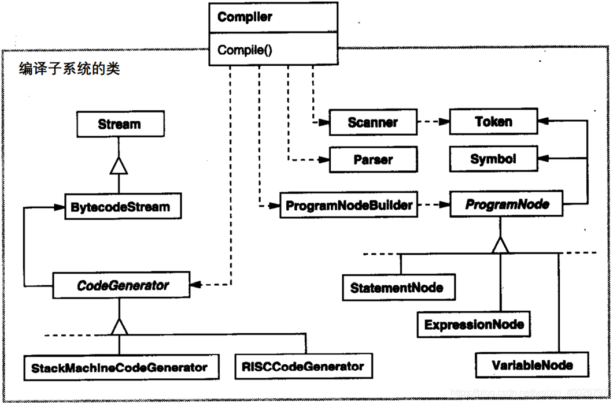
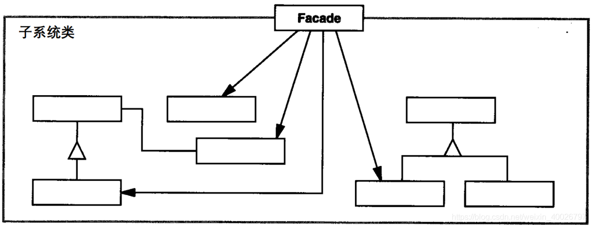

## 1 前言

本周参加了第六次设计模式研讨会，主题是外观（FACADE）模式，接下来我们来看看该模式的具体内容。

## 2 外观模式

**FACADE 模式**：隐藏系统的复杂性，并向客户端提供一个客户端可以访问系统的接口。

**意图**：为子系统中的一组接口提供一个一致的界面，Facade模式定义了一个高层接口，这个接口使得这一子系统更加容易使用。

**主要解决**：降低访问复杂系统的内部子系统时的复杂度，简化客户端与之的接口。

**实现核心**：在客户端和复杂系统之间再加一层，这一层将调用顺序、依赖关系等处理好。

## 3 实际例子

例如有一个编译环境，它允许应用程序访问它的编译子系统。这个编译子系统包含了若干个类，如Scanner、Parser、ProgramNode、BytecodeStream和ProgramNodeBuilder，用于实现这一编译器。

某些特殊程序需要直接访问这些类，但是**大多数编译器的用户并不关心语法分析和代码生成这样的细节**；他们只是希望编译一些代码。对这些用户，编译子系统中那些功能强大但层次较低的接口只会使他们的**任务复杂化**。

为了提供一个高层的接口对客户屏蔽这些类，编译子系统还包括一个 Complier 类。该类**定义了编译器功能的统一接口**。 Complier类是一个外观，它给用户提供了一个单一而简单的编译子系统接口（**它并不隐藏底层功能的接口**）。



## 4 结构与参与者



**Facade**：（Compiler）

1. 知道哪些子系统类负责处理请求； 
2. 将客户的请求代理给适当的子系统对象；

**Subsystem classes**：（Scanner、Parser）

1. 实现子系统的功能； 
2. 处理由Facade对象指派的任务； 
3. 没有Facade的然和相关信息（即没有Facade的指针)；

## 5 简单的示例代码

```cpp
//Facade.h
#include "SystemC.h"
#include "SystemA.h"
#include "SystemB.h"
class Facade
{
public:
	Facade();
	virtual ~Facade();
	void wrapOpration();
private:
	SystemC *m_SystemC;
	SystemA *m_SystemA;
	SystemB *m_SystemB;
};
```

```cpp
//Facade.c
#include "Facade.h"
Facade::Facade(){
	m_SystemA  = new SystemA();
	m_SystemB = new SystemB();
	m_SystemC = new SystemC();
}

Facade::~Facade(){
	delete m_SystemA;
	delete m_SystemB;
	delete m_SystemC;
}

void Facade::wrapOpration(){
	m_SystemA->operationA();
	m_SystemB->operationB();
	m_SystemC->opeartionC();
}
```

```cpp
//main.c
#include <iostream>
#include "Facade.h"
using namespace std;

int main(int argc, char *argv[])
{
	Facade fa;
	fa.wrapOpration();
	
	return 0;
}
```

输出结果：
```bash
operationA()
operationB()
operationC()
```

## 6 总结

**优点**：

1. 对客户屏蔽子系统组件，减少了客户处理的对象数目并使得子系统使用起来更加容易；
2. 实现子系统与客户间的松耦合，子系统组件变化不影响到它的客户类，只需调整外观类；
3. 降低了大型软件系统中的编译依赖性，简化了系统在不同平台的移植过程。编译一个子系统不需要编译其他子系统；修改一个子系统不影响其他子系统；子系统内部变化也不会影响到外观对象。
4. 只是提供了一个访问子系统的统一入口，并不影响用户直接使用子系统类。

**缺点**：

1. 不能很好地限制客户使用子系统类，如果对客户访问子系统类做太多的限制则减少了可变性和灵活性；
2. 在不引入抽象外观类的情况下，增加新的子系统可能需要修改外观类或客户端的源代码，违背了“开闭原则”；

**应用场景**：

1. 希望为复杂子系统提供一个简单接口，该接口可以满足大多数用户的需求，而且用户也可以越过外观类直接访问子系统；
2. 希望将子系统与客户以及其他子系统解耦，或者在层次化结构中，降低层之间的耦合；
