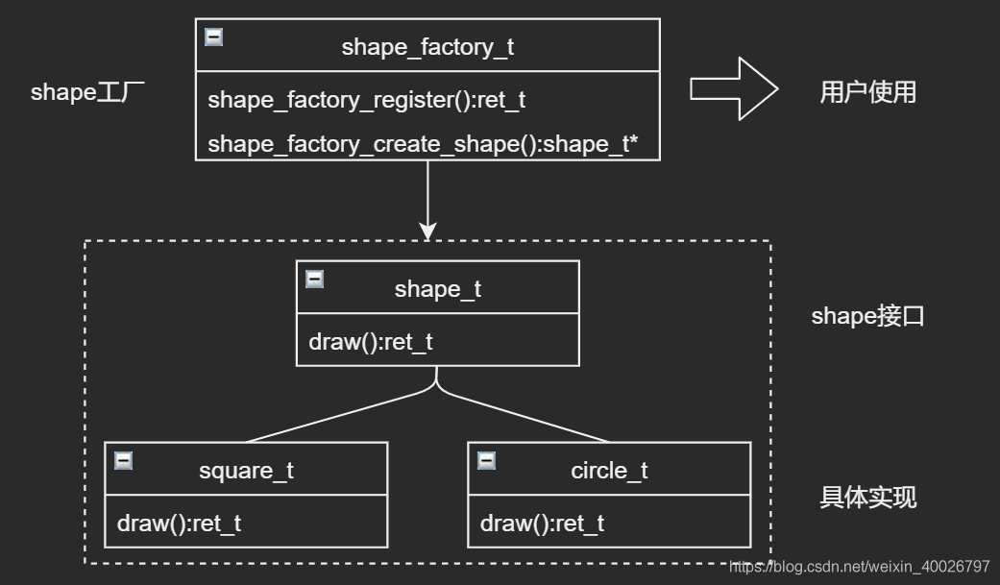

## 1 前言

上周学习了抽象工厂模式，该模式包含了简单工厂模式和工厂方法的某些特性，三者之间的区别详见：[上周博客](./abstract_factory.md)，本周深入了解一下简单工厂模式，并对其进行优化，实现一个可动态注册的简单工厂，本次练习参考了AWTK源码中 **widget_factory**  的实现，感兴趣的可以查阅源码，GitHub仓库：[https://github.com/zlgopen/awtk](https://github.com/zlgopen/awtk)。

> AWTK是  [ZLG](http://www.zlg.cn/) 开发的开源 GUI 引擎，官网地址：[https://www.zlg.cn/index/pub/awtk.html](https://www.zlg.cn/index/pub/awtk.html)。

## 2 简单工厂模式

简单工厂模式（Factory Pattern）是属于创建型模式，在该模式中，用户通过使用一个共同的接口来创建的具体对象。

**简单理解**：工厂是对具体产品（对象）的抽象，工厂提供统一接口创建不同的产品。本质上就是定义一个创建对象的接口，让其子类自己决定实例化哪一个工厂类，工厂模式使其创建过程延迟到子类进行。

**目的**：给用户提供一个创建一系列相关对象的接口，但用户是不需要指定它们的具体类，其主要是解决接口选择的问题。

**优点**：

1. 一个调用者想创建一个对象，只要知道其名称就可以了。  
2. 扩展性高，如果想增加一个产品，只要扩展一个工厂类就可以。
3. 屏蔽产品的具体实现，调用者只关心产品的接口。

**缺点**：每次增加一个产品时，都需要增加一个具体类和对象实现工厂，使得系统中类的个数成倍增加，在一定程度上增加了系统的复杂度，同时也增加了系统具体类的依赖。这并不是什么好事。

通常情况下简单工厂模式中的工厂类是静态实现的，即具体对象的构造函数写在工厂类的代码中，那么在新增产品时，就需要修改工厂类的代码，比较麻烦，因此需要进行优化，让工厂类提供动态注册的功能，方便用户可以在从外部直接向工厂类添加新产品，接下来我们来看一个示例。

## 3 示例类图及C语言代码

### 3.1 示例介绍

假如要实现一个画笔功能，可以画不同的形状（shape），此处有具体产品方形（square）和圆形（circle），它们具有的绘制（draw）行为，并且需要实现一个具有动态注册功能的形状工厂（shape_factory）,让用户可从外部新增具体形状。

### 3.2 示例类图



首先需要创建 shape_t 接口以及实现该接口的具体类。下一步是创建工厂类 shape_factory_t ，实现它的动态注册功能，提供给用户使用。

### 3.3 C语言实现

1. 创建 shape_t 接口

```c
/* shape.h */
#ifndef SHAPE_H
#define SHAPE_H

#include "awtk.h"

BEGIN_C_DECLS

typedef struct _shape_t shape_t;
typedef struct _shape_vtable_t shape_vtable_t;

typedef shape_t* (*shape_create_t)();
typedef ret_t (*shape_destroy_t)(shape_t* shape);
typedef ret_t (*shape_draw_t)(shape_t* shape);

struct _shape_vtable_t {
  uint32_t size;
  const char* type;
  shape_create_t create;
  shape_destroy_t destroy;
  shape_draw_t draw;
};

/**
 * @class shape_t
 * 形状接口，具体形状的基类。
 */
struct _shape_t {
  /**
   * @property {shape_vtable_t*} vt
   * 虚函数表。
   */
  const shape_vtable_t* vt;
};

/**
 * @method shape_create
 * 创建shape对象（仅在子类构造函数中使用）。
 * @param {shape_vtable_t*} vt 虚表。
 * @return {shape_t*} shape对象本身。
 */
shape_t* shape_create(const shape_vtable_t* vt);

/**
 * @method shape_destroy
 * 销毁shape对象。
 * @param {shape_t*} shape 形状对象。
 * @return {ret_t} 返回RET_OK表示成功，否则表示失败。
 */
ret_t shape_destroy(shape_t* shape);

/**
 * @method shape_draw
 * 绘制（此处模拟对象行为）。
 * @param {shape_t*} shape 形状对象。
 * @return {ret_t} 返回RET_OK表示成功，否则表示失败。
 */
ret_t shape_draw(shape_t* shape);

/* 子类类型常量 */
#define SHAPE_TYPE_SQUARE "square" /* 方形 */
#define SHAPE_TYPE_CIRCLE "circle" /* 圆形 */

#endif /* SHAPE_H */
```

```c
/* shape.c */
#include "shape.h"

shape_t* shape_create(const shape_vtable_t* vt) {
  return_value_if_fail(vt != NULL, NULL);

  /* 初始化子类虚函数表 */
  shape_t* shape = TKMEM_ALLOC(vt->size);
  return_value_if_fail(shape != NULL, NULL);

  memset(shape, 0x00, vt->size);
  shape->vt = vt;

  /* 初始化shape_t中的其他成员（此处无其他成员） */

  return shape;
}

ret_t shape_destroy(shape_t* shape) {
  return_value_if_fail(shape != NULL && shape->vt != NULL, RET_BAD_PARAMS);

  /* 调用具体子类的析构函数销毁对象 */
  if (shape->vt->destroy) {
    shape->vt->destroy(shape);
  }

  /* 释放shape_t中的其他成员（此处无其他成员） */

  /* 释放shape_t */
  memset(shape, 0x00, sizeof(shape_t));
  TKMEM_FREE(shape);

  return RET_OK;
}

ret_t shape_draw(shape_t* shape) {
  return_value_if_fail(shape != NULL && shape->vt != NULL, RET_BAD_PARAMS);

  /* 调用具体子类的绘制函数 */
  if (shape->vt->draw) {
    shape->vt->draw(shape);
  } else {
    log_debug("%s draw does not method exist!", shape->vt->type);
  }

  return RET_OK;
}
```

2. 完成shape_t 接口的具体实现（square_t、circle_t），此处仅展示 square_t 的实现，circle_t的实现类似：

```c
/* square.h */
#ifndef SQUARE_H
#define SQUARE_H

#include "../base/shape.h"

BEGIN_C_DECLS

/**
 * @class square_t
 * @parent shape_t
 * 方形（shape_t 接口的具体实现）。
 */
typedef struct _square_t {
  shape_t shape;
} square_t;

/**
 * @method square_create
 * 创建square对象
 * @return {shape_t*} shape对象。
 */
shape_t* square_create();

END_C_DECLS

#endif /* SQUARE_H */
```

```c
/* square.c */
#include "square.h"

static ret_t square_draw(shape_t* shape) {
  /* 打印信息模拟 draw 行为 */
  log_debug("%s draw method! \n", shape->vt->type);
  return RET_OK;
}

static ret_t square_destroy(shape_t* shape) {
  /* 释放子类square中的特有属性或做其他处理，此处无 */
  return RET_OK;
}

static const shape_vtable_t s_sqiare_vtable = {.size = sizeof(square_t),
                                               .type = SHAPE_TYPE_SQUARE,
                                               .create = square_create,
                                               .destroy = square_destroy,
                                               .draw = square_draw};

shape_t* square_create() {
  shape_t* shape = shape_create(&s_sqiare_vtable);
  return_value_if_fail(shape != NULL, NULL);
  return shape;
}
```

3. 创建工厂类 shape_factory_t，并实现动态注册功能：

```c
/* shape_factory.h */
#ifndef SHAPE_FACTORY_H
#define SHAPE_FACTORY_H

#include "shape.h"
#include "tkc/darray.h"

BEGIN_C_DECLS

/**
 * @class shape_factory_t
 * 形状工厂对象。
 *
 * 可提供通过类型创建形状。
 * 可从外部注册新形状（增强扩展性）。
 */
typedef struct _shape_factory_t {
  /**
   * @property {darray_t} creators
   * 动态数据，用来存放具体子类的构造函数指针。
   */
  darray_t creators;
} shape_factory_t;

/**
 * @method shape_factory_create
 * 创建形状工厂对象。
 * @return {shape_factory_t*} 返回形状工厂对象。
 */
shape_factory_t* shape_factory_create(void);

/**
 * @method shape_factory_register
 * 注册形状创建函数。
 * @param {shape_factory_t*} factory 形状工厂对象。
 * @param {const char*} type 形状类型。
 * @param {shape_create_t} create 创建函数。
 *
 * @return {ret_t} 返回RET_OK表示成功，否则表示失败。
 */
ret_t shape_factory_register(shape_factory_t* factory, const char* type, shape_create_t create);

/**
 * @method shape_factory_create_shape
 * 创建指定类型的形状。
 * @param {shape_factory_t*} factory 形状工厂对象。
 * @param {const char*} type 形状类型。
 *
 * @return {shape_t*} 返回形状对象。
 */
shape_t* shape_factory_create_shape(shape_factory_t* factory, const char* type);

/**
 * @method shape_factory_destroy
 * 析构并释放形状工厂对象。
 * @param {shape_factory_t*} factory 形状工厂对象。
 *
 * @return {ret_t} 返回RET_OK表示成功，否则表示失败。
 */
ret_t shape_factory_destroy(shape_factory_t* factory);

END_C_DECLS

#endif /* SHAPE_FACTORY_H */
```

```c
/* shape_factory.c */
#include "shape_factory.h"

#define TYPE_LEN 31

/* 动态数据元素 */
typedef struct _creator_item_t {
  char type[TYPE_LEN + 1];
  shape_create_t create;
} creator_item_t;

/* 动态数据元素销毁函数 */
static ret_t creators_destroy(void* data) {
  TKMEM_FREE(data);
  return RET_OK;
}

/* 动态数据元素比较函数 */
static int creators_compare(const void* a, const void* b) {
  return strcmp(((creator_item_t*)a)->type, ((creator_item_t*)b)->type);
}

shape_factory_t* shape_factory_create(void) {
  shape_factory_t* factory = TKMEM_ZALLOC(shape_factory_t);
  return_value_if_fail(factory != NULL, NULL);
  /* 初始化动态数组 */
  darray_init(&(factory->creators), 0, creators_destroy, creators_compare);
  return factory;
}

ret_t shape_factory_register(shape_factory_t* factory, const char* type, shape_create_t create) {
  creator_item_t* item = NULL;
  return_value_if_fail(factory != NULL && type != NULL && create != NULL, RET_BAD_PARAMS);

  item = TKMEM_ZALLOC(creator_item_t);
  return_value_if_fail(item != NULL, RET_OOM);

  item->create = create;
  tk_strncpy(item->type, type, TYPE_LEN);
  darray_push(&(factory->creators), item);

  return RET_OK;
}

shape_t* shape_factory_create_shape(shape_factory_t* factory, const char* type) {
  shape_t* shape = NULL;
  const creator_item_t* iter = NULL;
  return_value_if_fail(factory != NULL && type != NULL, NULL);

  iter = darray_find(&(factory->creators), (void*)type);
  return_value_if_fail(iter != NULL, NULL);
  shape = iter->create();

  return_value_if_fail(shape != NULL, NULL);
  return shape;
}

ret_t shape_factory_destroy(shape_factory_t* factory) {
  return_value_if_fail(factory != NULL, RET_BAD_PARAMS);
  /* ~初始化动态数组 */
  darray_deinit(&(factory->creators));
  TKMEM_FREE(factory);
  return RET_OK;
}
```

4. 实现初始化 shape 功能，以便初始化程序的时候调用：

```c
/* shapes.h */
#ifndef SHAPES_H
#define SHAPES_H

#include "tkc/types_def.h"
#include "base/shape.h"
#include "base/shape_factory.h"

BEGIN_C_DECLS

/**
 * @method shapes_init
 * 初始化内置形状。
 * @return {shape_factory_t*} 返回形状工厂对象。
 */
shape_factory_t* shapes_init(void);

END_C_DECLS

#endif /* SHAPES_H */
```

```c
/* shapes.c */
#include "shapes.h"
#include "implement/square.h"
#include "implement/circle.h"

shape_factory_t* shapes_init(void) {
  shape_factory_t* factory = shape_factory_create();
  /* 注册内置形状 */
  shape_factory_register(factory, SHAPE_TYPE_SQUARE, square_create);
  shape_factory_register(factory, SHAPE_TYPE_CIRCLE, circle_create);

  return factory;
}
```

5. 使用代码如下：

```c
#include "awtk.h"
#include "shape/shapes.h"

/* 程序初始化入口 */
ret_t application_init(void) {
  shape_factory_t* factory = shapes_init();

  /* 获取square对象 */
  shape_t* shape1 = shape_factory_create_shape(factory, SHAPE_TYPE_SQUARE);
  /* 调用square的draw方法 */
  shape_draw(shape1);

  /* 获取circle对象 */
  shape_t* shape2 = shape_factory_create_shape(factory, SHAPE_TYPE_CIRCLE);
  /* 调用circle的draw方法 */
  shape_draw(shape2);

  /* 销毁具体对象和工厂对象 */
  shape_destroy(shape1);
  shape_destroy(shape2);
  shape_factory_destroy(factory);
  return RET_OK;
}
```

6. 输出效果：

```bash
square draw method!
circle draw method!
```

## 4 总结

从以上示例代码可以看出，实现可动态注册的工厂类本质上就是用一个动态数组将具体产品的构造函数指针保存起来，用户在创建具体产品对象时可以根据输入类型直接创建，无需知道具体类的逻辑代码。

简单工厂模式的动态注册功能实现原理即向动态数组中添加新元素，该元素中保存了新增产品的构造函数。
