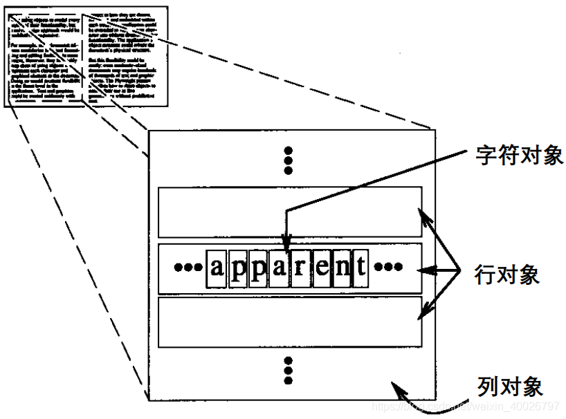
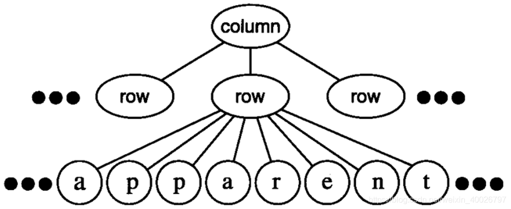
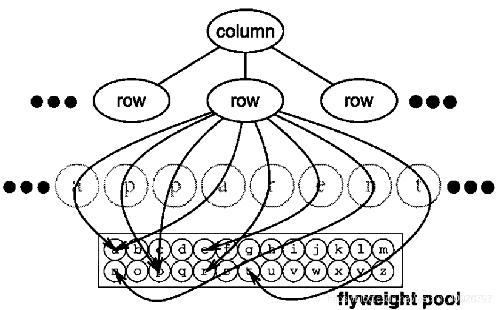
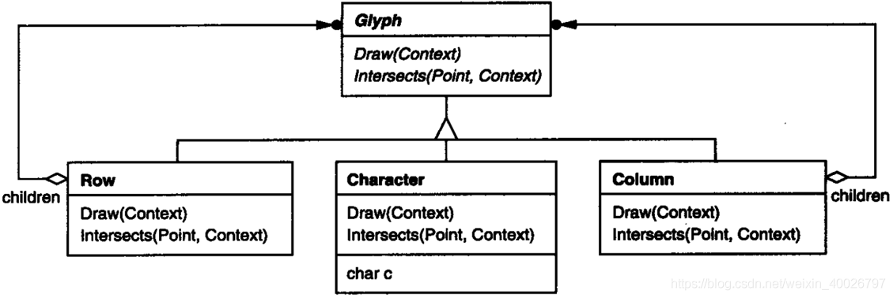
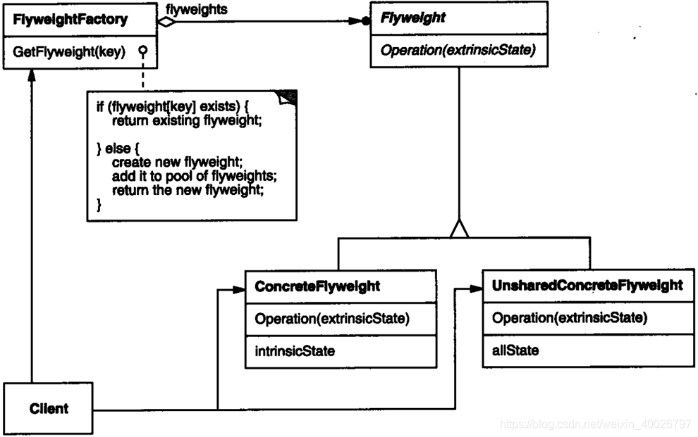

## 1 前言

本周参加了第七次设计模式研讨会，主题是享元（Flyweight）模式，接下来我们来看看该模式的具体内容。

## 2 享元模式

**Flyweight 模式**：通过共享技术实现相同或相似对象的重用，减少创建对象的数量，以减少内存占用和提高性能。

**意图**：运用共享技术有效地支持大量细粒度的对象。

**动机**：面向对象技术可以很好地解决一些**灵活性**或**可扩展性**问题，但在很多情况下需要在系统中**增加类和对象的个数**。当对象数量太多时，将导致运行代价过高，带来**性能下降**等问题。。

**核心思想**：在有大量对象时，将消耗大量内存，甚至可能造成内存溢出，享元模式把其中共同的部分抽象出来，如果有相同的业务请求，直接返回在内存中已有的对象，避免重新创建。

## 3 示例介绍

例如，大多数文档编辑器的实现都有文本格式化和编辑功能，这些功能在一定程度上是**模块化**的。

面向对象的文档编辑器通常使用对象来表示嵌入的成分，例如表格和图形。尽管用对象来表示文档中的每个字符会极大地提高应用程序的灵活性，但是这些编辑器通常并不这样做。

这是由于这种设计的缺点在于**代价太大**。即使是一个中等大小的文档也可能要求成百上千的字符对象，这会耗费大量内存，产生难以接受的运行开销。所以通常并不是将每个字符都用一个对象来表示。



Flyweight 模式描述了如何共享对象，使得可以细粒度地使用它们而无需高昂的代价。

flyweight 是一个共享对象，它可以同时在多个场景 (context)中使用，并且在每个场景中 flyweight 都可以作为一个独立的对象。

**内部状态**：储存于flyweight，包含独立于flyweight场景的信息，即可被共享的信息。

**外部状态**：取决于Flyweight场景，根据场景变化，不可共享。

> 注意：用户对象负责在必要的时候将外部状态传递给 Flyweight。flyweight 不能对它所运行的场景做出任何假设！

Flyweight模式对那些通常因为数量太大而难以用对象来表示的概念或实体进行建模。

例如，文档编辑器可以为字母表中的每一个字母创建一个 flyweight 。每个 flyweight 存储一个字符代码，但它在文档中的位置和排版风格可以在字符出现时由正文排版算法和使用的格式化命令决定。

由以上示例分析：

**内部状态**：字符代码。

**外部状态**：位置和排版风格等场景。

在逻辑上(用户眼中)的表现如下图：



实际代码的实现逻辑如下图：



示例的类图如下，Glyph 是图形对象的抽象类，也是 Flyweight ，其中有些对象可能是 flyweigh，例如此处的 Characher 。基于外部状态的那些操作将外部状态作为参量传递给它们。例如，Draw 和 Intersects 在执行之前，必须知道 glyph 所在的场景。



## 4 结构与参与者



**Flyweigh** ：（Glyph）

描述一个接口，通过这个接口 flyweight 可以接受并作用于外部状态；

**ConcreteFlyweigh**：（Characher）

实现Flyweigh接口，保存内部状态，并独立于外部场景，实现共享；

**UnsharedConcreteFlyweigh** ：（Row、Column）

不是所有Flyweigh子类都需被共享。在某些 Flyweigh 结构中，该类通常将 ConcreteFlyweigh 对象作为子节点。

**ConcreteFlyweigh**：

创建并管理 flyweigh 对象，确保合理地共享 flyweigh 。用户通过该类请求 flyweigh。

**Client**：

维持一个对 flyweigh 的引用，计算或储存一个（多个） flyweigh 的外部状态。

## 5 简单的示例代码

```cpp
// FlyweightFactory.cpp
#include "FlyweightFactory.h"
#include "ConcreteFlyweight.h"
#include <iostream>
using namespace std;

FlyweightFactory::FlyweightFactory(){}
FlyweightFactory::~FlyweightFactory(){}

Flyweight* FlyweightFactory::getFlyweight(string str){
	map<string,Flyweight*>::iterator itr = m_mpFlyweight.find(str);
	if(itr == m_mpFlyweight.end()) {
		Flyweight * fw = new ConcreteFlyweight(str);
		m_mpFlyweight.insert(make_pair(str,fw));
		return fw;	
	}
	else {
		cout << "flyweight exist!" << endl;
		return itr->second;
	}		
}
```

```cpp
// ConcreteFlyweight.h
#include "Flyweight.h"
#include <string>
using namespace std;

class ConcreteFlyweight : public Flyweight
{
public:
	ConcreteFlyweight(string str);
	virtual ~ConcreteFlyweight();
	virtual void operation();
private:
	string intrinsicState;
};
```

```cpp
// ConcreteFlyweight.cpp
#include "ConcreteFlyweight.h"
#include <iostream>
using namespace std;

ConcreteFlyweight::ConcreteFlyweight(string str){
	intrinsicState = str;
}

ConcreteFlyweight::~ConcreteFlyweight(){
}

void ConcreteFlyweight::operation(){
	cout << intrinsicState << endl; 
}
```

```cpp
// main.cpp
#include <iostream>
#include "ConcreteFlyweight.h"
#include "FlyweightFactory.h"
#include "Flyweight.h"
using namespace std;

int main(int argc, char *argv[])
{
	FlyweightFactory factory;
	Flyweight * fw = factory.getFlyweight("one");
	fw->operation();
	
	Flyweight * fw2 = factory.getFlyweight("two");
	fw2->operation();
	
	Flyweight * fw3 = factory.getFlyweight("one");
	fw3->operation();
	return 0;
}
```

输出结果如下：

```bash
one
two
flyweight exist！
one
```

## 6 总结

### 6.1 适用性

当以下情况都成立时使用 Flyweight模式：

- 一个应用程序使用了大量的对象。
- 完全由于使用大量的对象，造成很大的存储开销。
- 对象的大多数状态都可变为外部状态。
- 如果删除对象的外部状态，那么可以用相对较少的共享对象取代很多组对象。
- 应用程序不依赖于对象标识。Flyweigh 对象可以被共享，对于概念上明显有别的对象，标识测试将返回真值。

### 6.2 优缺点和应用场景

**优点**：

1. 极大减少内存中对象的数量，使得相同对象或相似对象在内存中只保存一份；
2. 外部状态相对独立，而且不会影响其内部状态，从而使得享元对象可以在不同的环境中被共享。

**缺点**：

1. 享元模式使得系统更加复杂，需要分离出内部状态和外部状态；
2. 为了使对象可以共享，享元模式需要将享元对象的状态外部化，而读取外部状态使得运行时间变长。

**应用场景**：

1. 一个系统有大量相同或者相似的对象，由于这类对象的大量使用，造成内存的大量耗费；   
2. 对象的大部分状态都可以外部化，可以将这些外部状态传入对象中；    
3. 使用享元模式需要维护一个存储享元对象的享元池，而这需要耗费资源，因此，应当在多次重复使用享元对象时才值得使用享元模式。
