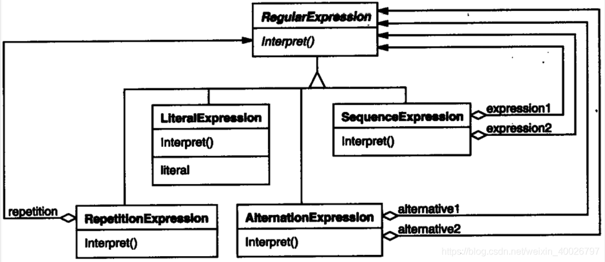

## 1 前言

本周参加了第十一次设计模式研讨会，主题是解释器模式，接下来我们来看看该模式的具体内容。

## 2 解释器模式

**解释器模式**：它提供了评估语言的语法或表达式的方法，实现一个表达式接口，该接口解析一个特定的上下文。

**意图**：给定一个语言，定义它的文法的一种表示，并定义一个解释器，这个解释器使用该表示来解释语言中的句子。

**主要解决**：如果一种特定类型的问题发生的频率足够高，那么可能就值得将该问题的各个实例表述为一个简单语言中的句子。这样就可以构建一个解释器，该解释器通过解释这些句子来解决该问题。

**最典型的例子就是 AWTK 中的 fscript。**

> AWTK是  [ZLG](http://www.zlg.cn/) 开发的开源 GUI 引擎，前往 [官网](https://www.zlg.cn/index/pub/awtk.html)。
> AWTK GitHub 仓库：[http://github.com/zlgopen/awtk-mvvm](http://github.com/zlgopen/awtk-mvvm)

## 3 示例介绍

例如，搜索匹配一个模式的字符串是一个常见问题。正则表达式是描述字符串模式的一
种标准语言。与其为每一个的模式都构造一个特定的算法，不如使用一种通用的搜索算法来解释执行一个正则表达式，该正则表达式定义了待匹配字符串的集合。

解释器模式描述了如何为简单的语言定义一个文法 , 如何在该语言中表示一个句子 , 以及如何解释这些句子。在上面的例子中 , 本设计模式描述了如何为正则表达式定义一个文法 , 如何表示一个特定的正则表达式 , 以及如何解释这个正则表达式。

符号expression是开始符号, literal是定义简单字的终结符。

解释器模式使用类来表示每一条文法规则。在规则右边的符号是这些类的实例变量。上面的
文法用五个类表示: 一个抽象类 RegularExpression 和它四个子类 LiteralExpression、AlternationExpression、SequenceExpression 和 RepetitionExpression 后三个类定义的变量代表子表达式。

每个用这个文法定义的正则表达式都被表示为一个由这些类的实例构成的抽象语法树。
例如, 表示正则表达式： raining & (dogs | cats) *  的抽象语法树如下：

如果我们为 RegularExpression 的每一子类都定义解释 (Interpret)操作，那么就得到了为这些正则表达式的一个解释器。解释器将该表达式的上下文做为一个参数。上下文包含输入字符串和关于目前它已有多少已经被匹配等信息。

为匹配输入字符串的下一部分，每一个 RegularExpression 的子类都在当前上下文的基础上实现解释操作 (Interpret)。例如：

- LiteralExpression将检查输入是否匹配它定义的字 (literal)。
- AlternationExpression将检查输入是否匹配它的任意一个选择项。
- RepetitionExpression将检查输入是否含有多个它所重复的表达式。

## 四、结构与参与者

**AbstractExpression**： (抽象表达式，如RegularExpression) 

1. 声明一个抽象的解释操作，这个接口为抽象语法树中所有的节点所共享。

**TerminalExpression**：（终结符表达式，如LiteralExpression）

1. 实现与文法中的终结符相关联的解释操作。
2. 一个句子中的每个终结符需要该类的一个实例。

**NonterminalExpression**：（非终结符表达式，如 AlternationExpression, RepetitionExpression, SequenceExpressions)

1. 对文法中的每一条规则R ::= R1R2 . . . Rn都需要一个NonterminalExpression类。 
2. 为从R1到Rn的每个符号都维护一个AbstractExpression类型的实例变量。
3. 为文法中的非终结符实现解释 (Interpret)操作。解释(Interpret)一般要递归地调用表示 R1到Rn的那些对象的解释操作。 

**Context**：（上下文）

1. 包含解释器之外的一些全局信息

**Client**：（客户）

1. 构建(或被给定) 表示该文法定义的语言中一个特定的句子的抽象语法树。该抽象语法树由NonterminalExpression 和 TerminalExpression 的实例装配而成
2. 调用解释操作。

## 5 总结

### 5.1 优缺点

**优点**：

1. 易于改变和扩展文法。
2. 易于实现简单文法。
3. 增加了新的解释表达式的方式。 

**缺点**：

1. 可利用场景比较少。
2. 对于复杂的文法比较难维护。
3. 解释器模式会引起类膨胀。
4. 解释器模式采用递归调用方法，可能会降低效率。

### 5.2 应用场景

在以下情况可以使用解释器模式：

- 可以将一个需要解释执行的语言中的句子表示为一个抽象语法树。 
- 一些重复出现的问题可以用一种简单的语言来进行表达。 
- 一个简单语法需要解释的场景。
