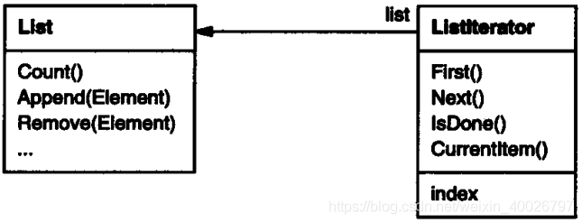
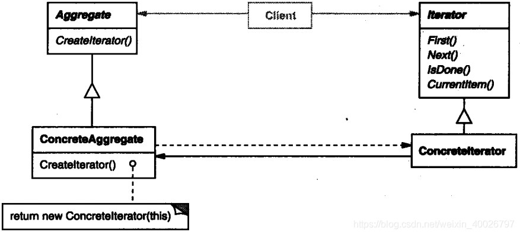

## 1 前言

本周没有开展设计模式研讨会，但周末学习了迭代器模式，此处做个记录。

## 2 迭代器模式

**迭代器模式**：它用于顺序访问集合对象的元素，用户不需要知道集合对象的底层表示。

**意图**：提供一种方法顺序访问一个聚合对象中各个元素 , 而又不需暴露该对象的内部表示。

**主要解决**：该模式主要解决以不同的方式来遍历整个整合对象。

## 3 示例介绍

一个聚合对象, 如列表(list), 应该提供一种方法来让别人可以访问它的元素，而又不需暴露它的内部结构. 此外，针对不同的需要，可能要以不同的方式遍历这个列表。但是即使可以预见到所需的那些遍历操作，你可能也不希望列表的接口中充斥着各种不同遍历的操作。有时还可能需要在同一个表列上同时进行多个遍历。

迭代器模式都可帮你解决所有这些问题。这一模式的关键思想是将对列表的访问和遍历从列表对象中分离出来并放入一个迭代器（iterator）对象中。

迭代器类定义了一个访问该列表元素的接口。迭代器对象负责跟踪当前的元素 ; 即,它知道哪些元素已经遍历过了。

例如, 一个列表（List）类可能需要一个列表迭代器（ListIterator）, 它们之间的关系如下图：



在实例化列表迭代器之前，必须提供待遍历的列表。一旦有了该列表迭代器的实例，就可以顺序地访问该列表的各个元素。 

- CurrentItem操作：返回表列中的当前元素 ；
- First 操作：初始化迭代器，使当前元素指向列表的第一个元素；
- Next操作：将当前元素指针向前推进一步，指向下一个元素,；
- IsDone操作：检查是否已越过最后一个元素，也就是完成了这次遍历。

将遍历机制与列表对象分离使我们可以定义不同的迭代器来实现不同的遍历策略，而无需在列表接口中列举它们。例如 , 过滤表列迭代器( FilteringListIterator)可能只访问那些满足特定过滤约束条件的元素。

注意迭代器和列表是耦合在一起的，而且客户对象必须知道遍历的是一个列表而不是其他聚合结构。 

因此，最好能有一种办法使得不需改变客户代码即可改变该聚合类。可以通过将迭代器的概念推广到多态迭代(polymorphic iteration)来达到这个目标。

例如, 假定我们还有一个列表的特殊实现，比如说 SkipList[Pug90]。SkipList 是一种具有类似于平衡树性质的随机数据结构。我们希望我们的代码对 L i s t和S k i p L i s t对象都适用。

首先，定义一个抽象列表类 AbstractList，它提供操作列表的公共接口。类似地，我们也需要一个抽象的迭代器类 Iterator，它定义公共的迭代接口。然后我们可以为每个不同的列表实现定义具体的 Iterator 子类。这样迭代机制就与具体的聚合类无关了。



剩下的问题是如何创建迭代器。既然要使这些代码不依赖于具体的列表子类 , 就不能仅仅简单地实例化一个特定的类 , 而要让列表对象负责创建相应的迭代器。这需要列表对象提供 CreateIterator 这样的操作, 客户请求调用该操作以获得一个迭代器对象。

> 备注：创建迭代器是一个 [工厂方法模式](./abstract_factory.md) 的例子。我们在这里用它来使得一个客户可向一个列表对象请求合适的迭代器。工厂方法模式产生两个类层次, 一个是列表的, 一个是迭代器的。CreateIterator “联系” 这两个类层次。

## 4 结构与参与者


**Iterator**（迭代器抽象接口）

1. 迭代器定义访问和遍历元素的接口。

**ConcreteIterator**（具体迭代器）

1. 具体迭代器实现迭代器接口。
2. 对该聚合遍历时跟踪当前位置。

**Aggregate**（聚合抽象接口）

1. 聚合定义创建相应迭代器对象的接口。

**ConcreteAggregate**（具体聚合）

1. 具体聚合实现创建相应迭代器的接口，该操作返回C o n c r e t e I t e r a t o r的一个适当的实例。

## 5 简单的示例代码

```cpp
// 迭代器抽象接口 Iterator.h
template<class Item>
class Iterator {
public:
    Iterator() {};
    virtual ~Iterator() {};

    virtual void first() = 0;
    virtual void next() = 0;
    virtual Item *curItem() = 0;
    virtual bool isDone() = 0;
};
```

```cpp
// 具体迭代器 ConcreteIterator.h
#pragma once
#include "Iterator.h"

template<class Item>
class ConcreteIterator : public Iterator <Item> {
public:
    ConcreteIterator(Aggregate<Item> *a) :aggr(a), cur(0) {};
    virtual ~ConcreteIterator() {};

    virtual void first();
    virtual void next();
    virtual Item *curItem();
    virtual bool isDone();
private:
    Aggregate<Item> *aggr;
    int cur;
};

template<class Item>
void ConcreteIterator<Item>::first() {
    cur = 0;
}

template<class Item>
void ConcreteIterator<Item>::next() {
    if (cur < aggr->getSize())
        cur++;
}

template<class Item>
Item *ConcreteIterator<Item>::curItem() {
    if (cur < aggr->getSize()) {
        return &(*aggr)[cur];
    } 
    return NULL;
}

template<class Item>
bool ConcreteIterator<Item>::isDone() {
    return cur >= aggr->getSize();
}
```

```cpp
// 聚合抽象接口 Aggregate.h
#pragma once
#include "Iterator.h"

template<class Item>
class Aggregate {
public:
    Aggregate() {};
    virtual ~Aggregate() {};

    virtual void pushData(Item item) = 0;
    virtual Iterator<Item>* createIterator() = 0;
    virtual Item& operator[](int index) = 0;
    virtual int getSize() = 0;
};                                                                                                                                                     
```

```cpp
// 具体聚合 ConcreteAggregate.h
#pragma once
#include <vector>
#include "Aggregate.h"
#include "ConcreteIterator.h"

using namespace std;

template <class Item>
class ConcreteAggregate : public Aggregate<Item> {
public:
    ConcreteAggregate() {};
    virtual ~ConcreteAggregate() {};

    virtual void pushData(Item item);
    virtual Iterator<Item>* createIterator();
    virtual Item& operator[](int index);
    virtual int getSize();
private:
    vector<Item> data;
};

template <class Item>
void ConcreteAggregate<Item>::pushData(Item item) {
    data.push_back(item);
}

template <class Item>
Iterator<Item>* ConcreteAggregate<Item>::createIterator() {
    return new ConcreteIterator<Item>(this);
}

template <class Item>
Item& ConcreteAggregate<Item>::operator[](int index) {
    return data[index];
}

template <class Item>
int ConcreteAggregate<Item>::getSize() {
    return data.size();
}
```

```cpp
// main 函数
int main(int argc, char *argv[]) {
    Aggregate<int> * aggr = new ConcreteAggregate<int>();
    aggr->pushData(3);
    aggr->pushData(2);
    aggr->pushData(1);
    Iterator<int> * it = aggr->createIterator();

    for (it->first(); !it->isDone(); it->next()) {
        std::cout << *it->curItem() << std::endl;
    }
    delete it;
    delete aggr;
}
```

输出结果：

```bash
3
2
1
```

## 6 总结

### 6.1 优缺点

**优点**：

1. 它支持以不同的方式遍历一个聚合对象。
2. 迭代器简化了聚合类。
3. 在同一个聚合上可以有多个遍历。 
4. 在迭代器模式中，增加新的聚合类和迭代器类都很方便，无须修改原有代码。

**缺点**：由于迭代器模式将存储数据和遍历数据的职责分离，增加新的聚合类需要对应增加新的迭代器类，类的个数成对增加，这在一定程度上增加了系统的复杂性

### 6.2 应用场景

迭代器模式可以用来：

* 访问一个聚合对象的内容而无需暴露它的内部表示。
* 支持对聚合对象的多种遍历。
* 为遍历不同的聚合结构提供一个统一的接口 (即, 支持多态迭代)。
