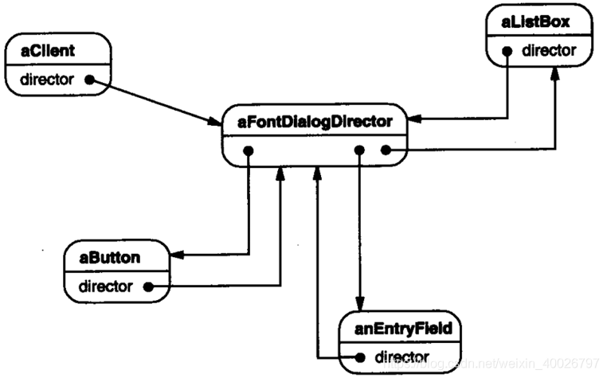
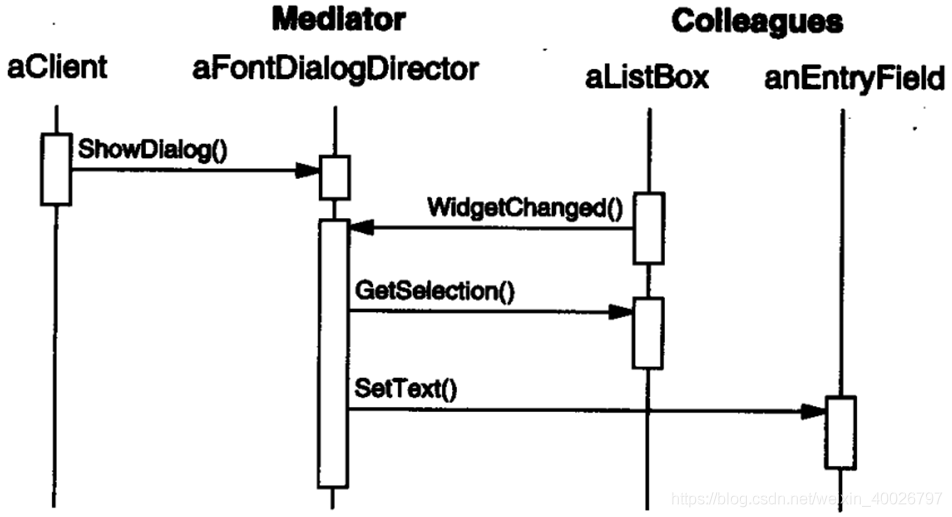
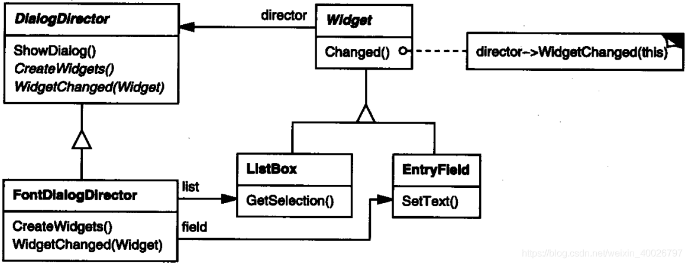
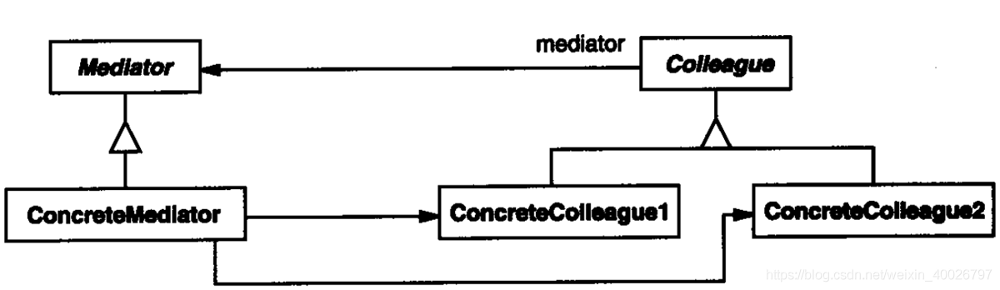
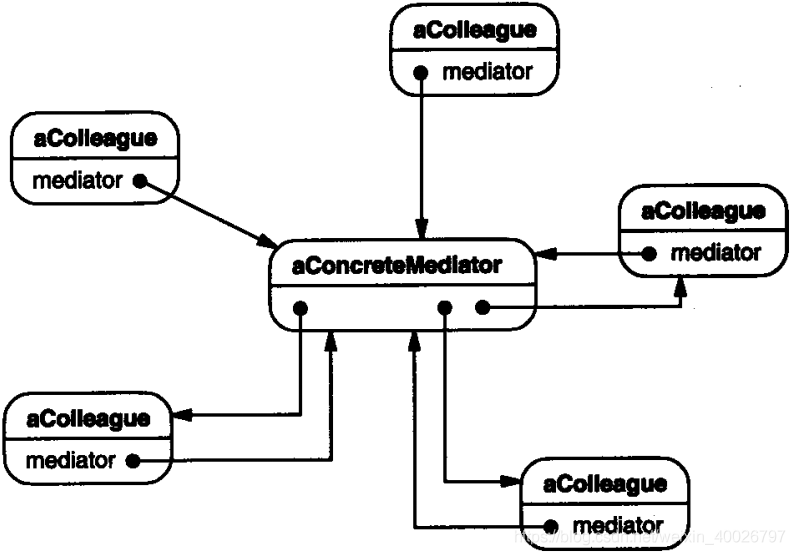

## 1 前言

本周参加了第十二次设计模式研讨会，主题是中介者模式，接下来我们来看看该模式的具体内容。

## 2 中介者模式

**中介者模式**：它用来降低多个对象和类之间的交互复杂性，它提供了一个中介类，该类通常处理不同类之间的交互，并支持松耦合，使代码易于维护。

**意图**：用一个中介对象来封装一系列的对象交互。中介者使各对象不需要显式地相互引用，从而使其耦合松散，而且可以独立地改变它们之间的交互。

**主要解决**：如果对象与对象之间存在大量的关联关系，这样势必会导致系统的结构变得很复杂，同时若是一个对象发生改变，我们也需要跟踪与之相关联的对象，同时做出相应的处理，中介者模式就是用来解决这种问题。

比如，MVC 框架中的控制器(controller)就是模式(model)和视图(view)的中介者，MVVM 中的 VM 层也是类似。

## 3 示例介绍

例如，考虑一个图形用户界面中对话框的实现。对话框使用一个窗口来展现一系列的窗
口组件, 如按钮、菜单和输入域等，通常对话框中的窗口组件间存在依赖关系。

例如 , 当某个输入域为空时 , 某个按钮不可用 或者 选择列表框中的某一列表项会改变输入域的内容；反过来，改变输入域中的文本，会改变列表框中的列表项或者 使某些按钮变得可用，这些按钮可以改变或删除这些输入域文本所指的东西。

不同的对话框会有不同的窗口组件间的依赖关系。因此即使对话框显示相同类型的窗口
组件, 也不能简单地直接重用已有的窗口组件类 ; 而必须定制它们以反映特定对话框的依赖关系。由于涉及很多个类，用逐个生成子类的办法来定制它们会很冗长。

可以通过将集体行为封装在一个单独的中介者(mediator)对象中避免这个问题。中介者负责控制和协调一组对象间的交互，它充当一个中介以使组中的对象不再相互显式引用。这些对象仅知道中介者, 从而减少了相互连接的数目。

面向对象设计鼓励将行为分布到各个对象中。这种分布可能会导致对象间有许多连接。在最坏的情况下,每一个对象都知道其他所有对象。

虽然将一个系统分割成许多对象通常可以增强可复用性 , 但是对象间相互连接的激增又会降低其可复用性。大量的相互连接使得一个对象似乎不太可能在没有其他对象的支持下工作，系统表现为一个不可分割的整体。而且，对系统的行为进行任何较大的改动都十分困难，因为行为被分布在许多对象中。结果是 , 你可能不得不定义很多子类以定制系统的行为。

例如，FontDialogDirector 可作为对话框中的窗口组件间的中介者。FontDialogDirector对象知道对话框中的各窗口组件，并协调它们之间的交互。它充当窗口组件间通信的中转中心，窗口组件间的通信都通过它间接进行，创建组件间不必互相知道，仅需知道 FontDialogDirector。



下面的交互图说明了各对象如何协作处理一个列表框中选项的变化。



下面一系列事件使一个列表框的选择被传送给一个输入域：

1. 列表框告诉它的操作者它被改变了。
2. FontDialogDirector 从列表框中得到选中的选择项。
3. FontDialogDirector 将该选择的列表项传递给输入域。
4. 现在输入域已有正文, FontDialogDirector 让某些按钮变得可用。

由于所有窗口组件的行为都放在于一个 中，只要扩展或替换它 , 就可以改变和替换这些行为。

这里展示的是 FontDialogDirector 抽象怎样被集成到一个类库中，如下图所示。



- DialogDirector 是一个抽象类, 它定义了一个对话框的总体行为。客户调用 ShowDialog 操作将对话框显示在屏幕上。
- CreateWidgets 是创建一个对话框的窗口组件的抽象操作。
- WidgetChanged 是另一个抽象操作 ; 窗口组件调用它来通知它的 FontDialogDirector 它们被改变了。
- DialogDirector 的子类将重定义 CreateWidgets 以创建正确的窗口组件, 并重定义 WidgetChanged 以处理其变化。

## 4 结构与参与者



**Mediator**： (中介者，如DialogDirector)

1. 中介者定义一个接口用于与各同事（Colleague）对象通信。

**ConcreteMediator**：（具体中介者，如FontDialogDirector）

1. 具体中介者通过协调各同事对象实现协作行为。
2. 了解并维护它的各个同事。

**Colleague class**：(同事类，如ListBox, EntryField)

1. 每一个同事类都知道它的中介者对象。
2. 每一个同事对象在需与其他的同事通信的时候，与它的中介者通信。



## 5 简单的示例代码

```cpp
// ConcreteMediator.h
#include "ConcreteColleagueB.h"
#include "Mediator.h"
#include "ConcreteColleagueA.h"
#include <map>
using namespace std;
class ConcreteMediator : public Mediator {
public:
	ConcreteMediator();
	virtual ~ConcreteMediator();

	virtual void operation(int nWho,string str);
	virtual void registered(int nWho, Colleague * aColleague);
private:
	map<int,Colleague*> m_mpColleague;
};
```

```cpp
// ConcreteMediator.cpp
#include "ConcreteMediator.h"
#include <map>
#include <iostream>
using namespace std;

ConcreteMediator::ConcreteMediator() {}
ConcreteMediator::~ConcreteMediator() {}

void ConcreteMediator::operation(int nWho,string str) {
	map<int,Colleague*>::const_iterator itr = m_mpColleague.find(nWho);
	if(itr == m_mpColleague.end()) {
		cout << "not found this colleague!" << endl;
		return;
	}
	Colleague* pc = itr->second;
	pc->receivemsg(str);
}


void ConcreteMediator::registered(int nWho,Colleague * aColleague) {
	map<int,Colleague*>::const_iterator itr = m_mpColleague.find(nWho);
	if(itr == m_mpColleague.end()) {
		m_mpColleague.insert(make_pair(nWho,aColleague));
		aColleague->setMediator(this);  //同时将中介类暴露给colleague 
	}
}
```

```cpp
// ConcreteColleagueA.h
#include "Colleague.h"

class ConcreteColleagueA : public Colleague {
public:
	ConcreteColleagueA();
	virtual ~ConcreteColleagueA();

	virtual void sendmsg(int toWho,string str);
	virtual void receivemsg(string str);

};
```

```cpp
// ConcreteColleagueA.cpp
#include "ConcreteColleagueA.h"
#include <iostream>
using namespace std;

ConcreteColleagueA::ConcreteColleagueA() {}
ConcreteColleagueA::~ConcreteColleagueA() {}

void ConcreteColleagueA::sendmsg(int toWho,string str) {
	cout << "send msg from colleagueA,to:" << toWho << endl;
	m_pMediator->operation(toWho,str);
}

void ConcreteColleagueA::receivemsg(string str) {
	cout << "ConcreteColleagueA reveivemsg:" << str <<endl;
}
```

```cpp
// mian.c
#include <iostream>
#include "ConcreteColleagueA.h"
#include "ConcreteMediator.h"
#include "ConcreteColleagueB.h"

using namespace std;

int main(int argc, char *argv[]) {
	ConcreteColleagueA * pa = new ConcreteColleagueA();
	ConcreteColleagueB * pb = new ConcreteColleagueB();
	ConcreteMediator * pm = new ConcreteMediator();
	pm->registered(1,pa);
	pm->registered(2,pb);
	
	// sendmsg from a to b
	pa->sendmsg(2,"hello,i am a");
	// sendmsg from b to a
	pb->sendmsg(1,"hello,i am b");
	
	delete pa,pb,pm;
	return 0;
}
```

输出结果如下：

```bash
send msg from colleagueA,to:2
ConcreteColleagueB reveivemsg:hello,i am a
send msg from colleagueB,to:1
ConcreteColleagueA reveivemsg:hello,i am b
```

## 6 总结

### 6.1 优缺点

**优点**：

1. 减少了子类生成：Mediator 将原本分布于多个对象间的行为集中在一起。改变这些行为只需生成 Meditator 的子类即可。这样各个 Colleague 类可被重用。
2. 它将各 Colleague 解耦：Mediator 有利于各个 Colleague 对象间的松耦合，可以独立的改变和复用各个 Colleague 类和 Mediator 类。
3. 它简化了对象协议：用 Mediator 和各个 Colleague 间的一对多的交互来代替多对多的交互。
4. 它对对象如何协作进行了抽象，有助于弄清楚系统中的对象是如何交互的。

**缺点**：它使控制集中化，中介者模式将交互的复杂性变为中介者的复杂性。因为中介者封装了协议，它可能比每个 Colleague 都复杂。这可能使得中介者自身成为一个难于维护的庞然大物。

### 6.2 应用场景

在以下情况可以使用中介者模式：

- 一组对象以定义良好但是复杂的方式进行通信，产生的相互依赖关系结构混乱且难以理解。 
- 一个对象引用其他很多对象并且直接与这些对象通信 ,导致难以复用该对象。
- 想定制一个分布在多个类中的行为，而又不想生成太多的子类。
