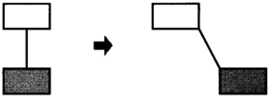
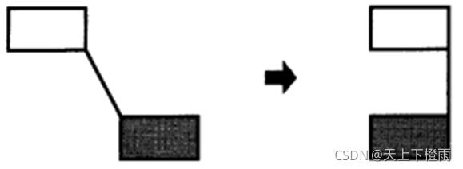
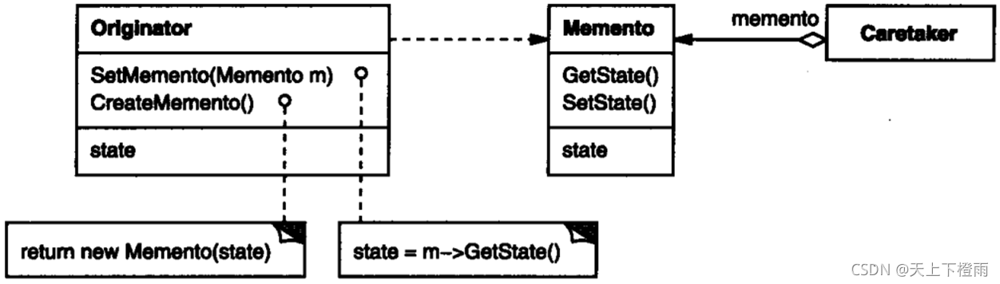
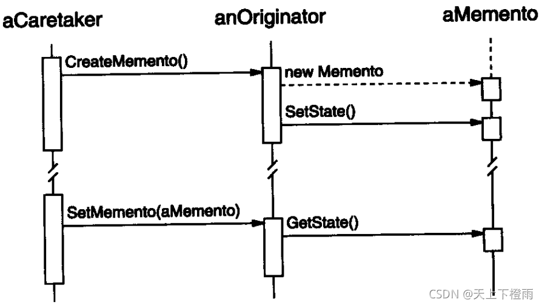

## 1 前言

本周参加了第十三次设计模式研讨会，主题是备忘录模式，接下来我们来看看该模式的具体内容。

## 2 备忘录模式

**备忘录模式**：在不破坏封装性的前提下，捕获一个对象的内部状态，并在该对象之外保存这个状态。

**意图**：在不破坏封装性的前提下，捕获一个对象的内部状态，并在该对象之外保存这个状态。这样以后就可将该对象恢复到原先保存的状态。

**主要解决**：该模式主要用于解决允许用户取消操作或者从错误中恢复操作的需求。

比如，游戏存档，Windows 系统中的 Ctrl + Z，数据库的事务管理等。

## 3 示例介绍

例如，考虑一个图形编辑器，它支持图形对象间的连线。用户可用一条直线连接两个矩
形, 而当用户移动任意一个矩形时 ,这两个矩形仍能保持连接。在移动过程中，编辑器自动伸展这条直线以保持该连接。

常用的保持对象间连接关系的方法是使用一个约束解释系统。将这一功能封装在一个 ConstraintSolver 对象中。它在连接生成时，记录这些连接并产生描述它们的数学方程。当用户生成一个连接或修改图形时，ConstraintSolver 就求解这些方程。并根据它的计算结果重新调整图形，使各个对象保持正确的连接。

本示例中，支持取消操并不像看起那么容易。一个简单的方法是每次移动时保存移动的距离，在取消这次移动时该对象移回相等的距离。但这不能保证所有的对象都会出现在它们原先出现的地方。假设在移动过程中某连接位置改变。在这种情况下 , 简单地将矩形移回它原来的位置并不一定能得到预想的结果。

一般来说, ConstraintSolver 的公共接口可能不足以精确地逆转它对其他对象的作用。为重建先前的状态，取消操作机制必须与 ConstraintSolver 更紧密的结合 , 但我们同时也应避免将 ConstraintSolver 的内部暴露给取消操作机制。

备忘录模式可以解决该问题，一个备忘录（memento）是一个对象，它存储另一个对象在某个瞬间的内部状态，而后者称为备忘录的原发器( originator )。当需要设置原发器的检查点时, 取消操作机制会向原发器请求一个备忘录。原发器用描述当前状态的信息初始化该备忘录。只有原发器可以向备忘录中存取信息，备忘录对其他的对象 “不可见”。

在刚才讨论的图形编辑器的例子中 , ConstraintSolver 可作为一个原发器。下面的事件序列描述了取消操作的过程：

1. 作为移动操作的一个额外操作 , 编辑器向 ConstraintSolver 请求一个备忘录。
2. ConstraintSolver 创建并返回一个备忘录 , 此处备忘录是 SolverState 类的一个实例，其中包含一些描述 ConstraintSolver 的内部等式和变量当前状态的数据结构。
3. 此后当用户取消移动操作时 , 编辑器将 SolverState 备忘录送回给 ConstraintSolver。
4. ConstraintSolver 根据 SolverState 对象中的信息，改变它的内部结构以精确地将它的等式和变量返回到先前的状态。

这一方案允许 ConstraintSolver 把恢复先前状态所需的信息交给其他的对象 , 而又不暴露它的内部结构和表示。

## 4 结构与参与者

**Memento**：(备忘录，如 SolverState)

1. 备忘录存储原发器对象的内部状态。
2. 防止原发器以外的其他对象访问备忘录。

**Originator**：(原发器，如ConstraintSolver)

1. 原发器创建一个备忘录,用以记录当前时刻它的内部状态。
2. 使用备忘录恢复内部状态.。

**Caretaker**：(负责人，如 undo mechanism)

1. 负责保存好备忘录。
2. 不能对备忘录的内容进行操作或检查。

## 5 协作

管理器向原发器请求一个备忘录，保留一段时间后，将其送回给原发器。有时管理者不会将备忘录返回给原发器 , 因为原发器可能根本不需要退到先前的状态。

## 6 总结

### 6.1 优缺点

**优点**：

1. 保持封装边界：使用备忘录可避免暴露只应由原发器管理却又必须存储在原发器之外的信息。该模式把可能很复杂的 Originator 内部信息对其他对象屏蔽起来 , 从而保持了封装边界。
2. 它简化了原发器：在其他保持封装性的设计中，Originator 负责保持客户请求过的内部状态版本，负担了存储管理工作，备忘录模式则减轻了这一负担。
3. 它给用户提供了一种可以恢复状态的机制，可以使用户能够比较方便地回到某个历史状态。

**缺点**：使用和维护备忘录的代价很大，频繁申请释放内存会消耗资源，容易产生内存碎片，并且在保存 Originator 内部状态的开销较大时，会占用较多内存资源。

### 6.2 应用场景

在以下情况可以使用备忘录模式：

- 必须保存一个对象在某一个时刻的 (部分)状态, 这样以后需要时它才能恢复到先前的状态。
- 如果一个用接口来让其它对象直接得到这些状态，将会暴露对象的实现细节并破坏对象的封装性。
