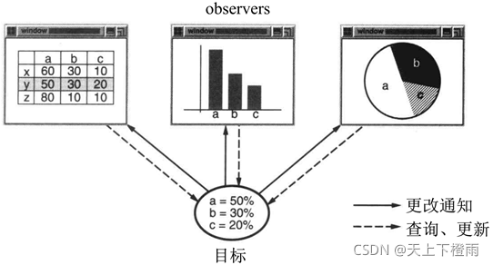
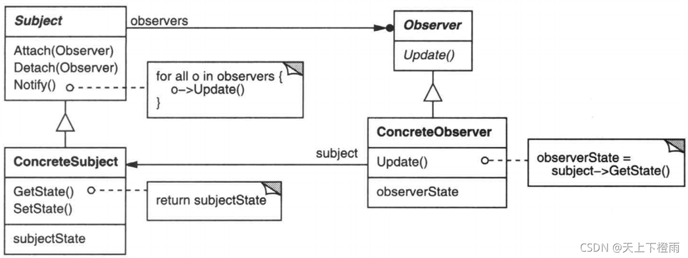
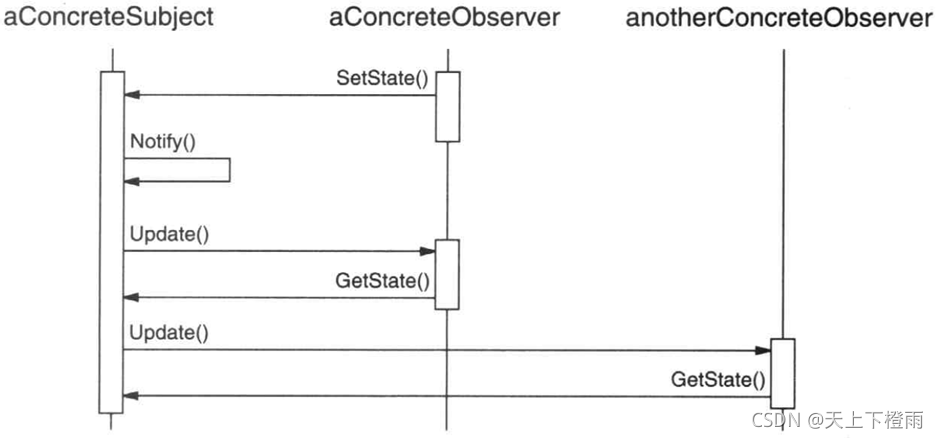

## 1 前言

本周参加了第十四次设计模式研讨会，主题是观察者模式，接下来我们来看看该模式的具体内容。

## 2 观察者模式

**观察者模式**：当对象间存在一对多关系时，则使用观察者模式。比如当一个对象被修改时，则会自动通知依赖它的对象，该模式属于行为型模式。

**意图**：定义对象间的一种一对多的依赖关系，当一个对象的状态发生改变时，所有依赖于它的对象都得到通知并被自动更新。

**主要解决**：该模式主要用于解决一个对象状态改变时通知其他对象的问题，而且要考虑到易用性和低耦合，保证高度的协作。

比如，AWTK-MVVM 的动态渲染，model 改变时，会通知依赖它的界面元素刷新。

> AWTK是  [ZLG](http://www.zlg.cn/) 开发的开源 GUI 引擎，官网地址：[https://www.zlg.cn/index/pub/awtk.html](https://www.zlg.cn/index/pub/awtk.html)。
> AWTK GitHub 仓库：[http://github.com/zlgopen/awtk-mvvm](http://github.com/zlgopen/awtk-mvvm)

> AWTK-MVVM是一套用C语言开发的，专门为嵌入式平台优化的MVVM框架。它实现了数据绑定、命令绑定和窗口导航等基本功能。
> AWTK-MVVM GitHub 仓库：[http://github.com/zlgopen/awtk-mvvm](http://github.com/zlgopen/awtk-mvvm)

## 3 示例介绍

将一个系统分割成一系列相互协作的类有一个常见的副作用：需要维护相关对象间的一致性。我们不希望为了维持一致性而使各类紧密耦合，因为这样降低了它们的可重用性。

例如, 许多图形用户界面工具箱将用户应用的界面表示与底下的应用数据分离（MVVM）。定义应用数据的类和负责界面表示的类可以各自独立地复用（它们也可一起工作）。 

一个表格对象和一个柱状图对象可使用不同的表示形式描述同一个应用数据对象的信息。表格对象和柱状图对象互相并不知道对方的存在，这样使你可以根据需要单独复用表格或柱状图。但在这里是它们表现的似乎互相知道。当用户改变表格中的信息时 ,柱状图能立即反映这一变化 , 反过来也是如此。



这一行为意味着表格对象和柱状图对象都依赖于数据对象 , 因此数据对象的任何状态改变
都应立即通知它们。同时也没有理由将依赖于该数据对象的对象的数目限定为两个，对相同的数据可以有任意数目的不同用户界面。

**Observer 模式描述了如何建立这种关系**。这一模式中的关键对象是目标( subject )和观察者( observer )。一个目标可以有任意数目的依赖它的观察者。一旦目标的状态发生改变 , 所有的观察者都得到通知。作为对这个通知的响应，每个观察者都将查询目标以使其状态与目标的状态同步。

这种交互也称为发布－订阅（publish-subscribe）。目标是通知的发布者。它发出通知时并不需知道谁是它的观察者。可以有任意数目的观察者订阅并接收通知。

## 4 结构与参与者



**Subject**：（目标）

1. 目标知道它的观察者。可以有任意多个观察者观察同一个目标。
2. 提供注册和删除观察者对象的接口。

**Observer**：（观察者）

1. 为那些在目标发生改变时需获得通知的对象定义一个更新接口。

**ConcreteSubject**：（具体目标）

1. 将有关状态存入各 ConcreteObserver 对象。
2. 当它的状态发生改变时, 向它的各个观察者发出通知。

**ConcreteObserver**：（具体观察者）

1. 维护一个指向 ConcreteSubject 对象的引用。
2. 存储有关状态，这些状态应与目标的状态保持一致。
3. 实现 Observer 的更新接口以使自身状态与目标的状态保持一致。

## 5 协作

当 ConcreteSubject 发生任何可能导致其观察者与其本身状态不一致的改变时，它将通知它的各个观察者。在得到一个具体目标的改变通知后 , ConcreteObserver 对象可向目标对象查询信息。ConcreteObserver 使用这些信息以使它的状态与目标对象的状态一致。



## 6 简单的示例代码

```cpp
// Subject.h
#include "Obeserver.h"
#include <vector>
using namespace std;

class Subject {
public:
	Subject();
	virtual ~Subject();
	Obeserver *m_Obeserver;

	void attach(Obeserver * pObeserver);
	void detach(Obeserver * pObeserver);
	void notify();
		
	virtual int getState() = 0;
	virtual void setState(int i)= 0;
	
private:
	vector<Obeserver*> m_vtObj;
};
```

```cpp
// Subject.cpp
#include "Subject.h"

Subject::Subject() {}

Subject::~Subject() {}

void Subject::attach(Obeserver * pObeserver) {
	m_vtObj.push_back(pObeserver);
}

void Subject::detach(Obeserver * pObeserver) {
	for(vector<Obeserver*>::iterator itr = m_vtObj.begin(); itr != m_vtObj.end(); itr++) {
		if(*itr == pObeserver) {
			m_vtObj.erase(itr);
			return;
		}			
	}
}

void Subject::notify(){
	for(vector<Obeserver*>::iterator itr = m_vtObj.begin(); itr != m_vtObj.end(); itr++) {	
		(*itr)->update(this);		
	}
}
```

```cpp
// Obeserver.h
class Subject;
class Obeserver {
public:
	Obeserver();
	virtual ~Obeserver();
	virtual void update(Subject * sub) = 0;
};
```

```cpp
// ConcreteObeserver.h
#include "Obeserver.h"
#include <string>
using namespace std;

class ConcreteObeserver : public Obeserver {
public:
	ConcreteObeserver(string name);
	virtual ~ConcreteObeserver();
	virtual void update(Subject * sub);

private:
	string m_objName;
	int m_obeserverState;
};
```

```cpp
// ConcreteObeserver.cpp
#include "ConcreteObeserver.h"
#include <iostream>
#include <vector>
#include "Subject.h"
using namespace std;

ConcreteObeserver::ConcreteObeserver(string name) {
	m_objName = name;
}

ConcreteObeserver::~ConcreteObeserver() {}

void ConcreteObeserver::update(Subject * sub) {
	m_obeserverState = sub->getState();
	cout << "update oberserver[" << m_objName << "] state:" << m_obeserverState << endl;
}
```

```cpp
// main.cpp
#include <iostream>
#include "Subject.h"
#include "Obeserver.h"
#include "ConcreteObeserver.h"
#include "ConcreteSubject.h"
using namespace std;

int main(int argc, char *argv[])
{
	Subject * subject = new ConcreteSubject();
	Obeserver * objA = new ConcreteObeserver("A");
	Obeserver * objB = new ConcreteObeserver("B");
	subject->attach(objA);
	subject->attach(objB);
	
	subject->setState(1);
	subject->notify();
	
	cout << "--------------------" << endl;
	subject->detach(objB);
	subject->setState(2);
	subject->notify();
	
	delete subject;
	delete objA;
	delete objB;
	return 0;
}
```

输出结果如下：

```bash
update oberserver[A] state:1
update oberserver[B] state:1
--------------------
update oberserver[A] state:2
```

## 7 总结

### 7.1 优缺点

**优点**：

1. **目标和观察者间的抽象耦合**：一个目标所知道的仅仅是它有一系列观察者 , 每个都符合抽象的Observer 类的简单接口。目标不知道任何一个观察者属于哪一个具体的类。这样目标和观察者之间的耦合是抽象的和最小的。
2. **支持广播通信**：不像通常的请求，目标发送的通知不需指定它的接收者。通知被自动广播给所有已向该目标对象登记的有关对象。目标对象唯一的责任就是通知它的各观察者。这给了在任何时刻增删观察者的自由。处理还是忽略通知取决于观察者。


**缺点**：

1. **意外的更新**：因为一个观察者并不知道其它观察者的存在 , 它对改变目标的代价一无所知。在目标上一个看似无害的的操作可能会引起一系列观察者以及依赖于这些观察者的对象的更新。此外 ，如果依赖准则的定义或维护不当，常常会引起错误的更新 , 这种错误通常很难捕捉。


### 7.2 应用场景

在以下任一情况下可以使用观察者模式：

- 当一个抽象模型有两个方面，其中一个方面依赖于另一方面。将这二者封装在独立的对象中以使它们可以各自独立地改变和复用。
- 当对一个对象的改变需要同时改变其它对象，而不知道具体有多少对象有待改变。
- 当一个对象必须通知其它对象，而它又不能假定其它对象是谁。换言之，你不希望这些对象是紧密耦合的。
性。
