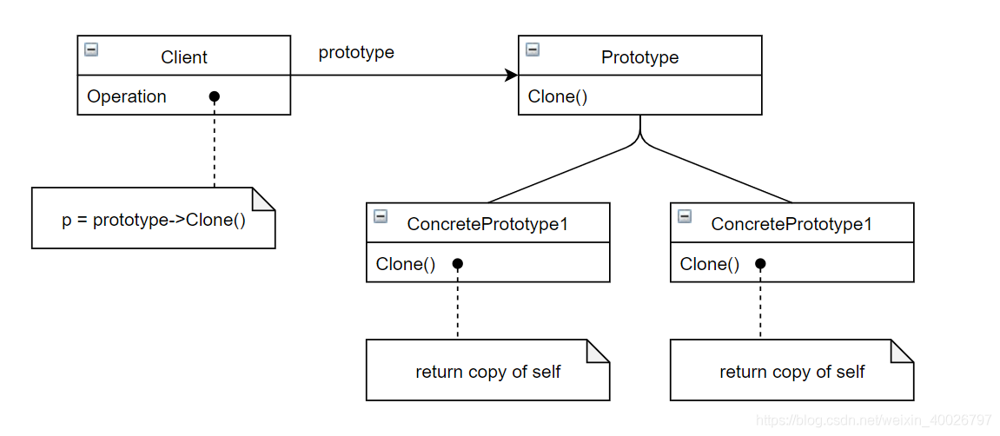

## 1 前言

原型模式（Prototype Pattern）相对比较简单，因此并不为其专门开一次研讨会，在闲余时间自行学习，接下来我们来看看该模式的具体内容。

## 2 原型模式

原型模式即实现一个原型接口，该接口用于创建当前对象的克隆。

**意图**：用原型实例指定创建对象的种类，并且通过拷贝这些原型创建新的对象。

当直接创建对象的代价比较大时，则采用这种模式。例如，一个对象需要在一个高代价的数据库操作之后被创建。我们可以缓存该对象，在下一个请求时返回它的克隆，在需要的时候更新数据库，以此来减少数据库调用。

原型模式的类图如下所示：



## 3 原型模式在AWTK中的应用

由类图可知，原型模式其实就是提供一个克隆接口用于创建对象，从而规避构造函数的约束，也节省了初始化对象的过程。

在AWTK中，控件基类类 widget\_t 便提供了克隆接口 widget_clone()，那么该接口通常用在什么地方呢？

在 AWTK-MVVM 中动态更新 list\_view 控件便使用了该接口，代码如下：

> AWTK是  [ZLG](http://www.zlg.cn/) 开发的开源 GUI 引擎，前往 [官网](https://www.zlg.cn/index/pub/awtk.html)。
> [AWTK-MVVM](http://github.com/zlgopen/awtk-mvvm) 是一套为 AWTK 用 C 语言开发，并支持各种脚本语言的 MVVM 框架。

```c
//awtk-mvvm\src\mvvm\awtk\binding_context_awtk.c
......
static widget_t* binding_context_get_widget(binding_context_t* ctx, widget_t* container) {
  darray_t* cache = &(ctx->cache_widgets);
  widget_t* widget = darray_pop(cache);
  if (widget == NULL) {
    widget_t* template_widget = WIDGET(widget_get_prop_pointer(container, WIDGET_PROP_TEMPLATE_WIDGET));
    
    //将第一个子控件作为模板，通过克隆的方式实现动态生成子控件。
    widget = widget_clone(template_widget, NULL);  
  }

  return widget;
}

......

static ret_t binding_context_prepare_children(binding_context_t* ctx, widget_t* widget) {
  uint32_t i = 0;
  view_model_t* view_model = ctx->view_model;
  uint32_t items = object_get_prop_int(OBJECT(view_model), VIEW_MODEL_PROP_ITEMS, 0);
  widget_t* template_widget = WIDGET(widget_get_prop_pointer(widget, WIDGET_PROP_TEMPLATE_WIDGET));

  if (template_widget == NULL) {
    template_widget = widget_get_child(widget, 0);
    widget_set_prop_pointer(widget, WIDGET_PROP_TEMPLATE_WIDGET, template_widget);
    widget_on(widget, EVT_DESTROY, binding_context_on_container_destroy, widget);

    widget_remove_child(widget, template_widget);
  }

  widget_trim_children(ctx, widget, items);
  for (i = widget_count_children(widget); i < items; i++) {
    widget_add_child(widget, binding_context_get_widget(ctx, widget));
  }
  return_value_if_fail(items == widget_count_children(widget), RET_OOM);

  return RET_OK;
}
......
```

从以上代码可以看出，当 list\_view 控件中的子控件需要动态生成时，使用原型模式进行克隆时最简单的方式，可以试想如果不使用原型模式，用 widget_factory() 来构造每一个子控件，那么将会出现构造、初始化等臃肿繁琐的代码，而且由于  list\_view 子控件的相似性，其中初始化的过程显得非常多余。

此处使用原型模式让代码可读性更好，变得更优雅，避免了重复调用构造函数和初始化子控件对象的过程，对 [AWTK-MVVM](http://github.com/zlgopen/awtk-mvvm) 感兴趣的朋友可自行查阅源码。

## 4 总结

### 4.1 优缺点

**优点**： 

1. 性能提高。  
2. 逃避构造函数的约束。
3. 让代码变得更优雅，可读性更好；

**缺点**： 

1. 配备克隆方法需要对类的功能进行通盘考虑，这对于全新的类不是很难，但对于已有的类不一定很容易，特别当一个类引用不支持串行化的间接对象，或者引用含有循环结构的时候。
2. 必须实现 Clone 接口。

### 5.1 适用场景

1. 当一个系统应该独立于它的产品创建，构成和表示时。
2. 当要实例化的类是在运行时刻指定时，例如，通过动态装载。   
3. 为了避免创建一个与产品类层次平行的工厂类层次时。 
4. 当一个类的实例只能有几个不同状态组合中的一种时。建立相应数目的原型并克隆它们可能比每次用合适的状态手工实例化该类更方便一些。
