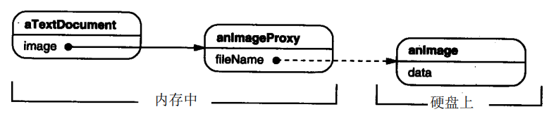
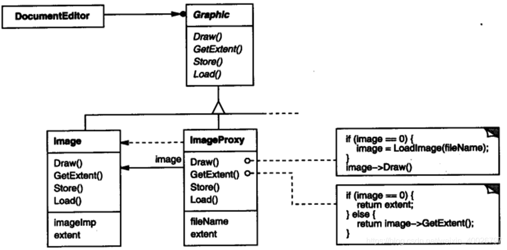
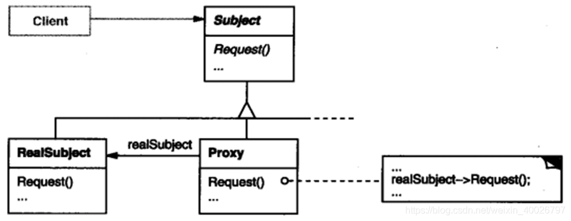
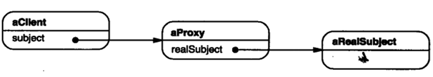

## 1 前言

本周参加了第八次设计模式研讨会，主题是代理（Proxy）模式，接下来我们来看看该模式的具体内容。

## 2 代理模式

**Proxy 模式**：在该模式中，一个类代表另一个类的功能，我们创建具有现有对象的对象，以便向外界提供功能接口。

**意图**：为其他对象提供一种代理以控制对这个对象的访问。

**动机**：在某些情况下，一个客户不想或者不能直接引用一个对象，此时可以通过一个称之为“代理”的第三者来实现间接引用。

**核心思想**：代理对象相当于客户端与目标对象之间的**中介**。代理对象可以在用户确实需要目标对象时负责对目标对象实例化，并且可以通过代理对象去掉用户不能看到的内容和服务，或者添加用户需要的额外服务。

## 3 示例介绍

例如，一个可以在文档中嵌入图形对象的文档编辑器。有些图形对象（如大型光栅图像）的创建开销很大。但是打开文档必须很迅速，因此我们在**打开文档时应避免一次性创建所有开销很大的对象**。因为并非所有这些对象在文档中都同时可见，所以也没有必要同时创建这些对象。

这意味着，对于每一个开销很大的对象，应该根据需要进行创建，当一个图像变为可见时会产生这样的需要。

此时，可以使用另一个对象，即图像 Proxy，替代那个真正的图像。 Proxy 可以代替一个图像对象，并且在需要时负责实例化这个图像对象。



文档编辑器通过抽象的 Graphic 类定义的接口访问嵌入的图像。

ImageProxy 是那些根据需要创建的图像的类， 它保存了文件名作为指向磁盘上的图像文件的指针。该文件名被作为一个参数传递给 ImageProxy 的构造器。

ImageProxy 还存储了这个图像的边框以及对真正的 Image 实例的指引，直到代理实例化真正的图像时，这个指引才有效。 

Draw 操作必须保证在向这个图像转发请求之前，它已经被实例化了。

GetExtent 操作只有在图像被实例化后才向它传递请求，否则，ImageProxy 返回它存储的图像尺寸。



## 4 结构与参与者



以下是运行时刻一种可能的代理结构的对象图。



**Proxy** ：（ImageProxy）

保存访问实体的引用，提供与实体接口相同的接口，控制对实体的存取并负责创建和删除它；

其他功能依赖于代理的类型：

- RemoteProxy 负责对请求及其参数进行编码，并向不同地址空间中的实体发送已编码请求
- VirtualProxy 可以缓存实体的附加信息，以便延迟对它的访问。例如，动机一节中提到的 ImageProxy 缓存了图像实体的尺寸。
- ProtectionProxy 检查调用者是否具有实现一个请求所必需的访问权限。

**Subject**：（Graphic）

定义 RealSubject 和 Proxy 共用接口；

**RealSubject**：（Image）

定义 Proxy 所代表的实体。

## 5 简单的示例代码

```cpp
// Proxy.h
#include "RealSubject.h"
#include "Subject.h"

class Proxy : public Subject
{
public:
	Proxy();
	virtual ~Proxy();
	void request();

private:
	void afterRequest();
	void preRequest();	
	RealSubject *m_pRealSubject;
};
```

```cpp
#include "Proxy.h"
#include <iostream>
using namespace std;

Proxy::Proxy(){
	m_pRealSubject = new RealSubject();
}

Proxy::~Proxy(){
	delete m_pRealSubject;
}

void Proxy::afterRequest(){
	cout << "Proxy::afterRequest" << endl;
}


void Proxy::preRequest(){
	cout << "Proxy::preRequest" << endl;
}

void Proxy::request(){
	preRequest();
	m_pRealSubject->request();
	afterRequest();
}
```

```cpp
// main.cpp
#include <iostream>
#include "RealSubject.h"
#include "Proxy.h"

using namespace std;

int main(int argc, char *argv[])
{
	Proxy proxy;
	proxy.request();
	
	return 0;
}
```

输出结果如下：

```bash
Proxy::preRequest
RealSubject ::request
Proxy::afterRequest
```

> 上网查找资料时有人觉得 RealSubject 对象的创建应该是在 main 中实现，但我认为 RealSubject 应该对用户是透明的，用户所面对的接口都是通过代理的，这样才是真正的代理。

## 6 总结

### 6.1 优缺点

**优点**：

1. 代理模式能够协调调用者和被调用者，在一定程度上降低了系统的耦合；
2. 远程代理使得客户端可以访问远程机器上的对象，远程机器可能有更好的计算性能与处理速度，可以快速响应并处理客户端请求；
3. 虚拟代理通过使用一个小对象来代表一个大对象，可以减少系统资源的消耗；
4. 保护代理可以控制对真实对象的使用权限。

**缺点**：

1. 由于在客户端与真正实体之间增加了代理对象，因此有些类型的代理模式会造成请的处理速度变慢；
2. 实现代理模式需要额外的工作，有些代理模式实现非常复杂。

### 6.2 应用场景
根据代理模式的使用目录，常见的代理模式有以下几种类型：

- 远程代理（Remote Proxy）：为一个位于不同地址空间的对象提供一个本地代理对象。
- 虚拟代理（Virtual Proxy） ：如果需要创建一个资源消耗较大的对象，可以先创建一个消耗相对较小的对象来表示，真实对象只在需要时才会被真正创建。
- 保护代理（Protection Proxy）：控制对原始对象的访问。在对象有不同的访问权限时使用。
- 智能指引（Remote Proxy）：取代了简单的指针，它在访问对象时执行一些附加操作。 它的典型用途包括：

> 1. 对指向实际对象的引用计数，这样当该对象没有引用时，可以自动释放它 (也称为Smart Pointers)。 
> 2. 当第一次引用一个持久对象时，将它装入内存。 
> 3. 在访问一个实际对象前，检查是否已经锁定了它，以确保其他对象不能改变它。
