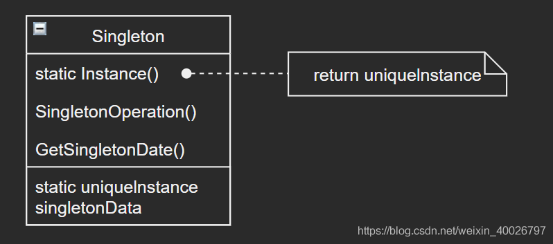

## 1 前言

单例模式（Singleton Pattern）是最简单的设计模式之一，因此并不为其专门开一次研讨会，在闲余时间自行学习，接下来我们来看看该模式的具体内容。

## 2 单例模式

单例模式即保证一个类仅有一个实例，并提供一个访问它的全局访问点

单例模式本质上就是让类自身负责保存它的唯一实例。这个类可以保证没有其他实例可
以被创建（通过截取创建新对象的请求），并且它可以提供一个访问该实例的方法。

由此可见，单例模式主要是用来避免 一个全局使用的类被频繁地创建与销毁 的情况，当我们想控制实例数目或者节省系统资源的时候使用。

## 3 示例类图



单例模式类的构造函数需设置为私有，避免用户在外部调用，并提供一个公有的获取唯一实例的接口。

## 4 示例代码

### 4.1 懒汉式（非线程安全）

懒汉式的特点是延迟加载，比如配置文件，采用懒汉式的方法，顾名思义，懒汉么，很懒的，例如配置文件的实例在用到的时候才会加载。
简单理解即在第一次获取类的实例时调用构造函数进行实例化。

首先来看看最基本的实现，这种实现最大的问题就是不支持多线程。当多个线程同时请求第一次获取实例时可能会创建多个指向不同实例的指针。

这种实现通常用在**不要求线程安全的情况**，优点是节省内存（第一次获取时才创建实例），并且运行效率高，但在多线程不能正常工作。代码如下：

```c
//singleton.h
#ifndef SINGLETON_H
#define SINGLETON_H

#include <stdio.h>
#include <stdlib.h>

typedef struct  _singleton_t {
	int data;
}singleton_t;

/**
* @method singleton
* 获取唯一实例（getInstance接口）。
*
* @return {singleton_t*} 返回singleton实例。
*/
singleton_t* singleton();

/**
* @method singleton_destroy
* 析构函数（销毁singleton实例，释放内存）。
*/
void singleton_destroy();

#endif /*SINGLETON_H*/
```

```c
//singleton.c
#include "singleton.h"
#include <assert.h>

/* 全局静态指针（指向唯一实例） */
static singleton_t* s_singleton = NULL;

static singleton_t* singleton_create() {
	s_singleton = (singleton_t*)malloc(sizeof(singleton_t));
	s_singleton->data = 0;
	return s_singleton;
}

singleton_t* singleton() {
	if (s_singleton == NULL) {
		singleton_create();  /* 调用构造函数实例化 */
	}
	assert(s_singleton != NULL);
	return s_singleton;
}

void singleton_destroy() {
	if (s_singleton != NULL) {
		free(s_singleton);
	}
}
```

```c
//main.c
#include "singleton.h"

int main(int argc, const char* argv[]) {

	singleton_t* singleton1 = singleton();
	singleton1->data = 10;

	singleton_t* singleton2 = singleton();
	singleton2->data = 20;

	if (singleton1 == singleton2) {
		printf("singleton1 == singleton2\n");
	}
	printf("singleton1->data = %d\n", singleton1->data);
	printf("singleton2->data = %d\n", singleton2->data);

	singleton_destroy();
	system("pause");
	return 0;
}
```

输入如下：

```bash
singleton1 == singleton2
singleton1->data = 20
singleton2->data = 20
```

### 4.2 懒汉式+线程互斥锁（线程安全）

由于上述最基本的懒汉式单例模式无法在多线程的情况下正常工作，那么对其进行进行优化，最简单的方式就是加上互斥锁，但这样肯定会降低效率，代码如下：

```c
//头文件singleton.h无变化，请查看4.1中的代码
```

```c
//singleton.c
#include "singleton.h"
#include <assert.h>
#include <pthread.h> 

extern pthread_mutex_t mute;

/* 全局静态指针（指向唯一实例） */
static singleton_t* s_singleton = NULL;

static singleton_t* singleton_create() {
	s_singleton = (singleton_t*)malloc(sizeof(singleton_t));
	s_singleton->data = 0;
	return s_singleton;
}

singleton_t* singleton() {
	pthread_mutex_lock(&mute); /* 上锁 */
	if (s_singleton == NULL) {
		singleton_create();  /* 调用构造函数实例化 */
	}
	pthread_mutex_unlock(&mute); /* 解锁 */
	assert(s_singleton != NULL);
	return s_singleton;
}

void singleton_destroy() {
	if (s_singleton != NULL) {
		free(s_singleton);
	}
}
```

```c
//main.c
#include <pthread.h> 
#include "singleton.h"

pthread_mutex_t mute; /* 互斥锁 */
int main(int argc, const char* argv[]) {
    pthread_mutex_init(&mute, NULL); /* 初始化互斥锁 */
    
	singleton_t* singleton1 = singleton();
	singleton_t* singleton2 = singleton();

	singleton1->data = 10;
	singleton2->data = 20;

	if (singleton1 == singleton2) {
		printf("singleton1 == singleton2\n");
	}
	printf("singleton1->data = %d\n", singleton1->data);
	printf("singleton2->data = %d\n", singleton2->data);

	singleton_destroy();
	pthread_mutex_destroy(&mute); /* 释放互斥锁 */
	
	system("pause");
	return 0;
}
```

### 4.3 懒汉式+OpenMP并行编程（避免死锁）

使用OpenMP并行编程可以避免多个进程同时修改实例对象时造成不同进程之间相互等待从而导致死锁的情况，代码如下：

> 关于OpenMP并行编程的内容可以参考博客：[【并行计算】基于OpenMP的并行编程](https://www.cnblogs.com/hantan2008/p/5961312.html)

```c
//头文件singleton.h无变化，请查看4.1中的代码
```

```c
//singleton.c
#include "singleton.h"
#include <assert.h>
#include <omp.h>

extern omp_lock_t lock;

/* 静态全局指针（指向唯一实例） */
static singleton_t* s_singleton = NULL;

static singleton_t* singleton_create() {
	s_singleton = (singleton_t*)malloc(sizeof(singleton_t));
	s_singleton->data = 0;
	return s_singleton;
}

singleton_t* singleton() {
	omp_set_lock(&lock); /* 上omp锁 */
	if (s_singleton == NULL) {
		singleton_create();  /* 调用构造函数实例化 */
	}
	omp_unset_lock(&lock); /* 解omp锁 */
	assert(s_singleton != NULL);
	return s_singleton;
}

void singleton_destroy() {
	if (s_singleton != NULL) {
		free(s_singleton);
	}
}
```

```c
//main.c
#include<omp.h>
#include "singleton.h"

omp_lock_t lock; /* omp锁 */
int main(int argc, const char* argv[]) {
	omp_set_num_threads(20);
    omp_init_lock(&lock); /* 初始化omp锁 */
    
	singleton_t* singleton1;
	singleton_t* singleton2;
#pragma omp parallel
	{
		singleton1 = singleton();
		singleton1->data = omp_get_thread_num();
	}
#pragma omp parallel 
	{
		singleton2 = singleton();
		singleton2->data = omp_get_thread_num();
	}

	if (singleton1 == singleton2) {
		printf("singleton1 == singleton2\n");
	}
	printf("singleton1->data = %d\n", singleton1->data);
	printf("singleton2->data = %d\n", singleton2->data);
	
    omp_destroy_lock(&lock); /* 释放omp锁 */
	singleton_destroy();
	system("pause");

	return 0;
}
```

### 4.4 饿汉式（非线程安全）

饿汉式的特点是程序一运行就创建实例了，因为饿汉式使用静态局部变量让类加载时就实例化，其优点是节省时间，但浪费内存。

如果说懒汉式是“时间换空间”，那么饿汉式就是“空间换时间”，饿汉式通常在复杂类实例化时间较长时使用，代码如下：

```c
//singleton.h
#ifndef SINGLETON_H
#define SINGLETON_H

#include<stdio.h>
#include<stdlib.h>

typedef struct  _singleton_t {
	int data;
}singleton_t;

/**
* @method singleton
* 获取唯一实例（getInstance接口）。
*
* @return {singleton_t*} 返回singleton实例。
*/
singleton_t* singleton();

#endif /*SINGLETON_H*/
```

```c
//singleton.c
#include "singleton.h"
#include <assert.h>

singleton_t* singleton() {
	static singleton_t s_singleton; /* 静态局部对象（唯一实例） */
	assert(&s_singleton != NULL);
	return &s_singleton;
}
```

```c
//main.c
#include "singleton.h"

int main(int argc, const char* argv[]) {

	singleton_t* singleton1 = singleton();
	singleton_t* singleton2 = singleton();

	singleton1->data = 10;
	singleton2->data = 20;

	if (singleton1 == singleton2) {
		printf("singleton1 == singleton2\n");
	}
	printf("singleton1->data = %d\n", singleton1->data);
	printf("singleton2->data = %d\n", singleton2->data);

	system("pause");
	return 0;
}
```

输入如下：

```bash
singleton1 == singleton2
singleton1->data = 20
singleton2->data = 20
```

上述写法对于多线程获取实例是安全的，但若想要实现多线程修改实例对象，同样需要添加互斥锁，可参考本文 4.2 章节。

## 5 总结

首先注意一点，为了方便演示，以上示例代码我没有写单例类 singleton_t 中的成员变量的get方法和set方法，通常情况下需要提供这些方法给用户使用。

### 5.1 单例模式的优缺点

**优点**：

1. 在内存里只有一个实例，减少了内存的开销，尤其是频繁的创建和销毁实例（比如管理学院首页页面缓存）。
2. 避免对资源的多重占用（比如写文件操作）。
3. 对唯一实例的受控访问，它可以严格的控制客户怎样以及何时访问它。
4. 缩小命名控件，单例模式是对全局变量的一种改进，它避免了那些储存唯一实例的全局变量污染命名空间。

**缺点**：没有接口，不能继承，与单一职责原则冲突，一个类应该只关心内部逻辑，而不关心外面怎么样来实例化。

### 5.2 其他优化改进

针对以上缺点，在C语言中其实是有解决方案的，可以将单例类（singleton_t）抽象出来作为基类，将其实例化的过程（构造函数）放到子类中。

比如 [AWTK 源码](https://github.com/zlgopen/awtk) 中实现的 窗口管理器（window_manager），基类 window_manager_t 采用了单例模式，实例化的过程放在其子类 window_manager_simple_t 中，通过外部注入的方式设置到静态全局指针中（指向唯一的实例化对象），感兴趣的朋友可以自行研究源码。

> AWTK是 [ZLG](http://www.zlg.cn/) 开发的开源 GUI 引擎，前往 [官网](https://www.zlg.cn/index/pub/awtk.html)。
