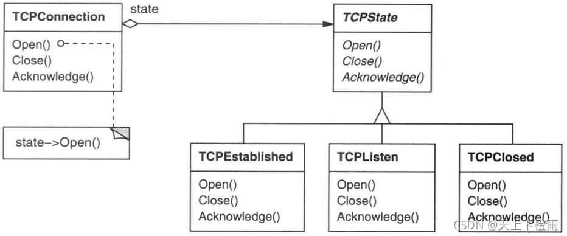
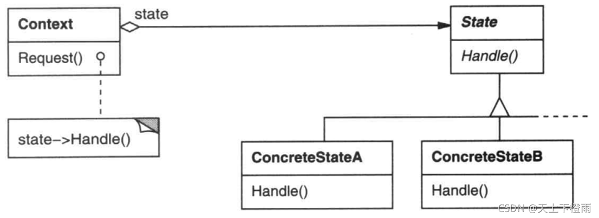

## 1 前言

国庆假期前参加了第十五次设计模式研讨会，主题是状态模式，接下来我们来看看该模式的具体内容。

## 2 状态模式

**状态模式**：在状态模式中，类的行为是基于它的状态改变的，它属于行为模式。

**意图**：允许一个对象在其内部状态改变时改变它的行为。对象看起来似乎修改了它的类。

**主要解决**：该模式主要用于解决对象行为依赖于它的状态（属性）的问题，可以根据对象的状态改变而改变对象的行为。

比如，TCP协议网络连接状态的不同，会表现出不同的行为。

## 3 示例介绍

考虑一个表示网络连接的类 TCPConnection。一个 TCPConnection 对象的状态处于若干不
同状态之一： 连接已建立（Established）、正在监听( Listening )、连接已关闭(Closed )。

当一个 TCPConnection 对象收到其他对象的请求时，它根据自身的当前状态作出不同的反应。例如，一个 Open 请求的结果依赖于该连接的状态。 

**State 模式描述了 TCPConnection 如何在每一种状态下表现出不同的行为。**

这一模式的关键思想是引入了一个称为 TCPState 的抽象类来表示网络的连接状态。TCPState 类为各表示不同的操作状态的子类声明了一个公共接口。 TCPState 的子类实现与特定状态相关的行为。

例如 , TCPEstablished 和 TCPClosed 类分别实现了特定于 TCPConnection 的连接已建立状态和连接已关闭状态的行为。



TCPConnection 类维护一个表示TCP连接当前状态的状态对象 (一个TCPState子类的实例)。

TCPConnection 类将所有与状态相关的请求委托给这个状态对象。 TCPConnection 使用它的 TCPState 子类实例来执行特定于连接状态的操作。

**一旦连接状态改变， TCPConnection 对象就会改变它所使用的状态对象。**

例如，当连接从已建立状态转为已关闭状态时 , TCPConnection 会用一个 TCPClosed 的实例来代替原来的 TCPEstablished 的实例。

## 4 结构与参与者



**Context**：(环境，如 TCPConnection)

1. 定义客户感兴趣的接口。
2. 维护一个 ConcreteState 子类的实例，这个实例定义当前状态。

**State**：(状态，如 TCPState)

1. 定义一个接口以封装与 Context 的一个特定状态相关的行为。

**ConcreteState subclasses**：(具体状态子类，如TCPEstablished, TCPListen, TCPClosed)

1. 每一子类实现一个与 Context 的一个状态相关的行为。

## 5 协作

-  Context 将与状态相关的请求委托给当前的 ConcreteState 对象处理。
-  Context可将自身作为一个参数传递给处理该请求的状态对象。这使得状态对象在必要时可访问 Context。
- Context 是客户使用的主要接口。客户可用状态对象来配置一个 Context ，一旦一个 Context 配置完毕, 它的客户不再需要直接与状态对象打交道。
-  Context 或 ConcreteState 子类都可决定哪个状态是另外哪一个的后继者，以及是在何种条件下进行状态转换。

## 6 简单的示例代码

```cpp
//  Context.h
#include "State.h"
class Context {
public:
	Context();
	virtual ~Context();

	void changeState(State * st);
	void request();

private:
	State *m_pState;
};
```

```cpp
//  Context.cpp
#include "Context.h"
#include "ConcreteStateA.h"

Context::Context() {
	//default is a
	m_pState = ConcreteStateA::Instance();
}

Context::~Context() {
}

void Context::changeState(State * st) {
	m_pState = st;
}

void Context::request() {
	m_pState->handle(this);
}
```

```cpp
//  ConcreteStateA.h
#include "State.h"
class ConcreteStateA : public State {
public:
	virtual ~ConcreteStateA();
	static State * Instance();
	virtual void handle(Context * c);

private:
	ConcreteStateA();
	static State * m_pState;
};
```

```cpp
//  ConcreteStateA.cpp
#include "ConcreteStateA.h"
#include "ConcreteStateB.h"
#include "Context.h"
#include <iostream>
using namespace std;

State * ConcreteStateA::m_pState = NULL;
ConcreteStateA::ConcreteStateA() {}
ConcreteStateA::~ConcreteStateA() {}

State * ConcreteStateA::Instance() {
	if ( NULL == m_pState) {
		m_pState = new ConcreteStateA();
	}
	return m_pState;
}

void ConcreteStateA::handle(Context * c) {
	cout << "doing something in State A.\n done,change state to B" << endl;
	c->changeState(ConcreteStateB::Instance());
}
```

```cpp
// main.cpp
#include <iostream>
#include "Context.h"
#include "ConcreteStateA.h"
#include "ConcreteStateB.h"
using namespace std;

int main(int argc, char *argv[]) {
	Context * c = new Context();
	c->request();
	c->request();
	c->request();

	delete c;
	return 0;
}
```

输出结果如下：

```bash
doing something in State A.
 done,change state to B
doing something in State B.
 done,change state to A
doing something in State A.
 done,change state to B
```

## 7 总结

### 7.1 优缺点

**优点**：

1. 封装了转换规则。
2. 枚举可能的状态，在枚举状态之前需要确定状态种类。
3. 将所有与某个状态有关的行为放到一个类中，并且可以方便地增加新的状态也，只需要改变对象状态即可改变对象的行为。
4. 允许状态转换逻辑与状态对象合为一体，而不是某一个巨大的条件语句块（难以维护）。
5. 可以让多个环境对象共享一个状态对象，从而减少系统中对象的个数。

**缺点**：

1. 状态模式的使用必然会增加系统类和对象的个数。
2. 状态模式的结构与实现都较为复杂，如果使用不当将导致程序结构和代码的混乱。
3. 状态模式对“开闭原则”的支持并不好，对于可以切换状态的状态模式，增加新的状态类需要修改那些负责状态转换的源代码，而且修改某个状态类的行为也需修改对应类的源码。

### 7.2 应用场景

在以下两种情况下均可以使用状态模式：

-  一个对象的行为取决于它的状态 , 并且它必须在运行时刻根据状态改变它的行为。
-  一个操作中含有庞大的多分支的条件语句，且这些分支依赖于该对象的状态。这个状态通常用一个或多个枚举常量表示。通常 , 有多个操作包含这一相同的条件结构。状态模式将每一个条件分支放入一个独立的类中。这使得你可以根据对象自身的情况将对象的状态作为一个对象，这一对象可以不依赖于其他对象而独立变化。
