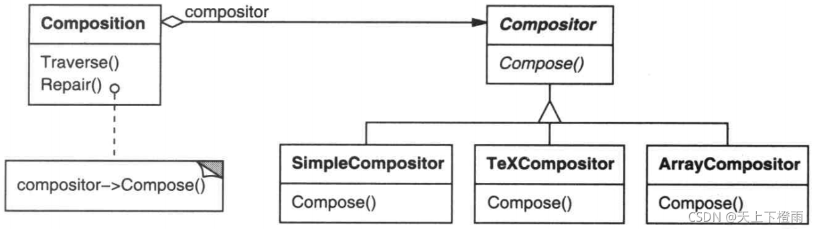
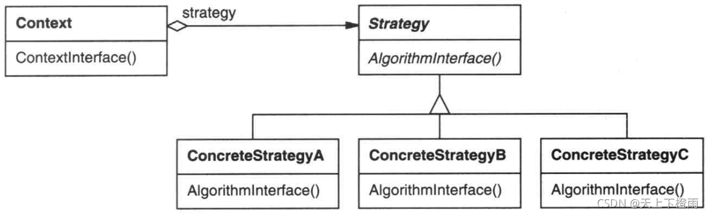

## 1 前言

近期参加了第十六次设计模式研讨会，主题是策略模式，接下来我们来看看该模式的具体内容。

## 2 策略模式

**策略模式**：在状态模式中，一个类的行为或其算法可以在运行时修改，它属于行为模式。在该模式中，我们创建表示各种策略的对象和一个行为随着策略对象改变而改变的context对象，策略对象改变context对象的执行算法。

**意图**：定义一系列的算法,把它们一个个封装起来,并且使它们可相互替换。本模式使得算法可独立于使用它的客户而变化。

比如，植物大战僵尸游戏中有大量不同类型的僵尸实体类，它们都继承僵尸抽象类，但在不同外部环境下，其前进速度、攻击方式、造型可能都不同，这些是动态变化的，可将其封装成一系列算法，方便用户根据不同的外部环境动态切换。

## 3 示例介绍

比如，有许多算法可对一个正文流进行分行。将这些算法硬编进使用它们的类中是不可取的，其原因如下:

1. 需要换行功能的客户程序如果直接包含换行算法代码的话将会变得复杂，这使得客户程序庞大并且难以维护，尤其当其需要支持多种换行算法时问题会更加严重。
2. 不同的时候需要不同的算法，我们不想支持我们并不使用的换行算法。
3. 当换行功能是客户程序的一个难以分割的成分时，增加新的换行算法或改变现有算法将十分困难。

我们可以定义一些类来**封装不同的换行算法**，从而避免这些问题。一个以这种方法封装的算法称为**一个策略(strategy)**，如下图所示。



假设一个 Composition 类负责维护和更新一个正文浏览程序中显示的正文换行。换行策略不是 Composition 类实现的，而是由抽象的 Compositor 类的子类各自独立地实现的。

**Compositor 各个子类实现不同的换行策略：**

1. SimpleCompositor 实现一个简单的策略，它一次决定一个换行位置。
2. TeXCompositor 实现查找换行位置的TEX算法。这个策略尽量全局地优化换行,也就是，一次处理一段文字的换行。
3. ArrayCompositor 实现一个策略,该策略使得每一行都含有一个固定数目的项。例如，用于对一系列的图标进行分行。

Composition 维护对 Compositor 对象的一个引用。一旦 Composition 重新格式化它的正文，它就将这个职责转发给它的 Compositor 对象。Composition 的客户指定应该使用哪一种 Compositor 的方式是直接将它想要的 Compositor 装入 Composition 中。

## 4 结构与参与者



**Strategy：**(策略，如 Compositor)

1. 定义所有支持的算法的公共接口。Context 使用这个接口来调用某 ConcreteStrategy 定义的算法。

**ConcreteStrategy：**(具体策略，如 SimpleCompositor、TeXCompositor…)

1. 以 Strategy 接口实现某具体算法。

**Context：**(上下文，如 Composition)

1. 用一个 ConcreteStrategy 对象来配置。
2. 维护一个对 Strategy 对象的引用。
3. 可定义一个接口来让 Stategy 访问它的数据。

## 5 协作

- Strategy 和 Context 相互作用以实现选定的算法。当算法被调用时，Context 可以将该算法所需要的所有数据都传递给该 Stategy 。或者 Context 可以将自身作为一个参数传递给 Strategy 操作。这就让 Strategy 在需要时可以回调 Context。
- Context 将它的客户的请求转发给它的 Strategy。客户通常创建并传递一个ConcreteStrategy 对象给该 Context；这样，客户仅与 Context 交互。通常有一系列的 ConcreteStrategy 类可供客户从中选择。

## 6 简单的示例代码

```cpp
//  Context.h
#include "Strategy.h"
class Context {
public:
	Context();
	virtual ~Context();
	void algorithm();
	void setStrategy(Strategy* st);
private:
	Strategy *m_pStrategy;
};
```

```cpp
//  Context.cpp
#include "Context.h"
Context::Context(){}
Context::~Context(){}

void Context::algorithm(){
	m_pStrategy->algorithm();
}

void Context::setStrategy(Strategy* st){
	m_pStrategy = st;
}
```

```cpp
//  ConcreteStrategyA.h
#include "Strategy.h"
class ConcreteStrategyA : public Strategy {
public:
	ConcreteStrategyA();
	virtual ~ConcreteStrategyA();
	virtual void algorithm();
};
```

```cpp
//  ConcreteStrategyA.cpp
#include "ConcreteStrategyA.h"
#include <iostream>
using namespace std;

ConcreteStrategyA::ConcreteStrategyA(){}
ConcreteStrategyA::~ConcreteStrategyA(){}

void ConcreteStrategyA::algorithm(){
	cout << "use algorithm A" << endl;
}
```

```cpp
#include <iostream>
#include "Context.h"
#include "ConcreteStrategyA.h"
#include "ConcreteStrategyB.h"
#include "Strategy.h"
#include <vector>
using namespace std;

int main(int argc, char *argv[]) {
	Strategy * s1 = new ConcreteStrategyA();
	Context * cxt = new Context();
	cxt->setStrategy(s1);
	cxt->algorithm();

	Strategy *s2 = new ConcreteStrategyB();
	cxt->setStrategy(s2);
	cxt->algorithm();
	
	delete s1;
	delete s2;
	
	int rac1 = 0x1;
	int rac2 = 0x2;
	int rac3 = 0x4;
	int rac4 = 0x8;
	
	int i = 0xe;
	int j = 0x5;

	int r1 = i & rac1;
	int r2 = i & rac2;
	int r3 = i & rac3;
	int r4 = i & rac4;
	
	cout <<"res:" << r1 << "/" << r2 << "/" << r3 << "/" << r4 << endl;
	
	return 0;
}
```

输出结果如下：

```bash
use algorithm A
use algorithm B
```

## 7 总结

### 7.1 优缺点

**优点**：

1. 封装了一系列算法，可以代替继承的方式，容易维护且扩展性良好。
2. 用户可以根据需求自由切换算法，降低耦合，提高了灵活行。
3. 避免使用多重条件判断（含有许多条件语句的代码通常意味着需要使用策略模式）。

**缺点**：

1. 策略类会增多，系统中对象的数目也会增多。
2. Strategy和Context之间通信开销较大，有时 Context 会创建和初始化一些用不到的参数。
3. 所有策略类都需要对外暴露，用户必须了解这些不同的 Strategy。

### 7.2 应用场景

当存在以下情况时使用策略模式：


- 许多相关的类仅仅是行为有异。“策略”提供了一种用多个行为中的一个行为来配置一个类的方法。
- 需要使用一个算法的不同变体。例如，你可能会定义一些反映不同的空间/时间权衡的算法。当这些变体实现为一个算法的类层次时，可以使用策略模式。
- 算法使用客户不应该知道的数据。可使用策略模式以避免暴露复杂的、与算法相关的数据结构。
- 一个类定义了多种行为 , 并且这些行为在这个类的操作中以多个条件语句的形式出现。将相关的条件分支移入它们各自的 Strategy 类中以代替这些条件语句。
