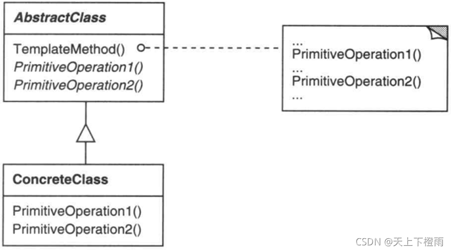

## 1 前言

近期参加了第十七次设计模式研讨会，主题是模板方法，接下来我们来看看该模式的具体内容。

## 2 模板方法

**模板方法**：在模板方法中，一个抽象类公开定义了执行它的方式/模板。它的子类可以按需要重写方法实现，但调用将以抽象类定义的方式进行。这种类型的设计魔术属于类行为型模式。

**意图**：定义一个操作中的算法的骨架，而将一些步骤延迟到子类中。TemplateMethod 使得子类可以不改变一个算法的结构即可重定义该算法的某些特定步骤。

比如，常见的购物场景。生活中我们都离不开购物，购物我们可能在网上也可能在实体店中购物，但大体可以分为以下几个步骤：浏览商品、加购物车、结算商品价格。这里我们可以把这个总体的步骤当做是一个抽象类，然后我们有这三个步骤，其中具体浏览了什么商品，那些加购了都可以在子类中实现，最后进行结算。

## 3 示例介绍

假设一个提供考虑一个提供 Application 和 Document 类的应用框架。 Application 类负责打开一个已有的以外部形式存储的文档，如一个文件。一旦一个文档中的信息从该文件中读出后，它就由一个 Document 对象表示。

用框架构建的应用可以通过继承 Application 和 Document 来满足特定的需求。

例如：

-  一个绘图应用定义 DrawApplication 和 DrawDocument 子类；
-  一个电子表格应用定义 Spreadsheet-Application 和 SpreadsheetDocument 子类。

抽象的 Application 类在它的 OpenDocument 操作中定义了打开和读取一个文档的算法：

```c
void Application::OpenDocument (const char* name) {
  if (!CanOpenDocument(name)) {
    return;
  }
  Document* doc = DoCreateDocument();
  if (doc) {
    _docs->AddDocument(doc);
    AboutToOpenDocument(doc);
    doc->Open();
    doc->DoRead();
  }
}
```


OpenDocument 定义了打开一个文档的每一个主要步骤。它检查该文档是否能被打开，创
建与应用相关的 Document 对象，将它加到它入的文档集合中，并且从一个文件中读取该Document。

我们称 OpenDocument 为一个模板方法(template method)。一个模板方法用一些抽象的操作定义一个算法，而子类将重定义这些操作以提供具体的行为。 

Application 的子类将定义检查一个文档是否能够被打开（CanOpenDocument）和创建文档（DoCreateDocument）的具体算法步骤。Document 子类将定义读取文档（DoRead）的算法步骤。

如果需要，模板方法也可定义一个操作（AboutToOpenDocument）让 Application 子类知道该文档何时将被打开。通过使用抽象操作定义一个算法中的一些步骤，模板方法确定了它们的先后顺序，但它允许 Application 和 Document 子类改变这些具体步骤以满足它们各自的需求。

## 4 结构与参与者



**AbstractClass**：（抽象类，如 Application）

1. 定义抽象的原语操作（primitive operation），具体的子类将重定义它们以实现一个算法的各步骤。
2. 实现一个模板方法,定义一个算法的骨架。该模板方法不仅调用原语操作，也调用定义在 AbstractClass 或其他对象中的操作。

**ConcreteClass**：（具体类，如 MyApplication）

实现原语操作以完成算法中与特定子类相关的步骤。

## 5 协作

ConcreteClass 靠 AbstractClass 来实现算法中不变的步骤。

## 6 总结

### 6.1 优缺点

**优点**：

1. 封装不变部分，扩展可变部分。
2. 提取公共代码，便于维护。
3. 行为由抽象基类控制，子类实现。

**缺点**：每一个不同的实现都需要一个子类，导致类的个数增加，使得系统更庞大。

### 6.2 应用场景

模板方法应用于下列情况：

- 一次性实现一个算法的不变的部分，并将可变的行为留给子类来实现。
- 各子类中公共的行为应被提取出来并集中到一个公共父类中以避免代码重复。首先识别现有代码中的不同之处，并且将不同之处分离为新的操作。最后，用一个调用这些新的操作的模板方法来替换这些不同的代码。
- 控制子类扩展。模板方法只在特定点调用“hook”操作，这样就只允许在这些点进行扩展。
