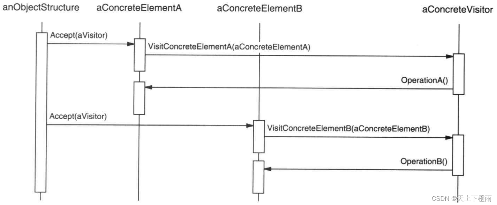

## 1 前言

设计模式的基础学习进入了尾声，本周在家看了一下《设计模式：可复用面向对象软件的基础》中介绍的最后一个设计模式——访问者模式，在此写篇博客记录一下。

**虽然通过阅读《设计模式：可复用面向对象软件的基础》以及与同事开展研讨会学习了各种设计模式，但这还远远不够，后续需要在实践中应用这些设计模式，写出易扩展、易用、易维护的代码，提高自己的开发能力。**

## 2 访问者模式

**访问者模式**：表示一个作用于某对象结构中的各元素的操作。它使你可以在不改变各元素的类的前提下定义作用于这些元素的新操作。

**意图**：主要将数据结构与数据操作分离，访问者模式能将算法与其所作用的对象隔离开来。

比如，有一位非常希望赢得新客户的资深保险代理人。 他可以拜访街区中的每栋楼， 尝试向每个路人推销保险。 所以根据大楼内组织类型的不同， 他可以提供专门的保单：

- 如果建筑是居民楼， 他会推销医疗保险。
- 如果建筑是银行， 他会推销失窃保险。
- 如果建筑是咖啡厅， 他会推销火灾和洪水保险。

## 3 示例介绍

假如，需要设计一个编译器，它将源程序表示为一个抽象语法树。该编译器需在抽象语法树上实施某些操作以进行“静态语义”分析，例如检查是否所有的变量都已经被定义了。它也需要生成代码。因此它可能要定义许多操作以进行类型检查、代码优化、流程分析，检查变量是否在使用前被赋初值，等等。此外，还可使用抽象语法树进行优美格式打印、程序重构、 code instrumentation 以及对程序进行多种度量。

这些操作大多要求对不同的节点进行不同的处理。例如对代表赋值语句的结点的处理就不同于对代表变量或算术表达式的结点的处理。因此有用于赋值语句的类，有用于变量访问的类，还有用于算术表达式的类，等等。结点类的集合当然依赖于被编译的语言，但对于一个给定的语言其变化不大。


上面的框图显示了 Node 类层次的一部分。这里的问题是，将所有这些操作分散到各种结点类中会导致整个系统难以理解、难以维护和修改。将类型检查代码与优美格式打印代码或流程分析代码放在一起，将产生混乱。此外，增加新的操作通常需要重新编译所有这些类。

如果可以独立地增加新的操作，并且使这些结点类独立于作用于其上的操作，将会更好一些。要实现上述两个目标，我们可以将每一个类中相关的操作包装在一个独立的对象（称为一个Visitor）中，并在遍历抽象语法树时将此对象传递给当前访问的元素。当一个元素“接受”该访问者时，该元素向访问者发送一个包含自身类信息的请求。该请求同时也将该元素本身作为一个参数。然后访问者将为该元素执行该操作—这一操作以前是在该元素的类中的。

例如，一个不使用访问者的编译器可能会通过在它的抽象语法树上调用 TypeCheck 操作对一个过程进行类型检查。每一个结点将对调用它的成员的 TypeCheck 以实现自身的 TypeCheck 。

如果该编译器使用访问者对一个过程进行类型检查，那么它将会创建一个TypeCheckingVisitor 对象，并以这个对象为一个参数在抽象语法树上调用 Accept 操作。每一个结点在实现 Accept 时将会回调访问者：一个赋值结点调用访问者的 VisitAssignment 操作，而一个变量引用将调用 VisitVariableReference。以前类 AssignmentNode 的 TypeCheck  操作现在成为 TypeCheckingVisitor  的 VisitAssignment  操作。

为使访问者不仅仅只做类型检查，我们需要所有抽象语法树的访问者有一个抽象的父类 NodeVisitor。NodeVisitor 必须为每一个结点类定义一个操作。一个需要计算程序度量的应用将定义 NodeVisitor 的新的子类，并且将不再需要在结点类中增加与特定应用相关的代码。Visitor 模式将每一个编译步骤的操作封装在一个与该步骤相关的 Visitor 中。


使用 Visitor 模式，必须定义两个类层次：一个对应于接受操作的元素（ Node 层次）另一个对应于定义对元素的操作的访问者（ NodeVisitor 层次）。给访问者类层次增加一个新的子类即可创建一个新的操作。只要该编译器接受的语法不改变（即不需要增加新的 Node 子类），我们就可以简单的定义新的 NodeVisitor 子类以增加新的功能。

## 4 结构与参与者


**Visitor**：（访问者，如NodeVisitor）

为该对象结构中 ConcreteElement 的每一个类声明一个 Visit 操作。该操作的名字和特征标识了发送 Visit 请求给该访问者的那个类。这使得访问者可以确定正被访问元素的具体的类。这样访问者就可以通过该元素的特定接口直接访问它。

**ConcreteVisitor**：（具体访问者，如TypeCheckingVisitor）

实现每个由 Visitor 声明的操作。每个操作实现本算法的一部分，而该算法片断乃是对应于结构中对象的类。ConcreteVisitor 为该算法提供了上下文并存储它的局部状态。这一状态常常在遍历该结构的过程中累积结果。

**Element**：（元素，如Node）

定义一个 Accept 操作，它以一个访问者为参数。

**ConcreteElement**：（具体元素，如 AssignmentNode，VariableRefNode）

实现 Accept 操作，该操作以一个访问者为参数。

**ObjectStructure**：（对象结构，如 Program）

1. 能枚举它的元素。
2. 可以提供一个高层的接口以允许该访问者访问它的元素。
3. 可以是一个复合或是一个集合，如一个列表或一个无序集合。

## 5 协作

- 一个使用 Visitor 模式的客户必须创建一个 ConcreteVisitor 对象，然后遍历该对象结构，并用该访问者访问每一个元素。
- 当一个元素被访问时，它调用对应于它的类的 Visitor 操作。如果必要，该元素将自身作为这个操作的一个参数以便该访问者访问它的状态。

下面的交互框图说明了一个对象结构、一个访问者和两个元素之间的协作。



## 6 简单的示例代码

```cpp
// main.cc
class ConcreteComponentA;
class ConcreteComponentB;

class Visitor {
 public:
  virtual void VisitConcreteComponentA(const ConcreteComponentA *element) const = 0;
  virtual void VisitConcreteComponentB(const ConcreteComponentB *element) const = 0;
};

class Component {
 public:
  virtual ~Component() {}
  virtual void Accept(Visitor *visitor) const = 0;
};

class ConcreteComponentA : public Component {
 public:
  void Accept(Visitor *visitor) const override {
    visitor->VisitConcreteComponentA(this);
  }
  std::string ExclusiveMethodOfConcreteComponentA() const {
    return "A";
  }
};

class ConcreteComponentB : public Component {
 public:
  void Accept(Visitor *visitor) const override {
    visitor->VisitConcreteComponentB(this);
  }
  std::string SpecialMethodOfConcreteComponentB() const {
    return "B";
  }
};

class ConcreteVisitor1 : public Visitor {
 public:
  void VisitConcreteComponentA(const ConcreteComponentA *element) const override {
    std::cout << element->ExclusiveMethodOfConcreteComponentA() << " + ConcreteVisitor1\n";
  }

  void VisitConcreteComponentB(const ConcreteComponentB *element) const override {
    std::cout << element->SpecialMethodOfConcreteComponentB() << " + ConcreteVisitor1\n";
  }
};

class ConcreteVisitor2 : public Visitor {
 public:
  void VisitConcreteComponentA(const ConcreteComponentA *element) const override {
    std::cout << element->ExclusiveMethodOfConcreteComponentA() << " + ConcreteVisitor2\n";
  }
  void VisitConcreteComponentB(const ConcreteComponentB *element) const override {
    std::cout << element->SpecialMethodOfConcreteComponentB() << " + ConcreteVisitor2\n";
  }
};

void ClientCode(std::array<const Component *, 2> components, Visitor *visitor) {
  // ...
  for (const Component *comp : components) {
    comp->Accept(visitor);
  }
  // ...
}

int main() {
  std::array<const Component *, 2> components = {new ConcreteComponentA, new ConcreteComponentB};
  std::cout << "客户端代码通过访问者基类接口调用所有访问者实体类：\n";
  ConcreteVisitor1 *visitor1 = new ConcreteVisitor1;
  ClientCode(components, visitor1);
  std::cout << "\n";
  std::cout << "它允许相同的客户端代码与不同类型的访问者一起工作：\n";
  ConcreteVisitor2 *visitor2 = new ConcreteVisitor2;
  ClientCode(components, visitor2);

  for (const Component *comp : components) {
    delete comp;
  }
  delete visitor1;
  delete visitor2;

  return 0;
}
```

输出结果：

```bash
客户端代码通过访问者基类接口调用所有访问者实体类：
A + ConcreteVisitor1
B + ConcreteVisitor1

它允许相同的客户端代码与不同类型的访问者一起工作：
A + ConcreteVisitor2
B + ConcreteVisitor2
```

## 7 总结

### 7.1 优缺点

**优点**：符合单一职责原则、优秀的扩展性、灵活性。

1. 访问者模式使得易于增加新的操作：访问者使得增加依赖于复杂对象结构的构件的操作变得容易了。仅需增加一个新的访问者即可在一个对象结构上定义一个新的操作。相反，如果每个功能都分散在多个类之上的话，定义新的操作时必须修改每一类。
2. 访问者集中相关的操作而分离无关的操作：相关的行为不是分布在定义该对象结构的各个类上，而是集中在一个访问者中。无关行为却被分别放在它们各自的访问者子类中。这就既简化了这些元素的类，也简化了在这些访问者中定义的算法。所有与它的算法相关的数据结构都可以被隐藏在访问者中。

**缺点**：具体元素对访问者公布细节，违反了迪米特原则、具体元素变更比较困难、违反了依赖倒置原则。

1. 增加新的 ConcreteElement 类很困难：每添加一个新的 ConcreteElement  都要在 Vistor 中添加一个新的抽象操作，并在每一个 ConcretVisitor 类中实现相应的操作。有时可以在 Visitor 中提供一个缺省的实现，这一实现可以被大多数的ConcreteVisitor 继承，但这与其说是一个规律还不如说是一种例外。
2. 破坏封装：访问者方法假定 ConcreteElement 接口的功能足够强，足以让访问者进行它们的工作。结果是，该模式常常迫使你提供访问元素内部状态的公共操作，这可能会破坏它的封装性。

### 7.2 应用场景

在下列情况下使用 Visitor 模式：

- 一个对象结构包含很多类对象，它们有不同的接口，而你想对这些对象实施一些依赖于其具体类的操作。
- 需要对一个对象结构中的对象进行很多不同的并且不相关的操作，而你想避免让这些操作“污染”这些对象的类。Visitor 使得你可以将相关的操作集中起来定义在一个类中。当该对象结构被很多应用共享时，用 Visitor 模式让每个应用仅包含需要用到的操作。
- 定义对象结构的类很少改变，但经常需要在此结构上定义新的操作。改变对象结构类需要重定义对所有访问者的接口，这可能需要很大的代价。如果对象结构类经常改变，那么可能还是在这些类中定义这些操作较好。
