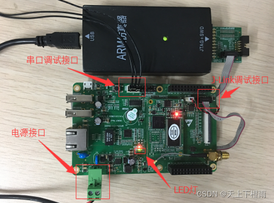

## 1 前言

近期因工作需求学习了一下 IOT.js 和 AWorks 平台通用外设接口（包括：ADC、GPIO、I2C、PWM、SPI 和 UART），并将它们逐一适配到 IOT.js 中，为后续 [AWTK-MVMM](https://github.com/zlgopen/awtk-mvvm) 的 JS项目支持平台外设调用奠定基础，此处做笔记记录一下。

- [IOT.js适配AWorks平台通用外设接口（1）：ADC](./iotjs_aworks_adc.md)；
- [IOT.js适配AWorks平台通用外设接口（2）：GPIO](./iotjs_aworks_gpio.md)；
- [IOT.js适配AWorks平台通用外设接口（3）：I2C](./iotjs_aworks_i2c.md)；
- [IOT.js适配AWorks平台通用外设接口（4）：PWM](./iotjs_aworks_pwm.md)；
- [IOT.js适配AWorks平台通用外设接口（5）：SPI](./iotjs_aworks_spi.md)；
- [IOT.js适配AWorks平台通用外设接口（6）：UART](./iotjs_aworks_uart.md)；

### 1.1 IOT.js

IOT.js 是三星开源的 JavaScript 物联网开发平台。它为 JavaScript 应用程序提供了访问硬件、网络、文件系统和异步化的能力，功能类似于 nodejs，但无论是代码体积还是内存需求，IOT.js 都要小很多，是用 JavaScript 开发 IOT 设备应用程序的首选。

> 备注： IOT.js 的 GitHub 仓库：https://github.com/jerryscript-project/iotjs。

### 1.2 AWorks

AWorks 是 [ZLG](https://www.zlg.cn/index.html) 开发的 IOT 物联网生态系统，将MCU和OS的共性高度抽象为统一接口，支持平台组件“可插拔、可替换、可配置”，与硬件无关、与操作系统种类无关的方式设计，只需修改相应的头文件，即可实现“一次编程、终生使用、跨平台”。

我们这里主要使用 AWorks M1052 开发板作为测试设备适配常见外设接口。



## 2 A/D转换器

### 2.1 模数信号转换

ADC 即模拟信号转数字信号，我们经常接触的噪声和图像信号都是模拟信号，要将模拟信号转换为数字信号，必须经过采样、保持、量化和编码几个过程。AWorks提供了A/D转换接口，可以直接通过接口获取相应引脚输入的模拟电压大小。

### 2.2 A/D 转换接口

AWorks提供了的A/D转换接口分为 3 大类：基础配置接口、获取采样值接口（同步方式）和获取采样值接口（异步方式）。

基础配置接口：

- aw_adc_rate_get：获取ADC通道的采样率。
- aw_adc_rate_set：设置ADC通道的采样率。
- aw_adc_vref_get：获取基准电压。
- aw_adc_bits_get：获取ADC通道的转换位数。

获取采样值接口（同步方式）：

- aw_adc_sync_read：读取指定通道的采样值。

> 备注：这里的JS异步接口的适配主要是借助 IoT.js 中的 libtuv 实现，因此就不详细介绍AWorks提供的异步接口了。

## 3 适配过程

### 3.1 AWorks演示代码

首先来看看在AWorks上如何读取指定ADC引脚的采样数据。

步骤一：外设使能，在AWorks工程配置文件 `aw_prj_params.h` 中开启以下宏定义使能对应的ADC设备：

```c
#define AW_DEV_IMX1050_ADC1    /**< \brief iMX1050 ADC */
```

步骤二：到外设文件中查看设备对应的引脚，比如这里查看 `awbl_hwconf_imx1050_adc1.h` 文件，找到 ADC1 设备通道 0 所对应的引脚为 GPIO1_27，通过查阅硬件设计图得知该引脚在底板中丝印为串口8的RX，因此这里我们需要关闭串口8的功能，避免引脚复用的情况。

步骤三：编写例程，首先定义 ADC 通道号和采样次数，之后读取通道的 AD 值并将 AD 值转换为电压值打印显示，循环操作。示例代码如下：

```c
#include "aw_adc.h"

#define N_SAMPLES    1       //定义采样次数为1次
#define CHANNEL      0        //转换通道为通道0

int main()
{
    uint16_t adc_val[N_SAMPLES];  /* ADC值 */
    uint32_t vol_val[N_SAMPLES];  /* 电压值 */
    aw_err_t  ret;
    int       i;
    
    /* ADC值清0 */
    memset(adc_val, 0, sizeof(adc_val));

    /* 读取通道的AD值 */
    ret = aw_adc_sync_read(CHANNEL, adc_val, N_SAMPLES, FALSE);
    if (ret != AW_OK) {
        aw_kprintf("read fail\r\n");
    } else {
        aw_kprintf("read success\r\n");
    }

    /* 转换为实际电压值 */
    aw_adc_val_to_mv(CHANNEL, adc_val, N_SAMPLES, vol_val);

    /* 打印采样值 */
    for (i = 0; i < N_SAMPLES; i++) {
        aw_kprintf("%d ", vol_val[i]);
    }
    return 0;
}
```

我们将底板上的 3.3V 电压引脚与 RX8 短接，输出结果如下：

```bash
read success
3300
```

> 备注：`aw_adc_val_to_mv` 转换接口得到的采样值单位为 mv。

### 3.2 C语言适配层

在 IOT.js 中，适配某个平台的外设通常需要实现 `src/modules/iotjs_module_xxx.h` 文件中的接口，比如这里我们需要实现 `iotjs_module_adc.h` 中的相关接口：

```c
#ifndef IOTJS_MODULE_ADC_H
#define IOTJS_MODULE_ADC_H

#include "iotjs_def.h"
#include "iotjs_module_periph_common.h"

// Forward declaration of platform data. These are only used by platform code.
// Generic ADC module never dereferences platform data pointer.
typedef struct iotjs_adc_platform_data_s iotjs_adc_platform_data_t;

typedef struct {
  jerry_value_t jobject;
  iotjs_adc_platform_data_t* platform_data;
  int32_t value;
} iotjs_adc_t;

bool iotjs_adc_read(iotjs_adc_t* adc);
bool iotjs_adc_close(iotjs_adc_t* adc);  
bool iotjs_adc_open(iotjs_adc_t* adc);

// Platform-related functions; they are implemented
// by platform code (i.e.: linux, nuttx, tizen).
void iotjs_adc_create_platform_data(iotjs_adc_t* adc);
void iotjs_adc_destroy_platform_data(iotjs_adc_platform_data_t* platform_data);
jerry_value_t iotjs_adc_set_platform_config(iotjs_adc_t* adc,
                                            const jerry_value_t jconfig);

#endif /* IOTJS_MODULE_ADC_H */
```

适配层（`src/modules/aworks/iotjs_module_adc-aworks.c`）代码如下：

```c
#if !defined(WITH_AWORKS)
#error "Module __FILE__ is for AWorks only"
#endif

#include "iotjs_def.h"
#include "aw_adc.h"
#include "modules/iotjs_module_adc.h"

struct iotjs_adc_platform_data_s {
  uint32_t channel;
};

/* ADC通道 */
#define AWORKS_ADC_STRING_CHANNEL "channel"

/* 采样次数 */
#define AWORKS_ADC_SAMPLES_NUM 1

void iotjs_adc_create_platform_data(iotjs_adc_t* adc) {
  adc->platform_data = IOTJS_ALLOC(iotjs_adc_platform_data_t);
  adc->platform_data->channel = 0;
}

void iotjs_adc_destroy_platform_data(iotjs_adc_platform_data_t* platform_data) {
  IOTJS_RELEASE(platform_data);
}

jerry_value_t iotjs_adc_set_platform_config(iotjs_adc_t* adc,
                                            const jerry_value_t jconfig) {
  JS_GET_REQUIRED_CONF_VALUE(jconfig, adc->platform_data->channel,
                             AWORKS_ADC_STRING_CHANNEL, number);

  return jerry_create_undefined();
}

bool iotjs_adc_read(iotjs_adc_t* adc) {
  uint32_t ch = adc->platform_data->channel;
  int bits = aw_adc_bits_get(ch);

  if (bits > 0) {
    /* 储存ADC值的缓冲区实际类型与ADC位数相关 */
    /* 1~8位：类型为 uint8_t */
    /* 9~16位：类型为 uint16_t */
    /* 17~32位：类型为 uint32_t */
    int multiple = bits > 8 ? (bits > 16 ? 4 : 2) : 1;
    char adc_v[AWORKS_ADC_SAMPLES_NUM * multiple]; /* ADC值 */
    uint32_t vol_v[AWORKS_ADC_SAMPLES_NUM];        /* 电压值 */

    memset(adc_v, 0x00, sizeof(adc_v));
    memset(vol_v, 0x00, sizeof(vol_v));

    /* 读取通道的AD值 */
    if (aw_adc_sync_read(ch, (void*)adc_v, AWORKS_ADC_SAMPLES_NUM, AW_FALSE) <
        0) {
      return false;
    }

    /* 转换为实际电压值，单位为：mV */
    if (aw_adc_val_to_mv(ch, (void*)adc_v, AWORKS_ADC_SAMPLES_NUM, vol_v) < 0) {
      return false;
    }

    adc->value = (int32_t)(*vol_v);

    return true;
  }

  return false;
}


bool iotjs_adc_close(iotjs_adc_t* adc) {
  return true;
}

bool iotjs_adc_open(iotjs_adc_t* adc) {
  iotjs_adc_platform_data_t* platform_data = adc->platform_data;
  int bits = aw_adc_bits_get(platform_data->channel);
  int vref = aw_adc_vref_get(platform_data->channel);

  // 检查AWorks上对应的ADC通道是否可用
  if (bits < 0 || vref < 0) {
    return false;
  }

  return true;
}
```

### 3.3 JS测试代码

适配好后，我们编写 JS 代码测试一下，此处同样将底板上的 3.3V 引脚与 RX8 短接：

```js
var adc = require('adc');  /* 导入adc模块 */

var value = -1;
var configuration = {
  channel: 0  /* 设置通道0 */
};

adcObj = adc.openSync(configuration);
console.log('ADC initialized');

value = adcObj.readSync();
console.log(value, 'mV');
adcObj .closeSync();
```

输出结果：

```bash
ADC initialized
3300mV
```
