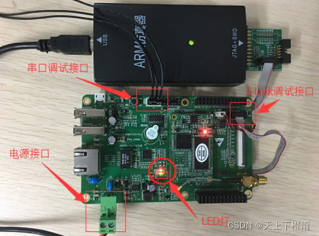

## 1 前言

近期因工作需求学习了一下 IOT.js 和 AWorks 平台通用外设接口（包括：ADC、GPIO、I2C、PWM、SPI 和 UART），并将它们逐一适配到 IOT.js 中，为后续 [AWTK-MVMM](https://github.com/zlgopen/awtk-mvvm) 的 JS项目支持平台外设调用奠定基础，此处做笔记记录一下。

- [IOT.js适配AWorks平台通用外设接口（1）：ADC](./iotjs_aworks_adc.md)；
- [IOT.js适配AWorks平台通用外设接口（2）：GPIO](./iotjs_aworks_gpio.md)；
- [IOT.js适配AWorks平台通用外设接口（3）：I2C](./iotjs_aworks_i2c.md)；
- [IOT.js适配AWorks平台通用外设接口（4）：PWM](./iotjs_aworks_pwm.md)；
- [IOT.js适配AWorks平台通用外设接口（5）：SPI](./iotjs_aworks_spi.md)；
- [IOT.js适配AWorks平台通用外设接口（6）：UART](./iotjs_aworks_uart.md)；

> 备注：IOT.js 和 AWorks 的相关介绍请看第一篇 ADC 适配笔记。

## 2 GPIO

在使用一个I/O口前，必须正确的配置I/O的功能和模式。同时，由于一个I/O口往往可以用于多种功能，但同一时刻只能用于某一确定的功能，为了避免冲突，在将一个引脚用作某一功能前，应该向 AWorks 系统申请，使用完毕后再释放。

当将I/O口用作GPIO（General Purpose Input Output）功能时，GPIO作为一种通用输入/输出接口，有两种常用的使用方式：

- 一种是用作普通的输入/输出接口；
- 一种是用作中断输入接口，即当指定的输入状态事件发生（比如：下降沿）时，触发用户自定义回调函数。

我们这里主要是适配第一种普通的输入/输出接口，中断GPIO不过多介绍，具体可以自行查看 AWorks 的官方API文档。

### 2.1 I/O配置

通常情况下，一个引脚往往可以用作多种功能，例如，在 i.MX280 中，PIO3_0可以用作下面4种功能：

- 应用串口0的接收引脚；
- I2C的时钟引脚；
- 调试串口的CTS引脚；
- 通用GPIO。

同时，GPIO往往还具有多种模式，比如上拉、下拉、开漏、推挽等。为了正确使用一个IO口，必须先将其配置为正确的功能和模式。AWorks提供了I/O配置接口，其原型为：

```c
aw_err_t aw_gpio_pin_cfg(int pin, uint32_t flags);
```

其中，pin为引脚编号，flags 为配置的功能和模式标志，返回值为标准的错误号，返回AW_OK时表示配置成功，否则表示配置失败，可能是由于部分功能和模式不支持造成的。

### 2.2 I/O的申请和释放 

如上文所述 PIO3_0 的功能众多，但是在同一时刻，其只能被用作某一确定的功能，并不能同时使用多种功能。

随着系统复杂度的上升，用户往往很难保证某一引脚只被用作一种功能，稍有不慎，就可能将某一引脚通用是配置为多种功能，此时，部分使用某种功能的应用程序将不能正常工作。在这种情况下，用户往往很难发现工作异常的原因。

为了保证引脚功能的互斥使用，AWorks提供了一种申请机制，在将引脚用作某一功能前，必须向系统申请，若该引脚处于空闲状态，还未被申请过，则本次申请成功，同时标记该引脚已被使用。若在申请前，该引脚已被申请，则本次申请失败。当与个引脚使用完毕时，应该释放该引脚，以便系统将该引脚分配给下一个申请者。

（1）申请引脚的函数原型：

```c
aw_err_t aw_gpio_pin_request(const char *p_name, const int *p_pins, int num);
```

其中，p_name为申请者的名字，p_pins指向引脚列表，num为本次申请的引脚个数。返回值为标准的错误号，返回AW_OK时表示申请成功，可以正常使用相关的引脚，否则表示申请失败，相关引脚已被占用，无法使用。

（2）释放引脚的函数原型：

```c
aw_err_t aw_gpio_pin_release(const int *p_pins, int num);
```

其中，p_pins指向引脚列表，num为本次申请的引脚个数。返回值为标准的错误号，返回AW_OK时表示释放成功，否则表示释放失败，可能是由于参数错误导致的。

### 2.3 普通I/O接口

当一个引脚配置为通用I/O接口时（输入或输出），则可以通过相关的I/O接口控制其输出状态获取其输入状态。相关接口如下：

- aw_gpio_get：读取GPIO引脚的输入值/输出值；
- aw_gpio_set：读取GPIO引脚的输出值；
- aw_gpio_toggle：翻转GPIO引脚的输出值。

## 3 适配过程

### 3.1 AWorks演示代码

先来看看这些GPIO接口的基本用法，我们在底板上跑一下简单的例程。

步骤一：外设禁能，在AWorks工程配置文件 `aw_prj_params.h` 中关闭以下宏定义禁能对应的LED灯设备，避免引脚复用：

```c
//#define AW_DEV_GPIO_LED    /**< \brief LED */
```

步骤二：到外设文件中查看设备对应的引脚，比如这里查看 `awbl_hwconf_gpio_led.h` 文件，找到 LED 灯设备所对应的引脚为 GPIO1_19，即底板上的 run 引脚。

步骤三：编写例程，申请GPIO1_19引脚并将其初始化为输出功能、上拉模式，通过修改引脚的高低电平让LED灯出现闪烁的现象。示例代码如下：

```c
#include "aw_gpio.h"
#include "aw_led.h"

#define GPIO_LED     DM_GPIO_LED  /* LED灯的引脚编号 */

int main()
{
    int i = 0;
    aw_kprintf("\nGPIO demo testing...\r\n");

    int gpio_led_test[] = {GPIO_LED};
    if (aw_gpio_pin_request("gpio_led_test",
                             gpio_led_test,
                             AW_NELEMENTS(gpio_led_test)) == AW_OK) {

        /* GPIO 引脚配置：输出功能、上拉模式 */
        aw_gpio_pin_cfg(GPIO_LED, AW_GPIO_OUTPUT | AW_GPIO_PULL_UP);
    }

    /* LED以1s的周期闪烁5次 */
    for (i = 0; i < 5; i++) {
        aw_gpio_set(GPIO_LED, 0);
        aw_mdelay(500);
        aw_gpio_set(GPIO_LED, 1);
        aw_mdelay(500);
    }

    /* LED以0.2s的周期持续闪烁 */
    for (i = 0; i < 40; i++) {
        aw_gpio_toggle(GPIO_LED);
        aw_mdelay(100);
    }

    aw_gpio_pin_release(gpio_led_test, AW_NELEMENTS(gpio_led_test));
    aw_kprintf("\nGPIO demo exit...\r\n");
    return 0;
}
```

输出结果：

```bash
GPIO demo testing...
GPIO demo exit...
```

测试结果主要是观察M1052底板上的LED灯闪烁。



### 3.2 C语言适配层

在 IOT.js 中，适配某个平台的外设通常需要实现 `src/modules/iotjs_module_xxx.h` 文件中的接口，比如这里我们需要实现 `iotjs_module_gpio.h` 中的相关接口：

```c
#ifndef IOTJS_MODULE_GPIO_H
#define IOTJS_MODULE_GPIO_H

#include "iotjs_def.h"
#include "iotjs_module_periph_common.h"

typedef enum {
  kGpioDirectionIn = 0,
  kGpioDirectionOut,
  __kGpioDirectionMax
} GpioDirection;

typedef enum {
  kGpioModeNone = 0,
  kGpioModePullup,
  kGpioModePulldown,
  kGpioModeFloat,
  kGpioModePushpull,
  kGpioModeOpendrain,
  __kGpioModeMax
} GpioMode;

typedef enum {
  kGpioEdgeNone = 0,
  kGpioEdgeRising,
  kGpioEdgeFalling,
  kGpioEdgeBoth,
  __kGpioEdgeMax
} GpioEdge;

typedef struct iotjs_gpio_platform_data_s iotjs_gpio_platform_data_t;

// This Gpio class provides interfaces for GPIO operation.
typedef struct {
  jerry_value_t jobject;
  iotjs_gpio_platform_data_t* platform_data;

  bool value;
  uint32_t pin;
  GpioDirection direction;
  GpioMode mode;
  GpioEdge edge;
} iotjs_gpio_t;

bool iotjs_gpio_open(iotjs_gpio_t* gpio);
bool iotjs_gpio_write(iotjs_gpio_t* gpio);
bool iotjs_gpio_read(iotjs_gpio_t* gpio);
bool iotjs_gpio_close(iotjs_gpio_t* gpio);
bool iotjs_gpio_set_direction(iotjs_gpio_t* gpio);

// Platform-related functions; they are implemented
// by platform code (i.e.: linux, nuttx, tizen).
void iotjs_gpio_create_platform_data(iotjs_gpio_t* gpio);
void iotjs_gpio_destroy_platform_data(
    iotjs_gpio_platform_data_t* platform_data);

#endif /* IOTJS_MODULE_GPIO_H */
```

适配层（`src/modules/aworks/iotjs_module_gpio-aworks.c`）代码如下：

```c
#if !defined(WITH_AWORKS)
#error "Module __FILE__ is for AWorks only"
#endif

#include "iotjs_def.h"
#include "aw_gpio.h"
#include "modules/iotjs_module_gpio.h"

struct iotjs_gpio_platform_data_s {
  bool is_request;
};

#define AWORKS_GPIO_REQ_NAME "iotjs_gpio"

static int direction_to_constant(GpioDirection direction) {
  switch (direction) {
    case kGpioDirectionIn:
      return AW_GPIO_INPUT;
    case kGpioDirectionOut:
      return AW_GPIO_OUTPUT;
  }
  return -1;
}

static int mode_to_constant(GpioMode mode) {
  switch (mode) {
    /* 不设置模式时，默认为浮空模式 */
    case kGpioModeNone:
      return AW_GPIO_FLOAT;
    case kGpioModePullup:
      return AW_GPIO_PULL_UP;
    case kGpioModePulldown:
      return AW_GPIO_PULL_DOWN;
    case kGpioModeFloat:
      return AW_GPIO_FLOAT;
    case kGpioModePushpull:
      return AW_GPIO_PUSH_PULL;
    case kGpioModeOpendrain:
      return AW_GPIO_OPEN_DRAIN;
  }
  return -1;
}

void iotjs_gpio_create_platform_data(iotjs_gpio_t* gpio) {
  gpio->platform_data = IOTJS_ALLOC(iotjs_gpio_platform_data_t);
}

void iotjs_gpio_destroy_platform_data(
    iotjs_gpio_platform_data_t* platform_data) {
  IOTJS_ASSERT(platform_data);
  IOTJS_RELEASE(platform_data);
}

bool iotjs_gpio_open(iotjs_gpio_t* gpio) {
  DDDLOG("%s - pin: %d, direction: %d, mode: %d", __func__, gpio->pin,
         gpio->direction, gpio->mode);

  aw_err_t ret;
  int mode;
  int direction;
  int p_pins[] = { gpio->pin };

  ret = aw_gpio_pin_request(AWORKS_GPIO_REQ_NAME, p_pins, AW_NELEMENTS(p_pins));
  if (ret != AW_OK) {
    gpio->platform_data->is_request = false;
    DLOG("%s: gpio pin number error or occupied(%d)", __func__, ret);
    return false;
  } else {
    gpio->platform_data->is_request = true;
  }

  direction = direction_to_constant(gpio->direction);
  if (direction < 0) {
    DLOG("%s: gpio pin direction error(%d)", __func__, gpio->direction);
    return false;
  }

  mode = mode_to_constant(gpio->mode);
  if (mode < 0) {
    DLOG("%s: gpio pin mode error(%d)", __func__, gpio->mode);
    return false;
  }

  ret = aw_gpio_pin_cfg(gpio->pin, direction | mode);
  if (ret != AW_OK) {
    DLOG("%s: gpio pin config error(%d)", __func__, ret);
    return false;
  }

  return true;
}

bool iotjs_gpio_write(iotjs_gpio_t* gpio) {
  aw_err_t ret = aw_gpio_set(gpio->pin, (int)gpio->value);
  if (ret != AW_OK) {
    DLOG("%s, Cannot write value(%d).", __func__, ret);
    return false;
  }

  return true;
}

bool iotjs_gpio_read(iotjs_gpio_t* gpio) {
  int ret = aw_gpio_get(gpio->pin);
  if (ret < 0) {
    DLOG("%s, Cannot read value(%d).", __func__, ret);
    return false;
  }

  gpio->value = (bool)ret;
  return true;
}

bool iotjs_gpio_close(iotjs_gpio_t* gpio) {
  if (gpio->platform_data->is_request) {
    aw_err_t ret;
    int p_pins[] = { gpio->pin };

    ret = aw_gpio_pin_release(p_pins, AW_NELEMENTS(p_pins));
    if (ret != AW_OK) {
      DLOG("%s: gpio pin number error (%d)", __func__, ret);
      return false;
    } else {
      gpio->platform_data->is_request = false;
    }
  }

  return true;
}

bool iotjs_gpio_set_direction(iotjs_gpio_t* gpio) {
  aw_err_t ret;
  int direction = direction_to_constant(gpio->direction);

  ret = aw_gpio_pin_cfg(gpio->pin, direction);
  if (ret != AW_OK) {
    DLOG("%s, Cannot set direction(%d).", __func__, ret);
    return false;
  }

  return true;
}
```

### 3.2 JS测试代码

适配好后，我们编写 JS 代码测试一下，同样利用 LED灯进行测试：

```js
var gpio = require('gpio');  /* 导入gpio模块 */

var value = 0; 
var loopCnt = 10;
var configuration = {
  pin: 19,                        /* LED灯的引脚编号 */
  direction: gpio.DIRECTION.OUT,  /* 输出功能 */
  mode: gpio.MODE.PULLUP          /* 上拉模式 */
};

console.log('test start');
ledGpio = gpio.openSync(configuration);
var loop = setInterval(function() {
  if (--loopCnt < 0) {
    console.log('test complete');
    clearInterval(loop);
    gpio.closeSync();
  } else {
    value = value ^ 1;
    gpio20.writeSync(value);
  }
}, 500)
```

输出结果：

```bash
test start
test complete
```

LED灯一秒钟闪烁一次，共5次。
