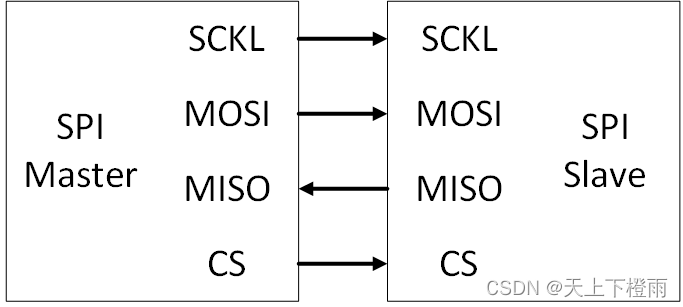

## 1 前言

近期因工作需求学习了一下 IOT.js 和 AWorks 平台通用外设接口（包括：ADC、GPIO、I2C、PWM、SPI 和 UART），并将它们逐一适配到 IOT.js 中，为后续 [AWTK-MVMM](https://github.com/zlgopen/awtk-mvvm) 的 JS项目支持平台外设调用奠定基础，此处做笔记记录一下。

- [IOT.js适配AWorks平台通用外设接口（1）：ADC](./iotjs_aworks_adc.md)；
- [IOT.js适配AWorks平台通用外设接口（2）：GPIO](./iotjs_aworks_gpio.md)；
- [IOT.js适配AWorks平台通用外设接口（3）：I2C](./iotjs_aworks_i2c.md)；
- [IOT.js适配AWorks平台通用外设接口（4）：PWM](./iotjs_aworks_pwm.md)；
- [IOT.js适配AWorks平台通用外设接口（5）：SPI](./iotjs_aworks_spi.md)；
- [IOT.js适配AWorks平台通用外设接口（6）：UART](./iotjs_aworks_uart.md)；

> 备注：IOT.js 和 AWorks 的相关介绍请看第一篇 ADC 适配笔记。

## 2 SPI

### 2.1 SPI总线

SPI(Serial Peripheral Interface)是一种全双工同步串行通信接口，常用于短距离高速通信，其数据传输速率通常可达到几M甚至几十M。SPI通信采用主/从结构，主/从双方通信时，需要使用到4根信号线：SCLK、MOSI、MISO、CS。其典型的连接示意图如下：



- SCLK：时钟信号，由主机设备产生。
- MOSI：主机数据输出，从机数据输入。
- MISO：从机数据输出，主机数据输入。
- CS：片选信号，由主设备控制。

数据传输是由主机发起，主机在串行数据传输前驱动CS信号，使之变为有效状态（通常情况下，有效状态为低电平），接着，在SCLK上输出时钟信号，在时钟信号的同步下，每个时钟传输一位数据，主机数据通过MOSI传输至从机，从机数据通过MISO传输至主机，数据传输完毕后，主机释放CS信号，使之变为无效状态，一次数据传输完成。

一个主机可以连接多个从机，多个从机共同使用SCLK、MOSI、MISO三根信号线，每个从机的片选信号 CS 是独立的，因此，若主机连接多个从机，就需要多个片选控制引脚。当一个主机连接多个从机时，同一时刻最多只能使一个片选信号有效，以选择一个确定的从机作为数据通信的目标对象，也就是说，在某一时刻，最多只能激活寻址一个从机，以使各个从机之间相互独立的使用，互不干扰。注意没在单个通信网络中，可以有多个从机，但有且只能有一个主机。

### 2.2 SPI接口

绝大部分情况下，MCU都作为SPI主机与SPI从机器件通信，因此这里仅介绍 AWorks中将MCU作为SPI主机的相关接口：

- aw_spi_mkdev：初始化SPI从机实例。
- aw_spi_setup：设置SPI从机实例。
- aw_spi_write_then_read：SPI先写后读。
- aw_spi_write_then_write：执行SPI两次写。

##  3 适配过程

### 3.1 AWorks演示代码

先来看看这些SPI相关接口的基本用法，我们在底板上跑一下简单的例程。

步骤一：外设使能，在AWorks工程配置文件 `aw_prj_params.h` 中开启以下宏定义使能SPI：

```c
 #define AW_DEV_IMX1050_LPSPI3 /**< \brief iMX1050 LPSPI3 (SPI3) */
```

步骤二：到外设文件中查看设备对应的引脚，比如这里查看 `awbl_hwconf_imx1050_lpspi3.h` 文件，可以看到该SPI3设备的CS、MISO、MOSI、SCK分别使用GPIO1_28、GPIO1_29、GPIO1_30、GPIO1_31引脚，分别对应底板上的ss、MISO、MOSI、CLK引脚，我们需确定这些引脚能正常使用。

步骤三：编写例程，测试SPI主机模式的基本读写功能。示例代码如下：

```c
#include "aworks.h"         /* 此头文件必须被首先包含 */
#include "aw_delay.h"       /* 延时服务 */
#include "aw_spi.h"
#include "aw_gpio.h"
#include "aw_vdebug.h"
#include "aw_demo_config.h"

#define HARD_CS_CFG          1
//#define SOFT_CS_CFG          1 /* 使用软件CS请打开spi配置文件，关闭硬件CS模式*/

/** \brief SPI1的配置 */
#define SPI_DEV_BUSID        DE_SPI_DEV_BUSID       /**< \brief SPI总线 */
#define SPI_DEV_MODE         AW_SPI_CPHA            /**< \brief SPI模式 */
#define SPI_DEV_SPEED        2000000                /**< \brief SPI速度 */
#define SPI_DEV_BPW          8                     /**< \brief SPI数据位数，取值只能是8、16、32 */
#define SPI_TEST_LEN         16                     /**< \brief SPI收发数据量 */
#define SPI_CS_PIN           DE_SPI_CS_PIN          /**< \brief SPI片选引脚，根据具体平台修改 */

struct aw_spi_message       spi_msg;
struct aw_spi_transfer      spi_trans;

#if HARD_CS_CFG
void pfunc_cs (int state){

    return ;
}
#endif

/*
 * \brief 测试SPI主机模式的基本读写功能
 */
int main() {
    aw_spi_device_t     spi_dev;
    int                 ret;
    int                 i;
#if SPI_DEV_BPW == 8
    uint8_t             read_buf[SPI_TEST_LEN]  = {0};
    uint8_t             write_buf[SPI_TEST_LEN] = {0};
#elif SPI_DEV_BPW == 16
    uint16_t             read_buf[SPI_TEST_LEN]  = {0};
    uint16_t             write_buf[SPI_TEST_LEN] = {0};
#elif SPI_DEV_BPW == 32
    uint32_t             read_buf[SPI_TEST_LEN]  = {0};
    uint32_t             write_buf[SPI_TEST_LEN] = {0};
#endif

#if SOFT_CS_CFG
    int                 cs_pin = SPI_CS_PIN;
    /* 配置SPI之前需先申请CS引脚 */
    aw_gpio_pin_request("spi_demo_cs", &cs_pin, 1);
#endif

    /* 生成 SPI FLASH 设备 */
    aw_spi_mkdev(&spi_dev,
                  SPI_DEV_BUSID,   /* 位于哪条SPI总线上 */
                  SPI_DEV_BPW,     /* 字大小 */
                  SPI_DEV_MODE,    /* SPI 模式 */
                  SPI_DEV_SPEED,   /* 支持的最大速度 */
#if HARD_CS_CFG
                  NULL,            /* 片选引脚 */
                  pfunc_cs);       /* 无自定义的片选控制函数 */
#else
                  cs_pin,          /* 片选引脚 */
                  NULL);           /* 无自定义的片选控制函数 */
#endif
    if (aw_spi_setup(&spi_dev) != AW_OK) {
        aw_kprintf("aw_spi_setup fail!\r\n");
        goto _exit ;
    }


    /* 设置发送数据 */
    for (i = 0; i < SPI_TEST_LEN; i++) {
        write_buf[i] = i;
    }

    memset(read_buf,0,SPI_TEST_LEN);

    while(1){
        /* 传输数据 */
        ret = aw_spi_write_and_read (&spi_dev, write_buf, read_buf, sizeof(write_buf));

        if (ret != AW_OK) {
            aw_kprintf("__spi_trans fail!\r\n");
            goto _exit ;
        }
        aw_kprintf("write_buf:");
        for(i = 0; i < SPI_TEST_LEN;i++){
            aw_kprintf("%d ",write_buf[i]);
        }
        aw_kprintf("\r\n");

        aw_kprintf("read_buf:");
        for(i = 0; i < SPI_TEST_LEN;i++){
            aw_kprintf("%d ",read_buf[i]);
        }
        aw_kprintf("\r\n");

        aw_mdelay(500);
    }

_exit:
#if SOFT_CS_CFG
    /* 测试完成后释放CS引脚 */
    aw_gpio_pin_release(&cs_pin, 1);
#endif
    return 0;
}
```

输出结果：

```bash
write_buf:0 1 2 3 4 5 6 7 8 9 10 11 12 13 14 15
read_buf:0 1 2 3 4 5 6 7 8 9 10 11 12 13 14 15
```

### 3.2 C语言适配层

在 IOT.js 中，适配某个平台的外设通常需要实现 `src/modules/iotjs_module_xxx.h` 文件中的接口，比如这里我们需要实现 `iotjs_module_spi.h` 中的相关接口：

```c
#ifndef IOTJS_MODULE_SPI_H
#define IOTJS_MODULE_SPI_H

#include "iotjs_def.h"
#include "iotjs_module_buffer.h"
#include "iotjs_module_periph_common.h"


typedef enum {
  kSpiMode_0,
  kSpiMode_1,
  kSpiMode_2,
  kSpiMode_3,
  __kSpiModeMax
} SpiMode;

typedef enum { kSpiCsNone, kSpiCsHigh, __kSpiCsMax } SpiChipSelect;

typedef enum { kSpiOrderMsb, kSpiOrderLsb, __kSpiOrderMax } SpiOrder;

// Forward declaration of platform data. These are only used by platform code.
// Generic SPI module never dereferences platform data pointer.
typedef struct iotjs_spi_platform_data_s iotjs_spi_platform_data_t;
// This SPI class provides interfaces for SPI operation.
typedef struct {
  jerry_value_t jobject;
  iotjs_spi_platform_data_t* platform_data;

  SpiMode mode;
  SpiChipSelect chip_select;
  SpiOrder bit_order;
  uint8_t bits_per_word;
  uint16_t delay;
  uint32_t max_speed;
  bool loopback;

  // SPI buffer
  char* tx_buf_data;
  char* rx_buf_data;
  uint8_t buf_len;
} iotjs_spi_t;

jerry_value_t iotjs_spi_set_platform_config(iotjs_spi_t* spi,
                                            const jerry_value_t jconfig);
bool iotjs_spi_open(iotjs_spi_t* spi);
bool iotjs_spi_transfer(iotjs_spi_t* spi);
bool iotjs_spi_close(iotjs_spi_t* spi);

// Platform-related functions; they are implemented
// by platform code (i.e.: linux, nuttx, tizen).
void iotjs_spi_create_platform_data(iotjs_spi_t* spi);
void iotjs_spi_destroy_platform_data(iotjs_spi_platform_data_t* pdata);

#endif /* IOTJS_MODULE_SPI_H */
```

适配层（`src/modules/aworks/iotjs_module_spi-aworks.c`）代码如下：

```c
#if !defined(WITH_AWORKS)
#error "Module __FILE__ is for AWorks only"
#endif

#include "iotjs_def.h"
#include "aw_spi.h"
#include "modules/iotjs_module_spi.h"

struct iotjs_spi_platform_data_s {
  int bus;
  aw_spi_device_t spi_dev;
};

static int mode_to_constant(SpiMode mode) {
  switch (mode) {
    case kSpiMode_0:
      return AW_SPI_MODE_0;
    case kSpiMode_1:
      return AW_SPI_MODE_1;
    case kSpiMode_2:
      return AW_SPI_MODE_2;
    case kSpiMode_3:
      return AW_SPI_MODE_3;
  }
  return -1;
}

static int clip_select_to_constant(SpiOrder order) {
  switch (order) {
    case kSpiCsNone:
      return 0;
    case kSpiCsHigh:
      return AW_SPI_CS_HIGH;
  }
  return -1;
}

static int order_to_constant(SpiOrder order) {
  switch (order) {
    case kSpiOrderMsb:
      return 0;
    case kSpiOrderLsb:
      return AW_SPI_LSB_FIRST;
  }
  return -1;
}

static void pfunc_cs(int state) {
  return;
}

void iotjs_spi_create_platform_data(iotjs_spi_t* spi) {
  spi->platform_data = IOTJS_ALLOC(iotjs_spi_platform_data_t);
  spi->platform_data->bus = -1;
}

void iotjs_spi_destroy_platform_data(iotjs_spi_platform_data_t* platform_data) {
  IOTJS_ASSERT(platform_data);
  IOTJS_RELEASE(platform_data);
}

jerry_value_t iotjs_spi_set_platform_config(iotjs_spi_t* spi,
                                            const jerry_value_t jconfig) {
  iotjs_spi_platform_data_t* platform_data = spi->platform_data;
  JS_GET_REQUIRED_CONF_VALUE(jconfig, platform_data->bus,
                             IOTJS_MAGIC_STRING_BUS, number);

  return jerry_create_undefined();
}

bool iotjs_spi_open(iotjs_spi_t* spi) {
  aw_err_t ret;
  int mode;
  int order;
  int clip_select;
  uint16_t flags;
  iotjs_spi_platform_data_t* platform_data = spi->platform_data;

  mode = mode_to_constant(spi->mode);
  order = order_to_constant(spi->bit_order);
  clip_select = order_to_constant(spi->chip_select);

  if (mode < 0 || order < 0 || clip_select < 0) {
    DLOG("%s: spi open error: bad config param.", __func__);
    return false;
  }

  flags = mode | order | clip_select;
  aw_spi_mkdev(&platform_data->spi_dev, /* SPI设备实例 */
               platform_data->bus,      /* SPI总线编号 */
               spi->bits_per_word,      /* 数据位宽 */
               flags,                   /* 设备模式标志 */
               spi->max_speed,          /* 支持最大速度 */
               0,                       /* 片选引脚（这里使用硬件片选） */
               pfunc_cs                 /* 片选控制函数（为NULL时使用软件片选） */
  );

  ret = aw_spi_setup(&platform_data->spi_dev);
  if (ret != AW_OK) {
    memset(&platform_data->spi_dev, 0x00, sizeof(aw_spi_device_t));
    DLOG("%s: spi setup error(%d)", __func__, ret);
    return false;
  }

  DDLOG(
      "SPI Options \n mode: %d\n chipSelect: %d\n bitOrder: %d\n "
      "maxSpeed: %d\n bitPerWord: %d\n",
      spi->mode, spi->chip_select, spi->bit_order, spi->max_speed,
      spi->bits_per_word);

  return true;
}

bool iotjs_spi_transfer(iotjs_spi_t* spi) {
  aw_err_t ret;
  iotjs_spi_platform_data_t* platform_data = spi->platform_data;

  ret = aw_spi_write_and_read(&platform_data->spi_dev, (void*)spi->tx_buf_data,
                              (void*)spi->rx_buf_data, spi->buf_len);
  if (ret != AW_OK) {
    DDLOG("%s - transfer failed: %d", __func__, ret);
    return false;
  }

  return true;
}

bool iotjs_spi_close(iotjs_spi_t* spi) {
  iotjs_spi_platform_data_t* platform_data = spi->platform_data;

  platform_data->bus = -1;
  memset(&platform_data->spi_dev, 0x00, sizeof(aw_spi_device_t));

  return true;
}
```


### 3.2 JS测试代码

适配好后，我们编写 JS 代码测试一下：

```js
var spi = require('spi');

var configuration = {
  bus: 2,            /* 使用SPI3的总线编号 */
  mode: spi.MODE[1], /* 模式一 */
  maxSpeed: 2000000, /* 单位：Hz，表示最大速度2M */
  bitsPerWord: 8,    /* 数据位宽（目前仅支持8位） */
};

console.log('test start');
var spiObj = spi.openSync(configuration);
var data = 'Hello Iotjs!';                          /* 发送字符串 */
// var data = [0x90, 0x00, 0x00, 0x00, 0xff, 0xff]; /* 发送数组（该指令用来获取从机ID，需要配套的SPI从机芯片） */
var tx = new Buffer(data);
var loopCnt = 1;

var loop = setInterval(function () {
  var rx = spiObj.transferSync(tx);
  var len = data.length;
  console.log('data.length: ', len);

  var value = '';
  for (var i = 0; i < len; i++) {
    // console.log(rx[i]);  /* 打印读取数据的原始值 */
    value += String.fromCharCode(rx[i]);
  }
  console.log(value);

  if (--loopCnt <= 0) {
    clearInterval(loop);
    spiObj.closeSync();
    console.log('test complete');
  }
}, 1000);
```

输出结果：

```bash
test start
data.length:12
Hello Iotjs!
test complete
```
