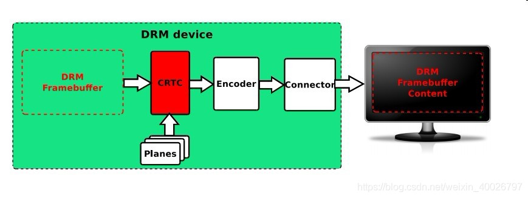

## 1 前言

在本周的工作中为解决客户问题，查看awtk-linux-fb中的源码，其中对于里面关于DRM的内容很感兴趣，请教同事后又上网查了资料，本文对DRM的学习做了总结记录，并以C语言练习了DRM的使用。在此感谢回答我疑问的同事。

> 备注：[awtk-linux-fb](https://github.com/zlgopen/awtk-linux-fb) 是 AWTK 针对arm-linux平台的移植。

## 2 什么是DRM

DRM（Direct Rendering Manager）即**直接渲染管理器**。它是为了解决多个程序对 Video Card 资源的协同使用问题而产生的。它向用户空间提供了一组 API，用以访问操纵 GPU。

简单理解，DRM是Linux下的图形渲染架构，用来管理显示输出和分配buffer。应用程序可以直接操纵 DRM的 ioctl 或者是用 framebuffer 提供的接口进行显示相关操作。后来封装成了 libdrm 库，让用户可以更加方便的进行显示控制。

## 3 DRM中的基本概念

要弄明白 DRM 是怎么把用户的绘图输出到显示屏上，绕不开以下几个概念，具体关系如下图所示：

- Framebuffer
- CRTC
- Encoder
- Connector
- Display Device(LCD)



### 3.1 DRM Framebuffer

它是一块内存区域，可以理解为一块画布，驱动和应用层都能访问它。绘制前需要将它格式化，设定绘制的色彩模式（例如RGB24，YUV 等）和画布的大小（分辨率）。

### 3.2 CRTC

阴极摄像管上下文。这个看名字很很难懂，但简单的来说他就是显示输出的上下文，可以理解为扫描仪。CRTC对内连接 Framebuffer 地址，对外连接 Encoder，会扫描 Framebuffer 上的内容，叠加上 Planes 的内容，最后传给Encoder。

### 3.3 Planes

平面。它和 Framebuffer 一样是内存地址。它的作用是干什么呢？打个比方，在电脑上，一边打字聊微信一边看电影，这里对立出来两个概念，打字是文字交互，是小范围更新的 Graphics 模式；看电影是全幅高速更新的 Video 模式，这两种模式将显卡的使用拉上了两个极端。

这时Planes就发挥了很好的作用，它给 Video 刷新提供了高速通道，使 Video 单独为一个图层，可以叠加在 Graphic 上或之下，并具有缩放等功能。

Planes 是可以有多个的，相当于图层叠加，因此扫描仪（CRTC）扫描的图像实际上往往是 Framebuffer 和 Planes 的组合（Blending）。

### 3.4 Encoder

编码器。它的作用就是将内存的 pixel 像素编码（转换）为显示器所需要的信号。简单理解就是，如果需要将画面显示到不同的设备（Display Device）上，需要将画面转化为不同的电信号，例如 DVID、VGA、YPbPr、CVBS、Mipi、eDP 等。

Encoder 和 CRTC 之间的交互就是我们所说的 ModeSetting，其中包含了前面提到的色彩模式、还有时序（Timing）等。

### 3.5 Connector

连接器。它常常对应于物理连接器 (例如 VGA, DVI, FPD-Link, HDMI, DisplayPort, S-Video等) ，它不是指物理线，在 DRM中，Connector 是一个抽象的数据结构，代表连接的显示设备，从Connector中可以得到当前物理连接的输出设备相关的信息 ，例如，连接状态，EDID数据，DPMS状态、支持的视频模式等。

## 4 DRM使用示例

根据上文，可以知道 DRM 是一个显示驱动框架，也就是把功能封装成 open/close/ioctl 等标准接口，应用程序调用这些接口来驱动设备，显示数据。本文接下来将从使用者的角度来看，验证和使用DRM驱动。

**DRM设备节点** ：DRM 驱动会在 `/dev/dri` 下创建3个设备节点：

```bash
card0
controlD64
renderD128
```

**libdrm库** ：DRM驱动，对用户空间，提供了专门的的调用库 `libdrm.so`，用户空间通过该库可以间接的调用和使用驱动。

### 4.1 打开设备

```c
/* 打开设备有专门的接口：drmOpen ，但此处为方便，使用open函数 */
int fd = open("/dev/dri/card0", O_RDWR | O_CLOEXEC);
    if (fd < 0) {
        ret = -errno;
        fprintf(stderr, "cannot open '%s': %m\n", node);
        return ret;
    }
```

### 4.2 检查DRM的能力

DRM的能力通过drmGetCap接口获取，用drm_get_cap结构描述：

```c
/** DRM_IOCTL_GET_CAP ioctl argument type */
struct drm_get_cap {
    __u64 capability;
    __u64 value;
};

int drmGetCap(int fd, uint64_t capability, uint64_t *value)
{
    struct drm_get_cap cap;
    int ret;

    memclear(cap);
    cap.capability = capability;

    ret = drmIoctl(fd, DRM_IOCTL_GET_CAP, &cap);
    if (ret)
        return ret;

    *value = cap.value;
    return 0;
}
```

使用示例：

```c
uint64_t has_dumb;
if (drmGetCap(fd, DRM_CAP_DUMB_BUFFER, &has_dumb) < 0 || !has_dumb) {
    fprintf(stderr, "drm device '%s' does not support dumb buffers\n",
        node);
    close(fd);
    return -EOPNOTSUPP;
}
```

### 4.3 检索Resource

获取Resource具体看以下函数：

```c
drmModeResPtr drmModeGetResources(int fd)
```

Resource结构封装：

```c
struct drm_mode_card_res {
    __u64 fb_id_ptr;
    __u64 crtc_id_ptr;
    __u64 connector_id_ptr;
    __u64 encoder_id_ptr;
    __u32 count_fbs;
    __u32 count_crtcs;
    __u32 count_connectors;
    __u32 count_encoders;
    __u32 min_width, max_width;
    __u32 min_height, max_height;
};
```

```c
typedef struct _drmModeRes {
    int count_fbs;
    uint32_t *fbs;

    int count_crtcs;
    uint32_t *crtcs;

    int count_connectors;
    uint32_t *connectors;

    int count_encoders;
    uint32_t *encoders;

    uint32_t min_width, max_width;
    uint32_t min_height, max_height;
} drmModeRes, *drmModeResPtr;
```

使用示例：

```c
/* retrieve resources */
int ret = drmModeGetResources(fd);
if (!res) {
    fprintf(stderr, "cannot retrieve DRM resources (%d): %m\n",
        errno);
    return -errno;
}
```

### 4.4 获取Connector

_drmModeConnector描述结构：

```c
typedef struct _drmModeConnector {
    uint32_t connector_id;
    uint32_t encoder_id; /**< Encoder currently connected to */
    uint32_t connector_type;
    uint32_t connector_type_id;
    drmModeConnection connection;
    uint32_t mmWidth, mmHeight; /**< HxW in millimeters */
    drmModeSubPixel subpixel;

    int count_modes;
    drmModeModeInfoPtr modes;

    int count_props;
    uint32_t *props; /**< List of property ids */
    uint64_t *prop_values; /**< List of property values */

    int count_encoders;
    uint32_t *encoders; /**< List of encoder ids */
} drmModeConnector, *drmModeConnectorPtr;
```

使用示例：

```c
drmModeConnector *conn = drmModeGetConnector(fd, res->connectors[i]);
if (!conn) {
    fprintf(stderr, "cannot retrieve DRM connector %u:%u (%d): %m\n",
        i, res->connectors[i], errno);
    continue;
}
```
### 4.5 Encoder

Encoder的结构描述：

```c
typedef struct _drmModeEncoder {
    uint32_t encoder_id;
    uint32_t encoder_type;
    uint32_t crtc_id;
    uint32_t possible_crtcs;
    uint32_t possible_clones;
} drmModeEncoder, *drmModeEncoderPtr;
```

使用示例：

```c
if (conn->encoder_id) {
    drmModeEncoder *enc = drmModeGetEncoder(fd, conn->encoder_id);
}
```

```c
drmModeEncoderPtr drmModeGetEncoder(int fd, uint32_t encoder_id)
{
    struct drm_mode_get_encoder enc;
    drmModeEncoderPtr r = NULL;

    memclear(enc);
    enc.encoder_id = encoder_id;

    if (drmIoctl(fd, DRM_IOCTL_MODE_GETENCODER, &enc))
        return 0;

    if (!(r = drmMalloc(sizeof(*r))))
        return 0;

    r->encoder_id = enc.encoder_id;
    r->crtc_id = enc.crtc_id;
    r->encoder_type = enc.encoder_type;
    r->possible_crtcs = enc.possible_crtcs;
    r->possible_clones = enc.possible_clones;

    return r;
}
```

### 4.6 CRTC

CRTC结构描述：

```c
struct crtc {
    drmModeCrtc *crtc;
    drmModeObjectProperties *props;
    drmModePropertyRes **props_info;
    drmModeModeInfo *mode;
};
```

```c
typedef struct _drmModeCrtc {
    uint32_t crtc_id;
    uint32_t buffer_id; /**< FB id to connect to 0 = disconnect */

    uint32_t x, y; /**< Position on the framebuffer */
    uint32_t width, height;
    int mode_valid;
    drmModeModeInfo mode;

    int gamma_size; /**< Number of gamma stops */

} drmModeCrtc, *drmModeCrtcPtr;
```

### 4.7 FrameBuffer

1. 创建DUMB Buffer：

```c
ret = drmIoctl(fd, DRM_IOCTL_MODE_CREATE_DUMB, &creq);
if (ret < 0) {
    fprintf(stderr, "cannot create dumb buffer (%d): %m\n", errno);
    return -errno;
}
```
2. 添加FrameBuffer：

```c
/* create framebuffer object for the dumb-buffer */
ret = drmModeAddFB(fd, dev->width, dev->height, 24, 32, dev->stride, dev->handle, &dev->fb);
if (ret) {
    fprintf(stderr, "cannot create framebuffer (%d): %m\n", errno);
    ret = -errno;
    goto err_destroy;
}
```

3. 准备map：

```c
    /* prepare buffer for memory mapping */
    memset(&mreq, 0, sizeof(mreq));
    mreq.handle = dev->handle;
    ret = drmIoctl(fd, DRM_IOCTL_MODE_MAP_DUMB, &mreq);
    if (ret) {
        fprintf(stderr, "cannot map dumb buffer (%d): %m\n",
            errno);
        ret = -errno;
        goto err_fb;
    }
```

4. 做map操作：

```c
/* perform actual memory mapping */
dev->map = mmap(0, dev->size, PROT_READ | PROT_WRITE, MAP_SHARED, fd, mreq.offset);
if (dev->map == MAP_FAILED) {
    fprintf(stderr, "cannot mmap dumb buffer (%d): %m\n", errno);
    ret = -errno;
    goto err_fb;
}
```

### 4.8 CRTC的准备

准备函数：drmModeGetCrtc、drmModeSetCrtc

```c
drmModeCrtcPtr drmModeGetCrtc(int fd, uint32_t crtcId)
{
    struct drm_mode_crtc crtc;
    drmModeCrtcPtr r;

    memclear(crtc);
    crtc.crtc_id = crtcId;

    if (drmIoctl(fd, DRM_IOCTL_MODE_GETCRTC, &crtc))
        return 0;

    /*
     * return
     */

    if (!(r = drmMalloc(sizeof(*r))))
        return 0;

    r->crtc_id         = crtc.crtc_id;
    r->x               = crtc.x;
    r->y               = crtc.y;
    r->mode_valid      = crtc.mode_valid;
    if (r->mode_valid) {
        memcpy(&r->mode, &crtc.mode, sizeof(struct drm_mode_modeinfo));
        r->width = crtc.mode.hdisplay;
        r->height = crtc.mode.vdisplay;
    }
    r->buffer_id       = crtc.fb_id;
    r->gamma_size      = crtc.gamma_size;
    return r;
}

int drmModeSetCrtc(int fd, uint32_t crtcId, uint32_t bufferId,
           uint32_t x, uint32_t y, uint32_t *connectors, int count,
           drmModeModeInfoPtr mode)
{
    struct drm_mode_crtc crtc;

    memclear(crtc);
    crtc.x             = x;
    crtc.y             = y;
    crtc.crtc_id       = crtcId;
    crtc.fb_id         = bufferId;
    crtc.set_connectors_ptr = VOID2U64(connectors);
    crtc.count_connectors = count;
    if (mode) {
      memcpy(&crtc.mode, mode, sizeof(struct drm_mode_modeinfo));
      crtc.mode_valid = 1;
    }

    return DRM_IOCTL(fd, DRM_IOCTL_MODE_SETCRTC, &crtc);
}
```

### 4.9 绘制

```c
static void modeset_draw(void)
{
    uint8_t r, g, b;
    bool r_up, g_up, b_up;
    unsigned int i, j, k, off;
    struct modeset_dev *iter;

    srand(time(NULL));
    r = rand() % 0xff;
    g = rand() % 0xff;
    b = rand() % 0xff;
    r_up = g_up = b_up = true;

    for (i = 0; i < 50; ++i) {
        r = next_color(&r_up, r, 20);
        g = next_color(&g_up, g, 10);
        b = next_color(&b_up, b, 5);

        for (iter = modeset_list; iter; iter = iter->next) {
            for (j = 0; j < iter->height; ++j) {
                for (k = 0; k < iter->width; ++k) {
                    off = iter->stride * j + k * 4;
                    *(uint32_t*)&iter->map[off] =
                             (r << 16) | (g << 8) | b;
                }
            }
        }
        usleep(100);
    }
}
```

## 5 总结

以上使用示例仅为简单绘制，更详细且严谨的代码请参考：[awtk-linux-fb 中的 lcd_linux_drm.c](https://github.com/zlgopen/awtk-linux-fb/blob/master/awtk-port/lcd_linux/lcd_linux_drm.c)。
