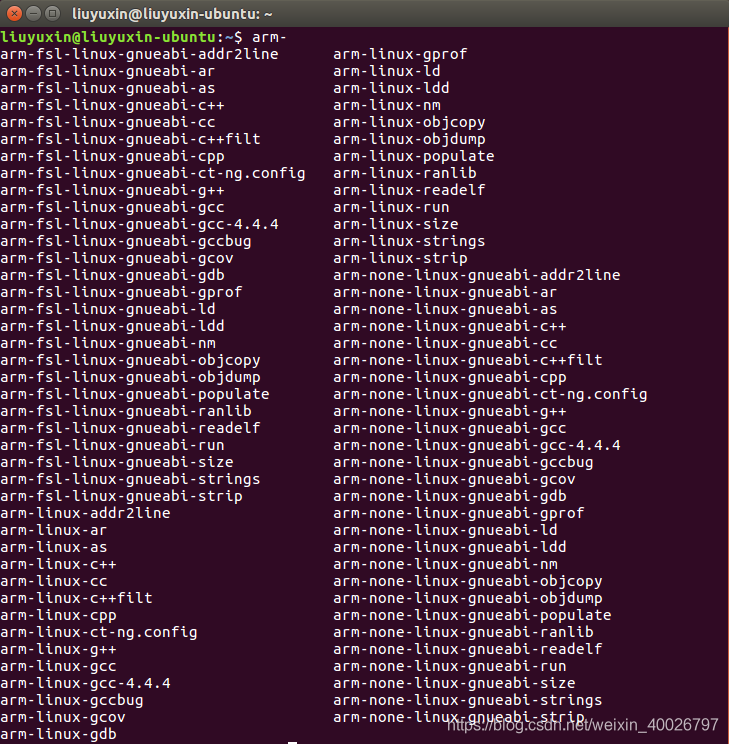
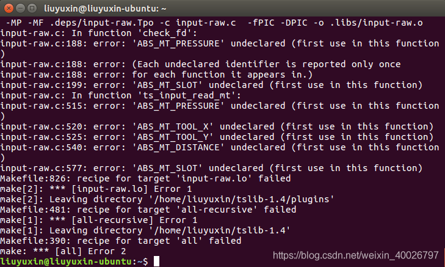
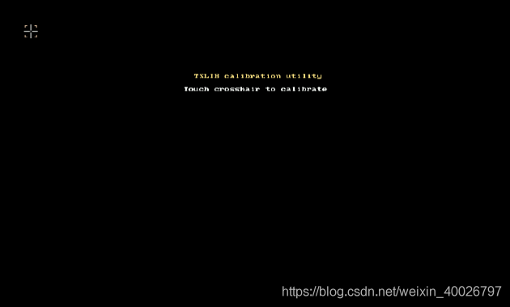

## 1 交叉编译器

交叉编译器用于在Linux PC上编译嵌入式Linux平台上的项目（tslib），此处采用交叉工具链压缩包（gcc-4.4.4-glibc-2.11.1-multilib-1.0_EasyARM-iMX283.tar.bz2），在Ubuntu虚拟机上的安装配置步骤如下：

> 备注：交叉编译工具链：https://cloud.189.cn/t/MRzQb2beeEFf（访问码：ph5h）

### 1.1 安装交叉编译器

将gcc-4.4.4-glibc-2.11.1-multilib-1.0_EasyARM-iMX283.tar.bz2拷贝到Ubuntu虚拟机上，解压到指定目录（添加环境变量会使用该目录），此处目录为/home/user/tools/，在压缩包目录下打开终端，执行以下命令：

```bash
tar -jxvf gcc-4.4.4-glibc-2.11.1-multilib-1.0_EasyARM-iMX283.tar.bz2 –C /home/user/tools/
```

解压完成后可在gcc-4.4.4-glibc-2.11.1-multilib-1.0/arm-fsl-linux-gnueabi/bin目录下看到交叉编译器。

### 1.2 设置环境变量

打开全局配置文件，在终端中执行以下命令：

```bash
sudo vim /etc/profile
```

在文件末尾将交叉编译器所在的路径添加到全局环境变量中，需要添加的文本如下：

```bash
export PATH=$PATH:/home/user/tools/gcc-4.4.4-glibc-2.11.1-multilib-1.0/arm-fsl-linux-gnueabi/bin/
```

执行修改过后的全局配置文件，在终端中执行以下命令（点+空格+文件名）：

```bash
. /etc/profile
```

执行完毕后重启虚拟机，检查交叉编译器是否成功添加至全局变量，在终端中输入“arm-”，然后按下键盘上的TAB键，若添加成功，则可以看见很多“arm-fsl-linux-gnueabi”、 “arm-linux”、“arm-none-linux-gnueabi”开头的命令，如下图所示：



### 1.3 测试交叉编译器

在终端中输入交叉编译器命令，例如arm-none-linux-gnueabi-gcc，然后回车，能够得到以下信息，说明交叉编译器能够正常工作：

```bash
arm-none-linux-gnueabi-gcc
arm-none-linux-gnueabi-gcc: no input files
```

若输出以下信息，则交叉编译器仍然存在问题，无法正常工作：

```bash
arm-none-linux-gnueabi-gcc
bash:/home/user/tools/gcc-4.4.4-glibc-2.11.1-multilib-1.0/arm-fsl-linux-gnueabi/bin/arm-none-linux-gnueabi-gcc: 没有那个文件或目录
```

此时请确认：

- 在安装目录的bin文件下确实有arm-none-linux-gnueabi-gcc文件；
- 在终端输入arm-none-linux-gnueabi-，按下键盘的TAB键，能找到该命令。

如果以上两个条件都确认无误，那么问题就好解决了。这种问题主要发生在64位操作系统上，原因在于大多数交叉编译器为了适应性，通常以32位发布，而实际操作系统是64位的，存在架构差异，所以无法执行。

解决方案是在64位的Ubuntu上安装32位兼容库，在终端中执行以下命令：

```bash
sudo apt-get install lib32z1
```

安装完成后，再重复以上测试步骤，即可输出正常结果。

## 2 移植tslib-1.4

tslib是一个开源程序，能够为触摸屏驱动获得的采样提供诸如滤波、去抖动、校准等功能，通常作为触摸屏驱动的适配层，为上层的应用提供了一个统一接口。

> 备注：tslib-1.4源码：https://cloud.189.cn/t/VRv2qmFfqmIz（访问码：t0ov）

此处在Ubuntu虚拟机上安装并编译tslib-1.4，再将生成的tslib文件夹整个拷贝到嵌入式Linux平台。

在Ubuntu虚拟机中安装并编译tslib-1.4的步骤如下：

**（1）在Ubuntu上安装autoconf、automake和libtool，在终端中执行以下命令：**

```bash
sudo apt-get install autoconf
sudo apt-get install automake
sudo apt-get install libtool
```

**（2）将tslib-1.4.tar.gz拷贝到Ubuntu虚拟机上，解压，在压缩包目录下打开终端，执行以下命令：**

```bash
sudo tar -zxvf tslib-1.4.tar.gz
```

**（3）进入解压目录，在终端中执行以下命令（可复制到Ubuntu上再修改路径）：**

```bash
cd tslib-1.4
sudo ./autogen.sh
sudo ./configure --prefix=/home/user/tools/tslib --host=arm-fsl-linux-gnueabi CC=/home/user/tools/gcc-4.4.4-glibc-2.11.1-multilib-1.0/arm-fsl-linux-gnueabi/bin/arm-none-linux-gnueabi-gcc ac_cv_func_malloc_0_nonnull=yes
```

- --prefix指定安装路径，可自行指定tslib的安装目录；
- --host指定交叉编译器，此处指定交叉编译器是arm-fsl-linux-gnueabi；
- CC指使用的交叉编译器，请与本地安装的交叉编译器路径一致。

**（4）由于本文使用的Linux开发板的触摸屏驱动没有提供ioctl接口，因此需要屏蔽tslib中ioctl相关代码（若触摸屏驱动有ioctl接口，则跳过该步骤），否则在Linux开发板上运行ts_calibrate会有如下图所示的错误，屏蔽方法为修改tslib-1.4/plugins/input-raw.c文件中的check_fb函数，将该函数修改为以下代码：**

```c
static int check_fd(struct tslib_input *i)
{
 i->using_syn = 1; 
 return 0;
}
```


**（5）编译tslib，在终端中执行以下命令：**

```bash
sudo make
```

若出现如下图所示的错误，是因为Ubuntu内核比较老，相关的宏定义在内核的头文件中没有，需要在tslib库中的头文件（src/tslib.h）声明。



**打开解压目录下的src/tslib.h文件，在终端中输入以下指令：**

```bash
sudo vim src/tslib.h
```

**在src/tslib.h文件中添加以下宏定义，添加完成后保存，再编译即可：**

```c
#define ABS_MT_SLOT      0x2f    /* MT slot being modified */
#define ABS_MT_PRESSURE  0x3a    /* Pressure on contact area */
#define ABS_MT_DISTANCE  0x3b    /* Contact hover distance */
#define ABS_MT_TOOL_X    0x3c    /* Center X tool position */
#define ABS_MT_TOOL_Y    0x3d    /* Center Y tool position */
```

**（6）安装tslib到第（3）步设置的目录中（--prefix指定的安装路径），在终端中执行以下命令：**

```bash
sudo make install
```

若可以看到该指定路径下有4个文件夹：/bin、/ect、/lib、/include，则表示安装完成。

**（7）为了在移植开发板的时候，可以制定输入模块，需要修改ts.conf文件，进入安装目录下的/ect/文件夹，打开终端，打开ts.conf文件，在终端中输入以下命令：**

```bash
sudo vim ts.conf
```

找到#module_raw input那一行，去掉注释#，并检查ts.conf文件是否有以下定义，至此在Ubuntu上安装tslib完成。

```bash
module_raw input
module pthres pmin=1
module variance delta=30
module dejitter delta=100
module linear
```
**（8）将生成的tslib文件夹整个拷贝到嵌入式Linux平台。比如此次拷贝到/usr/local/目录中**

**（9）打开Linux开发板的环境变量文件/etc/profile，在终端中执行以下命令：**

```bash
vi /etc/profile
```

**（10）在/etc/profile文件文件末尾添加如下内容：**

```bash
export TSLIB_ROOT=/usr/local/tslib                       /* 指定tslib目录路径 */
export TSLIB_TSDEVICE=/dev/input/event0                  /* 指定触摸屏设备 */
export TSLIB_CALIBFILE=/etc/pointercal                   /* 指定校准文件的存放位置 */
export TSLIB_CONFFILE=$TSLIB_ROOT/etc/ts.conf            /* 指定tslib配置文件的路径 */
export TSLIB_PLUGINDIR=$TSLIB_ROOT/lib/ts                /* 指定tslib插件文件的路径 */
export TSLIB_FBDEVICE=/dev/fb0                           /* 指定帧缓冲设备 */
export QWS_MOUSE_PROTO=tslib:/dev/input/event0           /* 指定鼠标设备 */
export LD_LIBRARY_PATH=$TSLIB_ROOT/lib:$LD_LIBRARY_PATH  /* 添加tslib库 */
```

其中TSLIB_ROOT更改为自己实际存放的tslib的绝对路径。

TSLIB_TSDEVICE和QWS_MOUSE_PROTO这两项需要查看自己的开发板触摸屏设备对应/dev/input下的文件。例如本文采用的iMX287A开发板中的触摸屏设备文件所在路径为/dev/input/event0。

**（11）重新启动Linux开发板，使系统重新读取/etc/profile的环境变量，在终端执行以下命令：**

```bash
reboot
```

**（12）进入/usr/local/tslib/bin目录，运行ts_calibrate，测试tslib是否安装和移植完成，在终端中执行以下命令：**

```bash
cd /usr/local/tslib/bin
./ts_calibrate
```

若Linux开发板出现如下图所示的界面，则tslib安装和移植完成。


