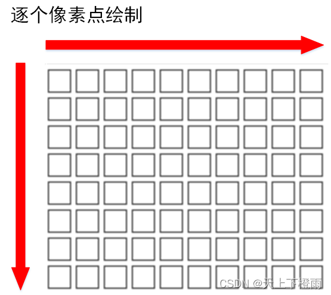
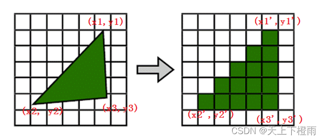
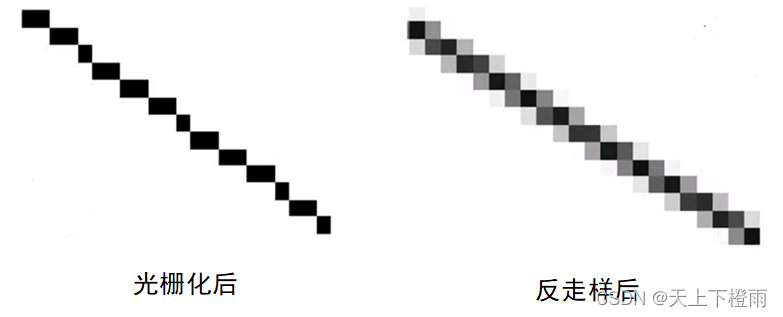
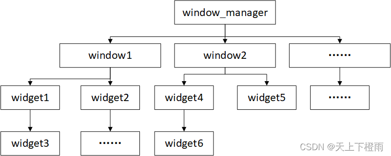
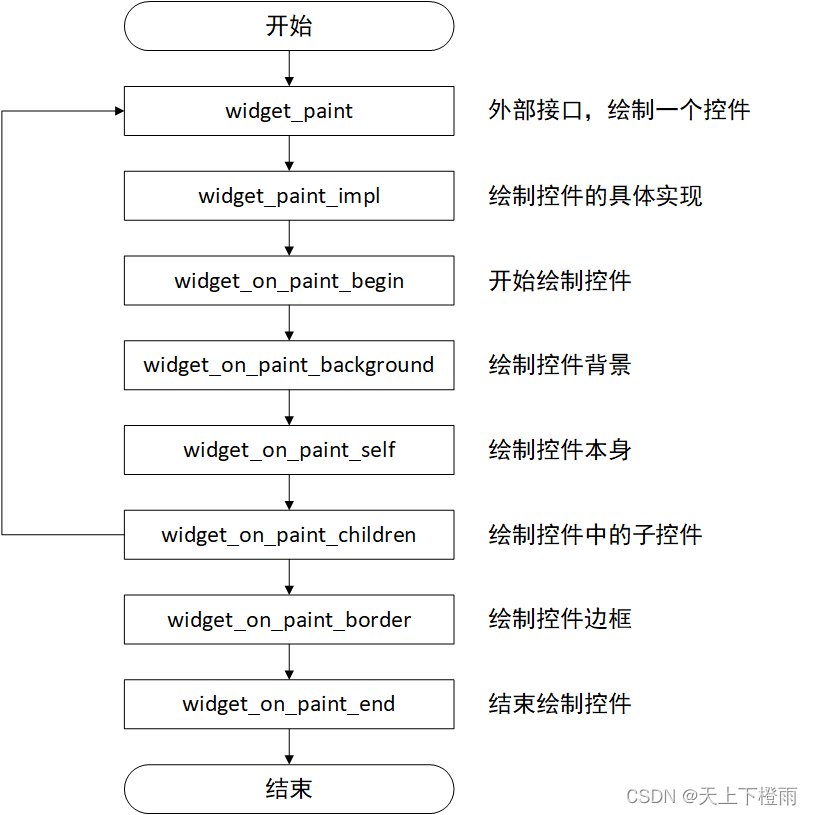
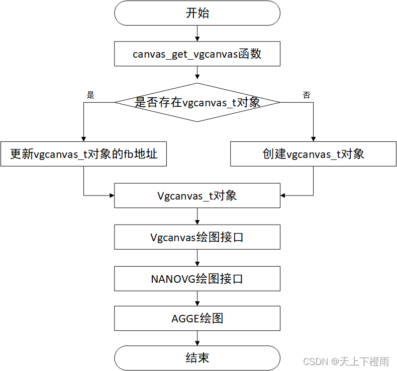

## 1 前言

AWTK 全称 Toolkit AnyWhere，是 ZLG 基于 C 语言开发的开源 GUI 引擎，旨在为用户提供一个功能强大、高效可靠、简单易用、可轻松做出炫酷效果的 GUI 引擎。

- 官网连接：[https://www.zlg.cn/index/pub/awtk.html](https://www.zlg.cn/index/pub/awtk.html)
- GitHub仓库：[https://github.com/zlgopen/awtk](https://github.com/zlgopen/awtk)

GUI 框架的核心主要包含以下两点：

1. 界面绘制。
2. 消息响应。

其中又以界面绘制最为重要，在学习、使用以及完善 AWTK 的过程中，我逐渐对 AWTK 的绘制流程即原理有了大致的了解，在此非常感谢领导和同事对我的指导与培训，本文对学到的东西做个记录。

## 2 绘制的基础知识

在分析 AWTK 的绘制流程前首先需要简单了解一下计算机绘制与显示的基础知识。

### 2.1 屏幕显示图像的原理

首先，第一个问题，屏幕时怎么显示图像的？计算机显示到屏幕上的图像其实就是位图（Bitmap），是由许多个像素点构成的，每个像素点又通过 RGB 三原色组成。

由于屏幕上的像素点很密集，所以肉眼一般是看不见像素点之间的缝隙的，比如 1080p 的屏幕，其分辨率为 1080 X 1920，也就是说屏幕上有约 200 万个像素点。

而屏幕对应的显存就是一个存放这些像素点颜色数据的二维数组，每个像素点对应一个数组元素，元素中存储像素的 RGB 值，通过混合三种颜色的到最终显示到屏幕上的颜色。

屏幕显示一帧图像是有一个过程的，一般是从左上角的原点开始逐个打点，一个像素一个像素得绘制，从左往右、从上之下，直到屏幕的右下角。这里所说的原点位置和刷新方向不是固定的，不同的屏幕可能不同，甚至部分屏幕可以设置这些参数。




常见的屏幕颜色位数详见下表

|                  | 24位色           | 16位色                                   | 8位色     | 1位色(单色) |
| ---------------- | ---------------- | ---------------------------------------- | --------- | ----------- |
| 格式             | RGB8888、BGR8888 | RGB565、BGR565、RGB5551、BGR5551         | 8位灰度图 | 单色图      |
| 能显示的颜色个数 | 2^24             | 2^16 或 2^15(剩下一位表示像素点亮或不亮) | 2^8       | 2           |

通常来讲，会根据 LCD 屏幕的颜色格式分配一块或多块 LCD 大小的显存存放屏幕中像素点的颜色数据，俗称显存，又称 FrameBuffer，简称 fb。

### 2.2 光栅化和反走样

我们通常所讲的几何图形是一个数学概念，但屏幕是由像素点组成的，是点阵状的，几何图形中的线和区域在屏幕中都只能通过打点的形式来表现，光栅化就是指这个过程，如下图所示：




光栅化就是将几何图形（浮点坐标）转化成离散的点阵图像（整数坐标），这个过程肯定伴随着精度丢失，上图可以很明显得看出来。

> 备注：简单理解，计算机绘图主要分为两种，svg 和 位图，svg 就需要光栅化转成点阵，而位图本身就是点阵。

图像走样是由于光栅化过程中丢失了一些数据导致出现锯齿形或者阶梯状外观。而反走样是通过各种手段来改善图像走样的效果不佳的技术，如下图所示：



## 3 AWTK 中提供的画布

AWTK 提供了两种画布：普通（canvas）和矢量图画布（vgcanvas），通过调用这两种画布提供的画图接口，可以实现不同的绘图功能。

* canvas：普通画布可以实现一些简单的绘制功能，如：绘制水平或垂直直线、文本、图片、矩形等。如果需要绘制比较复杂一点的图形就需要使用矢量图画布，如：绘制椭圆、圆弧等。
* vgcanvas：与 canvas 相比 vgcanvas 的效率要低一些，但功能也丰富些。绘制一些简单的图形，如线条、矩形等可以用 canvas；复杂一点图形，如圆角矩形就用 vgcanvas。

> 备注：即使是渲染同一个效果，vgcanvas 也会比 canvas 慢。

## 4 AWTK GUI 界面绘制流程

### 4.1 界面控件结构

在 AWTK 中，界面控件是一个树状的结构，全局的 window_manager 是控件树的根节点，所有的窗口和控件都由它进行最终的管理，结构示意图如下：




### 4.2 控件绘制流程

AWTK 有一个 GUI 主线程循环，该循环会不断调用以下函数：

```c
/* awtk/src/main_loop/main_loop_simple.c */
static ret_t main_loop_simple_step(main_loop_t* l) {
  uint32_t curr_expected_sleep_time = 0xFFFFFFFF;
  main_loop_simple_t* loop = (main_loop_simple_t*)l;

  main_loop_dispatch_input(loop);
  main_loop_dispatch_events(loop);
  event_source_manager_dispatch(loop->event_source_manager);

  window_manager_check_and_layout(loop->base.wm);
  window_manager_paint(loop->base.wm);

  curr_expected_sleep_time = window_manager_get_curr_expected_sleep_time(loop->base.wm);
  main_loop_set_curr_expected_sleep_time(l, curr_expected_sleep_time);

  return RET_OK;
}
```

- main_loop_dispatch_input 函数：获取输入设备的信息。
- event_source_manager_dispatch 函数：处理输入设备信息。
- main_loop_dispatch_events 函数：处理定时器和 idle 等消息源。
- window_manager_check_and_layout 函数：完成 UI 布局的相关操作。
- window_manager_paint 函数：完成 GUI 界面的绘制

其中，window_manager_paint 函数会深度遍历树状结构的 UI 树，并且把相关的 UI 控件绘制到屏幕上面，早画的控件会被晚画的控件覆盖，绘制每一个控件的流程如下图所示：



```c
/* awtk/base/widget.c */
static ret_t widget_paint_impl(widget_t* widget, canvas_t* c) {
  int32_t ox = widget->x;
  int32_t oy = widget->y;
  uint8_t save_alpha = c->global_alpha;

  if (widget->opacity < TK_OPACITY_ALPHA) {
    canvas_set_global_alpha(c, (widget->opacity * save_alpha) / 0xff);
  }

  if (widget->astyle != NULL) {
    ox += style_get_int(widget->astyle, STYLE_ID_X_OFFSET, 0);
    oy += style_get_int(widget->astyle, STYLE_ID_Y_OFFSET, 0);
  }

  canvas_translate(c, ox, oy);
  widget_on_paint_begin(widget, c);
  widget_on_paint_background(widget, c);
  widget_on_paint_self(widget, c);
  widget_on_paint_children(widget, c);
  widget_on_paint_border(widget, c);
  widget_on_paint_end(widget, c);

  canvas_untranslate(c, ox, oy);
  if (widget->opacity < TK_OPACITY_ALPHA) {
    canvas_set_global_alpha(c, save_alpha);
  }

  widget_on_paint_done(widget, c);

  return RET_OK;
}
```

AWTK 控件绘图流程，一般都是先绘制控件背景，再绘制控件本身，然后再绘制控件的子集，最后绘制控件的边框，通过不断递归重复这一流程，绘制所有控件。在绘制相关的函数中，主要通过调用 canvas 或 vgcanvsa 的相关接口将对应的数据绘制到画布上。

## 5 AWTK的绘制原理

AWTK 常用的渲染模式有两种，分别为 AGGE 和 OpenGL。前者是软件渲染，主要通过 CPU 来计算界面数据并将其拷贝到显存中实现显示，兼容性比较好，但渲染效果一般，速度慢，适合没有 GPU 的嵌入式平台；后者基于 OpenGL/GLES 实现，渲染效果好，适合有 GPU 的平台，常用于 PC。

由于 AWTK 中 OpenGL 模式下的绘图过程比较绕，后面我们先从方便理解的 AGGE 模式入手。

### 5.1 AWTK中的NANOVG

NANOVG 是第三方的矢量画布库，默认只提供 OpenGL 的适配，但它本身是支持重载的，因此，后面 AWTK 中自行增加了 AGGE 的适配。

在 AWTK 中，存在 NANOVG 前后端的概念，具体定义如下：

- NANOVG 前端：指 NANOVG 对外提供的抽象接口，供画布类型调用。
- NANOVG 后端：指 NANOVG 的具体实现，即真正的将图像数据绘制到屏幕上，比如默认提供的 OpenGL，以及 AWTK 后来增加 AGGE。

NANOVG 的作用其实就是给 AWTK 提供了矢量画布的功能。

### 5.2 AGGE模式绘制流程

AGGE 是一个非常小的开源矢量画布类库，并且该类库是基于软件渲染实现，代码大概有 3000 多行，非常适合嵌入式平台使用，选择 AGGE 作为 AWTK 的矢量画布实现时，界面的绘制原理详见下文。

#### 5.2.1 普通画布canvas

**普通画布 canvas 的主要功能**：渲染贴图，渲染文字，填充矩形，渲染矩形边框，填充圆角矩形和渲染圆角矩形边框。

**普通画布 canvas 的绘制流程**：canvas 画布底层是通过调用 lcd_t 类的接口来实现相应的效果，lcd_t 类是平台相关的，通常由适配层实现，这里用的是 lcd_mem.inc 中的实现将图像绘制到显存。


> 备注：在 AWTK 中，默认提供了软件绘图的实现，用户只需实现 awtk/src/base/g2d.h 文件中的相关接口，再定义宏 `WITH_G2D` 即可采用硬件加速绘图，具体可以看 AWTK 的移植文档：[awtk.zlg.cn/docs](awtk.zlg.cn/docs)。

#### 5.2.2 矢量画布vgcanvas

**矢量画布 vgcanvas 的绘制流程**：vgcanvas 画布通过调用 NANOVG 的相关接口来实现相应的效果，此处 NANOVG 后端用 AGGE 实现。




**本质上来说 AGGE 绘图的过程，就是矢量路径的图形光栅化，然后在显示到屏幕上面。**

此外，vgcanvas 在 AWTK 中能实现绘图的核心函数为 **canvas_get_vgcanvas**，该函数可以重载，主要用于获取 vgcanvas_t 对象，将 vgcanvas_t 与 lcd_t 对象绑定并更新 fb 地址，确保图像数据能绘制到正确的显存上。

> 备注
> 
> 1. 在 AWTK 中 vgcanvas 对象一般情况下有且只有一个单例对象。
> 2. AWTK 有可能使用多缓冲机制，因此在使用 vgcanvas 对象前需更新 fb 地址，确保可以将内容正确画到当前的 fb 上。
> 3. nanovg_agge 由 vgcanvas_nanovg_soft.inc 实现。

### 5.3 OpenGL模式绘制流程

OpenGL（Open Graphics Library）是用于渲染2D、3D矢量图形的跨语言、跨平台的应用程序变成接口，具有渲染效果好、效率高的优点。在 AWTK 中常用于 Windows、Ubuntu、树莓派等平台。

AWTK 提供了三个版本的 OpenGL 实现：GLES3、GLES2、GL3，可以在 awtk_config.py 文件中可以进行配置：

```py
## awtk/awtk_config.py
if OS_NAME == 'Windows':
    TK_ROOT = TK_ROOT.replace('\\', '\\\\')
    NANOVG_BACKEND = 'GLES2'
else:
    NANOVG_BACKEND = 'GL3'

# VGCANVAS='CAIRO'
# NANOVG_BACKEND='GLES2'
# NANOVG_BACKEND='GLES3'
# NANOVG_BACKEND='AGG'
# NANOVG_BACKEND='BGFX'
# NANOVG_BACKEND='AGGE'
```

#### 5.3.1 普通画布canvas

与 AGGE 渲染模式不同，OpenGL 渲染模式下的 canvas 画布底层虽然也是通过调用 lcd_t 类的接口来实现相应的效果，但是 lcd_t 类的接口却不是用 lcd_mem.inc 了，而是直接改用 vgcanvas 实现，即 lcd_vgcanvas.inc。

也就是说，在 OpenGL 渲染模式下无论是使用 cnavas 画布绘图还是使用 vgcanvas 画布绘图，最终被调用的都是 vgcanvas。

canvas --> lcd --> vgcanvas：最后由 vgcanvas 调用 opengl 的接口将界面画到显存上

#### 5.3.2 矢量画布vgcanvas

与 AGGE 渲染模式一样，OpenGL 渲染模式下的 vgcanvas 画布通过调用 NANOVG 的相关接口来实现相应的效果，只不过此处 NANOVG 后端采用 OpenGL 实现。

> 备注：nanovg_gl 由 vgcanvas_nanovg_gl.inc 实现。

## 6 总结

### 6.1 绘制流程

AWTK 绘制界面主要有两个途径，一是调用 canvas 画布，二是调用 vgcanvas 画布，其中 canvas 画布的绘制主要看 lcd_t 的实现；vgcanvas 画布的绘制主要看 NANOVG 后端的实现。

1. canvas 是一个抽象的上层概念，无法直接操作显存，通过 lcd_t 来绘制图像，主要提供给用户使用。
2. lcd_t 对象如何操作显存主要看它的实现，这里在 OpenGL 渲染模式下比较特殊，借助 vgcanvas 来绘制。
3. vgcanvas 调用 NANOVG 的接口来绘图，其具体实现要看后端。

### 6.1 绘制原理

开头就讲了 LCD 显示的原理实际上就是将图像的像素数据写到 LCD 对应的显存中，那么 AWTK 绘制界面的基本原理其实就是将 UI 控件、图片(jpg、png、gif等)、字体、矢量图(svg)等信息融合成 LCD 颜色格式的位图数据拷贝到显存中。

canvas 可以直接贴图，vgcanvas 则是将矢量路径转成光栅化的位图再贴到显存上。

> 备注：AWTK 借助了 stb 库将图片(jpg、png、gif等)和矢量字体(ttf)转化成位图，再绘制到界面上。
