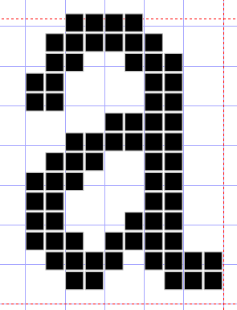
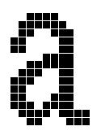
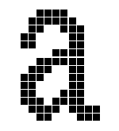

## 1 前言

首先，再阅读本文之前需要对 FreeType 的使用方法有基本的了解，可以参考：[FreeTpye库学习笔记：将矢量字体解析为位图](./awtk_freetype_ttf.md)。

## 2 FreeType 存在的问题

矢量字体（TrueType）通过数学曲线来描述字形，包含字形边界上的关键点、连线的导数信息等。

FreeType 解析矢量字体的过程是将字形关键点按照规则连线变成字符轮廓，最后再将轮廓填充成点阵字。

很明显，在这个过程中，字形关键点是字体轮廓精准的度量，而位图则可以看成网格状态的，单位为像素，那么将坐标点转化为位图的过程势必会导致精度丢失，比如点坐标为(1.2, 2.8)，那么转换成位图则变成了(1, 3)。

并且由于 FreeType 为了提高运算速度，采用位移的方式进行数学计算势必会导致精度丢失更加严重，在处理一些小字号字体或像素字体时，容易发生像素块粘连的现象。

例如，像素字体的字形如下图所示：



但解析后得到的位图如下，可以明显看见像素粘连：



## 3 优化FreeType的解析效果

### 3.1 提高解析字体的精度

虽然 FreeType 解析字体时精度丢失无法避免，但提高运算精度依然可以优化显示效果。

FreeType 提供两种计算二次贝塞尔曲线的精度，低精度 0.5 个像素，高精度 0.0625 个像素。其默认采用低精度进行运算，通过设置标志位 FT\_OUTLINE\_HIGH\_PRECISION 可让 FreeType 采用高精度运算。

```c
uint32_t flags = FT_LOAD_DEFAULT | FT_LOAD_RENDER | FT_LOAD_NO_AUTOHINT | FT_OUTLINE_HIGH_PRECISION;
```

### 3.2 关闭 auto\_hint

要了解 auto\_hint 首先需要知道什么是 hinting 。

hinting 用来优化字体显示的方法。由于屏幕像素有限，矢量字体的缩放需要有更多的考虑，例如当一条线在两个像素格子中间时，该取左边的格子还是右边的格子？如果这方面没做好，就常常会出现字形衬线没对齐、或小字号字形歪七扭八、或像素块粘连到一起的情况。

> 备注：hinting 是额外的信息，它告诉 渲染器 renderer 该如何处理这些细节部分，使矢量字在小字号时显示效果更好，因此，hinting 是非常费时费人力的工作，TrueType 字体很多，但是有良好 hinting 的不多，拙劣的 hinting 会让字变得很难看。

为了改善以上问题，FreeType 提供了 auto\_hint 功能，并默认开启该功能，它可以自动为没有 hinting 的字体做 hinting 工作，auto\_hint 肯定无法做得像人力 hinting  一样好，对于许多笔画复杂的文字（如中文）效果不佳，并且对于小字号的复杂字形，经常造成一系列反效果，最典型问题的就是像素粘连。

因此，经过多次测试，关闭 FreeType 的 auto\_hint 功能可以对大多数矢量字体的中文显示效果更好，通过设置标志位 FT\_LOAD\_NO\_AUTOHINT 可关闭该功能。

```c
uint32_t flags = FT_LOAD_DEFAULT | FT_LOAD_RENDER | FT_LOAD_NO_AUTOHINT | FT_OUTLINE_HIGH_PRECISION;
```

## 4 总结

经过以上优化，FreeType 解析像素字体后得到的位图效果如下：



由此可见，对于字号较小的复杂字形以及像素字体，提高 FreeType 的解析精度并关闭 auto_hint 功能能有效提高显示效果。
