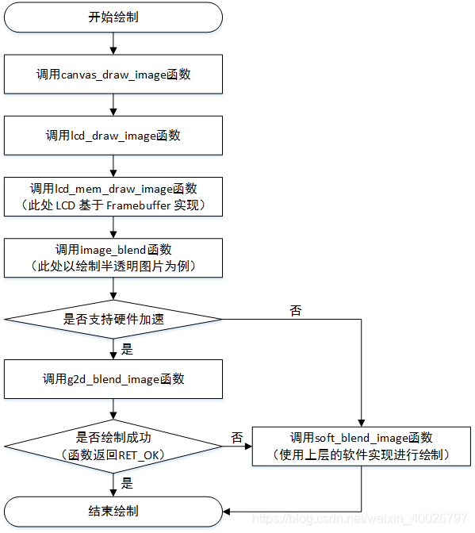

## 1 简介

AWTK是 [ZLG](http://www.zlg.cn/) 开发的开源 GUI 引擎，前往 [官网](https://www.zlg.cn/index/pub/awtk.html)。

G2D 硬件加速是指将计算量较大的图像处理工作分配给专门的硬件外设来处理，减轻 CPU 的计算量，以此提高图像绘制的性能。

不同硬件平台的硬件加速外设不一样，其实现方法也有区别，在 AWTK 中，用户需要实现 awtk/src/base/g2d.h 文件中的相关接口，详见下表，然后开启宏 WITH_G2D 即可支持硬件加速，具体详见本文 2.21 章节。

| 函数名称         | 说明                                                                                | 备注                                                                                                     |
| ---------------- | ----------------------------------------------------------------------------------- | -------------------------------------------------------------------------------------------------------- |
| g2d_fill_rect    | 用颜色填充指定的区域                                                                |                                                                                                          |
| g2d_copy_image   | 把图片指定的区域拷贝到 Framebuffer 中                                               |                                                                                                          |
| g2d_rotate_image | 把图片指定的区域进行旋转并拷贝到 Framebuffer 的相应区域                             | 本函数主要用于辅助实现横屏和竖屏的切换，一般支持90度旋转即可                                             |
| g2d_blend_image  | 把图片指定的区域渲染到 Framebuffer 指定的区域，如果两个指定区域大小不一致则进行缩放 | 如果硬件设备不支持缩放或者不支持全局 Alpha 融合算法（绘制半透明图像），请返回 RET_NOT_IMPL，使用软件渲染 |

为方便读者理解，此处以绘制一张半透明的背景图为例，介绍 AWTK 是如何支持硬件加速的，绘制步骤如下：

1. 在 AWTK 中通常会调用画布 canvas 中的 canvas_draw_image 函数绘制图像；
2. 紧接着 canvas_draw_image 函数会调用 LCD 包装的 lcd_draw_image 函数；
3. 在基于 Framebuffer 实现的 LCD 中实际上调用的是 lcd_mem_draw_image 函数；
4. 由于此处绘制的是半透明图像，因此不能直接拷贝绘制，需要调用 image_blend 函数进行渲染；
5. 如果开启宏 WITH_G2D 支持硬件加速，那么 image_blend 函数会调用 g2d_blend_image 函数进行绘制；
6. 如果没有开启宏 WITH_G2D 或者 g2d_blend_image 函数绘制失败，那么就会调用 soft_blend_image 函数进行软件渲染。

> 备注：
> 
> 1. AWTK 中的画布 canvas 提供了基本的绘图功能和状态管理，其接口详见：awtk/src/base/canvas.h。
> 2. AWTK 中的 LCD 的相关接口详见：awtk/src/base/lcd.h。
> 3. AWTK 提供了基于 Framebuffer 的 LCD 缺省实现，代码详见：awtk/src/lcd/lcd_mem.inc。
> 4. 基于 Framebuffer 实现的 LCD 通常会调用 awtk/src/blend/image_g2d.h 中的接口进行绘制。

绘制半透明背景的流程详见下图：



## 2 AWTK内置的STM32 G2D

目前，AWTK 内置了 STM32 系列平台 G2D 硬件加速的实现，代码详见：awtk/src/blend/stm32_g2d.c，只需定义下面的宏即可启用该功能：

```c
#define WITH_STM32_G2D 1
```

> 备注：定义宏 WITH_STM32_G2D 后，AWTK 会自动定义宏 WITH_G2D 启用硬件加速，用户无需重复定义。

STM32 平台通过外设 DMA2D（Direct Memory Access 2D）支持硬件加速，此处以实现 g2d.h 文件中的 g2d_fill_rect 函数为例，介绍如何通过 DMA2D 实现硬件加速，其他接口的实现方法类似，详情可参考：awtk/src/blend/stm32_g2d.c。

> 备注：
> 
> 1. AWTK 针对 STM32f767igtx 的移植层 awtk-stm32f767igtx-raw 的下载地址：https://github.com/zlgopen/awtk-stm32f767igtx-raw。
> 2. DMA2D 的相关说明可参考：awtk-stm32f767igtx-raw/HALLIB/STM32F7xx_HAL_Driver/Inc/stm32f7xx_hal_dma2d。
> 3. DMA2D 的使用方法可参考：awtk-stm32f767igtx-raw/HARDWARE/LCD/ltdc.c。

```c
/* awtk/src/blend/stm32_g2d.c */
...
#define DMA2D_WORKING ((DMA2D->CR & DMA2D_CR_START))  /* DMA2D 是否正在工作（传输）  */

/* 等待 DMA2D 工作（传输）完成 */
#define DMA2D_WAIT                  \
  do {                              \
    while (DMA2D_WORKING)           \
      ;                             \
    DMA2D->IFCR = DMA2D_IFSR_CTCIF; \
  } while (0);

#define PIXEL_FORMAT_BGRA8888 0X00  /* 颜色格式：BGRA8888 */
#define PIXEL_FORMAT_BGR565 0X02    /* 颜色格式：BGR565 */

/**
 * @method g2d_fill_rect
 * 用颜色填充指定的区域。
 * @param {bitmap_t*} fb Framebuffer对象。
 * @param {const rect_t*} dst 要填充的目标区域。
 * @param {color_t} c 填充颜色。
 *
 * @return {ret_t} 返回RET_OK表示成功，否则表示失败，返回失败则上层用软件实现。
 */
ret_t g2d_fill_rect(bitmap_t* fb, const rect_t* dst, color_t c) {
  ...
   /** 
    * 注意：STM32 的 DMA2D 仅颜色透明度大于 0xf0 以及颜色格式为 BGR565 和 BGRA8888 的硬件加速， 
    * 因此，c.rgba.a 必须大于 0xf0 且 fb->format 必须等于 BITMAP_FMT_BGR565 或 BITMAP_FMT_BGRA8888。
   */

  /* 根据 fb->format，获取像素占用字节、颜色格式以及颜色值 */
  uint16_t o_pixsize = 0;
  uint16_t o_format = 0;
  uint32_t color = 0;
  if (fb->format == BITMAP_FMT_BGR565) {
    o_pixsize = 2;
    o_format = PIXEL_FORMAT_BGR565;
    color = ((((c.rgba.r) >> 3) << 11) | (((c.rgba.g) >> 2) << 5) | ((c.rgba.b) >> 3));
  } else {
    o_pixsize = 4;
    o_format = PIXEL_FORMAT_BGRA8888;
    color = c.color;
  }

  uint8_t* fb_data = bitmap_lock_buffer_for_write(fb); /* 为修改数据锁定位图缓冲区 */
  uint16_t o_offline = fb->w - dst->w;                 /* 计算行偏移 */
  /* 计算指定填充区域的起始地址 */
  uint32_t o_addr = ((uint32_t)fb_data + o_pixsize * (fb->w * dst->y + dst->x));

  __HAL_RCC_DMA2D_CLK_ENABLE();   /* 使能 DMA2D 时钟 */
  DMA2D->CR &= ~(DMA2D_CR_START); /* 先停止 DMA2D */
  DMA2D->CR = DMA2D_R2M;          /* 设置 DMA2D 的传输模式：从寄存器到内存 */

  DMA2D->OPFCCR = o_format;    /* 设置颜色格式 */
  DMA2D->OOR = o_offline;      /* 设置行偏移 */
  DMA2D->OMAR = o_addr;        /* 设置输出缓冲区地址（指定填充区域的起始地址） */
  DMA2D->OCOLR = color;        /* 设置填充颜色 */
  DMA2D->NLR = dst->h | (dst->w << 16);  /* 设置行数 */

  DMA2D->CR |= DMA2D_CR_START; /* 启动 DMA2D */
  DMA2D_WAIT                   /* 等待 DMA2D 工作（传输）完成 */
  bitmap_unlock_buffer(fb);    /* 绘制完成，解锁位图缓冲区 */

  return RET_OK;
}
```


## 3 NXP 的 PXP G2D

除了 AWTK 内置的 STM32 平台的硬件加速移植外，在 AWTK 针对 AWorks (RT1052)平台的移植中，提供了 NXP PXP 硬件加速的实现文件，代码详见：awtk-aworks-rt1052/awtk-port/rt1052_g2d.c，只需定义下面的宏即可启用该功能：

```c
#define WITH_PXP_G2D 1
```

> 备注：
> 
> 1. 移植层 awtk-aworks-rt1052 的下载地址：https://github.com/zlgopen/awtk-aworks-rt1052。
> 2. 定义宏 WITH_PXP_G2D 后，AWTK 会自动定义宏 WITH_G2D 启用硬件加速，用户无需重复定义。

AWorks 平台通过外设 PXP（像素处理）支持硬件加速，此处同样以实现 g2d.h 文件中的 g2d_fill_rect 函数为例，介绍如何通过 PXP 实现硬件加速，其他接口的实现方法类似，详情可参考：awtk-aworks-rt1052/awtk-port/rt1052_g2d.c。

> 备注：如想了解 AWorks 平台 PXP 的详细说明以及使用方法可前往 ZLG 官网下载最新的 RT1052 光盘资料，其中包括文档《AWorks M105x 外设使用指南——PXP》，官网地址：https://www.zlg.cn。

```c
/* awtk-aworks-rt1052/awtk-port/rt1052_g2d.c */
...
/**
 * @method g2d_fill_rect
 * 用颜色填充指定的区域。
 * @param {bitmap_t*} fb Framebuffer对象。
 * @param {const rect_t*} dst 要填充的目标区域。
 * @param {color_t} c 填充颜色。
 *
 * @return {ret_t} 返回RET_OK表示成功，否则表示失败，返回失败则上层用软件实现。
 */
ret_t g2d_fill_rect(bitmap_t* fb, const rect_t* dst, color_t c)
{  
  ...
   /** 
    * 注意：NXP 的 PXP 仅支持颜色透明度大于 0xf8 以及颜色格式为 BGR565 为的硬件加速，
    * 因此，c.rgba.a 必须大于 0xf8 且 fb->format 必须等于 BITMAP_FMT_BGR565。
   */

    /* 定义 PXP 输出缓冲的配置 */
    pxp_output_buffer_config_t pxp_output_config = {0}; 

    /* 定义 PXP process surface 的配置，以下简称 PS（此处为填充区域缓冲）*/
    pxp_ps_buffer_config_t ps_buffer_config = {0};  

    uint8_t out_pixsize = 2;                              /* 像素占用字节 */
    uint8_t* fb_data = bitmap_lock_buffer_for_write(fb);  /* 为修改数据锁定位图缓冲区 */

    /* 计算指定填充区域的起始地址 */
    uint32_t out_addr = (uint32_t)fb_data + (fb->w * dst->y + dst->x) * out_pixsize;
    /* 计算需要刷新的缓冲区大小（从填充区域起始地址到结束地址的大小） */
    uint32_t fb_flush_size = ((dst->h - 1) * fb->w + dst->w) * out_pixsize;
    
    aw_cache_flush((void *)out_addr,  fb_flush_size); /* 刷新缓冲区中的数据 */
    pxp_hard_reset();                                 /* 复位 pxp */

    /* PXP 输出缓冲配置 */
    pxp_output_config.pixel_format = kPXP_OutputPixelFormatRGB565; /* 设置颜色格式 */
    pxp_output_config.interlaced_mode = kPXP_OutputProgressive;    /* 设置输出模式 */
    pxp_output_config.buffer0_addr = out_addr;                     /* 设置输出缓冲首地址 */
    pxp_output_config.pitch_bytes = fb->w * out_pixsize;           /* 设置一行所占的字节数 */
    pxp_output_config.width  = dst->w;                             /* 设置填充区域宽度 */
    pxp_output_config.height = dst->h;                             /* 设置填充区域高度 */
    pxp_set_output_buffer_config(&pxp_output_config);              /* 更新输出缓存配置 */

    /* PXP PS 配置 */
    ps_buffer_config.pixel_format = kPXP_PsPixelFormatRGB888;      /* 设置颜色格式 */
    ps_buffer_config.buffer_addr  = out_addr;                      /* 设置填充缓存首地址 */
    ps_buffer_config.pitch_bytes  = fb->w * out_pixsize;           /* 设置一行所占的字节数 */
    pxp_set_process_surface_buffer_config(&ps_buffer_config);      /* 更新填充缓存配置 */
    pxp_set_process_surface_position(0, 0, dst->w - 1, dst->h - 1);/* 设置 PS 图形位置 */
    pxp_set_alpha_surface_position(1, 1, 0, 0);                    /* 设置 AS 图形位置 */
    pxp_set_process_surface_color_key(0, 0xFFFFFF);                /* 设置 PS ColorKey */

    /* 设置填充的颜色 */
    pxp_set_process_surface_back_ground_color((uint32_t)c.color & (0xFFFFFF));
    pxp_start();  /* 启动 PXP */

    pxp_complete_status_sync();                           /* 等待 PXP 图形处理完成 */
    aw_cache_invalidate((void *)out_addr, fb_flush_size); /* 清空缓存中的缓冲区数据 */
    bitmap_unlock_buffer(fb);                             /* 绘制完成，解锁位图缓冲区 */

    return RET_OK;
}
```
