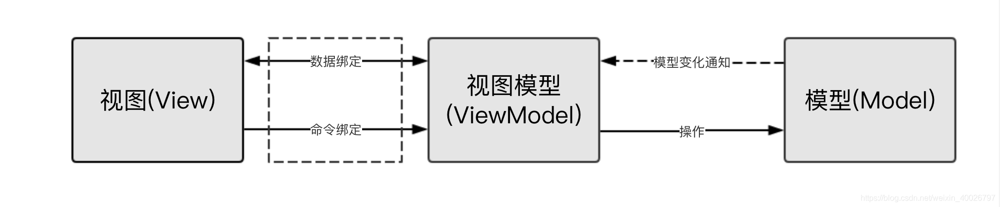
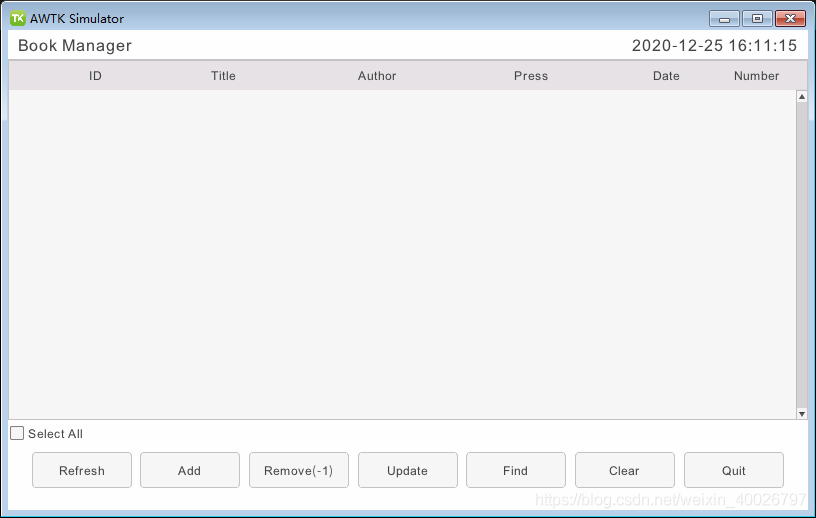

## 1 前言

最近要使用MVVM框架实现图书管理系统的AWTK GUI界面，因此需要学习awtk-mvvm，该项目的说明文档非常详尽，本文仅记录学习awtk-mvvm过程中的要点，并不作为教程，更详细且严谨的请参考awtk-mvvm/docs下的md文档，相信各位也会大有所获。

> 备注：前往 GitHub 下载 [awtk-mvvm](http://github.com/zlgopen/awtk-mvvm)。

## 2 什么是MVVM？

MVVM是Model-View-ViewModel的简写。它本质上就是MVC的改进版。MVVM就是将其中的View的状态和行为抽象化，将界面UI和业务逻辑分开，这件事是ViewModel帮我们做的，它可以取出Model的数据，同时帮忙处理View中涉及的业务逻辑（通常是涉及显示内容的处理）。

> 备注：更多关于MVVM的知识请参考：awtk-mvvm/docs/8.intro.md 中的 8.2.3 章节。



## 3 什么是AWTK-MVVM？

AWTK-MVVM是一套用C语言开发的，专门为嵌入式平台优化的MVVM框架。它实现了数据绑定、命令绑定和窗口导航等基本功能，使用AWTK-MVVM开发应用程序，无需学习AWTK本身的API，只需学习绑定规则和模型的实现方式即可。

AWTK-MVVM具备代码小、性能高、易调试和隔离彻底等优势，还支持C语言和JS语言开发，但目前不支持界面元素动态生成，当然这个可以通过传统的开发方式解决。

> 备注：更多关于AWTK-MVVM的相关说明请参考：awtk-mvvm/docs/8.intro.md 中的 8.3 章节。

## 4 设计图书管理系统的Model

### 4.1 简介

用 AWTK-MVVM 开发应用程序时，开发者的主要工作是编写Model的代码，而ViewModel则由代码产生器自动生成。需要注意的是在编写Model的代码时，要按照固定的规则来编写注释，这些注释的规则在AWTK本身及相关项目中广泛使用，**这是重中之重，因为若不按照规则编写注释或者写错、漏写，都会导致自动生成的ViewModel代码有误，影响后续开发。**

### 4.2 设计需求

此处设计一个图书管理系统的Model，其界面如图所示，需要包含刷新、增删改查、清除、退出功能（函数），并且该界面中需要同步图书列表的行数，因此需要包含一个items属性，用于保存当前界面上图书的总数。



### 4.3 Model代码

图书管理系统的Model命名为book_controller，其头文件为book_controller.h，代码如下：

> 注意：items属性是写在注释中的，其本体为book_manager_t中动态数组的size，这种属性在awtk-mvvm中被称为合成属性。

```c
//book_controller.h
#ifndef BOOK_CONTROLLER_H
#define BOOK_CONTROLLER_H

#include "tkc/types_def.h"
#include "../../src/book/book_manager.h"

BEGIN_C_DECLS

/**
 * @class book_controller_t
 *
 * @annotation ["model"]
 * 图书管理系统控制器。
 *
 */
typedef struct _book_controller_t {
  /**
   * @property {uint32_t} items
   * @annotation ["fake", "readable"]
   * 图书总数。
   */

  /* private */
  book_manager_t* bm;
} book_controller_t;

/**
 * @method book_controller_create
 * 创建book_controller对象。
 *
 * @annotation ["constructor"]
 * @return {book_controller_t*} 返回book_controller对象。
 */
book_controller_t* book_controller_create(void);

/**
 * @method book_controller_destroy
 * 销毁book_controller对象。
 *
 * @annotation ["destructor"]
 * @param {book_controller_t*} bc book_controller对象。
 *
 * @return {ret_t} 返回RET_OK表示成功，否则表示失败。
 */
ret_t book_controller_destroy(book_controller_t* bc);

/**
 * @method book_controller_get_items
 * 获取图书总数。
 *
 * @param {book_controller_t*} bc book_controller对象。
 *
 * @return {uint32_t} 返回图书总数。
 */
uint32_t book_controller_get_items(book_controller_t* bc);

/**
 * @method book_controller_refresh
 * 刷新图书
 *
 * @annotation ["command"]
 * @param {book_store_t*} bc book_controller对象。
 *
 * @return {ret_t} 返回RET_ITEMS_CHANGED表示模型有变化，View需要刷新；返回其它表示失败。
 */
ret_t book_controller_refresh(book_controller_t* bc);

/**
 * @method book_controller_add
 * 增加一本图书。
 *
 * @annotation ["command"]
 * @param {book_controller_t*} bc book_controller对象。
 *
 * @return {ret_t} 返回RET_ITEMS_CHANGED表示模型有变化，View需要刷新；返回其它表示失败。
 */
ret_t book_controller_add(book_controller_t* bc);

/**
 * @method book_controller_remove
 * 删除指定id的图书。
 *
 * @annotation ["command"]
 * @param {book_controller_t*} bc book_controller对象。
 * @param {int32_t} id 图书id。
 *
 * @return {ret_t} 返回RET_ITEMS_CHANGED表示模型有变化，View需要刷新；返回其它表示失败。
 */
ret_t book_controller_remove(book_controller_t* bc, int32_t id);

/**
 * @method book_controller_update
 * 修改指定id的图书。
 *
 * @annotation ["command"]
 * @param {book_controller_t*} bc book_controller对象。
 * @param {int32_t} id 图书id。
 *
 * @return {ret_t} 返回RET_ITEMS_CHANGED表示模型有变化，View需要刷新；返回其它表示失败。
 */
ret_t book_controller_update(book_controller_t* bc, int32_t id);

/**
 * @method book_controller_find
 * 查找指定id的图书。
 *
 * @annotation ["command"]
 * @param {book_controller_t*} bc book_controller对象。
 * @param {int32_t} id 图书id。
 *
 * @return {ret_t} 返回RET_ITEMS_CHANGED表示模型有变化，View需要刷新；返回其它表示失败。
 */
ret_t book_controller_find(book_controller_t* bc, int32_t id);

/**
 * @method book_controller_clear
 * 清除图书。
 *
 * @annotation ["command"]
 * @param {book_controller_t*} bc book_controller对象。
 *
 * @return {ret_t} 返回RET_ITEMS_CHANGED表示模型有变化，View需要刷新；返回其它表示失败。
 */
ret_t book_controller_clear(book_controller_t* bc);

/**
 * @method book_controller_quit
 * 退出。
 *
 * @annotation ["command"]
 * @param {book_controller_t*} bc book_controller对象。
 *
 * @return {ret_t} 返回RET_OK表示成功，否则表示失败。
 */
ret_t book_controller_quit(book_controller_t* bc);

END_C_DECLS

#endif /*BOOK_CONTROLLER_H*/
```

仔细观察代码注释中的 annotation 参数，具体说明如下：

| 属性/函数 | 注释 annotation 参数 | 说明                               |
| --------- | -------------------- | ---------------------------------- |
| 属性      | readable             | 可读的（需实现get函数）            |
| 属性      | writable             | 可写的（需实现set函数）            |
| 属性      | fake                 | 合成属性（即该属性由其他属性合成） |
| 函数      | constructor          | 构造函数                           |
| 函数      | destructor           | 析构函数                           |
| 函数      | command              | 命令函数                           |

> 备注：更多关于AWTK-MVVM框架Model代码注释规则和函数命名方式的知识请查阅：awtk-mvvm/docs/model.md。
