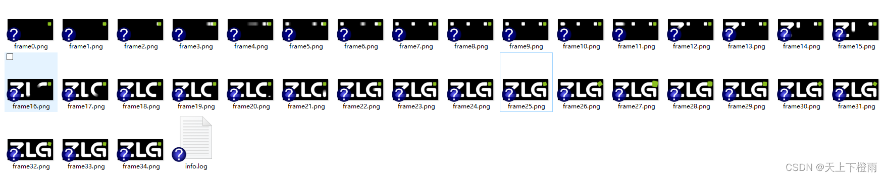

## 1 前言

本文基于 AWTK 提供的自定义控件 video image 编写，该控件主要用来解决嵌入式开发板上 JPG、PNG、GIF文件解析慢且内存需求量高的问题。

> 备注：
>   1. AWTK 是  [ZLG](http://www.zlg.cn/) 基于C语言开发的开源 GUI 引擎，[前往官网](https://www.zlg.cn/index/pub/awtk.html)，[Github仓库](http://github.com/zlgopen/awtk)。
>   2. awtk-widget-video-image 是 AWTK 官方提供的自定义控件，[Gitee仓库](https://gitee.com/awtk/awtk-widget-video-image)。

## 2 video image 控件

在一般的嵌入式板子上面，解析 JPG、PNG、GIF文件速度是很慢的，尤其是在播放高分辨率的序列帧的时尤为明显，为了解决该问题，AWTK 提供了 video image 控件。

video_image 控件是采用帧间差异的图像算法，把序列帧压缩为一个自定义的视频文件，这种方法的逻辑实际上就是空间换时间的策略，虽然整体视频文件的大小会比 JPG 文件（PNG 文件）要大，但是会比位图文件小很多。

**控件原理：**

1. 先将一系列JPG/PNG格式的序列帧图片解析成位图。
2. 采用帧间差异算法计算并保存每一帧之间的脏矩形区域和数据。
3. 将这些差异数据压缩为一个自定义的视频文件。
4. 采用 lz4 算法（一个第三方库）再次对视频文件进行压缩，进一步缩小资源。
5. 在程序运行时候先用 lz4 算法解压视频文件，然后将帧间差异解析出来，组合成位图，一帧帧播放。

## 3 为什么需要将GIF拆解成序列帧？

在 AWTK 中，显示 gif 图片的过程时会先将 gif 文件解析成一帧帧的位图，再将它们拼接起来加载到内存中，比如一个分辨率为 480 X 480 的 gif 图片，其中包含 120 帧图像，需要将其解析为 16 位色的 bitmap 显示到 LCD 上，那么就至少需要 480 X 480 X 120 X 2 大小的内存，约为 52.7 M。

这么大的内存需求量，一般的嵌入式开发板显然是无法提供的，这个时候就可以借助 git_to_video_gen 工具将 git 图片转成一张张的位图序列帧，然后再使用 diff_image_to_video_gen 工具压缩成 video_image 控件使用的视频文件。

> 备注：git_to_video_gen 工具可以在 window 和 linux 上面运行。

git_to_video_gen 工具的用法：git_to_video_gen.exe [空格] image_name [空格] save_file_path

| 参数           | 说明                 | 备注 |
| -------------- | -------------------- | ---- |
| image_name     | gif文件路径          |      |
| save_file_path | 序列帧文件的保存路径 |      |

git_to_video_gen 工具默认将 gif 图片转成一系列 RGBA8888 格式的 png 图片帧，并且会在图片帧目录下生成 info.log 文件，该文件用于存放 gif 的相关信息，比如：

```bash
image_name_format=frame%d
delays=30
```

其中参数的含义如下：

| 参数              | 说明               | 备注                                          |
| ----------------- | ------------------ | --------------------------------------------- |
| image_name_format | 序列帧的文件名格式 | git_to_video_gen工具生成的序列帧默认为frame%d |
| delays            | gif的帧间延迟时间  | 每一帧的时间间隔，单位为毫秒                  |


本文主要是介绍 git_to_video_gen 工具的实现，即将 gif 文件拆解成序列帧。

## 4 将GIF拆解成序列帧

首先，我们先编写 git_to_video_gen 工具的 main 函数：

```cpp
/* 该工具仅在 Linux 平台和 Windows 平台使用 */
#if defined(LINUX) || defined(WIN32)
#include "tkc/fs.h"
#include "tkc/mem.h"
#include "tkc/path.h"
#include "tkc/utils.h"
#include "base/bitmap.h"
#include "base/types_def.h"
#include "image_loader/image_loader_stb.h"
#include <iostream>
using namespace std;

/* 导入stb_image_write库，用于后续将序列帧保存到本地硬盘 */
#define STB_IMAGE_WRITE_IMPLEMENTATION
#include "../3rd/stb/stb_image_write.h"

#define GIF_INFO_FILE_NAME "info.log"    /* 保存序列帧的相关信息，比如文件名格式、帧间延迟时间， */
#define FRAME_FILE_NAME_FORMAT "frame%d" /* 序列帧文件名格式 */
#define FRAME_FILE_NAME_MAX_LEN 16       /* 序列帧文件名最大长度 */

/**
 * 注意：本工具默认将 GIF 图片解析为RGBA8888格式的位图序列帧，再将它们保存为 png 格式的文件 
 */

......

int main(int argc, char** argv) {
  bitmap_t image;
  const char* image_name = NULL;
  const char* save_file_path = NULL;
  memset(&image, 0x00, sizeof(bitmap_t));

  /* 用户需传入两个参数：gif文件路径、序列帧文件的保存路径 */
  if (argc < 3) {
    cout << "argvs: image_name, save_file_path" << endl;
    return -1;
  }

  image_name = argv[1];
  save_file_path = argv[2];

  /* 将GIF文件解析并拼接成包含所有帧的位图 */
  if (!get_bitmap(image_name, &image)) {
    cout << "get bitmap failed!" << endl;
    return -1;
  }
  
  if (image.is_gif) {
    /* 将包含所有帧的位图拆解成序列帧并保存到本地硬盘 */
    if (save_git_frame(&image, save_file_path)) {
      char buff[MAX_PATH] = {0};
      char info_path[MAX_PATH] = {0};
      tk_snprintf(buff, sizeof(buff), "image_name_format=%s\ndelays=%d\n", FRAME_FILE_NAME_FORMAT,
                  *image.gif_delays);
      path_build(info_path, sizeof(info_path), save_file_path, GIF_INFO_FILE_NAME, NULL);
      file_write(info_path, buff, tk_strlen(buff));
    }
  } else {
    cout << "image is not a gif!" << endl;
  }
  /* 销毁位图 */
  bitmap_destroy(&image);

  return 0;
}

#endif
```

### 4.1 先将GIF解析拼接成位图

这里我们首先借助 AWTK 中的 stb_image 库将 gif 文件解析并拼接成一幅包含所有帧的位图，代码如下：

```cpp
static bool get_bitmap(const char* image_name, bitmap_t* image) {
  ret_t ret = RET_FAIL;
  uint8_t* buff = NULL;
  uint32_t buff_length = 0;
  /* 确保GIF文件存在 */
  if (!file_exist(image_name)) {
    return false;
  }
  /* 读取GIF文件的数据 */
  buff = (uint8_t*)file_read(image_name, &buff_length);
  if (buff != NULL) {
    /* 调用stb_image库中的函数将GIF解析成位图 */
    ret = stb_load_image(ASSET_TYPE_IMAGE_GIF, buff, buff_length, image, false, false, false,
                         LCD_ORIENTATION_0);
    TKMEM_FREE(buff);
  }

  return ret == RET_OK;
}
```

### 4.2 将位图拆解为序列帧

得到包含GIF文件所有帧的位图对象后，再将这个位图拆解成一帧一帧的数据保存到本地硬盘即可，代码如下：

```cpp
static bool save_git_frame(bitmap_t* image, const char* save_file_path) {
  fs_t* fs = os_fs();
  ret_t ret = RET_OK;
  int x = image->w;
  int y = image->gif_frame_h;
  int stride_bytes = image->line_length;
  char file_path[MAX_PATH];
  char file_name[FRAME_FILE_NAME_MAX_LEN];
  /* 确保存放序列帧文件的目标路径存在 */
  if (!fs_dir_exist(fs, save_file_path)) {
    ret = fs_create_dir_r(fs, save_file_path);
  }

  if (ret == RET_OK) {
    /* 获取位图数据 */
    uint8_t* image_data = bitmap_lock_buffer_for_read(image);
    /* 循环遍历每一帧位图数据 */
    for (int i = 0; i < image->gif_frames_nr; i++) {
      int32_t len = 0;
      uint8_t* png_data = NULL;
      uint8_t* bmp_data = image_data + (stride_bytes * y * i);
      memset(file_path, 0x00, sizeof(file_path));
      memset(file_name, 0x00, sizeof(file_name));
  
      tk_snprintf(file_name, sizeof(file_name), FRAME_FILE_NAME_FORMAT ".png", i);
      path_build(file_path, sizeof(file_path), save_file_path, file_name, NULL);
      /* 调用stb_image_write库中的接口将每帧位图数据写入本地硬盘（保存为png文件）  */
      png_data = stbi_write_png_to_mem(bmp_data, stride_bytes, x, y, 4, &len);
      if (png_data != NULL) {
        file_write(file_path, png_data, len);
        STBIW_FREE(png_data);
      }
    }
    bitmap_unlock_buffer(image);
  }

  return ret == RET_OK;
}
```

### 4.3 示例效果

比如这里我将 `awtk-widget-video-image/design/default/images/video/gif_35.gif` 文件拆解成序列帧，命令如下：


```bash
.\bin\gif_to_frame_gen.exe design\default\images\video\gif_35.gif design\default\images\video\gif_35
```

即可得到 `design\default\images\video\gif_35`目录，其中存放着 `gif_35.gif` 文件生成的序列帧，如下图所示：


