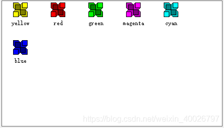
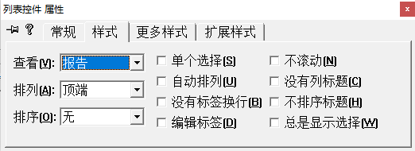
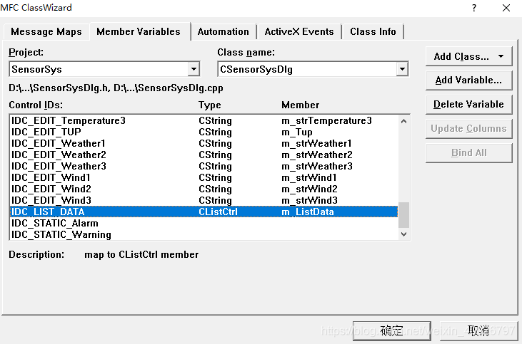

## 1 添加ListCtrl控件



## 2 设置列表样式

属性中View（样式）设置为Report（报告）:



## 3 列表关联变量

类向导为列表控件关联变量：



## 4 初始化列表

在列表控件所在的对话框类里的 `OnInitDialog()` 函数中初始化表头：

```cpp
//列表初始化
m_ListData.SetExtendedStyle(LVS_EX_GRIDLINES | LVS_EX_FULLROWSELECT);/添加网格线和整行选中属性
//插入表头
m_ListData.InsertColumn(0,_T("日期"),LVCFMT_CENTER);
m_ListData.InsertColumn(1,_T("星期"),LVCFMT_CENTER);
m_ListData.InsertColumn(2,_T("时间"),LVCFMT_CENTER);
m_ListData.InsertColumn(3,_T("温度(℃)"),LVCFMT_CENTER);
m_ListData.InsertColumn(4,_T("湿度(%RH)"),LVCFMT_CENTER);
m_ListData.InsertColumn(5,_T("光照强度(lx)"),LVCFMT_CENTER);
m_ListData.InsertColumn(6,_T("CO2浓度(ppm)"),LVCFMT_CENTER);
m_ListData.InsertColumn(7,_T("备注"),LVCFMT_CENTER);
//设置列宽
m_ListData.SetColumnWidth(0,80);
m_ListData.SetColumnWidth(1,50);
m_ListData.SetColumnWidth(2,80);
m_ListData.SetColumnWidth(3,75);
m_ListData.SetColumnWidth(4,80);
m_ListData.SetColumnWidth(5,85);
m_ListData.SetColumnWidth(6,85);
m_ListData.SetColumnWidth(7,80);
```

> 注意：ListView控件第一列无法居中，如果需要第一列居中，则讲第一列宽度设为0，从第二开始使用。

## 5 插入数据

```cpp
m_ListData.InsertItem(0, "你要插入的数据");//创建一行并将“数据”写入第一列
m_ListData.SetItemText(0, 1, "你要插入的数据");//将“数据”写入第二列，以此类推
m_ListData.SetItemText(0, 2, "你要插入的数据");
m_ListData.SetItemText(0, 3, "你要插入的数据");
m_ListData.SetItemText(0, 4, "你要插入的数据");
m_ListData.SetItemText(0, 5, "你要插入的数据");
m_ListData.SetItemText(0, 6, "你要插入的数据");
m_ListData.SetItemText(0, 7, "你要插入的数据");
m_ListData.SetItemText(0, 8, "你要插入的数据");
```

## 6 删除选中行（可多行）

```cpp
//删除选中行（可多行）
int nItem;
POSITION pos;
while (pos = m_ListData.GetFirstSelectedItemPosition())
{ 
	nItem = -1;
	nItem = m_ListData.GetNextSelectedItem(pos);
	if (nItem >= 0 && m_ListData.GetSelectedCount() > 0)
	{
		m_ListData.DeleteItem(nItem);
	}
}
```

## 7 获取与取消选中行

```cpp
int i=m_ListData.GetSelectionMark();//获得选中行的行标
m_ListData.SetSelectionMark(-1);    //取消选中行
```
