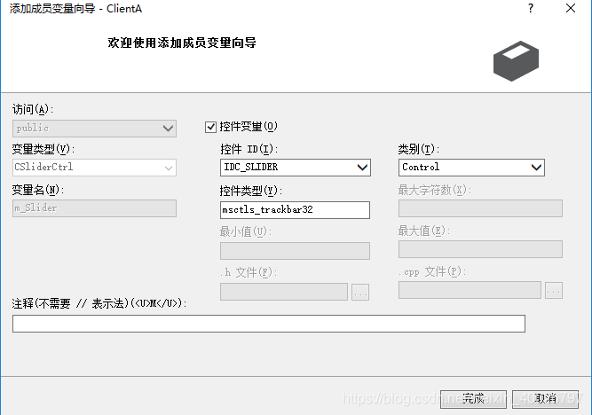
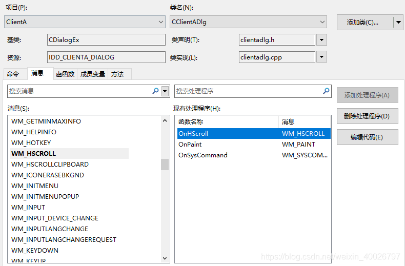

## 1 前言

滑动控件是MFC中常用的控件之一。它由一个滑动条，一个滑块和可选刻度组成，用户可以通过移动滑块在相应的控件中显示对应的值。通常，在滑动控件附近一定有标签控件或编辑框控件，用于显示相应的值。接下来我们看看简单的用法。

## 2 添加slider控件

在对话框添加一个slider滑动块控件，然后给该slider滑动块控件添加一个关联变量m_Slider，如下图所示：



## 3 初始化slider控件

初始化滑块，在对话框初始化程序里面，添加如下代码：

```cpp
m_Slider.SetRange(0,20);//设置范围为0~20
m_Slider.SetPos(-1);    //设置当前值为-1
m_Slider.SetLineSize(1);//设置按下左/右箭头移动量为1个单位
m_Slider.SetTicFreq(1); //设置滑动条刻度的频度
```

## 4 将slider值显示到edit

将滑块数据显示到编辑框中，在【项目】-【类向导】-【消息】页面，找到消息事件函数`WM_HSCROLL`，双击出现在右边方框，再次双击右边方框 `OnHScroll` 函数，



在弹出的消息事件函数里面，添加如下代码：

```cpp
void CClientADlg::OnHScroll(UINT nSBCode, UINT nPos, CScrollBar* pScrollBar)
{
	// TODO: 在此添加消息处理程序代码和/或调用默认值
	UpdateData(TRUE);
	m_Speed = m_Slider.GetPos();//获得滑动块当前位置
	UpdateData(FALSE);
	CDialogEx::OnHScroll(nSBCode, nPos, pScrollBar);
}
```

其中m_Speed是编辑框的对应的double变量，整个使用过程完毕。

## 5 slide 控件常用函数

### 5.1 GetRange,SetRange函数

用于查询和设置滑动条的取值范围，默认为0~100。函数定义形式如下： 

```cpp
void GetRange(int &nMin,int &nMax) const; 
void SetRange(int nMin,int nMax,BOOL bRedrGETaw=FALSE);
```

### 5.2 GetPos,SetPos函数

用于查询和设置滑动条的当前值。函数定义形式如下： 

```cpp
int GetPos() const; 
int SetPos(int nPos);
```

### 5.3 GetLineSize,SetLineSize函数

用于查询和设置在按一下右或左箭头时滑块的移动量，默认为1个单位。函数定义形式如下：

```cpp
int GetLineSize() const; 
int SetLineSize(int nSize);
```

### 5.4 GetPageSize,SetPageSize函数

用于查询和设置函滑块和块移动量，块移动量是指当按下PgUp或PgDown时滑块的移动量。函数定义形式如下： 

```cpp
int GetPageSize() const; 
int SetPageSize(int nSize);
```

### 5.5 SetTicFreq函数

用于设置滑动条刻度的频度。默认为一个单位一个函数。函数定义形式如下：

```cpp
void SetTicFreq(int nFreq);
```

### 5.6 SetTic函数

用于在指定的位置设置刻度。Windows默认的刻度是均匀的。函数定义形式如下：

```cpp
BOOL SetTic(int nTic);
```

### 5.7 ClearTics函数

用于清除所有的刻度。函数定义形式如下：

```cpp
void ClearTics(BOOL bRedraw=FALSE);
```

我们在初始化时写入以下语句，即设置范围为-100到100，刻度为每10个单位一个：

```cpp
m_Slider.SetRange(-100,100); 
m_Slider.SetTicFreq(10); 
```
