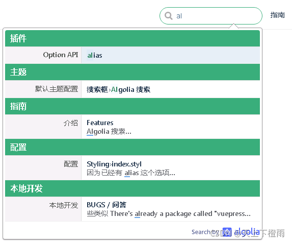
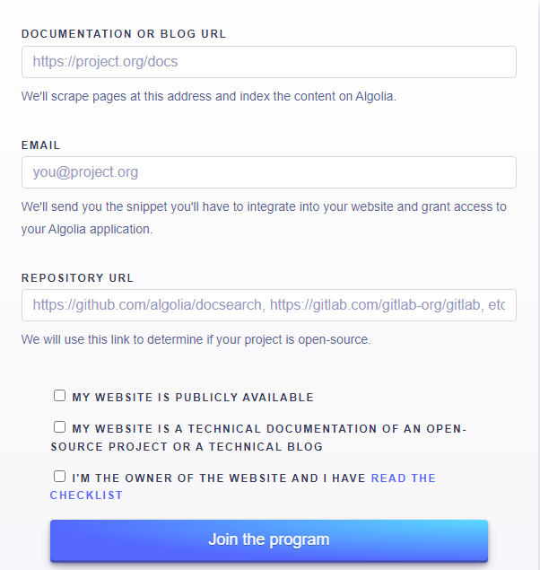
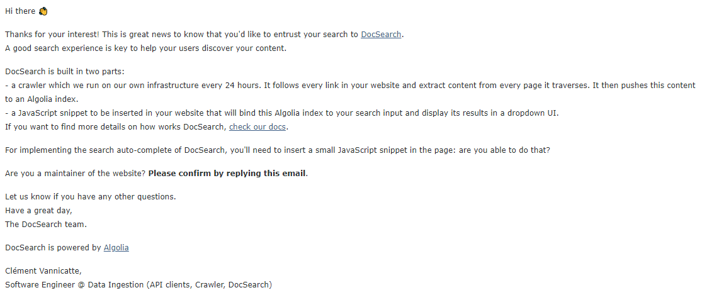
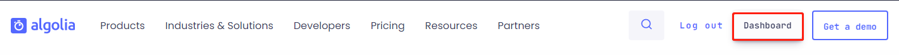
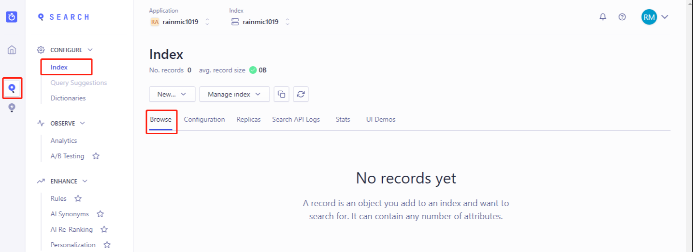
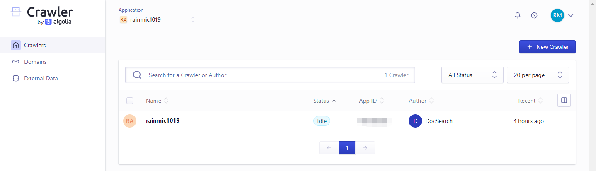
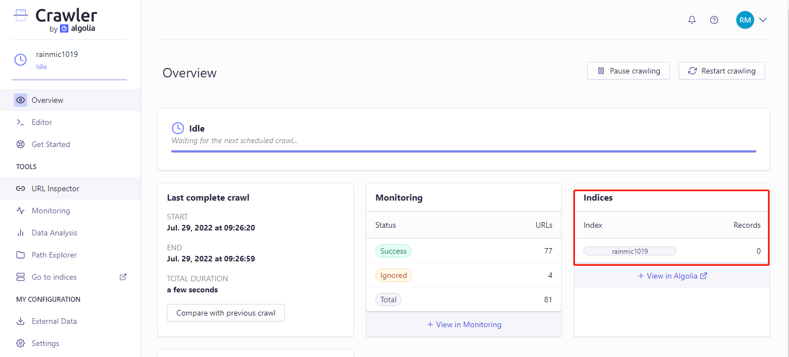
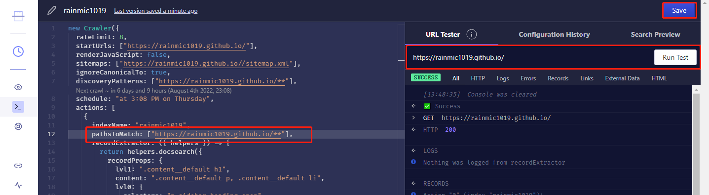
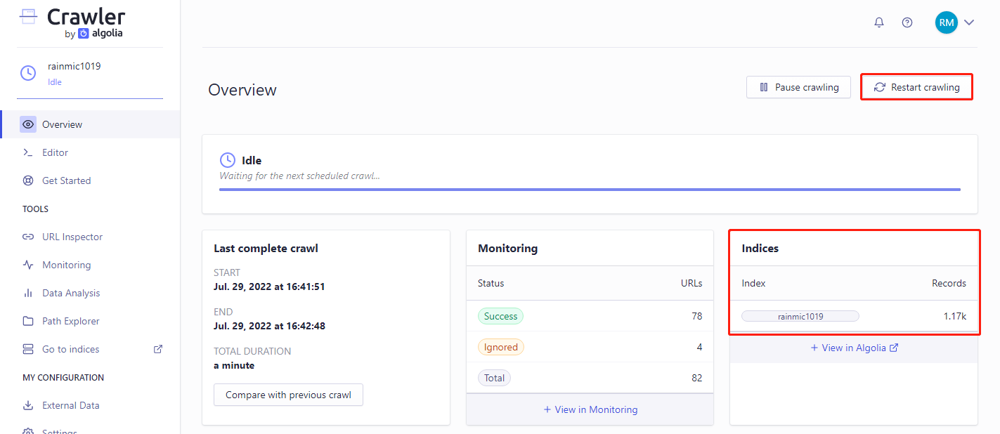
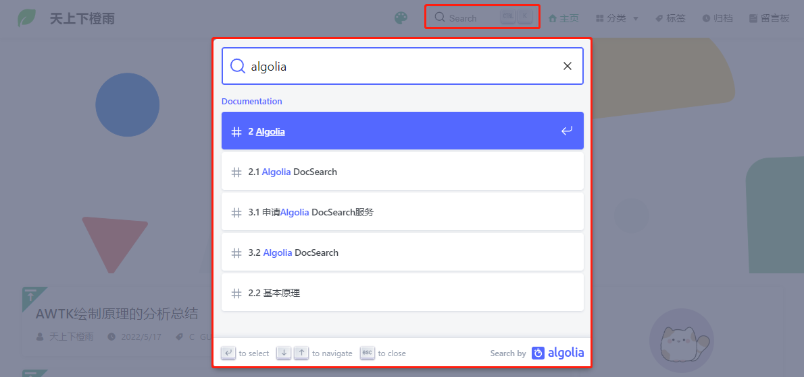

## 1 前言

目前，我的 [个人网站](https://liuyuxin.site/) 是基于 [VuePress](https://www.vuepress.cn/) 搭建的，其中 VuePress 内置的搜索只会提取文档的标题（h1、h2、h3）构建搜索索引，我个人觉得不太好用，因此想借助第三方提供的免费搜索服务 Algolia DocSearch 来实现个人网站的全文搜索。

## 2 Algolia

[Algolia](https://www.algolia.com/) 是一个数据库实时搜索服务，能够提供毫秒级的数据库搜索服务，并且其服务能以 API 的形式方便地布局到网页、客户端、APP 等多种场景。

VuePress 的官方文档就是使用的 Algolia 搜索，使用 Algolia 搜索最大的好处就是方便，它会自动爬取网站的页面内容并构建索引，你只用申请一个 Algolia 服务，在网站上添加一些代码，就像添加统计代码一样，然后就可以实现一个全文搜索功能。



### 2.1 Algolia DocSearch

[Algolia DocSearch](https://www.algolia.com/developers/code-exchange/frontend-tools/docsearch/) 是 Algolia 提供的自动化的全文搜索服务，DocSearch 会定时爬取指定网站（通常就是我们的文档网站）上的内容，自动构建搜索索引，不需要繁琐的配置，操作简单，用户只需要用相关的 API 直接调用就行了。

### 2.2 基本原理

Algolia 服务器会 **定期抓取** 我们指定的 **文档地址** 中的内容进行分析并 **建立索引**，这样在网站搜索框中输入关键词后，前端会调用 Algolia DocSearch 的接口并显示搜索结果。这些请求、结果显示的相关逻辑都封装好了，我们要做的就是按要求插入代码、配置好网站样式以及搜索框。

> 备注：根据 Algolia DocSearch 的官方文档，默认情况下它通常一周爬取一次网站内容，用户也可自行触发爬取，详见：[DocSearch 的快速描述](https://docsearch.algolia.com/docs/what-is-docsearch)。

### 2.3 使用要求

Algolia DocSearch 提供的免费服务是需要申请的，当我们的网站满足下列条件时，Algolia 那边的工作人员才会让我们的申请通过：

1. 我们必须是云文档网站的 **所有者**，网站必须是 **公开的**。
2. 网站内容必须是 **开源项目的技术文档** 或 **技术博客**。
3. 网站申请服务时必须有 **完整稳定的设计和内容**，即确认网站做好生产准备。

## 3 实现全文搜索

### 3.1 申请Algolia DocSearch服务

前往 [Algolia DocSearch Apply](https://docsearch.algolia.com/apply/) 网站，填写网站地址、邮箱、仓库地址等信息，然后提交申请。

> 备注：这里填写的网站地址必须是公开的、且设计完整、内容稳定。如果网站还处于测试阶段，申请通过的概率很小。



### 3.2 回复确认邮件

申请通过后，Algolia DocSearch 官方会发送确认邮件到上一个步骤中填写的邮箱，收到后需要回复一下这个网站是我们负责开发维护的，并且可以修改网站代码。



回复邮件内容：

```bash
Thanks!

I am the maintatiner of the website, I can modify the code.
```

### 3.3 启动搜索服务

通过确认后，Algolia DocSearch 会再发一封使用邮件，其中包含 **appId、apiKey 和 indexName**，用于在网站生成框架中配置使用，例如在 VuePress 中配置如下，其他框架类似：

```js
module.exports = {
    themeConfig: {
        algolia: {
            appId: '请看邮件',
            apiKey: '请看邮件',
            indexName: '请看邮件'
        }
    }
}
```

并且该邮件还会提供接受邀请的链接，前往该链接重新设置密码后（账号是申请时填的邮箱），即可登录 [Algolia](https://www.algolia.com/)。

## 4 后台管理数据

申请 Algolia DocSearch 成功后，我们也可以前往 [Algolia](https://www.algolia.com/) 管理自己的后台数据。步骤如下：

**步骤一**：登录账号后，点击右上角的 "Dashboard" 按钮前往后台。



**步骤二**：点击左侧列表里的"Search"，可以查看对应的 "indexName" 数据，如果 "Browse" 里面没有显示数据，那么说明 DocSearch 的爬虫有点问题，导致没有生成对应的 Records：



**步骤三**：前往 [Algolia 的爬虫后台](https://crawler.algolia.com/admin/)，同样需要登录。在首页进入我们需要修改的爬虫，可以看到右侧的 Records 数据为 0 条，很明显爬虫有问题：





**步骤四**：点击左侧菜单中的"Editor"查看并编辑爬虫代码，注意看代码中的 `pathsToMatch` 路径，很明显是不对的，后面多了个 `docs`，将它改成正确的网站路径 `https://rainmic1019.github.io/**`：

修改前：

```js
new Crawler({
  actions: [{
      ...
      pathsToMatch: ["https://rainmic1019.github.io/docs/**"],
      ...
    }],
  ...
});
```

修改后：

```js
new Crawler({
  actions: [{
      ...
      pathsToMatch: ["https://rainmic1019.github.io/**"],
      ...
    }],
  ...
});
```

**步骤五**：修改完成后，进行测试，如果能成功提取到数据则表示没问题，点击右上角的"Save"按钮保存代码：



**步骤六**：切换回"Overview"，点击右上角的 "Restart crawling" 重新爬取数据即可。



## 5 添加CSS和JavaScript

如果使用的是 VuePress 的默认主题，那么按照 VuePress 官方文档中的方法直接配置好 appId、apiKey 和 indexName 就可以了。但在其他主题中，比如 `vuepress-theme-rec`，它是自己实现的搜索框，所以按 VuePress 官方文档进行配置是没有效果的，此时就需要按照 Algolia 发给我们的邮件里的方法，给网站添加 CSS 和 JavaScript，然后在加载完毕的时候调用提供的 API。

### 5.1 修改config.js

`.vuepress/config.js` 是 VuePress 中最重要的文件，它是 VuePress 项目的配置文件入口，导出一个 JavaScript 对象，其中设置 `head` 属性可以指定额外需要被注入到当前页面的 HTML `<head>` 中的标签，每个标签都可以以 `[tagName, { attrName: attrValue }, innerHTML?]` 的格式指定，比如这里我们把 Algolia 邮件中指定的 HTML 标记添加进去：


```js
module.exports = {
    head: [
        ......
        /* 添加 Algolia 搜索框的 CSS 和 JavaScript 文件*/
        ['link', { href: "https://cdn.jsdelivr.net/npm/@docsearch/css@3", rel: "stylesheet" }],
        ['script', { src: "https://cdn.jsdelivr.net/npm/@docsearch/js@3" }],
    ]
}
```

### 5.2 修改enhanceApp.js

`.vuepress/enhanceApp.js` 文件是 VuePress 中仅次于 `config.js` 的第二重要的文件，我们可以通过修改该文件来对 VuePress 应用进行拓展配置。这个文件应当 `export default` 一个钩子函数，并接受一个包含了一些应用级别属性的对象作为参数。我们可以使用这个钩子来安装一些附加的 Vue 插件、注册全局组件，或者增加额外的路由钩子等，比如这里我们把 Algolia 邮件中的代码添加进去：

```js
export default ({
    Vue,      /* VuePress 正在使用的 Vue 构造函数*/
    options,  /* 附加到根实例的一些选项 */
    router,   /* 当前应用的路由实例 */
    siteData  /* 站点元数据 */
}) => {
    /* 应用级别的拓展优化 */
    Vue.mixin({
        mounted() {
            setTimeout(() => {  /* 添加 setTimeout 避免报错（该报错不影响效果） */
                try {
                    docsearch({  /* 添加 Algolia DocSearch 提供的代码 */
                        appId: "请看邮件",
                        apiKey: "请看邮件",
                        indexName: "请看邮件",
                        container: '.search-box',
                        debug: false
                    });
                } catch (e) {
                    console.log(e);
                }
            }, 100)
        },
    });
};
```

> 注意：其中的 `container`，参考 docsearch 的 [官方仓库](https://github.com/algolia/docsearch)，这里提供的不是 input 输入框的选择器，而是一个挂载节点，比如 div 的选择器。

## 6 修改搜索框样式

VuePress 提供了一种添加额外样式的简便方法。我们可以创建一个 `.vuepress/styles/index.styl` 文件。这是一个 [Stylus](https://stylus-lang.com/) 文件，但也可以使用正常的 CSS 语法。

此处我们通过该文件来设置一下 Algolia 搜索框的样式：

```css
.search-box .DocSearch.DocSearch-Button {
    cursor: text;
    width: 10rem;
    height: 2rem;
    color: #5b5b5b;
    border: 1px solid var(--border-color);
    border-radius: 0.25rem;
    font-size: 0.9rem;
    padding: 0 0.5rem 0 0rem;
    outline: none;
    transition: all 0.2s ease;
    background: transparent;
    background-size: 1rem;
}

.search-box .DocSearch-Button-Container {
    margin-left: 0.4rem;
}

.search-box .DocSearch-Button .DocSearch-Search-Icon {
    width: 16px;
    height: 16px;
    position: relative;
    top: 0.1rem;
}

.search-box .DocSearch-Button-Placeholder {
    font-size: 0.8rem;
}

.search-box .DocSearch-Button-Keys {
    display: flex;
    position: absolute;
    right: 0.1rem;
}

.search-box .DocSearch-Button-Key {
    font-size: 12px;
    line-height: 20px;
}
```

最终显示的效果如下图所示：



## 7 总结

Algolia DocSearch 可以说真的跟官网描述一样，算是目前构建可在线搜索文档的最简单的方式之一了。我们只需要关注文档本身，进行少量的配置，其它的 Algolia 全包了。另外，Algolia 还有一些其它优秀产品及服务，感兴趣的也可以前往官网自行探索。

本文以自己的 [个人网站](https://liuyuxin.site/) 为例，但 Algolia DocSearch 适合很多类型的网站，更方便的是许多网站构建器本身就内置了对 Algolia 的支持，比如 Hexo、 VuePress、Docusaurus 等等。
