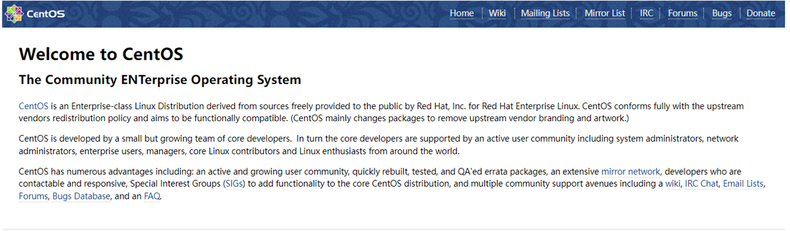
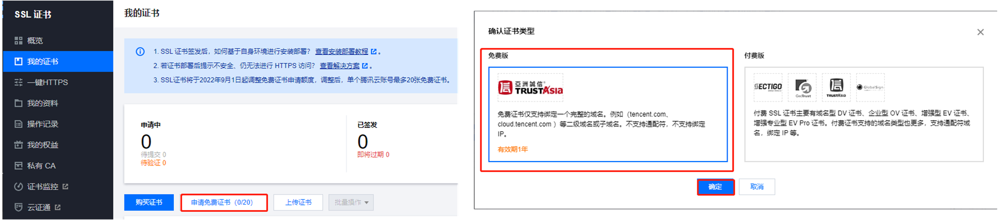
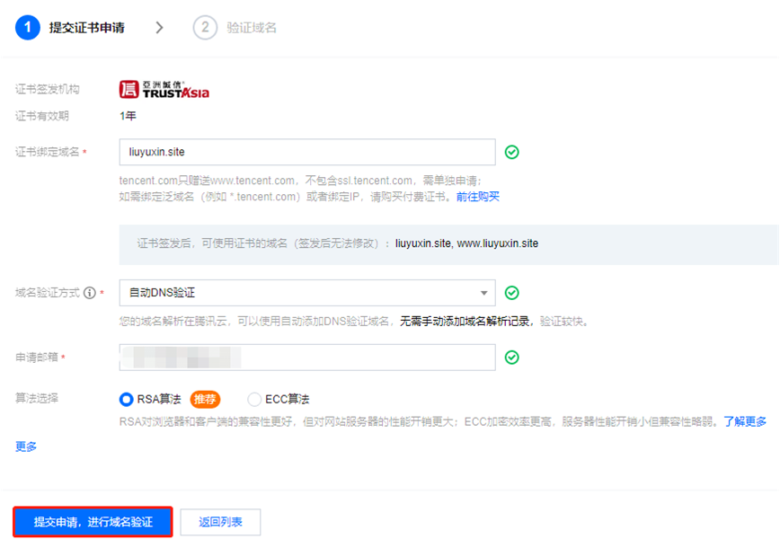
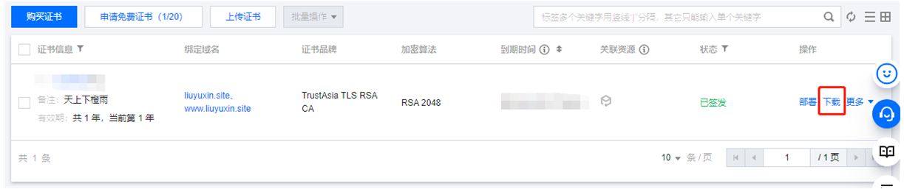
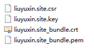

## 1 前言

之前文章 [建站过程中的踩坑记录：自定义域名、百度收录与备案](./notes_of_personal_website.md) 中提到，我将会把个人网站从 GitHub Pages 迁移到腾讯云服务器，本文就针对这个过程做个笔记。

> 备注：我的个人网站是使用 [VuePress](https://www.vuepress.cn/) 生成的静态网页。

## 2 安装 Nginx

在安装 Nginx 之前，先看看 yum 的源，执行以下命令：

```bash
cat /etc/yum.repos.d/CentOS-Base.repo
```

输出结果如下：

```ini
[extras]
gpgcheck=1
gpgkey=http://mirrors.tencentyun.com/centos/RPM-GPG-KEY-CentOS-7
enabled=1
baseurl=http://mirrors.tencentyun.com/centos/$releasever/extras/$basearch/
name=Qcloud centos extras - $basearch
[os]
gpgcheck=1
gpgkey=http://mirrors.tencentyun.com/centos/RPM-GPG-KEY-CentOS-7
enabled=1
baseurl=http://mirrors.tencentyun.com/centos/$releasever/os/$basearch/
name=Qcloud centos os - $basearch
[updates]
gpgcheck=1
gpgkey=http://mirrors.tencentyun.com/centos/RPM-GPG-KEY-CentOS-7
enabled=1
baseurl=http://mirrors.tencentyun.com/centos/$releasever/updates/$basearch/
name=Qcloud centos updates - $basearch
```

可以看到由于我买的是腾讯云服务器，所以yum源默认为腾讯源，国内的源比较快，就不用修改了。

> 备注：如果源不是国内的话，就自己改一下吧，注意改之前先备份，避免出问题。

接下来执行以下命令安装 Nginx：

```bash
yum install nginx
```

## 3 启动 Nginx

安装好后，我们先启动 Nginx 看看效果，命令如下：

```bash
nginx
```

可以执行以下命令在应用程序中看看 Nginx 有没有启动成功：

```bash
top -d 1
```

接下来我们直接访问一下服务器的公网 ip 看看，比如我这里的是：119.29.8.163，可以看到以下界面，表示 Nginx 服务器启动成功：



## 4 配置 Nginx

启动 Nginx 之后会显示默认网站，如果想要它显示指定的静态网站，需要手动配置。

1. 首先，我们先把静态网站上传到服务器，比如此处我将静态的 HTML 文件放在 `/opt/site` 目录中。

2. 进入 Nginx 安装目录：

```bash
cd /etc/nginx
```

3. 编辑 `nginx.conf` 文件和 `nginx.conf.default` 文件，将 `http.server.location /` 的 `root` 指向云服务器中的静态网站文件夹，此处为 `/opt/site`：

```bash
http {
    server {
        location / {
            root   /opt/site;            # 静态html文件存放目录
            index  index.html index.htm; # 默认首页
        }
    }
}
```

4. 配置好后，重启 Nginx

```bash
nginx -s reload
```

重启完成后，刷新 119.29.8.163 页面应该就能看到部署的网站了。

## 5 配置 HTTPS 服务

### 5.1 申请 SSL 证书

我用的是腾讯云服务器，所以可以直接在腾讯云中申请的 SSL 证书，打开腾讯云控制台的 [SSL 证书页面](https://console.cloud.tencent.com/ssl)，申请免费证书：

注意：

- 免费证书有效期是一年，一年后手动重新申请即可；
- 申请 SSL 证书的域名需要备案。



填写好资料后，提交申请即可：



### 5.2 下载 SSL 证书

申请通过后，可以在腾讯云控制台的 [SSL 证书页面](https://console.cloud.tencent.com/ssl) 找到对应的证书并下载（注意：下载 Nginx 类型的证书）：



下载完成后，得到 liuyuxin.site_nginx.zip 压缩包，解压后目录结构如下：



### 5.3 使用 SSL 证书

首先，我们现在腾讯云控制台的 [DNS 解析 DNSPod 页面](https://console.cloud.tencent.com/cns)，将域名解析到云服务器 IP，这样通过域名就可以访问个人网站了。

接着开始配置 SSL 证书，需要上传到 Nginx 服务器的文件如下：

| 文件                     | 说明     |
| ------------------------ | -------- |
| liuyuxin.site_bundle.crt | 证书文件 |
| liuyuxin.site.key        | 私钥文件 |

将这两个文件放到云服务器的 Nginx 安装目录（`/etc/nginx`）中的 `ssl` 文件夹中，这个路径可自定义，后续可以在配置文件中指定。

编辑 `/etc/nginx/nginx.conf` 文件，开启 HTTPS 默认端口 443：

```bash
http {
    server {
        # SSL 默认访问端口号为 443
        listen 443 ssl; 
        # 配置绑定证书的域名
        server_name liuyuxin.site; 
        # 配置证书文件的相对路径或绝对路径
        ssl_certificate "/etc/nginx/ssl/liuyuxin.site_bundle.crt";
        # 配置私钥文件的相对路径或绝对路径
        ssl_certificate_key "/etc/nginx/ssl/liuyuxin.site.key"; 
        ssl_session_timeout 5m;
        # 配置协议
        ssl_protocols TLSv1.2 TLSv1.3; 
        # 配置加密套件，写法遵循 openssl 标准
        ssl_ciphers ECDHE-RSA-AES128-GCM-SHA256:HIGH:!aNULL:!MD5:!RC4:!DHE; 
        ssl_prefer_server_ciphers on;
        location / {
            # 网站主页路径
            root   /opt/site;
            index  index.html index.htm;
        }
    }
}
```

配置好后，执行以下命令验证配置文件问题，返回 ok 则表示配置文件可正常运行：

```bash
nginx -t
```

重启 Nginx 服务：

```bash
nginx -s reload
```

此时，我们可以通过 HTTPS 协议访问网页了：https://liuyuxin.site/

### 5.4 HTTP 自动跳转 HTTPS

为保证数据安全，我这里将 HTTP 请求自动重定向到了 HTTPS，编辑 `/etc/nginx/nginx.conf` 文件，新增重定向配置：

```bash
http {
    server {
        # SSL 默认访问端口号为 443
        listen 443 ssl; 
        # 配置绑定证书的域名
        server_name liuyuxin.site; 
        # 配置证书文件的相对路径或绝对路径
        ssl_certificate "/etc/nginx/ssl/liuyuxin.site_bundle.crt";
        # 配置私钥文件的相对路径或绝对路径
        ssl_certificate_key "/etc/nginx/ssl/liuyuxin.site.key"; 
        ssl_session_timeout 5m;
        # 配置协议
        ssl_protocols TLSv1.2 TLSv1.3; 
        # 配置加密套件，写法遵循 openssl 标准
        ssl_ciphers ECDHE-RSA-AES128-GCM-SHA256:HIGH:!aNULL:!MD5:!RC4:!DHE; 
        ssl_prefer_server_ciphers on;
        location / {
            # 网站主页路径
            root   /opt/site;
            index  index.html index.htm;
        }
    }
    server {
        listen 80;
        # 配置绑定证书的域名
        server_name liuyuxin.site; 
        # 把 http 的域名请求转成 https
        return 301 https://$host$request_uri; 
    }
}
```

配置好后，执行以下命令验证配置文件，并重启 Nginx 服务：

```bash
nginx -t
nginx -s reload
```

## 6 自动部署

由于手动更新云服务器上的静态网站文件比较麻烦，因此这里我写了一个 shell 脚本自动部署网站，其原理很简单，就是通过 ssh 把 Vuepress 编译生成的静态网页上传到云服务器的指定目录，代码如下：

```bash
# 确保脚本抛出遇到的错误
set -e

# 生成静态网站
npm run docs:build
echo "==================== build html done ===================="

# 清除服务器上的静态网站
ssh root@119.29.8.163 "rm -rf /opt/site"
echo "==================== clear html done ===================="

# 将静态网站部署到服务器
scp -r ./site root@119.29.8.163:/opt
echo "==================== deploy html done ===================="
```

> 注意：该脚本会先清除服务器上原来的网站，再部署新的网站，因此需要输入两次密码。
