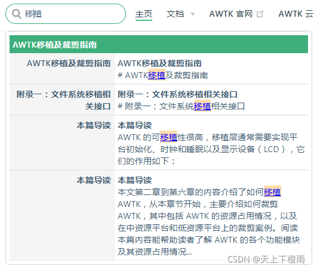

## 1 前言

近期想要将一些技术文档放到云上托管，因此去了解了一下各类静态网页生成器以及部分使用细节，对此做了一些记录，希望能帮助到大家，后续也会更新一些关于云文档搭建的文章。

## 2 网页生成器的选择

目前我们对云文档托管的需求如下：

1. 要将一些 Markdown 说明文档、帮助文档托管到云端，确定是用网页的方式展现，类似的可以参考：[Vue 云文档](https://cn.vuejs.org/v2/guide/)、[LVGL 云文档](https://docs.lvgl.io/master/index.html#)、[TouchGFX 云文档](https://support.touchgfx.com/zh-CN/docs/introduction/welcome)；
2. 网页需要有导航栏、搜索栏、侧边栏；
3. 主页与导航栏需要列处文档列表，即需要能够自定义主页和导航栏；
4. 搜索栏可以搜索文档标题也可以进行全局搜索；
5. 需要可以选择文档版本，可以考虑将版本列表放到导航栏。
6. 需要能将 Markdown 文档转为 PDF，方便下载浏览。

根据以上需求，我们筛选出了以下三个网页生成器，并分析它们的优缺点，确定基于什么框架实现。

### 2.1 VuePress

示例参考：[VuePress 云文档](https://vuepress.vue.js.org/zh/)。

VuePress 是一个极简静态网页生成器，简洁明了，新能高，以 Markdown 文档为中心，可使用 Vue 组件来实现扩展功能。

效果如图：


优缺点：

1. 环境配置简单，配置操作简单。
2. 提供默认主题，可自定义主题，从而更改网站主页与整体样式。
3. 支持导航栏、侧边栏、搜索栏，提供内置搜索引擎，但无法搜索全文。
4. 以 Markdown 为中心开发，内置 md 扩展功能与 Vue 扩展功能。
5. 支持全文搜索插件，并支持内置  Algolia DocSearch。
6. 支持内置多语言翻译。

运行环境：

1. Node.js >= 8.6。

### 2.2 Sphinx

示例参考：[LVGL 云文档](https://docs.lvgl.io/master/index.html#)

Sphinx 是一个功能强大的文档生成器，最初为生成 Python 文档而诞生，默认使用 reStructuresText（简称 rst）格式进行写作。

效果如图：


优缺点：

1. 具有丰富的输出格式，支持 HTML、LaTeX（用于打印 PDF 版本）、manual pages、纯文本等。
2. 具有完备的交叉引用，语义化标签，可以自动化链接函数、类、引文、术语及相似的片段信息。
4. 使用 rst 作为标记语言，可以享有 docutils 为其提供的分析、转换等多种工具，转换为 PDF 文档较为方便。
4. 自带的搜索框支持全文搜索，但搜索界面不太好用，且 Algolia DocSearch 不支持该生成器，生成网页后，需要手动嵌入 DocSearch 的代码。
5. 不支持 Markdown 文档，需要借助 Recommonmark 插件将 md 文档转为 rst 格式。
6. 不支持导航栏，需手动改写静态网页。
7. 环境配置相较于 VuePress 和 Docusaurus 来讲过于复杂，由于公司电脑无法使用 pip 安装依赖包，暂时无法测试。

运行环境：

1. python 2.4 或 python 3.1，以及 docutils 和 jinja2 库，sphinx 必须在 0.7 版本。
2. 如果需要源码支持高亮显示，则必须安装 pygments 库。
3. 如果使用 Python 2.4，还需要 uuid 库。

### 2.3 Docusaurus

示例参考：[TouchGFX 云文档](https://support.touchgfx.com/zh-CN/docs/introduction/welcome)

Docusaurus 与 VuePress 极为相似，环境配置以及功能都差不多，区别在于 Docusaurus  基于 React 构建，VuePress 基于 Vue 构建。

> 备注：如果想要基于 Python 构建的静态网页生成器，可以使用 MkDocs，其功能也是类似的。

效果如图：


运行环境：

1. Node.js >= 12.13.0。

> 备注：由于公司电脑安装了绿色版的 nodejs，版本为 10.15.3，因此暂未测试，但看了官方文档，操作基本与 VuePress 一致。

### 2.4 结论

结合本章节开始提出的需求，结论如下：

- VuePress 和 Docusaurus 可满足以上大部分需求，并且操作简单，可快速搭建云网站，但其难点在于 Markdown 转 PDF 怎么做。
- Sphinx 虽然提供 Markdown 转 PDF 的解决方案，但搭建环境比较复杂，Markdown 文档需根据转 rst 格式的要求进行额外配置，且 Sphinx 不提供导航栏、不支持 Algolia DocSearch，不支持主页设计，这些均需通过手写静态网站解决，比较麻烦。

此处选用 VuePress 作为网站生成器，拟采用下文中介绍 Pandoc+TeXLive 的方案实现 Markdown 转 PDF。

## 3 支持全文搜索

### 3.1 VuePress 自带插件

#### 3.1.1 fulltext-search

1. 安装插件（安装在生产环境）：

```bash
npm install -D vuepress-plugin-fulltext-search
```

2. 修改 vuepress 的配置文件：docs/.vuepress/config.js、

```js
module.exports = {
    // ...
    plugins: ['fulltext-search']
}
```

3. 配置搜索词高亮样式：

例如，命中文字高亮红色：

```css
.search-box .suggestion a .suggestion-row .suggestion-content .highlight
  color: red;
```

或者，命中文字高亮蓝色，背景色拿瓦白：

```css
.search-box .suggestion a .suggestion-row .suggestion-content .highlight
  color: blue;
  background-color: NavajoWhite;
```

> 备注：可查阅全局搜索插件的 [style 文件](node_modules\vuepress-plugin-fulltext-search\components\SearchBox.vue)，搜索 highlight 研究搜索框的样式。

效果如图：



优缺点：

1. 只有在使用 VuePress 时才能使用，操作简单，只需配置关键词高亮即可。
2. 效果与下文中的 Algolia DocSearch 类似，提供章节与具体搜索内容，清晰明了；
3. 搜索结果优先显示标题上的，正文的搜素效果没有 Algolia DocSearch 插件好。

#### 3.1.2 flexsearch

1. 安装插件（安装在生产环境）：

```bash
npm install -D vuepress-plugin-flexsearch
```

2. 修改 vuepress 的配置文件：docs/.vuepress/config.js、

```js
module.exports = {
    // ...
        plugins: [
        ['flexsearch'],
        // 其他插件
    ]
}
```

效果如图：


优缺点：

1. 只有在使用 VuePress 时才能使用，操作简单。
2. 提供了更多的配置项，较为灵活。
3. **该插件中文分词没做好，中文检索效果非常差，以至于无法检索，不建议使用。**

### 3.2 Algolia DocSearch

Algolia DocSearch 是第三方提供的免费搜索服务。

【使用要求】

1. 我们必须是云文档网站的**所有者**，网站必须是**公开的**。
2. 网站内容必须是**开源项目的技术文档**或**技术博客**。
3. 网站申请服务时必须有**完整稳定的设计和内容**，即确认网站做好生产准备。

【使用步骤】：

1. 访问 [Algolia Docsearch 官网](https://docsearch.algolia.com)。
2. 点击 Apply 申请使用，需要填写 **云文档地址** 和 **邮箱**。
3. 申请完成后，Algolia DocSearch会发送确认邮件到上一个步骤中填写的邮箱，收到后需要回复一下这个网站是我们负责开发维护的，并且可以修改网站代码。
4. 通过确认后，Algolia DocSearch会再发一封使用邮件，其中包含 **apiKey** 和 **indexName**，用于在网站生成框架中配置使用，例如在 VuePress 中配置如下，其他框架类似：

```js
module.exports = {
    themeConfig: {
        algolia: {
            apiKey: '请看邮箱',
            indexName: '请看邮箱'
        }
    }
}
```

【Algolia DocSearch 原理】：

Algolia 服务器会**定期抓取**我们填写的 **云文档地址** 中的内容进行分析并**建立索引**，这样在网站搜索框中输入关键词后，前端会调用 Algolia DocSearch 的接口并显示搜索结果。这些请求、结果显示的相关逻辑都封装好了，我们要做的就是按要求插入代码、配置好网站样式以及搜索框。

> 备注：根据 Algolia DocSearch 的官方文档，默认情况下它通常一周爬取一次网站内容，用户也可自行触发爬取，详见：[DocSearch 的快速描述](https://docsearch.algolia.com/docs/what-is-docsearch)。

【支持的网站生成框架】：

- Docusaurus v1/v2；
- VuePress；
- pkgdown；
- 等等，其他详见 DocSearch 文档。

[VuePress 云文档](https://vuepress.vue.js.org/zh/) 效果如图：


[TouchGFX 云文档](https://support.touchgfx.com/zh-CN/docs/introduction/welcome) 效果如图：


优缺点：

1. Algolia DocSearch 免费开源，为开源项目和技术博客的在线文档提供免费托管，可让自动爬取，也可以在 DocSearch 代码基础上手动爬取，作为交换需要在搜索栏上显示 algolia 的标志。
2. 搜索效果较好，但默认一周更新一次，用户使用且管理爬虫都需要向 algolia，由于目前暂时无法测试所以不确定申请流程有多长。

### 3.3 结论

综上所述，fulltext-search 插件的效果与 Algolia DocSearch 类似，因此在离线预览时，采用 fulltext-search，等到网站稳定发布时可以再考虑申请使用 Algolia DocSearch 提高检索效果。

## 4 生成PDF的方案

### 4.1 使用Sphinx

基本原理：

1. 借助 Recommonmark 插件将 md 文档转为 rst 格式；
2. 使用 Sphinx 内置引擎将 rst 文件转化为 tex 文件；
3. 使用第三方 Latex 渲染引擎将 tex文档输出为 LaTex 格式，再转成 PDF 文件。

优缺点：

1. 输出格式较为美观，调整 rst 文件灵活性更好。
2. 对 md 的支持不好，一些复杂格式，比如表格，仍需要修改 rst 或 tex 文件。

### 4.2 mdpdf

安装 mdpdf：

```bash
npm install -g mdpdf
```

转换文档：

```
mdpdf README.md
```

其他相关设置参数详见：[mdpdf](https://www.npmjs.com/package/mdpdf)。

优缺点：

1. 使用 npm 安装，配置简单，支持设置样式文件、并且可以调整页眉页脚、设置页边距、设置纸张大小。
2. 转换效果一般，过长的代码和过宽的表格会被遮挡，硬伤是不支持 PDF 目录。

### 4.3 markdown-pdf

与 mdpdf 类似，但效果要比 mdpdf 好，代码高亮且自动换行，表格也不会被遮挡，但表格没有划线，而且也没有目录，具体详见：[markdown-pdf](https://www.npmjs.com/package/markdown-pdf)。

### 4.4 Pandoc+TeXLive

Pandoc 用于各种格式文档的转换，此处通过它将 Markdown 文档转化为 PDF 文件，其中包含以下两个步骤：

1. 将 Markdown 转化为 LaTex 源文件；
2. 调用 TeXLive 的 pdflatex、xelatex 或者其他 Tex 渲染引擎，将 .tex 文件转换为最终的 PDF 文件。

环境安装：

- 安装 [Pandoc](https://pandoc.org/)，将其添加到环境变量，检查命令： 

```bash
pandoc -v
```

- 安装 [TexLive](https://www/tug.org/texlive)，将其添加到环境变量，检查命令： 

```bash
tex -v
latex -v
xelatex -v
pdflatex -v
```

#### 4.4.1 处理中文

Pandoc 默认使用的 pdflatex 渲染引擎无法处理 Unicode 字符，如果 Markdown 中包含中文，转换为 PDF 的过程中会报错，需要用 xelatex 渲染引擎来处理中文，并且使用 CJKmainfont 选项指定支持中文的字体。

在 Windows 中，对于 Pandoc 2.0 以上版本，生成 PDF 文件的命令如下：

```bash
pandoc --pdf-engine=xelatex -V CJKmainfont="Microsoft YaHei" README.md -o README.pdf
```

CJKmainfont 指定支持中文的字体名称，寻找这些字体首先需要知道 language code，比如中文的是 **zh**，然后使用以下命令查看系统中支持该语言的所有字体：

```bash
fc-list :lang=zh
```

> 备注：fc-list 在Unix系统一般会预装，其他平台需要自行搜索安装依赖包，在 Windows 中可以直接查看 C:\Windows\Fonts 目录。
>
> - Win7 可以访问：控制面板\所有控制面板项\字体。
> - Win10 可通过【设置】=>【个性化】=>【字体】查看字体名称。

更多相关信息以及使用技巧详见：[pandoc-markdown-with-chinese](https://jdhao.github.io/2017/12/10/pandoc-markdown-with-chinese)。

优缺点：

1. Pandoc 支持生成目录（bookmarks）、标题、文档信息、列表渲染、代码高亮、设置样式、设置字体、设置链接颜色、设置页边距等多种个性化功能，转换效果比较好。
2. 配置有点麻烦，需要注意使用中文的问题，并且不同版本的 Pandoc 命令有点区别，容易踩坑。

### 4.5 结论

Sphinx 和 Pandoc + TeXLive 本质上原理一样，都是先转换为 LaTex 源文件，再渲染成 PDF，区别是使用的渲染引擎不太一样。

如果使用其他网页生成器，考虑到环境配置与灵活性的问题，综合考虑 Pandoc + TeXLive 更好一些。

## 5 方案总结
| 关键需求点   | 选择方案                                                                    |
| ------------ | --------------------------------------------------------------------------- |
| 网页生成框架 | VuePress                                                                    |
| 全文搜索插件 | 内部预览采用 fulltext-search 插件，正式上线再考虑是否改用 Algolia DocSearch |
| 生成 PDF     | Pandoc + TeXLive，需要学习 LaTex 语法，以便调整 PDF 效果                    |

## 6 其他问题评估

### 6.1 首页提供文档列表

VuePress 默认主题首页排版比较简洁，可能不太适用我们自身的情况，但可以通过自定义首页来解决这个问题，实际上就是开发一个 Vue 组件，需要编写 .vuepress/theme/components/Home.vue。

此外，直接编写静态首页也可以达到类似的效果。

参考示例：[VuePress开发静态博客](https://www.jianshu.com/p/aff8c343639c)。

### 6.2 导航栏提供文档列表

采用 VuePress 导航栏提供的列表功能即可，不同文档放在不同路径且展示在不同页面。

### 6.3 可选择文档版本

目前已知可将不同版本的文档放在不同文件路径下实现这个功能，后续需要测试一下放在 GitHub 的不同分支能否实现该功能，如果能用分支储存则用分支，减少 master 分支的文档内容，也方便归档整理。

### 6.4 将Word转Markdown

上面选用了 Pandoc 作为 Markdown 转 PDF 的工具，该工具也可将 Word 转 Markdown，默认情况下，文本转换效果不错，但图片、代码、表格等特殊格式仍要手动调整校对一下。

例如，此处将 README.docx 转成 README.md，命令如下：

```bash
pandoc --extract-media ./images README.docx -o README.md
```

> 备注：其中 --extract-media 参数表示图片存放路径。
