## 1 前言

最近折腾了一下[个人网站](https://liuyuxin.site/)，主要是自定义域名、百度收录博客内容以及备案相关的事情，这里做个笔记存档。

我的个人网站是放在 [GitHub Pages](https://pages.github.com/) 上托管的，选择它的原因当然是免费方便、部署简单，并且还支持自定义域名、使用免费的 HTTPS。它的缺点也很明显，Github 服务器在境外，无需备案，但速度没有保障，另外 GitHub Pages 托管的网站是无法被百度收录的（Google可以正常收录），官方给出的原因是，百度爬虫爬得太狠了，影响了 GitHub Pages 服务的正常使用，因此 GitHub pages 就干脆直接把百度爬虫屏蔽了，访问返回 403。

本篇文章中会讲述如何解决这以上问题。

## 2 自定义域名

如何使用 GitHub Pages 搭建个人网站网上有很多教程，这里就不再赘述了。假设我们已经搭建好了网站，域名通常是 `xxx.github.io`，这里的 xxx 是 GitHub 用户名，比如我的网站域名就是 `rainmic1019.github.io`。我觉得这个域名太长了，难看难记，因此想弄个自定义域名。

### 2.1 注册域名

由于之前就用过腾讯云的云服务器，这里为了方便，我直接在 [腾讯云](https://dnspod.cloud.tencent.com/) 上购买并注册了域名：`liuyuxin.site`，便宜的域名也就十几块一年，还是很划算的。

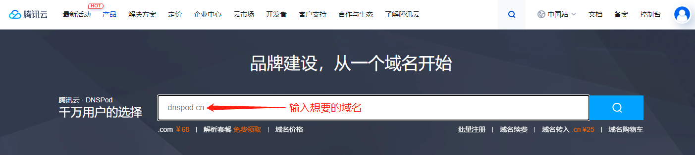

选中想要的域名后添加到选购清单付款即可，需要注意的是，根据国内最新的政策法规，**注册域名必须实名认证**，要先在腾讯云中进行实名认证，通过审核后才能注册成功。

### 2.2 解析域名

注册域名完成后，我们可以将域名（`liuyuxin.site`）解析到之前托管的 GitHub Pages 个人网站（`rainmic1019.github.io`）。

首先，进入腾讯云控制台，然后前往【DNS 解析 DNSPod】：

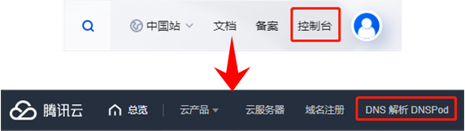

> 备注：原来的 DNSPod 被腾讯云收购了，解析服务由 DNSPod 提供，操作台也是一样的。

在打开的页面中可以看到刚刚注册的域名，前往 DNSPod 控制台进行解析：

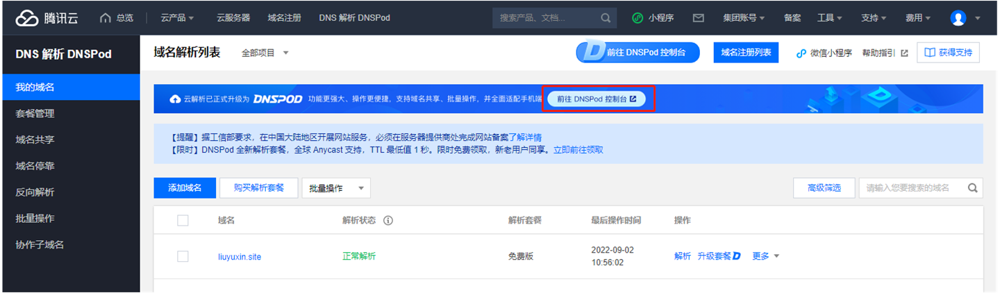

在【我的域名】中点击上一小节注册的域名进行解析管理：

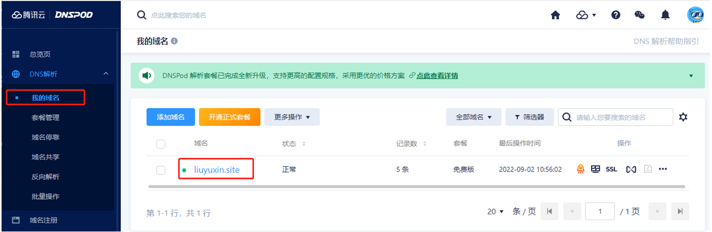

> 备注：如果域名不是在腾讯云注册的，可以点击"添加域名"按钮，进行验证，将其放到 DNSPod 中管理。

点击【快速添加解析】，选择"网站解析" -> "域名映射(CNAME)"，将注册的域名映射到我们的个人网站：

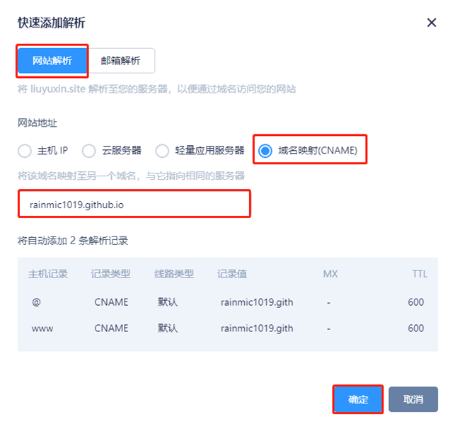

添加成功后，会有两条解析记录，都指向个人网站：

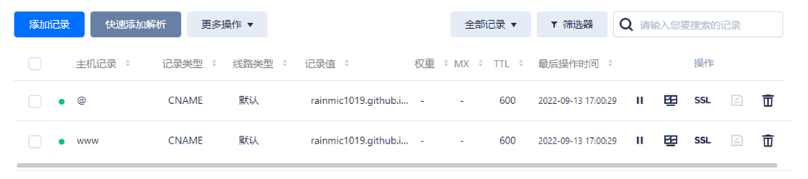

### 2.3 GitHub Pages使用域名

将注册的域名指向 GitHub Pages 个人网站后，我们可以到网站仓库中设置自定义域名，比如此处我的仓库是：https://github.com/RainMic1019/RainMic1019.github.io。

在仓库中选择【Setting】->【Pages】，在 Custom domain 栏目填写域名并保存，等待 GitHub Pages 检测域名，成功后即可通过自定义域名访问个人网站了。

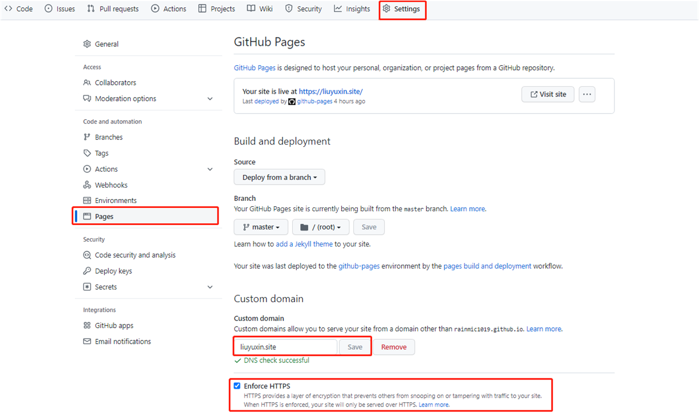

此处我们可以勾选 Enforce HTTPS 选择，让网站仅通过 HTTPS 提供服务，更加安全。

GitHub Pages 使用自定义域名实际上就是在仓库中创建一个 CNAME 文件，并在该文件中保存域名，如果想要在自动部署的时候就使用自定义域名，可以在部署脚本中额外创建一个 CNAME 文件并提交。

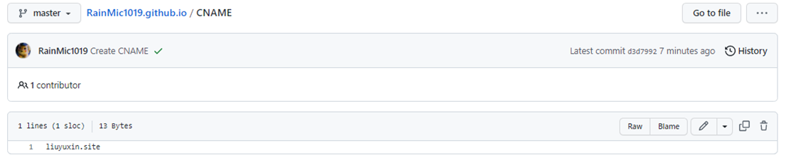

## 3 百度收录

本文一开始就讲了 GitHub Pages 托管的网站是无法被百度收录的，除此之外，Google、Bing 等搜索引擎，均可正常收录。

所以只需要针对百度的搜索引擎做特定的解析，只有当百度爬虫检索时，将域名解析至我们搭建的百度可爬取的镜像网站上即可。

### 3.1 Vercel

[Vercel](https://vercel.com/) 的前身叫 ZEIT，做的产品有 Next.js（React SSR 框架），Hyper（桌面终端应用，使用 Electron 编写），其创办人 Guillermo Rauch 也是 [socket.io](http://socket.io/) 和 mongoose 的作者。

简单来说 Vercel 是一个静态站 hosting 服务，可以通过 GitHub Hooks 实现自动部署，并且提供存储 + CDN + DNS 一套完整的服务。

### 3.2 部署镜像网站

这里我只是简单的在 Vercel 上部署了一个镜像网站，步骤如下：

步骤一：使用 GitHub 账户登录 [Vercel](https://vercel.com/)，授予 Vercel repo 的 read 权限。

步骤二：导入 GitHub 账户中的网站 repo，比如此处的 RainMic1019.github.io。

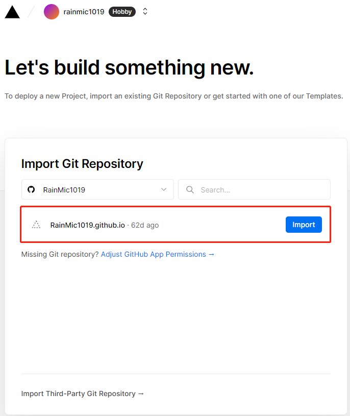

步骤三：配置并部署导入的网站 repo：

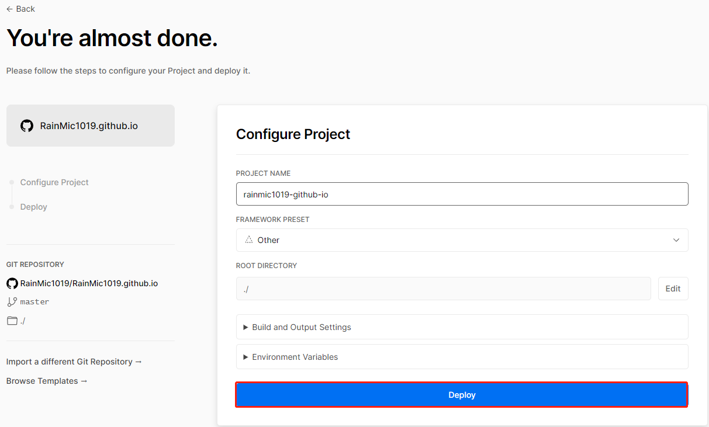

步骤四：稍等片刻，部署成功，此时我们就可以直接通过部署完成后 Vercel 提供的域名访问个人网站了，比如：https://rainmic1019-github-io.vercel.app。

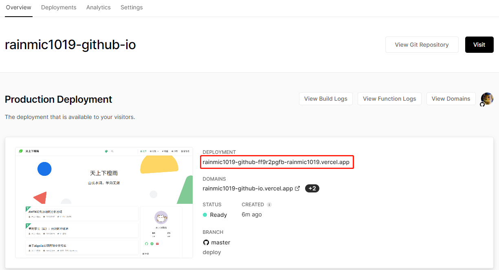

> 备注：项目名中的 `.` 会自动被替换成 `-`，Vercel 生成了一个类似于 xxxx.vercel.app 的域名，点击可以访问我们的网站主页，这时候静态资源已经部署到 Vercel 的边缘 CDN 节点上了，下次 GitHub 项目的任何更新都会触发 Vercel 项目更新，无需我们再手动部署，这点比 Gitee Pages 好用多了。

### 3.3 将百度爬虫指向Vercel

在 Vercel 搭建好镜像网站后，就可以通过 DNSPod 设置域名解析了。

在腾讯云的 DNSPod 控制台中选择对应的域名，点击【添加记录】，记录类型为 CNAME，将主机记录 @ 和 www 的百度搜索引擎都指向镜像网站的域名 `rainmic1019-github-io.vercel.app`，如下图所示：

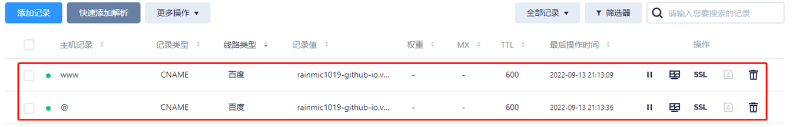

此时再使用 [百度站点管理](https://ziyuan.baidu.com/site) 抓取，便可显示抓取成功。

> 备注：在使用 [百度站点管理](https://ziyuan.baidu.com/site) 抓取前需要先添加站点，根据提示的步骤操作即可。

在百度搜索框中输入：`site:域名` 就可以检索域名收录情况，当然估计还要等几天的刷新才会有结果。

## 4 ICP备案

在中国大陆境内提供服务的网站都应依法进行 ICP 备案和公安备案，我后面会考虑将个人网站迁移到国内的腾讯云服务器上，因此这里就顺便做了 ICP 备案，以下是在腾讯云上进行备案的步骤。

> 备注：如果只是把网站托管到 GitHub Pages 并将域名指向它是不需要做备案的，因为 GitHub Pages 的服务器在境外，最近的也是香港。

登录 [腾讯云](https://cloud.tencent.com/)，点击导航栏中的备案，选择开始备案：

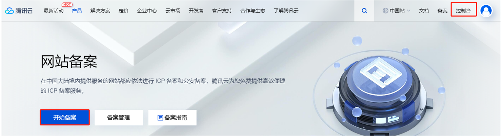

### 4.1 填写资料

我这里是首次备案，然后就可以根据提示填写资料了，主要包括主体信息、网站信息、以及其他资料。

- 主体信息：我申请的是个人备案，因此主体就是我自己，提供身份证、地址和联系方式即可：

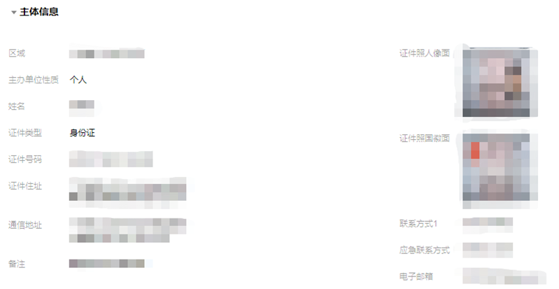

- 网站信息：主要包含网站名称、域名、内容、详细描述，以及负责人信息，这部分最重要的是服务器资源（备案授权码），这个可以通过购买腾讯云服务器获得（其他云服务器也是类似的），一台云服务可以生成五个授权码，一个授权码可以备案一个网站。再不济上淘宝十几块钱也能买一个。另外，需要注意的是网站名称最好是无意义的内容，比如：飞翔的小猪、青青草原等等，容易过审，网站内容必须描述详细，否则后续还得改。

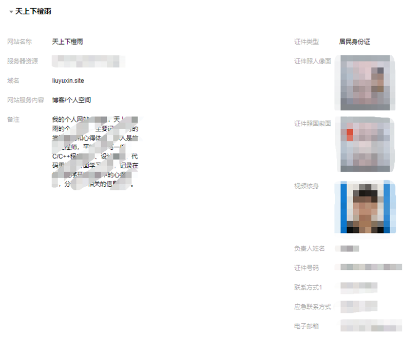

- 其他资料：这个主要看申请备案的具体省份，比如我是在广东省申请的，因此必须提供《互联网信息服务备案承诺书》，需签名并加盖手印。各个省份的要求都不同，根据实际情况来。

### 4.2 腾讯云初审

填写完资料后就可以提交审核了，首先是腾讯云这边的初审，通常在 1~2 个工作日内完成。在此期间，腾讯云的工作人员会电话回访，验证网站负责人信息以及帮忙修改资料中错漏的地方，我们确保联系方式畅通即可，只要资料没什么大问题都可以过审。

### 4.3 管局审核

通过腾讯云的审核后，接下来就到当地的通信管理局（简称管局）审核了，通常在 20 个工作日内完成。需要注意的是，我们需要进行短信验证，工信部（号码:12381）将给负责人手机号发送校验短信，收到短信后 24 小时内按照短信提示登录 [工信部网站](https://beian.miit.gov.cn/) 进行短信核验，超时未核验备案订单会被退回。

> 备注：如果没厚道验证短信，也可以去 [工信部网站](https://beian.miit.gov.cn/) 那边重发短信。

通过审核后，我们会收到短信和邮件通知，内容大致如下：

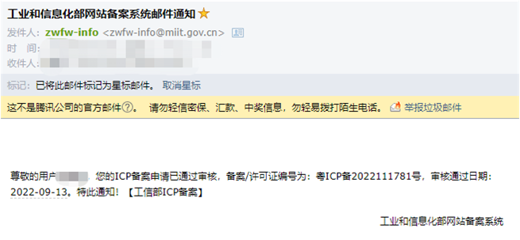

并且我们可以在 [工信部网站](https://beian.miit.gov.cn/) 中查询到自己的备案信息：

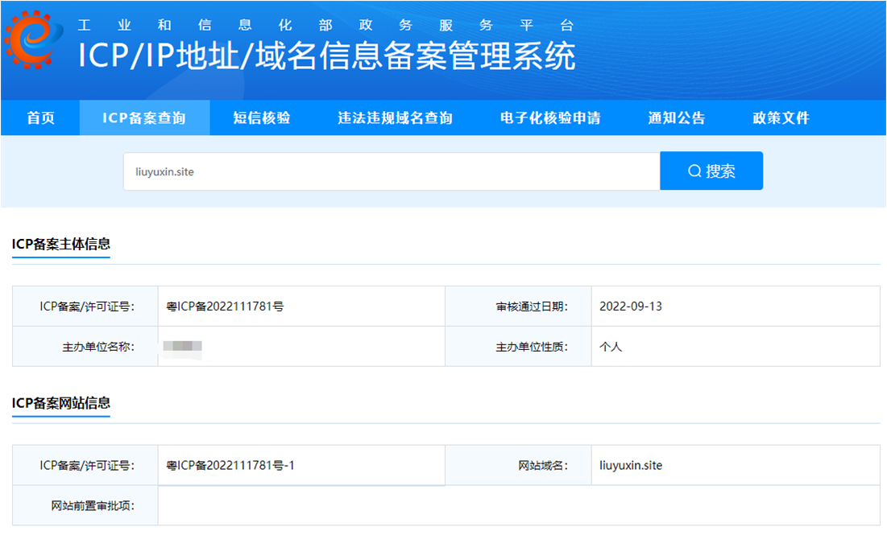

### 4.4 网站增加ICP备案信息

网站备案成功后，我们需要在备案成功的网站底部悬挂工信部下发的网站备案号，并生成链接指向工信部网站 `https://beian.miit.gov.cn`，提供给网站访问者查询核对。由于我是用 [VuePress](https://www.vuepress.cn/) 生成个人网站的，并且使用了主题 [vuepress-theme-reco](https://vuepress-theme-reco.recoluan.com/)，所以这里只需在 `.vuepress/config.js` 文件添加相关配置即可：

```js
module.exports = {
  themeConfig: {
    // ICP备案
    record: '粤ICP备2022111781号-1',
    recordLink: 'https://beian.miit.gov.cn',
  }
}
```

## 5 公安备案

根据相关规定，网站在工信部备案（ICP备案）成功后，需要在网站开通之日起的 30 日内登录 [全国互联网安全管理服务平台](http://www.beian.gov.cn/) 提交公安备案申请。

由于公安备案需要提供域名指向的公网 IP 地址，即指向国内的服务器，所以得先在腾讯云服务器上搭好自己的个人网站，我这里直接用了 Nginx 静态服务器环境，具体可以看这篇文章：[CentOS 7.6基于Nginx静态服务器搭建搭建个人网站](./centos_7.6_nginx_website.md)。

### 5.1 注册账号

前往 [全国互联网安全管理服务平台](http://www.beian.gov.cn/)，选择【联网备案登录】，注册并登录账号。

在弹出的"系统提示"窗口中，点击进入，填写主题信息，我是个人备案，因此只需提供身份证信息即可。

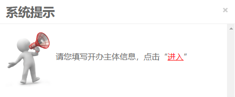

在"网站开办主体"页面，"开办主体性质"选择为"个人"：填写"开办者信息"，单击提交审核。

### 5.2 填写新办网站信息

在左侧导航栏中，点击新办网站申请，进入"新办网站申请"页面：

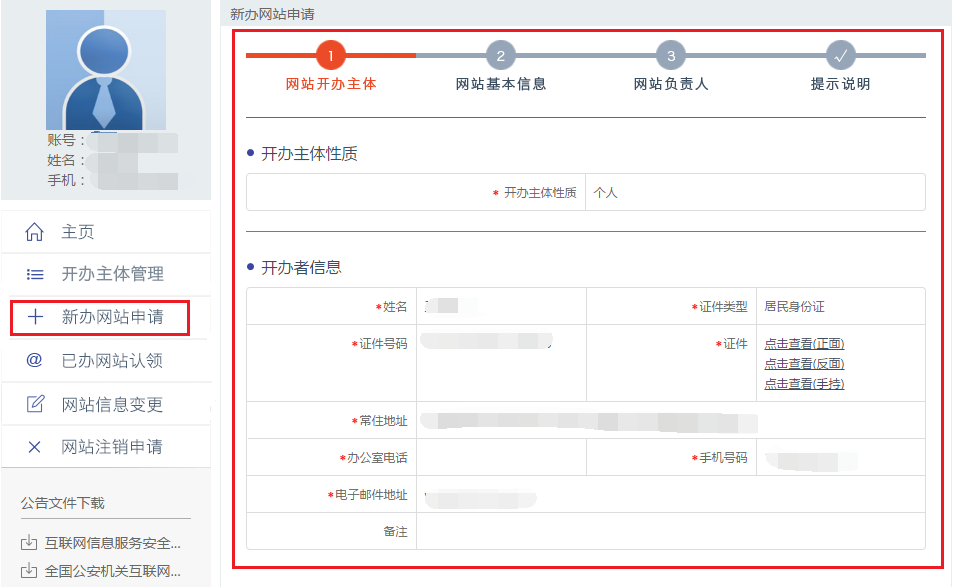

确认网站开办主体信息无误，点击下一步；根据页面提示，填写网站基本信息，并点击下一步。

> 备注：网站信息需要填写域名注册服务商和指向的服务器地址，这个根据实际情况填写。

### 5.3 网站增加公安备案信息

公安备案审核通过后，我们需在30日内登录 [全国互联网安全管理服务平台](http://www.beian.gov.cn/)，在已备案网站详情中，复制网站公安机关备案号和备案编号 HTML 代码，下载备案编号图标，并编辑网页源代码将公安联网备案信息放置在网页底部。

由于我是用 [VuePress](https://www.vuepress.cn/) 生成个人网站的，并且使用了主题 [vuepress-theme-reco](https://vuepress-theme-reco.recoluan.com/)，所以这里只需在 `.vuepress/config.js` 文件添加相关配置即可：

```js
module.exports = {
  themeConfig: {
    // 公安备案
    cyberSecurityRecord: '公安部备案文案',
    cyberSecurityLink: '公安部备案指向链接',
  }
}
```
