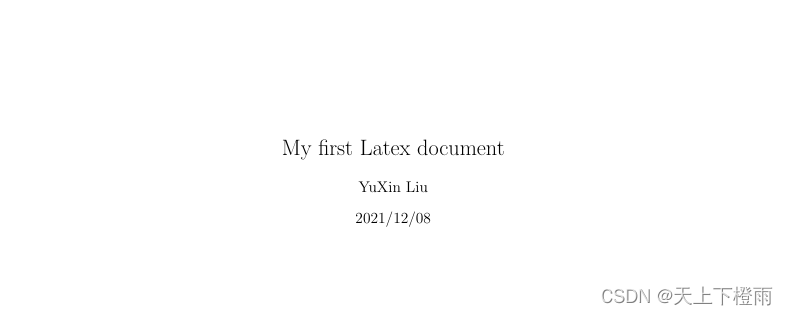
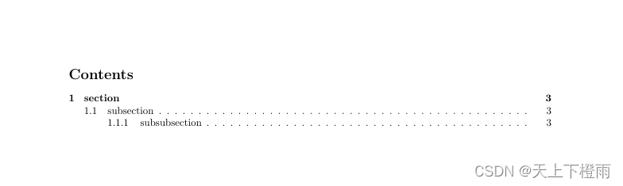
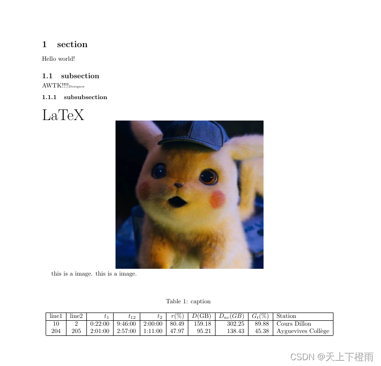

## 1 前言

在之前的 [云文档托管方案分析](./cloud_document.md) 中提到了，我们采用了 Pandoc+TeXLive 的方案来实现Markdown转PDF，接下来我们来详细介绍该方案。

## 2 Pandoc

[Pandoc](https://www.pandoc.org/) 是一个免费开源的通用文档转换工具，支持大量**标记语言**之间的格式转换，例如 Markdown、HTML、LaTex、PDF、Microsoft Word等，其源码放在了 [GitHub](https://github.com/jgm/pandoc) 仓库。

> 备注：标记语言是一种将文本以及文本相关的其他信息结合起来，展现出关于文档结构和数据处理细节的文字编码。与文本相关的其他信息（包括文本的结构和表示信息等）与原来的文本结合在一起，但是使用标记进行标识。

标记语言不仅仅是一种语言，就像许多语言一样，它需要一个运行时环境，使其有用。提供运行时环境的元素称为用户代理。

### 2.1 安装Pandoc

1. 前往官网的 [安装页面](https://pandoc.org/installing.html)，根据对应的系统下载 Pandoc。
2. 此处以为 Windows 平台为例，下载 [pandoc-2.14.2-windows-x86_64.zip](https://github.com/jgm/pandoc/releases/tag/2.14.2)。
3. 解压 pandoc-2.14.2-windows-x86_64.zip 后，将 pandoc.exe 的路径添加到环境变量。
4. 在终端中执行以下命令检测是否安装成功：

```bash
pandoc –v
```

命令结果显示详细的版本信息则表示安装成功，如下：

```bash
pandoc.exe 2.14.2
Compiled with pandoc-types 1.22, texmath 0.12.3.1, skylighting 0.11,
citeproc 0.5, ipynb 0.1.0.1
User data directory: C:\Users\liuyuxin\AppData\Roaming\pandoc
Copyright (C) 2006-2021 John MacFarlane. Web:  https://pandoc.org
This is free software; see the source for copying conditions. There is no
warranty, not even for merchantability or fitness for a particular purpose.
```

### 2.2 基本用法

1. 查看命令参数：

```bash
pandoc -h
```

2. 将 Word 转为 Markdown：

```bash
pandoc --extract-media ./images README.docx -o README.md
```

> 备注：--extract-media 参数用于指定 .docx 文件中导出图片的路径，比如此处指定为当前目录下的 images 文件夹。

3. 将 Markdown 转为 LaTex：

```bash
pandoc --toc –H head.tex README.md -o README.tex
```

更多介绍可以看 [Pandoc 的用户手册](https://pandoc.org/MANUAL.html)，另外官方还提供了一个 [在线转换工具](https://pandoc.org/try/) 以及 [各种转换示例](https://pandoc.org/demos.html)。

### 2.3 转换原理

Pandoc 将 Markdown 文档转为 PDF 文件，实际上包含两个步骤：

- 第一步：将 Markdown 转化为 LaTeX 源文件。
- 第二部：调用系统的 pdflatex、xelatex 或者其他 Tex 命令，将 LaTex 源文件渲染为 PDF 文件。

## 3 TeXLive

### 3.1 TeX

首先，我们需要知道什么是 TeX？

TeX 是一种排版系统，它提供了一套功能强大并且十分灵活的排版语言，拥有多大900多条指令，并且支持宏功能，用户可以通过不断定义新的命令来扩展功能。

> 备注：TeX 的诞生主要为了快速生产高质量的科技和数学类印刷文档。

### 3.2 LaTeX

LaTeX 是一种基于 TeX 实现的排版系统，LaTeX 使用 TeX 排版程序来格式化其输出，并且本身是用 TeX 宏语言编写的，是当前最流行以及应用最广泛的 Tex 扩展版本。

Tex 有许多发行版本，比如 **TeXLive（跨平台）**、MacTeX、MiKTeX 等等。

### 3.3 TeX发行版本

想要将 LaTeX 源文件渲染为 PDF，必须借助 TeX 渲染引擎，也就是所谓 TeX 发行版本，它负责根据 LaTeX 语法将其中的内容渲染为可以阅读打印的 PDF 文件。

此处我们采用了 [TeXLive](https://www.tug.org/texlive/)，可以在共享服务器上下载，主要考虑到以下四个优点：

- 免费；
- 跨平台；
- 包含支持中文 Unicode 编码的 xelatex 引擎；
- 内置简单的 TeX 编辑器 TeXwoks，可以快速预览效果；

### 3.4 安装TeXLive 

1. 前往  [TeXLive](https://www.tug.org/texlive/) 官网下载对应版本的镜像，如果速度较慢，可以去 [国内镜像](http://ftp.math.utah.edu/pub/tex/historic/systems/texlive/) 下载，此处下载 texlive2020.iso。
2. 按照默认步骤按照好后，将 [安装目录]\texlive\2020\bin\win32 添加到环境变量。
3. 在终端中执行以下命令检测是否安装成功：

```bash
tex -v
latex -v
xelatex -v
pdflatex -v
```

命令结果显示详细的版本信息则表示安装成功，下文中主要使用 xelatex 渲染引擎，此处执行 xelatex -v，结果如下：

```bash
XeTeX 3.14159265-2.6-0.999992 (TeX Live 2020/W32TeX)
kpathsea version 6.3.2
Copyright 2020 SIL International, Jonathan Kew and Khaled Hosny.
There is NO warranty.  Redistribution of this software is
covered by the terms of both the XeTeX copyright and
the Lesser GNU General Public License.
For more information about these matters, see the file
named COPYING and the XeTeX source.
Primary author of XeTeX: Jonathan Kew.
Compiled with ICU version 65.1; using 65.1
Compiled with zlib version 1.2.11; using 1.2.11
Compiled with FreeType2 version 2.10.1; using 2.10.1
Compiled with Graphite2 version 1.3.13; using 1.3.13
Compiled with HarfBuzz version 2.6.4; using 2.6.4
Compiled with libpng version 1.6.37; using 1.6.37
Compiled with poppler version 0.68.0
Compiled with fontconfig version 2.13.92; using 2.13.92
```

### 3.5 Latex基本语法

LaTeX 就像一门编程语言，每使用特殊功能都要导入相关的包，最后通过渲染引擎的编译生成PDF文件，其语言结构如下：

```bash
%% 定义文档信息
\documentclass{article}  %% 规定文档类型，常用的有 report、article、book、letter 等等

%% 导入需要使用的宏包
\usepackage{geometry}    %% 导入文档页面设置的宏包（宏命令集合）
\usepackage{graphicx}    %% 导入图形宏包，支持插入图片
\usepackage{longtable}   %% 导入长表格宏包，支持插入表格

%% 进行页面配置
\geometry{left=2.5cm,right=2.5cm,top=2.5cm,bottom=2.5cm} %% 利用导入的宏包中的命令设置页边距

%% 定义文档信息
\title{My first Latex document} %% 文档标题
\author{YuXin Liu}              %% 文档作者
\date{2021/12/08}               %% 文档时间

%% 表示文档内容开始
\begin{document}    

\maketitle          %% 渲染（打印）文档信息
\newpage            %% 另起一页
\tableofcontents    %% 渲染目录
\newpage            %% 另起一页
\section{section}   %% 添加章节
Hello world!
\subsection{subsection} %% 添加子章节
AWTK!!!!\tiny{Designer} 
\subsubsection{subsubsection} %% 添加孙章节·
\Huge{LaTeX} 
    
\centerline{  %% 此行内容居中（这里表示图片居中）
  \includegraphics[width=0.5\textwidth]{images//Pikachu.jpg}  %% 渲染图片
}

\normalsize 
this is a image.
this is a image. \\\\

%% 添加表格
\begin{longtable}{|c|c|r|r|r|r|r|r|r|l|}
    \caption{caption}       %% 表格标题
    \label{table:label}  \\ %% 添加表格标签
    \hline                  %% 添加水平线
    line1   &   line2   &   $t_1$   &   $t_{12}$    &   $t_2$       &   $r$(\%)&    $D$(GB)&    $D_{nc}(GB)$&$G_t$(\%)&Station\\    
    \hline
    % 每行的数据
    10      &   2       &   0:22:00 &   9:46:00 &   2:00:00 &   80.49   &   159.18  &   302.25  &   89.88   &   Cours Dillon    \\
    204     &   205     &   2:01:00 &   2:57:00 &   1:11:00 &   47.97   &   95.21   &   138.43  &   45.38   &   Ayguevives Collège  \\
    % 更多数据
    \hline
\end{longtable}

%% 表示文档内容结束
\end{document}
```

渲染效果：







### 3.6 LaTeX 相关资料分享

1. LaTeX 在线编译器 [TeXPage](https://www.texpage.com/)：可以在线编辑、预览效果、还可以下载一些成熟的模板。
2. 简单了解 LaTeX 的基础语法：[Latex基础语法 - 知乎 (zhihu.com)](https://zhuanlan.zhihu.com/p/52347414)。
3. 了解 LaTeX 中常用的宏包命令（中文）：[CTEX - 在线文档 - TeX/LaTeX 常用宏包](http://www.ctex.org/documents/packages/)。
4. LaTex 国内的模板库、论坛、示例、知识库：[LaTeX 工作室 (latexstudio.net)](https://www.latexstudio.net/)。
5. TexLive 国内镜像资源：[Index of /pub/tex/historic/systems/texlive (utah.edu)](http://ftp.math.utah.edu/pub/tex/historic/systems/texlive/)。

安装 TexLive 后使用终端命令查看官方文档（英文）：

-  查看所有使用手册集合：texdoc texdoc
-  配置指南：texdoc cfgguide
-  字体指南：texdoc fntguide
-  任何 TexLive 中的宏包说明书：texdoc [宏包名称]，比如查看图形宏包的说明书：texdoc graphic

## 4 转换技巧

### 4.1 处理中文

Pandoc 默认使用的 pdflatex 命令无法处理 Unicode 字符，如果 markdown 中包含中文，转换为 PDF 的过程中会报错，需要用 xelatex 来处理中文，并且使用 CJKmainfont 选项指定支持中文的字体。

在 Win 中，对于 Pandoc 2.0 以上版本，生成 PDF 文件的命令如下：

```bash
pandoc --pdf-engine=xelatex -V CJKmainfont="Microsoft YaHei" README.md -o README.pdf
```

CJKmainfont 指定支持中文的字体名称，寻找这些字体首先需要知道 language code，比如中文的是 **zh**，然后使用以下命令查看系统中支持该语言的所有字体：

```bash
fc-list :lang=zh
```

> 备注：fc-list 在Unix系统一般会预装，其他平台需要自行搜索安装依赖包，在 Windows 中可以直接查看 C:\Windows\Fonts 目录。
>
> - Win7 可以访问：控制面板\所有控制面板项\字体。
> - Win10 可通过【设置】=>【个性化】=>【字体】查看字体名称。

### 4.2 使用YAML header添加文档信息
Pandoc 支持 YAML 格式的 header，通过 header 可以指定文章的标题，作者，更新时间等信息，一个示例 header 如下：

```bash
---
title: "My title"
author: "author"
date: 2021-12-12
---
```

### 4.3 代码高亮

Pandoc 支持给 block code 里面的代码加上背景高亮，并提供了不同的高亮主题，支持非常多的语言。要列出 Pandoc 提供的高亮方案，使用下面命令：

```bash
pandoc --list-highlight-styles
```

要列出所有支持的语言，使用下面命令：

```bash
pandoc --list-highlight-languages
```

要使用语法高亮，Markdown 文件中的 block code 必须指定语言，同时在命令行使用--highlight-style 选项，例如：

```bash
pandoc --pdf-engine=xelatex --highlight-style tango README.md -o README.pdf
```

### 4.4 超链接样式

根据 Pandoc user guide 的说明，我们可以通过 colorlinks 选项给各种链接加上颜色，便于和普通文本区分开来，同时，为了精确控制不同类型链接颜色，Pandoc 还提供了对不同链接颜色的个性化设置选项：

```bash
colorlinks
    add color to link text; automatically enabled if any of linkcolor, filecolor, citecolor, urlcolor, or toccolor are set

linkcolor, filecolor, citecolor, urlcolor, toccolor
    color for internal links, external links, citation links, linked URLs, and
    links in table of contents, respectively: uses options allowed by xcolor,
    including the dvipsnames, svgnames, and x11names lists
```

例如，如果我们想给 URL 链接加上颜色，并且 urlcolor 要设为 NavyBlue, 可以使用下面的命令：

```bash
pandoc --pdf-engine=xelatex -V colorlinks -V urlcolor=NavyBlue README.md -o README.pdf
```

其他链接的颜色可以按照上述方式设置。

### 4.5 给section添加编号

默认情况下，生成的 PDF 不含目录，同时各级标题不含编号，仅仅字体大小有变化，要给各个 section 加上编号，可以用 -N 选项：

```bash
pandoc --pdf-engine=xelatex -N -o README.pdf README.md
```

### 4.6 给文档添加目录

加上目录，可以使用 --toc 选项：

```bash
pandoc --pdf-engine=xelatex --toc -o README.pdf README.md
```

### 4.7 修改PDF的页边距

使用默认设置生成的 PDF margin 太大，根据 [Pandoc 官方FAQ](https://pandoc.org/faqs.html#how-do-i-change-the-margins-in-pdf-output)，可以使用下面的选项更改 margin：

```bash
-V geometry:"top=2cm, bottom=1.5cm, left=2cm, right=2cm"
```

完整命令为：

```bash
pandoc --pdf-engine=xelatex -V geometry:"top=1.5cm, bottom=1.5cm, left=2cm, right=2cm" -o README.pdf README.md
```

### 4.8 代码、引用或列表渲染失败

原因是在 Pandoc 中 block quote，list 以及 table 前需要空一行。另外 block quote 中每一行渲染成 PDF 未能正确换行，所有行的文字都跑到了一行，可以通过强制在原 block quote 的每一行后面加上空格来解决。

### 4.9 代码加上背景色

将 Markdown 转为 PDF 时，由于 Pandoc 使用 LaTeX 中的 \textt 来表示 inline code，其中又定义了颜色变量 shadecolor 为代码背景色。为了增加 inline code 的可读性，我们可以修改 \texttt 命令中的 shadecolor，给文本添加背景色。首先建立 head.tex 文件，在其中加入以下命令：

```tex
%% 设置 shade 背景色（代码背景颜色）
\usepackage{color,framed}
\definecolor{shadecolor}{RGB}{235,235,235}
```

在使用 Pandoc 转换 Markdown 文件时，加上 -H 选项来引用 head.tex 文件，例如：

```bash
pandoc --pdf-engine=xelatex -H head.tex README.md -o README.pdf
```

### 4.10 使用head.tex配置PDF参数

由于将 Markdown 转为 PDF 需要诸多选项与设置，将这些设置都写在命令行上，既浪费时间，也不利于小修小改，所以可以将常用的一些命令都放到 head.tex 文件中，然后在转换 Markdown 文件的时候引用该文件即可。

例如，可以将设置页面宽度的命令，给代码背景着色的命令，以及设置链接颜色的命令统一放入 head.tex 中：

```tex
%% 设置页边距
\usepackage[top=2cm, bottom=2cm, left=1.5cm, right=1.5cm]{geometry}

%% 针对中文自动换行
\XeTeXlinebreaklocale "zh"

%% 设置行间距 1.5 倍
\linespread{1.5}\selectfont

%% 设置首行缩进
\usepackage{indentfirst}
\setlength{\parindent}{2em}

%% 段落之间的距离
\setlength{\parskip}{3pt} 	

%% 字与字之间加入0pt至1pt的间距，确保左右对齐
\XeTeXlinebreakskip = 0pt plus 1pt

%% 设置页眉页脚
\usepackage{fancyhdr}
\pagestyle{fancy}
\lhead{title} 
\chead{}
\rhead{version}
\lfoot{ZLG}
\cfoot{@2021 Guangzhou ZHIYUAN Electronics Co.,Ltd.}
\rfoot{\thepage}
\renewcommand{\headrulewidth}{0.4pt}  %% 页眉分割线宽
\renewcommand{\footrulewidth}{0.4pt}  %% 页脚分割线宽

%% 设置表头背景色
\usepackage{colortbl}
\definecolor{tableheadcolor}{RGB}{225,225,225}

%% 设置 shade 背景色（代码背景颜色）
\usepackage{color,framed}
\definecolor{shadecolor}{RGB}{235,235,235}

%% 设置 block quote 的样式
%% 由于还不知道怎么统一设置 quote 的背景色，先引用 shade 背景色
%% 用左右边距区分 quote
\usepackage{quoting}
\newenvironment{shadedquotation}
 {\begin{shaded*}
  \quoting[leftmargin=1em, rightmargin=1em, vskip=0pt, font=itshape]
 }
 {\endquoting
 \end{shaded*}
 }

% quote 应用 shadedquotation 环境
\def\quote{\shadedquotation}
\def\endquote{\endshadedquotation}
```

### 4.11 设置图片大小

Markdown 转 PDF 时想指定某个图片的大小，在 markdown 文档中引用图片只需在后面加上 {width=xx%} 即可，需要注意的是，这里百分比时以 PDF 文档中每行最大的 text width 为基础的，也就是说当 {width=100%} 时，图像将按比例横向占满 PDF（不包括左右页边距）。

```markdown
{width=70%}
```
