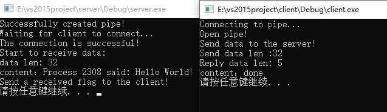

## 1 前言

之前的 [管道通信：匿名管道](./pipeline_anonymous.md) 中讲述了匿名管道的实现方法，本文来学习一下命名管道的内容，希望对自己与各位有所帮助。

## 2 基本概念

命名管道（Named Pipes），按照字面意思理解就是有名字的管道，它可在同一台计算机的不同进程之间或在跨越一个网络的不同计算机的不同进程之间，支持可靠的、单向或双向的数据通信。

## 3 命名管道的创建和使用

### 3.1 函数原型

#### 3.1.1 CreateNamedPipe

```cpp
/* 创建命名管道 */
HANDLE WINAPI CreateNamedPipe(
  /**
  * 管道名称。
  * 形式：\\.\pipe\pipename。
  * 最长256个字符，且不区分大小写。
  * 如果已有同名管道，则创建该管道的新实例。
  */
  LPCTSTR lpName, 
  /**
   * 管道打开方式。
   * 常用的管道打开方式有以下三种，更多请查阅MSDN：
   * PIPE_ACCESS_DUPLEX：该管道是双向的，服务器和客户端进程都可以从管道读取或者向管道写入数据。
   * PIPE_ACCESS_INBOUND：该管道中数据是从客户端流向服务端，即客户端只能写，服务端只能读。
   * PIPE_ACCESS_OUTBOUND：该管道中数据是从服务端流向客户端，即客户端只能读，服务端只能写。
  */
  DWORD dwOpenMode,
  /**
   * 管道模式。
   * 常用的管道模式如下，更多请查阅MSDN：
   * PIPE_TYPE_BYTE：数据作为一个连续的字节数据流写入管道。
   * PIPE_TYPE_MESSAGE：数据用数据块（名为“消息”或“报文”）的形式写入管道。
   * PIPE_READMODE_BYTE：数据以单独字节的形式从管道中读出。
   * PIPE_READMODE_MESSAGE：数据以名为“消息”的数据块形式从管道中读出（要求指定PIPE_TYPE_MESSAGE）。
   * PIPE_WAIT：同步操作在等待的时候挂起线程。
   * PIPE_NOWAIT：同步操作立即返回。
  */
  DWORD dwPipeMode,
  /**
   * 该管道能创建的最大实例数。
   * 必须大于1，小于PIPE_UNLIMITED_INSTANCES(255)。
  */
  DWORD nMaxInstances,
  DWORD nOutBufferSize,  // 管道输出缓冲区容量，设置0时使用默认大小
  DWORD nInBufferSize,   // 管道输入缓冲区容量，设置0时使用默认大小
  DWORD nDefaultTimeOut, // 管道默认等待超时
  LPSECURITY_ATTRIBUTES lpSecurityAttributes // 管道的安全属性
);
```

> 返回值：CreateNamedPipe() 执行成功返回命名管道的句柄，否则返回INVALID_HANDLE_VALUE。

#### 3.1.2 ConnectNamedPipe

```cpp
/* 等待客户端连接命名管道 */
BOOL WINAPI ConnectNamedPipe(
  HANDLE hNamedPipe,         // 命名管道的句柄
  LPOVERLAPPED lpOverlapped  // 指向 OVERLAPPED 结构的指针，一般置为NULL即可
);
```

#### 3.1.3 WaitNamedPipe

```cpp
/* 客户端连接命名管道 */
BOOL WINAPI WaitNamedPipe(
  LPCTSTR lpNamedPipeName, // 管道名称。形式：\\servername\pipe\pipename。本机管道的 servername 为"."。
  /**
   * 等待命名管道一个实例有效的超时时间（单位：毫秒）。
   * NMPWAIT_USE_DEFAULT_WAIT：使用命名管道设定值（调用CreateNamedPip()时设置的 nDefaultTimeOut）。
   * NMPWAIT_WAIT_FOREV：一直等待。
  */
  DWORD nTimeOut
);
```

> 返回值：WaitNamedPipe() 在指定时间内连接成功返回TRUE，否则返回FALSE。

> 注意：
> 1. 在指定时间内连接成功返回TRUE，否则返回FALSE。
> 2. 如果函数执行成功返回TRUE，表示至少有一个命名管道的实例有效，接下来应该使用 CreateFile() 函数打开命名管道的一个句柄，但是 CreateFile() 可能会打开管道失败，因为该实例有可能被服务端关闭或被已经被其他客户端打开。

### 3.2 示例代码

#### 3.2.1 实现步骤

1. 服务端调用 CreateNamedPipe() 创建命名管道并调用 ConnectNamedPipe() 等待客户端连接。
2. 客户端使调用 WaitNamedPipe() 连接成功后，再调用 CreateFile() 和 WriteFile() 打开管道并向管道中写入一段数据，即向服务端发送消息。
3. 服务端调用 ReadFile() 从管道中读取数据后（即收到消息），再向管道中写入确认信息表明已经收到数据，即通知客户端已收到。
4. 客户端收到确认信息后结束，调用 CloseHandle() 关闭管道（该管道是 CreateFile() 打开的）。
5. 服务端使用 DisconnectNamedPipe() 和 CloseHandle() 断开连接并关闭管道。

#### 3.2.2 服务端代码

```c
#include <stdio.h>
#include <windows.h>
#include <conio.h>

int main()
{
	const char *pStrPipeName = "\\\\.\\pipe\\MyNamePipe";

	// 创建管道
	HANDLE hPipe = CreateNamedPipe(pStrPipeName, PIPE_ACCESS_DUPLEX, PIPE_TYPE_MESSAGE | PIPE_READMODE_MESSAGE | PIPE_WAIT, PIPE_UNLIMITED_INSTANCES, 0, 0, NMPWAIT_WAIT_FOREVER, 0);
	if (hPipe != INVALID_HANDLE_VALUE) {
		printf("Successfully created pipe!\n");
		printf("Waiting for client to connect...\n");
	}

	// 等待客户端连接
	if (ConnectNamedPipe(hPipe, NULL) != NULL) {
		printf("The connection is successful!\n");
		printf("Start to receive data:\n");

		CHAR Buffer[1024] = { 0 };
		DWORD dwNumberOfBytesRead = 0;

		// 接收客户端发送的数据
		ReadFile(hPipe, Buffer, sizeof(Buffer), &dwNumberOfBytesRead, NULL);
		printf("data len: %d\n", dwNumberOfBytesRead);
		printf("content：%s\n", Buffer);

		// 确认已收到数据
		printf("Send a received flag to the client!\n");
		strcpy(Buffer, "done");
		WriteFile(hPipe, Buffer, strlen(Buffer) + 1, &dwNumberOfBytesRead, NULL);
	}

	// 断开连接并关闭管道
	DisconnectNamedPipe(hPipe);
	CloseHandle(hPipe);
	
	return 0;
}
```

#### 3.2.3 客户端代码

```c
#include <stdio.h>
#include <windows.h>
#include <conio.h>

int main()
{
	const char *pStrPipeName = "\\\\.\\pipe\\MyNamePipe";

	printf("Connecting to pipe...\n");
	if (WaitNamedPipe(pStrPipeName, NMPWAIT_WAIT_FOREVER) == FALSE) {
		printf("Failed to connect to pipe!\n");
		return 0;
	}

	printf("Open pipe!\n");
	HANDLE hPipe = CreateFile(pStrPipeName, GENERIC_READ | GENERIC_WRITE, 0, NULL, OPEN_EXISTING, FILE_ATTRIBUTE_NORMAL, NULL);

	printf("Send data to the server!\n");

	CHAR Buffer[1024] = { 0 };
	DWORD dwNumberOfBytesWritten = 0;

	// 向服务端发送数据
	sprintf(Buffer, "Process %d said: %s", GetCurrentProcessId(), "Hello World!");
	WriteFile(hPipe, Buffer, strlen(Buffer) + 1, &dwNumberOfBytesWritten, NULL);
	printf("Send data len :%d \n", dwNumberOfBytesWritten);

	// 接收服务端发回的数据
	ReadFile(hPipe, Buffer, sizeof(Buffer), &dwNumberOfBytesWritten, NULL);
	printf("Reply data len: %d\n", dwNumberOfBytesWritten);
	printf("content：%s\n", Buffer);

	CloseHandle(hPipe);

	return 0;
}
```

#### 3.2.4 输出结果

运行结果如下所示，运行时先启动服务器，然后再启动客户端：



## 4 总结

由此可见，命名管道的用法其实与套接字非常类似，也是一种实现进程间通信的方法。

至此，管道通信的学习完毕，以下时管道通信的相关笔记，方便查阅：

- [管道通信：输入输出重定向](./pipeline_io_redirection.md)
- [管道通信：匿名管道](./pipeline_anonymous.md)
- [管道通信：命名管道]()
