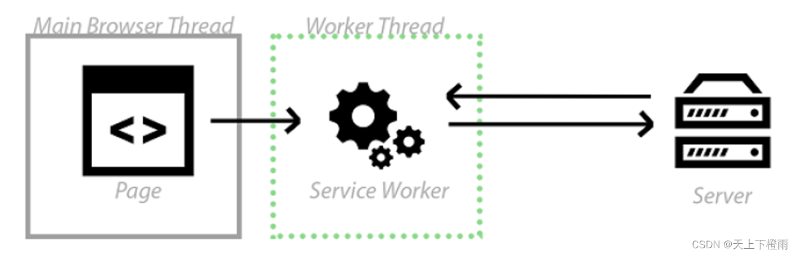
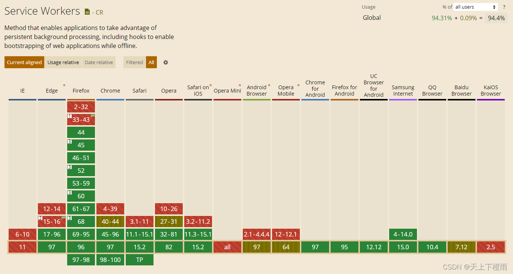
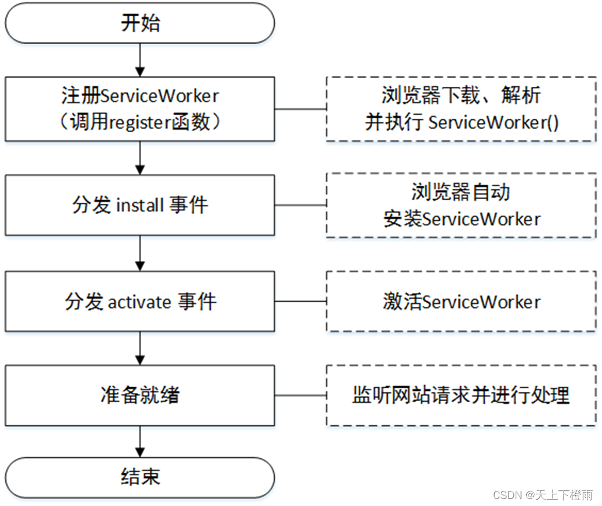
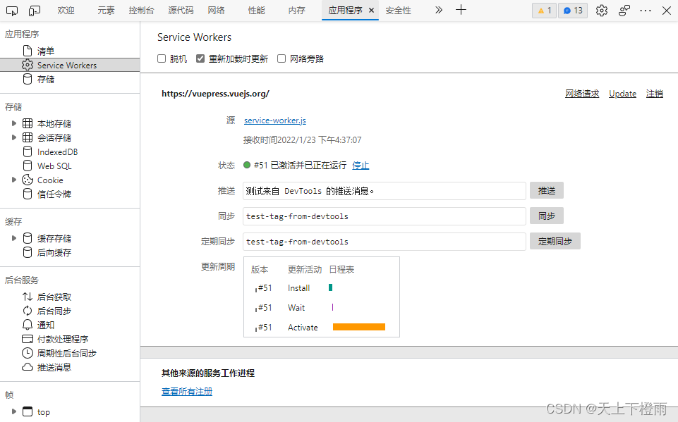

## 1 前言

近期在研究网页缓存机制的时候学习了一下渐进式 Web 应用（PWA）中了 ServiceWorkers，并在 [AWTK在线帮助文档](https://awtk.zlg.cn/docs) 中实践应用了一下，在此做个记录。

## 2 渐进式Web应用（PWA）

PWA全称 Progressive Web App，即渐进式Web应用，实际上就是一个网页应用，加上App Manifest 和 **ServiceWorker** 来实现 PWA 的安装和离线访问等功能，使得Web应用接近原生 APP。

- 可以添加到主屏幕，点击主屏幕图标可以实现启动动画以及隐藏地址栏；
- **实现离线缓存功能，即使客户端没有网络，依然可以正常访问；**
- 实现消息推送等等……

我们这里主要使用 Service Worker 实现离线缓存，减少网络通信，提高页面刷新效率。

## 3 ServiceWorker

ServiceWorker 是 Chrome 团队提出并力推的一个 Web API，用于给 Web 应用提供高级的可持续的后台处理能力。



它本质上充当服务器和浏览器之间的代理服务器，能够拦截网站的请求，从而控制页面加载。

在 Service Worker 中我们可以做很多事情，比如拦截客户端的请求、向客户端发送消息、向服务器发起请求等等，其中最重要的作用之一就是离线资源缓存。

由于其拦截请求的特性，出于安全考虑，**Service Worker 只能被使用在 https 或者本地的 localhost 环境下**。

关于 Service Worker 在不同浏览器的兼容性，详见 [caniuse](https://caniuse.com/?search=Service%20Worker) 中提供的信息：



可以看到 IE 和 Opera Mini 的全版本都不支持，但主流浏览器:Edge、Chrome、Firefox、Safari 较新的版本都是支持的，可以放心用，不过建议在用之前还是得先做好评估。

# 5 ServiceWorker启动过程

当用户首次导航至 URL 时，服务器会返回响应的网页。

1. 调用 register() 函数时， Service Worker 开始下载。
2. 在注册过程中，浏览器会下载、解析并执行 ServiceWorker()。如果在此步骤中出现任何错误，register() 返回的 promise 都会执行 reject 操作，并且 Service Worker 会被废弃。
3. 一旦 ServiceWorker 成功执行了，install 事件就会激活。
4. 安装完成，ServiceWorker 便会激活，并控制在其范围内的一切。如果生命周期中的所有事件都成功了，ServiceWorker 便已准备就绪，随时可以使用了。



在 ServiceWorker 的启动过程中，若有任何环节出错，则 ServiceWorker 会被直接废弃，直到下次刷新页面，将重新启动。

## 5 实现ServiceWorker

### 5.1 注册

如果当前使用的浏览器支持 ServiceWorker ，在 window.navigator 下则会存在 serviceWorker 对象，我们可以使用这个对象的 register 方法来注册一个 ServiceWorker。

> 备注：ServiceWorker在使用的过程中存在大量的 Promise ，对于 Promise 不是很了解的话可以先去看一下相关文档。ServiceWorker 的注册方法返回的也是一个 Promise 。

```js
/* index.html or index.js */
/* 判断当前浏览器是否支持serviceWorker */
if ('serviceWorker' in navigator) {
    /* 当页面加载完成就创建一个serviceWorker */
    window.addEventListener('load', function () {
        /* register 方法接受两个参数 */
        /* 参数一：指定serviceWorker文件路径  */
        /* 参数二：scope参数是可选的，可以用来指定你想让serviceWorker控制的内容子目录 */
        /* 在这个例子里，我们指定了'/'，表示根网域下的所有内容。这也是默认值。 */
        navigator.serviceWorker.register('./service-worker.js', {scope: './'})
            .then(function (registration) {
                 console.log('ServiceWorker registration successful with scope: ', registration.scope);
             })
            .catch(function (err) {
                console.log('ServiceWorker registration failed: ', err);
             });
    });
}
```

register 方法返回一个 Promise 。如果注册失败，可以通过 catch 来捕获错误信息；如果注册成功，可以使用 then 来获取一个 ServiceWorkerRegistration 的实例。

### 5.2 安装

注册完 ServiceWorker 之后，浏览器会为我们自动安装它，因此我们就可以在 register 时指定的 service-worker.js 文件中编写对应的安装及拦截逻辑，监听它的 install 事件。

```js
/* service-worker.js */
this.addEventListener('install', function (event) {
  console.log('Service Worker install');
});
```

类似的，ServiceWorker 在安装完成后会被激活，所以我们也可监听 activate 事件。

```js
/* service-worker.js */
this.addEventListener('activate', function (event) {
  console.log('Service Worker activate');
});
```

这时，我们可以在浏览器开发者工具的”应用程序“栏目中看到我们注册的ServiceWorker。



在默认情况下，ServiceWorker 必定会每24小时被下载一次，如果下载的文件是最新文件，那么它就会被重新注册和安装，但不会被激活，当不再有页面使用旧的 ServiceWorker 的时候，它就会被激活。

> 备注：由于以上特性不方便开发，因此这里勾引选了"重新加载时更新"的选项，勾选后每次刷新页面都能使用最新的 ServiceWorker 文件。

此处编写一个最简单的缓存 index.html 的例子，代码如下：

```js
/* service-worker.js */
/* 监听安装事件，install事件一般是被用来设置浏览器的离线缓存逻辑 */
this.addEventListener('install', function (event) {
    /* 通过这个方法可以防止缓存未完成，就关闭serviceWorker */
    event.waitUntil(
        /* 创建一个名叫V1的缓存版本 */
        caches.open('v1').then(function (cache) {
            /* 指定要缓存的内容，地址为相对于跟域名的访问路径 */
            return cache.addAll([
                './index.html'
            ]);
        })
    );
});

/* 注册fetch事件，拦截全站的请求 */
this.addEventListener('fetch', function(event) {
  event.respondWith(
      /* magic goes here */
      ......
      /* 在缓存中匹配对应请求资源直接返回 */
    caches.match(event.request)
  );
});
```

## 6 借助VuePess的插件实现ServiceWorker

VuePress 官方提供了对PWA的支持，安装 plugin-pwa 插件后，在 config.js 中进行以下配置即可：

```js
module.exports = {
  /* 在HTML<head>标签中插入PWA配置文件 */
  head: [
    ['link', { rel: 'manifest', href: '/manifest.json' }]
    ……
  ], 
  ……
  plugins: [
      '@vuepress/pwa', {      /* 启用PWA插件，实现ServiceWorker缓存机制 */
          serviceWorker: true,/* VuePress将自动生成并注册一个ServiceWorker */
          updatePopup: true   /* 监听服务端内容，发生更新时提供refersh按钮刷新页面 */
        },
    ]
}
```

配置时需要提供 Manifest 和 icons，具体详见：[Web app manifests](https://developer.mozilla.org/en-US/docs/Web/Manifest)。
