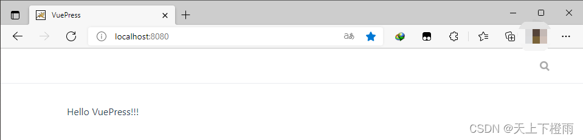
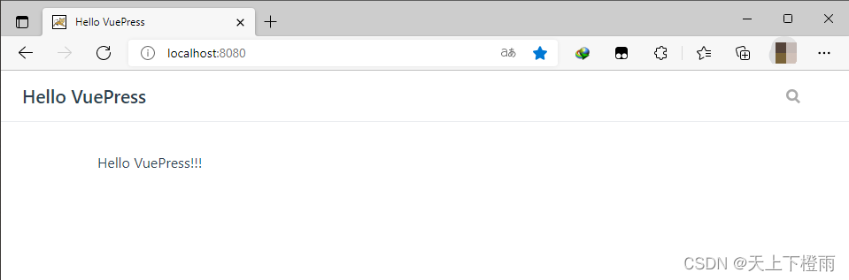
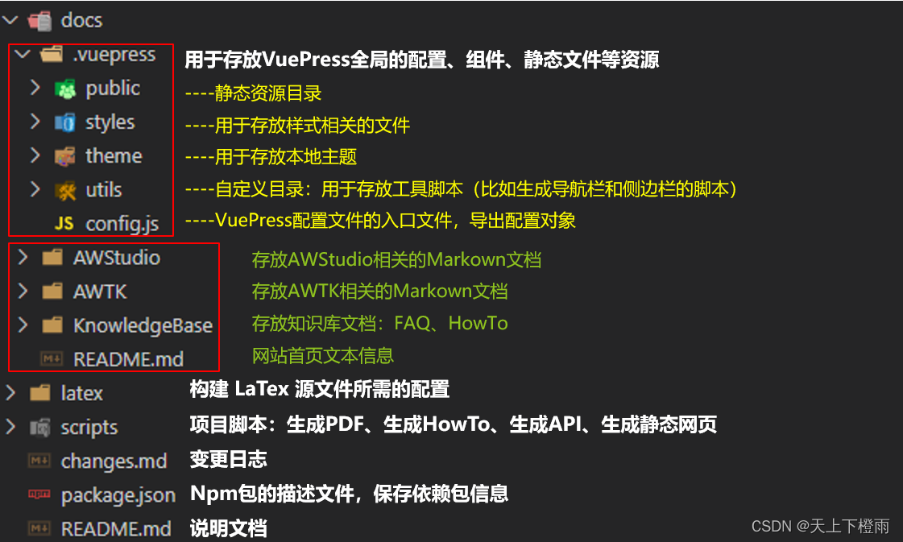
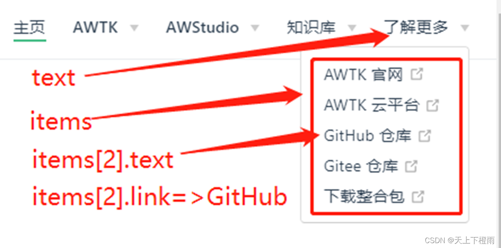
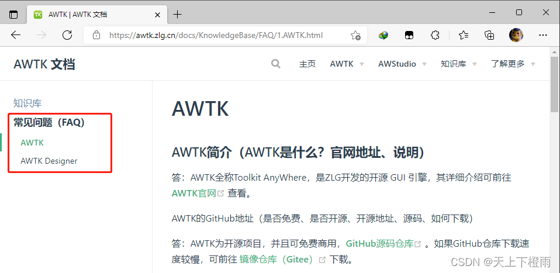
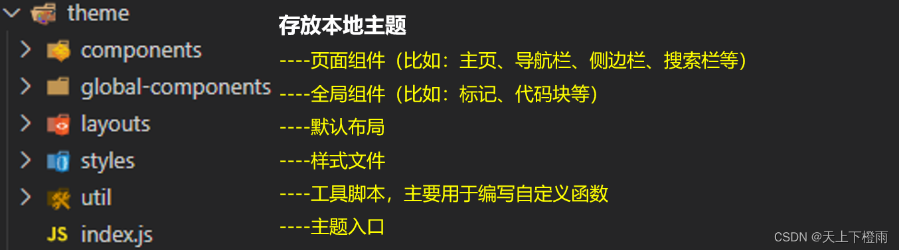
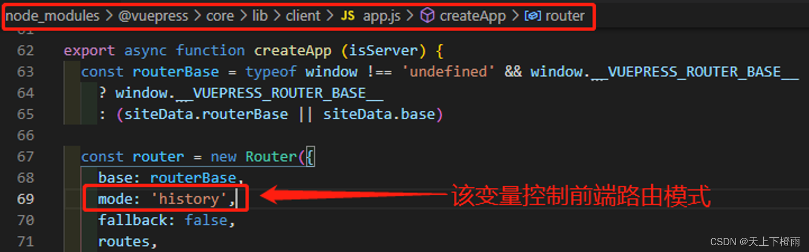

## 1 前言

近期由于工作需要，接触了一些静态网页生成器，选中了 VuePress，具体可以先看看：[云文档托管方案分析](./cloud_document.md)。

## 2 VuePress是什么？

VuePress是尤雨溪尤大为了支持 Vue 及其子项目的文档需求而写的一个项目，VuePress界面十分简洁，并且非常容易上手，花少量时间就可以将项目架构搭好，具体效果可以看：[VuePress的官方文档](https://vuepress.vuejs.org/zh/guide/)。

一个 VuePress 网站是一个由 [Vue](https://vuejs.org/) 、[Vue Router](https://github.com/vuejs/vue-router) 和 [webpack](https://webpack.js.org/) 驱动的单页应用，其基于Vue实现，因此可以嵌入各种Vue组件来实现扩展功能。

## 3 环境搭建

1. 环境要求：Node.js >= 8.6；

2. 新建一个文件夹，如：mydocs；

3. 新建 mydocs/package.json 文件，并安装 VuePress：

```bash
npm install -D vuepress
```

4. 在 package.json 中加入以下脚本：

```json
{
    "scripts": {
        "docs:dev": "vuepress dev docs",
        "docs:build": "vuepress build docs",
    }
}
```

5. 在 mydocs 下新建 docs 目录，并新建 docs/README.md 文件，并在其中添加文本 “Hello VuePress!!!”；

6. 执行以下命令预览效果：

```bash
npm run docs:dev
```

命令执行成功：

```bash
success [11:24:18] Build ba39f5 finished in 6893 ms!
> VuePress dev server listening at http://localhost:8080/
```

7. 访问 http://localhost:8080/ ，可以看到我们添加的 “Hello VuePress!!!”：



8. CTRL + C 结束预览，执行以下命令生成静态网页：

```bash
npm run docs:build
```

命令执行成功：

```bash
PS E:\.RainMic1019\blog> npm run docs:build

> @ docs:build E:\.RainMic1019\blog
> vuepress build docs

wait Extracting site metadata...
tip Apply theme @vuepress/theme-default ...
tip Apply plugin container (i.e. "vuepress-plugin-container") ...
tip Apply plugin @vuepress/register-components (i.e. "@vuepress/plugin-register-components") ...
tip Apply plugin @vuepress/active-header-links (i.e. "@vuepress/plugin-active-header-links") ...
tip Apply plugin @vuepress/search (i.e. "@vuepress/plugin-search") ...
tip Apply plugin @vuepress/nprogress (i.e. "@vuepress/plugin-nprogress") ...

√ Client
  Compiled successfully in 8.88s

√ Server
  Compiled successfully in 6.08s

wait Rendering static HTML...
success Generated static files in docs\.vuepress\dist.
```

打包好的静态网页位于：mydocs/docs/.vuepress/dist。

## 4 基础配置

1. 在 docs/.vuepress 文件夹下创建config.js，它是VuePress必要的配置文件，导出一个JavaScript对象。

2. 我们可以先加入以下配置：

```js
module.exports = {
  title: 'Hello VuePress',
  description: 'Just playing around'
}
```

再次预览可以看到网页标题已经改变了：



导出对象的更多配置详见：[VuePress的官方文档](https://vuepress.vuejs.org/zh/config/#%E5%9F%BA%E6%9C%AC%E9%85%8D%E7%BD%AE)。

我们接下来侧重讲 VuePress 项目的目录结构以及导航栏与侧边栏的配置。

### 4.1 目录结构



> 备注：其中 LaTex 相关的内容可以无视，这是用来生成 PDF 的配置文件。

### 4.2 导航栏

**导航栏** 列表默认位于网页右上方，需要配置属性 themeConfig.nav，它是一个Array类型的变量，可以配置多个，其中每个元素包含显示文本 text 和指向链接 link，如果需要做成下拉列表，则使用名为 items 的数组替换 link 属性。

link 是地址：

- 以 / 开头 和 / 结尾，默认读取文件夹下的 README.md。
- 仅以 / 开头，不写 .md 后缀，默认读取文件夹下对应的 markdown 文件。
- 如果是其它链接，直接写地址就行。
- 要配置多个，使用 items 嵌套。此时就是一个下拉列表。

```js
module.exports = {
    ...
    themeConfig: {
        nav: [
            { text: '主页', link: '/' },
            ...
            {
                text: '知识库',
                items: [
                    { text: 'FAQ', link: '/KnowledgeBase/FAQ/1.AWTK' },
                    { text: 'HowTo', link: '/KnowledgeBase/HowTo/api_doc' }
                ]
            },
            {
                text: '了解更多',
                items: [
                    { text: 'AWTK 官网', link: 'https://www.zlg.cn/index/pub/awtk.html' },
                    { text: 'AWTK 云平台', link: 'https://awtk.zlg.cn/' },
                    { text: 'GitHub 仓库', link: 'https://github.com/zlgopen/awtk' },
                    { text: 'Gitee 仓库', link: 'https://gitee.com/zlgopen/awtk' },
                    {...},
                ]
            }
        ]
    }
}
```



### 4.3 侧边栏

**侧边栏** 默认位于网页左侧，需要配置属性 themeConfig.sidebar，它是一个Object类型的变量，可以配置多个，其中每个元素包含文件路径 key 和该文件路径下的侧边栏详细配置 value，比如：文件路径为 /KnowledgeBase/FAQ/，其中有两个文档：AWTK、AWTK Designer。


```js
module.exports = {
    ...
    themeConfig: {
        sidebar: {
          '/KnowledgeBase/FAQ/': [{
              title: '常见问题（FAQ）',
              children: [
                {title:'AWTK',path:'1.AWTK'},
                {title:'AWTK Designer',path:'2.AWTK Designer’}
              ]
            }]
         }
     }
}
```



### 4.4 自动生成侧边栏

通常文档多的时候手动配置侧边栏非常麻烦，因此这里采用了脚本自动生成，其原理如下：

1. 遍历指定路径中的Markdown文档，并过滤掉无关文档；
2. 通过符号“.”切割文件名获取序号，根据文档序号进行排序；
3. 抽取文档名称作为侧边栏标题（title），并拼接出文档路径（path）

代码如下：

```js
// docs/.vuepress/utils/genSidebar.js
const fs = require('fs');
const rpath = require('path');

// 获取根目录
var DOCS_PATH = rpath.resolve(__dirname, '../..');

// 比较文档序列
function cmpMarkDown(md1, md2) {
    var ls1 = md1.split('.');
    var ls2 = md2.split('.');
    return parseInt(ls1[0]) - parseInt(ls2[0]);
}

// 获取md文档列表
function getMarkDownList(path, is_sort) {
    var list = new Array();
    if (typeof path == "string" && typeof is_sort == "boolean") {
        let file_list = fs.readdirSync(path);
        for (let i = 0; i < file_list.length; i++) {
            let file = file_list[i];
            if (file.endsWith('.md') && file.indexOf('README') == -1) {
                list.push(file);
            }
        }
        if (is_sort) {
            list.sort(cmpMarkDown)
        }
    }
    return list;
}

// 裁剪到文本左侧的特殊字符
function trimRight(string) {
    var str = new String();
    if (typeof string == "string") {
        str = string
        var filter = new String(' \t\r\n');
        if (filter.indexOf(str.charAt(str.length - 1) != -1)) {
            var i = str.length - 1;
            while (i >= 0 && filter.indexOf(str.charAt(i)) != -1) {
                i--;
            }
            str = str.substring(0, i + 1);
        }
        return str;
    }
    return undefined;
}

var genSidebar = {
    // 生成侧边栏
    genDefaultSidebar: function (path, name, version, is_sort, depth) {
        var result = new Array();
        var object = new Object();
        if (typeof path == "string" && typeof name == "string" && typeof version == "string") {
            let target_path = rpath.resolve(DOCS_PATH, path);
            if (typeof depth != "number") {
                depth = 2;
            }
            object.title = name + '_' + version;
            object.collapsable = false;
            object.sidebarDepth = depth;
            object.children = new Array();

            let md_list = getMarkDownList(target_path, is_sort);
            for (let i = 0; i < md_list.length; i++) {
                let md = md_list[i];
                let ls = md.split('.');
                let iter = new Object();
                if (ls.length > 2) {
                    iter.title = ls[1];
                    iter.path = ls[0] + '.' + ls[1];
                } else {
                    iter.title = ls[0];
                    iter.path = ls[0];
                }
                object.children.push(iter);
            }
        }
        result.push(object);
        return result;
    }
}

module.exports = genSidebar;
```

在 config.js 中的调用如下：

```js
// docs/.vuepress/config.js
const genSidebar = require('./utils/genSidebar.js');
...
/* 生成侧边栏配置 */
var sidebar = {
    '/KnowledgeBase/FAQ/': genSidebar.genDefaultSidebar('KnowledgeBase/FAQ', '常见问题（FAQ）', '知识库', true, 2),
    /* fallback 侧边栏必须最后定义，否则会导致侧边栏无法使用 */
    '/': ['']
}

/* vuepress 的配置对象 */
var config = {
    ...
    themeConfig: {
        sidebar: sidebar,
    },
}
```

## 5 自定义主题

出于美观考虑，VuePress的默认主题并不能完全满足我们的需求，此时我们可以自定义主题。由于改动不大，我们可以弹出默认主题，在它的基础上进行修改：

- 将VuePress的默认主题但弹出到 docs/.vuepress 中：vuepress eject docs；
- 成功后会生成 docs/.vuepress/theme 目录，其中就是默认主题的源码文件；
- 目录结构：



比如我们想修改网页首页，那么就可以直接修改 theme/components/Home.vue。

## 6 避坑指南

### 6.1 侧边栏无法正常使用

定义多个侧边栏时，确保 fallback 侧边栏（根目录‘/’ ）被最后定义，否则无法正常使用。

### 6.2 生成静态网页时出现解析错误

Markdown文档所在路径不能包含中文，否则生成静态网页时会出现解析错误。

### 6.3 部署站点无法使用相对路径

部署站点的基础路径默认为根目录‘/’，并且只能设置为绝对路径，比如我们项目的‘/docs/’。

### 6.4 预览或编译时内存溢出（OOM）

预览或编译时内存溢出（OOM），比如出现以下报错时：

```bash
<--- Last few GCs --->

[10064:00000000043D71B0]   273399 ms: Scavenge 1382.9 (1421.7) -> 1382.3 (1422.7) MB, 3.1 / 0.0 ms  (average mu = 0.127, current mu = 0.068) allocation failure
[10064:00000000043D71B0]   273404 ms: Scavenge 1383.1 (1422.7) -> 1382.5 (1423.2) MB, 3.2 / 0.0 ms  (average mu = 0.127, current mu = 0.068) allocation failure
[10064:00000000043D71B0]   273409 ms: Scavenge 1383.3 (1423.2) -> 1382.7 (1423.7) MB, 3.0 / 0.0 ms  (average mu = 0.127, current mu = 0.068) allocation failure


<--- JS stacktrace --->

==== JS stack trace =========================================
......
FATAL ERROR: Ineffective mark-compacts near heap limit Allocation failed - JavaScript heap out of memory
......
```

【原因分析】Node通过JavaScript使用内存时只能使用部分内存，64位系统下约1.4 GB/32位系统约0.7 GB。

【解决方案】设置 node 内存使用上限(单位：M)： set NODE_OPTIONS=--max_old_space_size=8192

### 6.5 页面刷新异常或点击前进/返回异常： 

两种前端路由模式：

**Hash（#）**：监听URL中hash的变化，渲染页面，它不向服务器发送请求，不需要服务端的支持

- 当页面中的hash发生变化时（在URL后面添加#xxxx），会触发hashchange事件；
- 事件中的event对象有oldURL和newURL两个属性，这样就能根据对应的hash值，做出相应操作；

比如，http://www.abc.com/#/hello，hash 的值为 #/hello。它的特点在于：hash 虽然出现在 URL 中，但不会被包括在 HTTP 请求中，对后端完全没有影响，因此改变 hash 不会重新加载页面。

**History（/）**：监听URL中的路径变化，需要客户端和服务端共同的支持

利用了 HTML5 中新增的 pushState() 和 replaceState() 方法。它们应用于浏览器的历史记录栈，提供了对历史记录进行修改的功能。只是当它们执行修改时，虽然改变了当前的 URL，但浏览器不会立即向后端发送请求。

了解更多：[前端路由hash、history原理及简单的实践下 - 龙恩0707 - 博客园 (cnblogs.com)](https://www.cnblogs.com/tugenhua0707/p/10859214.html)

VuePress 对 hash 模式的处理有问题，当刷新页面或返回页面时， hashchange 事件的回调函数没有处理好，hash 路由表更新有误，导致网页访问出错。

因此，建议使用 VuePress 默认 history 模式，路由模式修改方式如下：

- 打开 node_modules/@vuepress/core/lib/client/app.js 文件；
- 找到 createApp 函数，修改 router 对象中的 mode 属性为 history。



### 6.6 生成静态网页时内存消耗过多

VuePress v1.x 的在生成静态网页时，随着页面个数增多，消耗的内存会异常高。

比如：1300 个页面，消耗内存约 7G，耗时 100 分钟，根据官方资料以及类似的问题分析，原因如下：

- VuePress v1.x 需要通过将所有页面的数据加载到内存来生成搜索框所需的索引文件；
- VuePress v1.x 使用 webpack 作为内核打包静态网页，而该工具本身消耗内存就比较多；
- VuePress v1.x 疑似存在内存泄露，但官方人员说将不会在 v1.x 版本上修复，建议用户升级到 v2.x；

因此，有条件的话可以迁移到 [VuePress v2.x](https://v2.vuepress.vuejs.org/zh/) 上。

参考资料：

【官方issue】

- [https://github.com/vuejs/vuepress/issues/2448](https://github.com/vuejs/vuepress/issues/2448)
- [https://github.com/vuejs/vuepress/issues/2689](https://github.com/vuejs/vuepress/issues/2689)
- [https://github.com/vuepress/vuepress-next/issues/8](https://github.com/vuepress/vuepress-next/issues/8)

【类似的问题】

- [https://github.com/openupm/openupm/issues/2427](https://github.com/openupm/openupm/issues/2427)
- [https://github.com/ipfs/ipfs-blog/issues/41](https://github.com/ipfs/ipfs-blog/issues/41)
