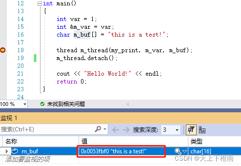

## 1 前言

本文接上文 [C++并发与多线程笔记一](./cpp_multithreading_1.md) 的内容，主要包含线程传参详解，detach()的坑以及成员函数做线程函数。

## 2 传递临时对象作为线程参数

先来看一个程序：

```cpp
#include <iostream>
#include <thread>
using namespace std;

void my_print(const int &i, char *pbuf)
{
	cout << i << endl;
	cout << pbuf << endl;
	return;
}

int main()
{
	int var = 1;
	int &m_var = var;
	char m_buf[] = "this is a test!";

	thread m_thread(my_print, m_var, m_buf);
	m_thread.join();

	cout << "Hello World!" << endl;
	return 0;
}
```

输出结果：

```bash
1
this is a test!
Hello World!
```

看起来貌似正常，但其中存在一个非常大的隐患。

### 2.1 要避免的陷阱一

假如将上述程序中 `join()` 改为 `detach()`，会发生什么情况？

上一篇博客讲过，使用 `detach()` 分离两个线程可能会导致主线程在子线程结束前就跑完了，那么此时子线程的引用参数 `i` 指向的局部变量 `var` 就已经被释放掉了，但实际情况并不是这样。

我们可以在主线程中监控中 `var` 和 `m_var` 的地址，如下图所示，可以看出二者的地址一样：


接着我们再来看看线程 `m_thread` 中变量 `i` 的地址，很明显，这个 `i` 指向的地址已经变了，它是个假引用，也就是说创建 `m_thread` 对象的时候，内部将 `m_var` 的值复制了一份给子线程的参数 `i`。

**这里虽然用了引用符号，但实际上的线程传参是值传递。**


因此，此处即使调用 `detach()` 也是安全的，但虽然是安全的也不建议这样做，容易造成误解。

### 2.2 要避免的陷阱二

按照同样的步骤，我们再监控一下主线程和子线程中的 `m_buf` 变量：

主线程中的 `m_buf` ：



子线程中的 `m_buf` ：


可以看出，两个线程中 `m_buf` 的地址是一模一样的，调用 `detach()` 后，当主线程运行完毕  `m_buf` 就会被释放，子线程如果在此时继续执行就会有问题，可能导致程序跑飞，这是不安全的。

#### 2.2.1 使用string类型解决问题

这里可以将 `p_buf` 的类型由 `char*` 改为 `string` 类型的引用来解决这个问题，原理与上文 2.1 中的 `const int &i` 参数一样，都是在创建 `m_thread` 对象的时候复制一份临时变量：

```cpp
#include <iostream>
#include <thread>
#include <string>
using namespace std;

void my_print(const int i, const string &pbuf)
{
	cout << i << endl;
	cout << pbuf << endl;
	return;
}

int main()
{
	int var = 1;
	char m_buf[] = "this is a test!";

	/* 如果detach了，这样仍然是不安全的 */
	/* 假如这样写：thread m_thread(my_print, var, m_buf); */
	/* 存在主线程运行完了（m_buf已被回收），系统采用m_buf隐式类型转换成string */
	/* 建议在代码中显式转换，先创建一个临时对象string(mybuf)，这样就绝对安全了 */
	thread m_thread(my_print, var, string(m_buf));
	m_thread.detach();

	cout << "Hello World!" << endl;
	return 0;
}
```

#### 2.2.2 为什么显式转换可以解决m_buf被回收的问题？

##### 2.2.2.1 简单验证

我们构造一个类型 A 来测试验证这个问题，代码如下：

```cpp
#include <iostream>
#include <thread>
using namespace std;

class A
{
public:
	int m_i;
	/* 构造函数，此处实际上是把一个int转成类型A的对象，又称类型转换构造函数 */
	A(int a) : m_i(a) { cout << "[A::A(int a) exec]" << endl; }
	/* 拷贝构造函数 */
	A(const A &a) : m_i(a.m_i) { cout << "[A::A(const A &a) exec]" << endl; }
	/* 析构函数 */
	~A() { cout << "[A::~A() exec]" << endl; }
};

void my_print(const int i, const A &pbuf)
{
	cout << &pbuf << endl; /* 打印pbuf的地址 */
	return;
}

int main()
{
	int var = 1;
	int secondpar = 12;
	/* 由于存在类型转换构造函数，这里的secondpar可以被隐式转换成A类型对象传递给my_print()函数 */
	thread m_thread(my_print, var, secondpar);
	m_thread.join();

	cout << "Hello World!" << endl;
	return 0;
}
```

输出结果：

```bash
[A::A(int a) exec]
00A7FD1C
[A::~A() exec]
Hello World!
```

此时的结果是正常的，先构造一个A类型的对象，拷贝到子线程中使用，然后打印出这个对象的地址，最后再调用析构函数释放对象。

接下来把代码中的 `m_thread.join()` 换成 `m_thread.detach()` ，输出结果如下：

```bash
Hello World!
```

可以看到，直到主线程运行完毕为止，类型A的构造函数都没有被调用过，即对象还没构建出来，也就是说这里的隐式转换是在 main() 函数运行完之后才执行的，那么子线程再继续跑肯定就出问题了，`const A &pbuf` 的内容根本不知道。

将这里的隐式转换改写为显式转换，代码如下：

```cpp
thread m_thread(my_print, var, A(secondpar));
```

输出结果：

```cpp
[A::A(int a) exec]
[A::A(const A &a) exec]
[A::~A() exec]
Hello World!
```

可以看出显式转换后，调用了类型A的构造函数创建了一个临时的类型A对象，然后又调用了类型A的拷贝构造函数，给子线程拷贝了一份这个临时A对象作为 `const A &pbuf` 参数。

由于这里用的还是 `m_thread.detach()`，所以子线程中的信息没有打印出来，我们可以换成`m_thread.join()`，再看看结果：

```cpp
[A::A(int a) exec]
[A::A(const A &a) exec]
[A::~A() exec]
007AFAD0
[A::~A() exec]
Hello World!
```

这样子线程中打印的信息就出来了，包括 `pbuf` 参数的地址和创建子线程时拷贝的那份A对象的析构函数。

##### 2.2.2.2 线程ID概念

每个线程都一个唯一的标识数字，称为线程ID，这里可以用 C++ 标准库里的函数来获取：`std::this_thread::get_id();`

##### 2.2.2.3 临时对象构造时机抓捕

我们给类型A添加一些代码，让我们能知道每个类型A对象具体是在哪一个线程中构造的，然后用隐式转换来看看结果，代码如下：

```cpp
#include <iostream>
#include <thread>
using namespace std;

class A
{
public:
	int m_i;
	/* 构造函数，此处实际上是把一个int转成类型A的对象，又称为类型转换构造函数 */
	A(int a) : m_i(a)
	{
		cout << "[A::A(int a) exec]  ";
		cout << "thread_id = " << this_thread::get_id() << "  ";
		cout << this << "  " << endl;
	}
	/* 拷贝构造函数 */
	A(const A &a) : m_i(a.m_i)
	{
		cout << "[A::A(const A &a) exec]  ";
		cout << "thread_id = " << this_thread::get_id() << "  ";
		cout << this << "  " << endl;
	}
	/* 析构函数 */
	~A()
	{
		cout << "[A::~A() exec]  ";
		cout << "thread_id = " << this_thread::get_id() << "  ";
		cout << this << "  " << endl;
	}
};

void my_print(const A &pbuf)
{
	cout << "sub thread_id = " << this_thread::get_id() << "  "; /* 打印子线程ID */
	cout << "&pbuf = " << &pbuf << endl;						 /* 打印pbuf的地址 */
	return;
}

int main()
{
	cout << "main thread_id = " << this_thread::get_id() << endl; /* 打印主线程ID */

	int var = 12;
	thread m_thread(my_print, var); /* 使用隐式转换 */
	m_thread.join();

	cout << "Hello World!" << endl;
	return 0;
}
```

输出如下：

```cpp
main thread_id = 8108
[A::A(int a) exec]  thread_id = 19076  00ADFC7C
sub thread_id = 19076  &pbuf = 00ADFC7C
[A::~A() exec]  thread_id = 19076  00ADFC7C
Hello World!
```

可以看出，使用隐式转换传参时，类型A的对象是在子线程中构造的，如果使用 `m_thread.detach()` ，那主线程都跑完了，`var` 对象都被释放了，再去构造A对象显然就出问题了，这就是为什么不能用隐式转换的原因。

我们再看看使用显式转换的结果，代码如下：

```cpp
thread m_thread(my_print, A(var));
```

输出结果：

```bash
main thread_id = 11520
[A::A(int a) exec]  thread_id = 11520  004FF648
[A::A(const A &a) exec]  thread_id = 11520  0091FA18
[A::~A() exec]  thread_id = 11520  004FF648
sub thread_id = 3988  &pbuf = 0091FA18
[A::~A() exec]  thread_id = 3988  0091FA18
Hello World!
```

使用显式转换后，可以看到A类对象的构建过程和拷贝过程都是在主线程中完成的，这就确保了子线程在使用该参数时是安全的。

### 2.3 临时变量传参小节

1. 如果传递int这种简单类型，推荐使用值传递，不要用引用；
2. 如果传递类对象，要避免使用隐式类型转换，必须在代码中显式转换（相当于创建一个临时变量），然后在函数参数里，用引用来接（），虽然该方法安全，但不易理解，不推荐使用，
3. 不建议使用 detach()，用了非常容易出问题。

> 备注：关于上述第二点，如果不用引用来接，而是直接用对象来接，比如 `void my_print(const int i, const A pbuf)`，则会额外再调用一次类型A的拷贝构造函数，浪费资源。

需要注意的是，从上文来看，**虽然传递临时对象作为线程参数（值传递）是可行且安全的，但在实际应用通常都不会这样做。**

因为太难控制了，随着版本迭代，代码量不断增加，要记住每个线程传参的生命周期，显然是不切实际的，而且像C语言是不会在创建子线程时把临时变量额外拷贝一份的。

## 3 传递类对象、智能指针作为线程参数

### 3.1 std::ref 传参

通过上面的代码测试，可以知道子线程回调函数`my_print`中的 `const A &pbuf` 参数是一个拷贝出来的对象，也就是说，在子线程中修改该对象中的成员，比如修改`pbuf.m_i = 66`，是不会传回给主线程的，代码如下：

```cpp
#include <iostream>
#include <thread>
using namespace std;

class A
{
public:
	mutable int m_i; /* 添加mutable修饰，让m_i能被修改 */
	/* 构造函数，此处实际上是把一个int转成类型A的对象，又称为类型转换构造函数 */
	A(int a) : m_i(a) { cout << "[A::A(int a) exec]" << endl; }
	/* 拷贝构造函数 */
	A(const A &a) : m_i(a.m_i) { cout << "[A::A(const A &a) exec]" << endl; }
	/* 析构函数 */
	~A() { cout << "[A::~A() exec]" << endl; }
};

void my_print(const A &pbuf)
{
	pbuf.m_i = 66;
	cout << "my_print pbuf.m_i = " << pbuf.m_i << endl;
	return;
}

int main()
{
	A obj(10);
	thread m_thread(my_print, obj);
	m_thread.join();

	cout << "main obj.m_i = " << obj.m_i << endl;
	cout << "Hello World!" << endl;
	return 0;
}
```

输出结果：

```bash
[A::A(int a) exec]
[A::A(const A &a) exec]
my_print pbuf.m_i = 66
[A::~A() exec]
main obj.m_i = 10
Hello World!
[A::~A() exec]
```

这里就容易造成误解：传给子线程的是一个引用，但修改这个引用的值，却不会同步修改引用的原值，所以一定要记住**这是个假引用**。 

如果希望这个变成一个真引用，则可以调用 `std::ref()` 包装引用传递的值，代码如下：

```cpp
class A
{
public:
	int m_i; /* 可以删除 mutable 修饰 */
	...
};

void my_print(A &pbuf) /* 可以删除 const 修饰 */
{
	...
}

int main()
{
	...
	thread m_thread(my_print, ref(obj)); /* 调用 std::ref() 包装引用传递的值 */
	...
	return 0;
}
```

输出结果：

```bash
[A::A(int a) exec]
my_print pbuf.m_i = 66
main obj.m_i = 66
Hello World!
[A::~A() exec]
```

> 备注：C++本身有引用，C++11引入了std::ref，主要是考虑函数式编程（如std::bind）在使用时，是对参数直接拷贝，而不是引用。C++11的设计者认为默认应该采用拷贝，如果使用者有需求，加上std::ref即可。

### 3.2 智能指针传参

智能指针 unique_ptr 不支持拷贝构造（不能拷贝，只能移动），如果要将 unique_ptr 对象传入子线程，需要调用 `std::move()`，代码如下：

```cpp
#include <iostream>
#include <thread>
using namespace std;

void my_print(unique_ptr<int> pInt)
{
	cout << "my_print pInt = " << pInt << endl;
	cout << "my_print *pInt = " << *pInt << endl;
	return;
}

int main()
{
	unique_ptr<int> var(new int(100));
	cout << "main before move var = " << var << endl;
	/* 独占式指针只能通过std::move()才可以传递给另一个指针 */
	/* 传递后var就指向空，新的pInt指向原来的内存 */
	/* 因此这里就不能用detach()了（如果主线程先执行完，pInt指向的对象就被释放了） */
	thread m_thread(my_print, move(var));
	m_thread.join();

	cout << "main after move var = " << var << endl;
	cout << "Hello World!" << endl;
	return 0;
}
```

输出结果：

```bash
main before move var = 012BB4D8
my_print pInt = 012BB4D8
my_print *pInt = 100
main after move var = 00000000
Hello World!
```

## 4 用成员函数指针做线程函数

上文 [C++并发与多线程笔记一](./cpp_multithreading_1.md) 中记录了重载类的`()`操作（ 即 `operator()` ）作为线程回调函数，此处介绍使用类中任意一个成员函数作为线程回调函数，代码如下：

```cpp
#include <iostream>
#include <thread>
using namespace std;

class A
{
public:
	int m_i;
	/* 构造函数，此处实际上是把一个int转成类型A的对象，又称为类型转换构造函数 */
	A(int a) : m_i(a) { cout << "[A::A(int a) exec]" << endl; }
	/* 拷贝构造函数 */
	A(const A &a) : m_i(a.m_i) { cout << "[A::A(const A &a) exec]" << endl; }
	/* 析构函数 */
	~A() { cout << "[A::~A() exec]" << endl; }
	/* 成员函数做线程回调函数 */
	void thread_work(int num)
	{
		cout << "thread_work exec" << endl;
	}
};

int main()
{
	A obj(10);
	int var = 15;
	/* 参数一：成员函数指针 */
	/* 参数二：A类对象 */
	/* 参数三：回调函数参数 */
	/* 参数..：回调函数参数 */
	thread m_thread(&A::thread_work, obj, var);		    /* obj对象会被拷贝一份传入子线程 */
	// thread m_thread(&A::thread_work, ref(obj), var); /* obj对象直接传入子线程 */
	// thread m_thread(&A::thread_work, &obj, var);	    /* 与std::ref()一样，obj对象也是直接传入子线程(&obj为取地址) */
	m_thread.join();

	cout << "Hello World!" << endl;
	return 0;
}
```

输出结果：

```bash
[A::A(int a) exec]
[A::A(const A &a) exec]
thread_work exec
[A::~A() exec]
Hello World!
[A::~A() exec]
```
