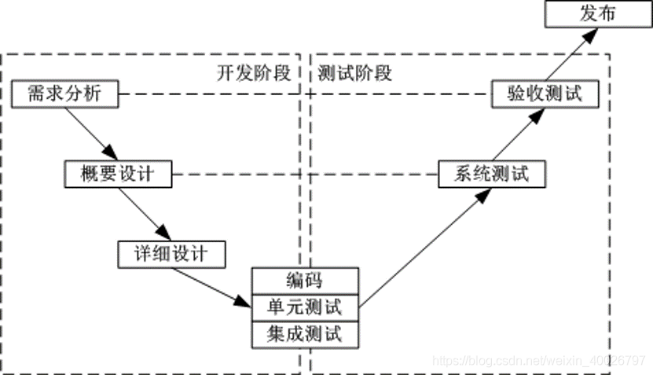
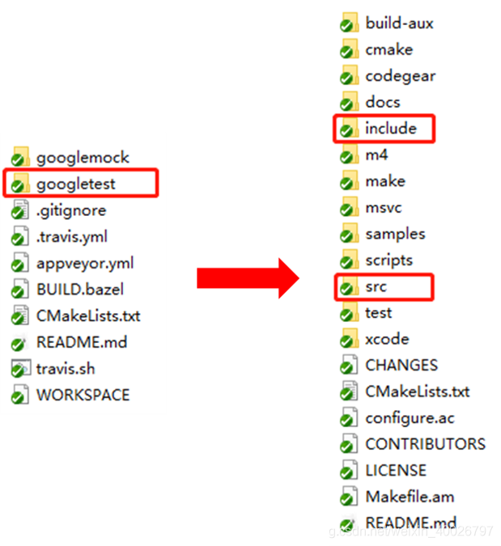
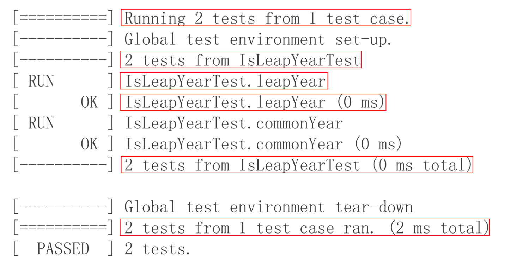
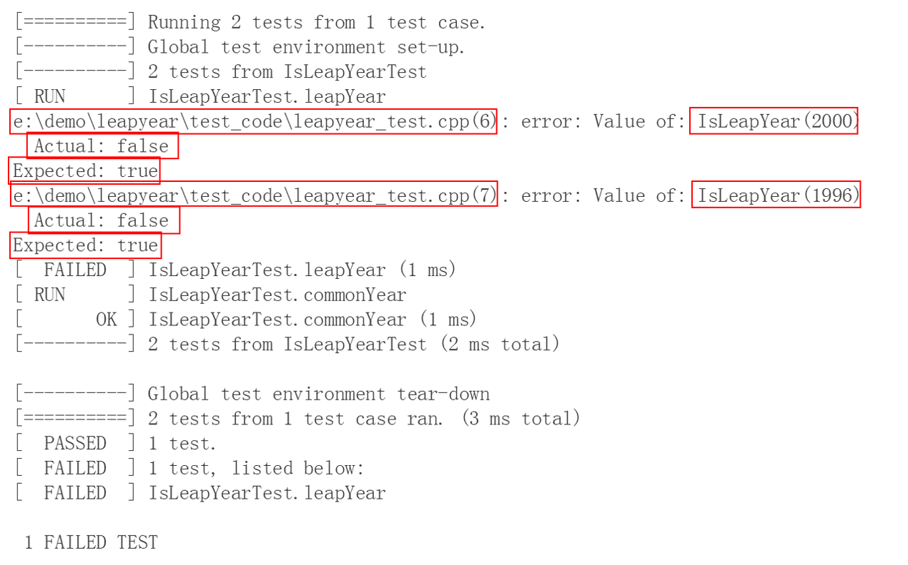

## 1 前言

在大学的时候，写代码随心所欲，想到什么就写什么，只顾实现功能，也不会去验证代码的可行性和稳定性，往往都会在在后续的使用过程中出现各种各样的问题，然后再去捉虫，这样写出来的代码质量差，在后期又耗费大量的时间修复旧代码bug。

参加工作后，接触到了单元测试，在第一个月的考核项目（智能家居控制面板）中，通过请教同事和参考AWTK源码中的单元测试代码，磕磕绊绊得写了一些单元测试，但由于没有设计好项目基础框架，业务逻辑和用户界面没有完全分离，因此只做了文件读写模块和网络通信模块的单元测试。刚好在本周的培训内容中又详细讲了单元测试的FIRST原则，以下记录了单元测试的学习感悟，并使用Google公司开源的C/C++单元测试框架——GTest进进行单元测试。

> 备注：AWTK是ZLG开源的GUI框架：https://github.com/zlgopen/awtk

## 2 什么是单元测试？

软件测试包括单元测试、集成测试、系统测试。

1. 单元测试：对软件设计的最小单位进行正确性测试，以检验程序单元是否满足功能、性能、接口、设计规约等要求。
2. 集成测试：将各个程序单元进行有序的、递增的组合进行测试，以检验各个程序单元的配合情况。
3. 系统测试：对集合了应用软件、系统软件、硬件的产品进行测试，以验证产品在实际应用中的功能、性能等特性。

根据传统的开发模型，如瀑布模型，软件开发过程和软件测试活动的关系可以反映为经典的软件测试V模型，如下图：



其中单元测试中的单元指软件中承担单一职责的单位，通常在程序中体现为一个函数、一个文件、一个类、一个模块等。单元测试都是以自动化方式执行，所以在大量回归测试的场景下更能带来高收益。并且单元测试代码里会提供函数的使用示例，因为单元测试的具体表现形式就是对各种函数以各种不同输入参数组合进行调用。

## 3 为什么需要单元测试？

在我随心所欲写程序时，经常会遇到一些问题，例如：

- 编译通过，但是要调试好久才能正常运行；
- 好不容易调试好了，但是一测试就会出一堆bug；
- 修复已有的bug，总会产生新的bug；
- bug难以重现，又无法定位；
- 等等......

以上问题总结一下，就是“你写的代码并不是你想要的结果”，而单元测试则是能保证“你写的代码是你想要的结果”的最有效办法。

单元测试阶段发现的bug更容易定位，并且由于单元测试自动化的特点，更加方便重现bug。在单元测试阶段发现bug，立即修复，不会将各种问题留到最后的系统测试阶段，让代码更可靠、更容易维护，减少后期测试、维护的成本。

总的来讲，单元测试能够提升代码质量，减少程序整体的调试时间。

## 4 如何做好单元测试？

单元测试需要遵循FIRST原则：

1. F-FAST（快速原则）：单元测试应该是可以快速运行的，在各种测试方法中，单元测试的运行速度是最快的，大型项目的单元测试通常应该在几分钟内运行完毕。
2. I-Independent（独立原则）：单元测试应该是可以独立运行的，单元测试用例互相无强依赖，无对外部资源的强依赖。
3. R-Repeatabl（可重复原则）：单元测试应该可以稳定重复的运行，并且每次运行的结果都是稳定可靠的。
4. S-Self Validating（自我验证原则）：单元测试应该是用例自动进行验证的，不能依赖人工验证。
5. T-Timely（及时原则）：单元测试必须及时进行编写，更新和维护，以保证用例可以随着业务代码的变化动态的保障质量。

下面会基于GTest框架来说明这五个原则。

## 5 基于GTest进行单元测试

### 5.1 快速了解GTest

GTest全称GoogleTest，是Google公司发布的一款非常优秀的开源C/C++单元测试框架，已被应用于多个开源项目及Google内部项目中，包括ChromeWeb浏览器、LLVM编译器框架等。

> 备注：GTest源码：https://github.com/google/googletest

下载或克隆源码后，可以看见目录结构如下图，通常我们进行单元测试时需要用到目录是include和src。配置工程需要做以下三件事：

1. 包含目录：
   - [GTest目录名]/googletest/include;
   - [GTest目录名]/googletest;

2. 添加源文件：
   - [GTest目录名]/googletest/src/gtest-all.cc;

3. 包含头文件：

```c
#include <gtest/gtest.h>
```



进行单元测试前我们需要了解两个概念：测试用户、测试用例集。

- 测试用例：为了验证代码的行为与预期是否相符而进行的一系列活动，在单元测试中，这一系列的活动依靠代码来完成。
- 测试用例集：多个相似或相关的测试用例的集合，是为了方便我们对测试用例进行管理而产生的一个概念。通俗一点，测试用例集就是对测试用例进行分组。

```c
TEST(IsLeapYearTest, leapYear)   /* 用例集IsLeapYearTest，用例leapYear */
{
  EXPECT_TRUE(IsLeapYear(2000)); /* 测试IsLeapYear函数，传入参数2000 */
  EXPECT_TRUE(IsLeapYear(1996));
}
```

写好测试用例后，需要运行测试用例，代码如下：

```c
int main(int argc, char** argv)
{
  testing::FLAGS_gtest_filter = “*”;    /* 选择需要运行的用例 */
  testing::InitGoogleMock(&argc, argv); /* 初始化测试框架 */
  return RUN_ALL_TESTS();               /* 运行所选测试用例 */
}
```

写好测试用例后，GTest中可以用一下方式表示测试用例：

- "用例集.用例"，例如： "IsLeapYearTest. leapYear"；
- 可以使用通配符"\*"和"?"，例如："IsLeapYearTest.\*"；
- 使用":"连接多个匹配条件，例如："*. leapYear : *. commonYear"；
- 使用"-"排除用例，例如："-IsLeapYearTest.*"；

### 5.2 断言

断言可以理解为判断一个值或多个值是否满足指定条件，例如：

| 说明                           | 断言的宏调用           |
| ------------------------------ | ---------------------- |
| 判断一个值是否为真             | EXPECT_TRUE(val)       |
| 判断一个值是否与期望值相等     | EXPECT_EQ(exp, val)    |
| 判断两个值的大小               | EXPECT_LE(val1, val2)  |
| 判断一个字符串是否与期望值相等 | EXPECT_STREQ(exp, val) |

> 备注：更多GTest中断言的宏请查阅文档：[GTest目录名]/googletest/docs/primer.md

当判定通过时，无输出，如下图：



当判定失败时，GTest会输出断言位置和失败原因，如下图：



GTest中断言的宏可以理解为两类：ASSERT、EXPECT。

- ASSERT_\*：当检查点失败时，退出当前函数（执行return操作）。
- EXPECT_\*：当检查点失败时，继续往下执行。

### 5.3 使用GTest说明FIRST原则

看完以上内容，应该对GTest有了简单的认识，接下来就使用GTest框架来举例说明FIRST原则。

#### 5.3.1 F-FAST（快速原则）

在调试程序的过程中，需要多次运行单元测试去验证被测试模块是否正确，应该为了节省时间，单元测试必须可以快速执行。

```c
TEST(Fs, basic) {                      /* 测试文件接口的基本功能 */
  ASSERT_EQ(fs_test(os_fs()), RET_OK); /* 测试获取文件系统对象函数os_fs() */
}
```

#### 5.3.2 I-Independent（独立原则）

单元测试可独立运行，测试用例直接无依赖，对外部资源无依赖，测试顺序不影响测试结果，测试过程中产生的外部资源文件需要在测试完成后销毁。

```c
/* 测试文件接口的读取功能 */
TEST(Fs, read_part) {
 char buff[128];
 uint32_t size = 0;
 const char* str = "hello world";
 const char* filename = "test.bin";

 /* 测试前要创建被读取的文件 */
 file_write(filename, str, strlen(str));   
 char* ret = (char*)file_read(filename, &size);

 /* 进行测试，对读取到的结果ret进行验证 */
 ASSERT_EQ(file_read_part(filename, buff, sizeof(buff), 0), strlen(str));
 ASSERT_EQ(strcmp(ret, str), 0);
 ASSERT_EQ(size, strlen(str));

 /* 测试完成后删除被读取的文件，并释放缓冲区 */
 file_remove(filename);
 TKMEM_FREE(ret);
}
```

#### 5.3.3 R-Repeatabl（可重复原则）

单元测试需要可以稳定重复的运行，每次得到的结果需要保持一致，如果连测试结果都不稳定，或者测试过程经常出现失败的情况，那么单元测试也没有意义了。

```c
TEST(RandomNumber, Compared) {                 /* 测试随机数比较大小 */
 ASSERT_TRUE((rand() % 100) > (rand() % 100)); /* 无法保证每次结果都一致 */
}
```

#### 5.3.4 S-Self Validating（自我验证原则）

单元测试由用例自动进行验证的，不依赖人工验证，这是因为人工验证耗费不必要的时间，而且没有办法保证验证结果的准确性，通常来说单元测试的自我验证就是由测试程序直接告诉开发者通过或不通过，不需要让开发者通过输出结果来判断自己的测试用例是否通过。例如GTest的测试用例输出，输出OK表示通过，如下所示：

```bash
[ RUN      ] Fs.basic        # RUN表示执行Fs.basic测试用例
[       OK ] Fs.basic (4 ms) # OK表示Fs.basic用例测试通过
[ RUN      ] Fs.read_part
[       OK ] Fs.read_part (0 ms)
```

#### 5.3.5 T-Timely（及时原则）

单元测试必须及时进行编写，更新和维护，以保证用例可以随着业务代码的变化动态的保障质量。单元测试通常是在写函数实现前就需要写好的，这样能让单元测试在开发者写函数实现的过程中起到校验的作用，避免开发者犯错。

```c
TEST(Module, Function) {   /* 测试某模块的功能（函数） */
 ASSERT_TRUE(function());  /* 先按照期望结果测试function()，再去写function()的实现 */
}
```
