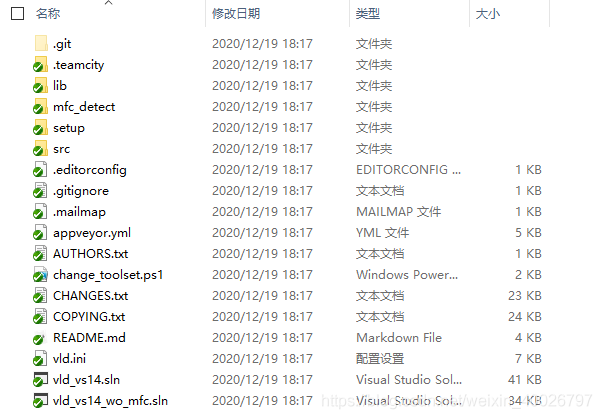
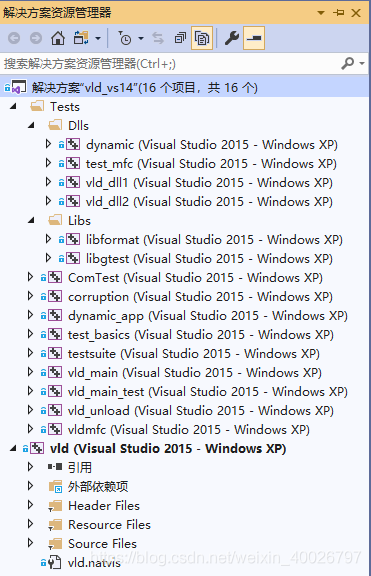
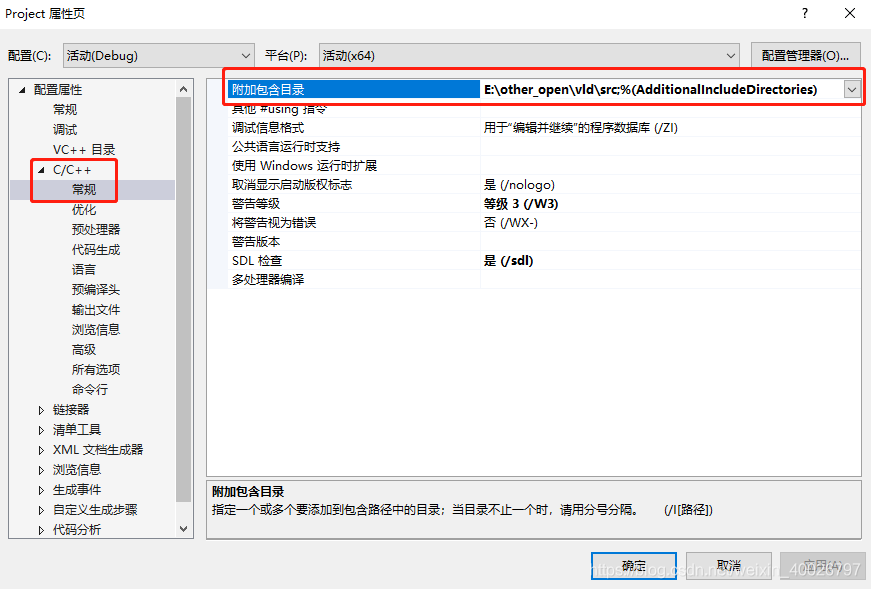
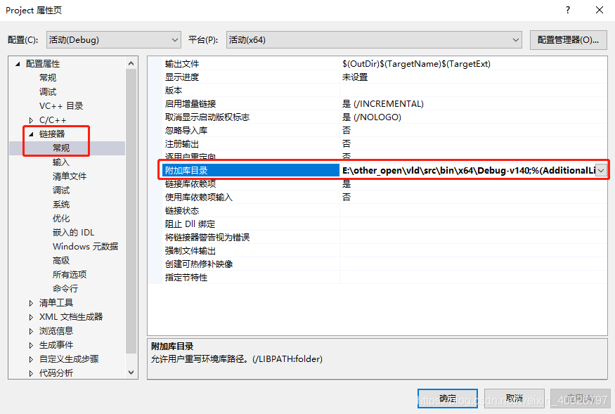
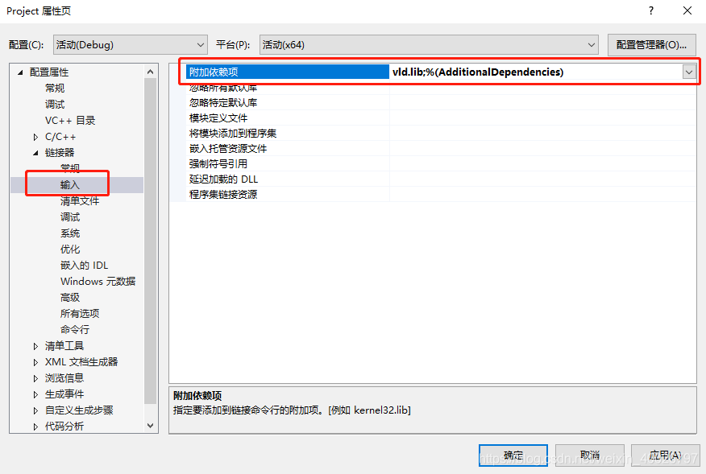
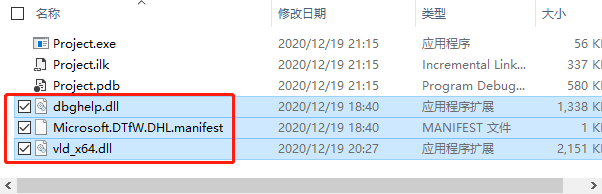
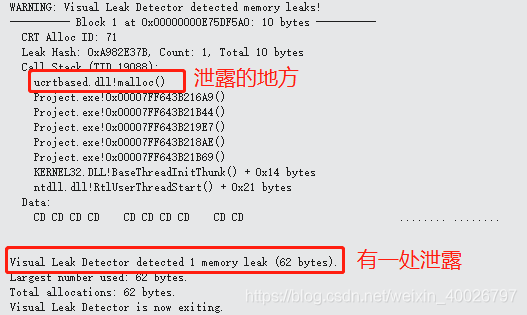
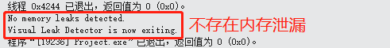

## 1 前言

本周在工作中接触了VLD(Visual Leak Detector)工具，该工具是一款在Visual Studio C++中使用的开源的检测内存泄露软件，本文从编译VLD开始记录该工具的使用方法。

## 2 下载VLD

VLD的 GitHub 仓库：[https://github.com/KindDragon/vld](https://github.com/KindDragon/vld)

下载后目录如下：



## 3 编译VLD

1. 使用Visual Studio 2015打开vld_vs14.sln，打开工程如下：



2. 编译其中的“vld”工程，若编译Win32版本，则会在 `vld/src/Win32/Debug-v140` 目录下生成 `vld.lib`；若编译x64版本，则会在 `vld\src\bin\x64\Debug-v140` 目录下生成 `vld.lib`。

## 4 使用VLD检测内存泄漏

1. 新建C++项目：Project。

2. 在Project项目的属性页包含目录 `vld/src`，如下图：



3. 在Project项目的属性页包含vld库目录，例如此处使用x64版本的库目录：`vld\src\bin\x64\Debug-v140`。



4. 在Project项目的属性页添加依赖项 `vld.lib`，如下图：



5. 将 `\vld\src\bin\x64\Debug-v140\vld_x64.dll` 拷贝到Project工程的exe可执行文件所在的目录下。

6. 将目录 `vld\setup\dbghelp\x64` 目录下的 `dbghelp.dll` 和 `Microsoft.DTfW.DHL.manifest` 文件拷贝到Project工程的exe可执行文件所在的目录下，如下图：



7. 测试程序：

```c
#include "vld.h" /* 测试程序的内存泄露只需包含头文件vld.h */
#include "stdio.h"
#include <stdlib.h>

int main()
{
	char * str = (char*)malloc(10);
	//free(str);
	return 0;
}
```

运行结果如下图：



若把 `free(str);` 代码的注释取消，再编译运行，结果如下：


