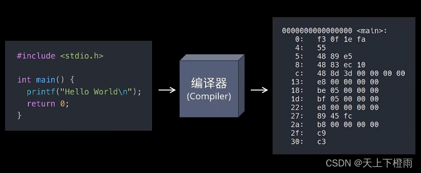

## 1 前言

在开发程序的过程中，编译和链接是一定会经历但很少被重视的步骤，通常这两个步骤会被 IDE 封装，开发者只需一键构建即可，但遇到错误（尤其是链接相关的错误）时，如果不了解编译和链接的原理，就很难定位并解决问题。本文则尝试分析并记录程序编译和链接的整个过程。


## 2 什么是编译？

编译的过程其实是将我们程序的源代码翻译成CPU能够直接运行的机器代码。



比如，写一个源文件 main.c，代码如下：

```c
#include <stdio.h>

int add(int a, int b);

int main() {
    printf("Hello World!\n");
    int result = add(5, 5);
    return 0;
}
```

其中打印一行文本，并调用了一个 `add()` 函数，该函数被定义在另一个源文件 `math.c` 中，代码如下：

```c
int add(int a, int b) {
    return a + b;
}
```

### 2.1 编译源码

接下来，我们可以调用 `gcc -c` 来分别编译这两个文件，命令如下：

```bash
gcc -c main.c
gcc -c math.c
```

> 备注：常用的 C/C++ 编译器除了 gcc 还有 clang、msvc 等等。

需要注意的是，**编译永远都是以单个源文件为单位的**。在实际开发中，我们通常会将不同功能的代码分散到不同的源文件，一方面方便代码的阅读和维护，同时也提升了软件构建的速度。

比如，我们修改了其中某一个源文件，那么只需要单独编译它这一个文件即可，不需要浪费时间重新编译整个工程。

### 2.2 二进制的目标文件

执行上述的 gcc 编译命令后，可以看到，在编译之后会生成两个扩展名为 `.o` 的文件，它们被称作目标文件。

目标文件是一个二进制的文件，文件的格式是 `ELF(Executable and Linkable Format)`，Linux 下所有可执行文件的通用格式。相应的 Windows 使用的是另一种格式 `PE`，它们虽然互不兼容，但在结构上非常相似，都是对二进制代码的一种封装。

我们可以在文件头部找到可执行文件的基本信息，比如支持的操作系统、计器类型等等，执行以下命令查看：

```bash
readelf -h main.o
```

输出结果：

```bash
ELF 头：
  Magic：   7f 45 4c 46 02 01 01 00 00 00 00 00 00 00 00 00 
  类别:                              ELF64
  数据:                              2 补码，小端序 (little endian)
  版本:                              1 (current)
  OS/ABI:                            UNIX - System V
  ABI 版本:                          0
  类型:                              REL (可重定位文件)
  系统架构:                          Advanced Micro Devices X86-64
  版本:                              0x1
  入口点地址：               0x0
  程序头起点：          0 (bytes into file)
  Start of section headers:          744 (bytes into file)
  标志：             0x0
  本头的大小：       64 (字节)
  程序头大小：       0 (字节)
  Number of program headers:         0
  节头大小：         64 (字节)
  节头数量：         13
  字符串表索引节头： 10
```

文件后面则是一系列的区块，里面有我们的计器代码还有程序的数据等等，查看区块/段(Sections)：

```bash
readelf -S main.o
```

输出结果：

```bash
共有 13 个节头，从偏移量 0x2e8 开始：

节头：
  [号] 名称              类型             地址              偏移量
       大小              全体大小          旗标   链接   信息   对齐
  [ 0]                   NULL             0000000000000000  00000000
       0000000000000000  0000000000000000           0     0     0
  [ 1] .text             PROGBITS         0000000000000000  00000040
       000000000000002b  0000000000000000  AX       0     0     1
  [ 2] .rela.text        RELA             0000000000000000  00000220
       0000000000000048  0000000000000018   I      11     1     8
  [ 3] .data             PROGBITS         0000000000000000  0000006b
       0000000000000000  0000000000000000  WA       0     0     1
  [ 4] .bss              NOBITS           0000000000000000  0000006b
       0000000000000000  0000000000000000  WA       0     0     1
  [ 5] .rodata           PROGBITS         0000000000000000  0000006b
       000000000000000d  0000000000000000   A       0     0     1
  [ 6] .comment          PROGBITS         0000000000000000  00000078
       0000000000000036  0000000000000001  MS       0     0     1
  [ 7] .note.GNU-stack   PROGBITS         0000000000000000  000000ae
       0000000000000000  0000000000000000           0     0     1
  [ 8] .eh_frame         PROGBITS         0000000000000000  000000b0
       0000000000000038  0000000000000000   A       0     0     8
  [ 9] .rela.eh_frame    RELA             0000000000000000  00000268
       0000000000000018  0000000000000018   I      11     8     8
  [10] .shstrtab         STRTAB           0000000000000000  00000280
       0000000000000061  0000000000000000           0     0     1
  [11] .symtab           SYMTAB           0000000000000000  000000e8
       0000000000000120  0000000000000018          12     9     8
  [12] .strtab           STRTAB           0000000000000000  00000208
       0000000000000016  0000000000000000           0     0     1
Key to Flags:
  W (write), A (alloc), X (execute), M (merge), S (strings), l (large)
  I (info), L (link order), G (group), T (TLS), E (exclude), x (unknown)
  O (extra OS processing required) o (OS specific), p (processor specific)
```

在以上信息中，经常提到有：

- `.text` 代码区，里面是之前编译好的机器代码；
- `.data` 数据区，里面保存了我们初始化的全局变量、局部静态变量等等；

需要注意的是，目标文件虽然包含了编译之后的机器代码，但它并不能够直接执行，操作系统也不允许你区执行它。因为我们在编译的过程中，用到了尚未定义的 `add()` 函数。

在主程序中 `add()` 其实只是一句声明而已，它被定义在另一个模块 `math.c` 中，这同样也包括我们用到的标准库中的 `printf()` 函数，如果我们去查看 `stdio.h` 头文件，其中的 `printf()` 也只是一个函数声明而已。

换句话说，我们在编译 `main.c` 时，编译器完全不知道 `printf()` 和 `add()` 函数的存在，比如它们位于内存的哪个区块、代码长什么样，都是不知道的。因此编译器只能将这个两个函数的跳转地址暂时先设为 0，随后在链接的时候再去修正它。

比如，我们来看一下 `main.o` 这个目标文件中的内容：

```bash
objdump -s -d main.o
```

输出结果：

```bash
main.o：     文件格式 elf64-x86-64

Contents of section .text:
 0000 554889e5 4883ec10 bf000000 00e80000  UH..H...........
 0010 0000be05 000000bf 05000000 e8000000  ................
 0020 008945fc b8000000 00c9c3             ..E........     
Contents of section .rodata:
 0000 48656c6c 6f20576f 726c6421 00        Hello World!.   
Contents of section .comment:
 0000 00474343 3a202855 62756e74 7520352e  .GCC: (Ubuntu 5.
 0010 342e302d 36756275 6e747531 7e31362e  4.0-6ubuntu1~16.
 0020 30342e31 32292035 2e342e30 20323031  04.12) 5.4.0 201
 0030 36303630 3900                        60609.          
Contents of section .eh_frame:
 0000 14000000 00000000 017a5200 01781001  .........zR..x..
 0010 1b0c0708 90010000 1c000000 1c000000  ................
 0020 00000000 2b000000 00410e10 8602430d  ....+....A....C.
 0030 06660c07 08000000                    .f......        

Disassembly of section .text:

0000000000000000 <main>:
   0:   55                      push   %rbp
   1:   48 89 e5                mov    %rsp,%rbp
   4:   48 83 ec 10             sub    $0x10,%rsp
   8:   bf 00 00 00 00          mov    $0x0,%edi
   d:   e8 00 00 00 00          callq  12 <main+0x12>
  12:   be 05 00 00 00          mov    $0x5,%esi
  17:   bf 05 00 00 00          mov    $0x5,%edi
  1c:   e8 00 00 00 00          callq  21 <main+0x21>
  21:   89 45 fc                mov    %eax,-0x4(%rbp)
  24:   b8 00 00 00 00          mov    $0x0,%eax
  29:   c9                      leaveq 
  2a:   c3                      retq 
```

上述的 `0000000000000000 <main>` 是指编译后的主函数代码，在下面的内容中，左边的是机器代码，右边是对应的反汇编，可以看到反汇编中的两个 `call` 指令，它们分别对应之前调用的 `printf()` 和 `add()` 函数，我们发现，它们的跳转地址都被设成了 0，而这里的 0 在后面链接的时候会被修正。

另外，为了让链接器能够定位到这些需要被修正的地址，在代码块中，我们还可以找到一个重定位表（Reloction Table），命令如下：

```bash
objdump -r main.o
```

输出结果：

```bash
main.o：     文件格式 elf64-x86-64

RELOCATION RECORDS FOR [.text]:
OFFSET           TYPE              VALUE 
0000000000000009 R_X86_64_32       .rodata
000000000000000e R_X86_64_PC32     puts-0x0000000000000004
000000000000001d R_X86_64_PC32     add-0x0000000000000004


RELOCATION RECORDS FOR [.eh_frame]:
OFFSET           TYPE              VALUE 
0000000000000020 R_X86_64_PC32     .text
```

比如在 `.text` 区块中，需要被重定位的两个函数 `printf()` 和 `add()`，它们分别位于偏移量 `0x0e` 和 `0x1d` 的位置，后面的 `R_X86_64_PC32` 是地址的类型和长度，这和我们之前看到的机器代码是一一对应的。

> 备注：这里的 `printf()` 函数显示为 `puts()` 是因为 `main.c` 中调用 `printf()` 函数时，传入的参数无需解析，即不含类似 `%s` 之类的 format 时，编译器会将其转换为 `puts()` 函数，进行简化。

## 3 什么是链接？

我们将编译生成的 `main.o` 和 `math.o` 链接生成一个独立的可执行文件，命令如下：

```bash
gcc main.o math.o -o demo
```

执行完成后，在终端目录下，我们可以找到生成的 demo 文件，该文件可以直接运行。

```bash
./demo
```

输出结果：

```bash
Hello World!
```

**链接其实将编译之后的所有目标文件，连同用到的一些静态库、运行时库（动态库）组合拼装成一个独立的可执行文件。**其中就包括我们之前提到的地址修正。

在这个时候，链接器会根据目标文件或者静态库中的重定位表，找到那些需要被重定位的函数、全局变量，从而修正它们的地址。


但如果我们在链接的时候忘记提供必须的目标文件，比如这里的 `math.o` 由于链接器找不到 `add()` 函数的实现，就会报错"引用未定义"(undefined reference to 'xxx')，或者有的编译器也叫"符号未定义"(undefined symbols to 'xxx')，意思就是我们的代码中用到了 `xxx`，但链接器却无法找到它的定义。

```bash
gcc main.o -o demo
```

输出结果：

```bash
main.o：在函数‘main’中：
main.c:(.text+0x1d)：对‘add’未定义的引用
collect2: error: ld returned 1 exit status
```

## 4 构建工具

本文到这里，相信大家对编译和链接已经有一定了解了，但如果我们每次都手动编译再链接显然不够高效，实际开发也没有人会这么做，通常我们都是用各种各样的 IDE 或者构建工具帮我们自动化整个流程。

我自己工作中常用到的构建工具主要有 Makefile 和 SCons，这里用最常见的 Makefile 来举例。

可能很多人对 Makefile 的印象是很古老，但其实 Makefile 除了软件构建之外还有许多其他的奇技淫巧，比如用它来自动生成文档等等，像很多现代的项目也都还在用它，譬如 Android OS 的构建等等。

Makefile 的核心是对"依赖"的管理，比如要构建上文中的可以执行程序 `demo`，则需要 `main.o` 和 `math.o` 文件同时执行 gcc 链接指令，构建 `main.o` 又需要 `main.c` 这个文件同时执行 gcc 编译命令，依此类推，我们可以发现，makefile 其实就是在定义一棵依赖树。


我们需要构建最右侧的这个目标文件就需要提供左边那些节点文件，然后这样层层递归下去，代码如下：

```makefile
all: demo

demo: main.o math.o
				gcc main.o math.o -o demo

main.o: main.c
				gcc -c main.c

math.o: math.c
				gcc -c math.c

clean:
				rm demo main.o math.o
```

有了 makefile 以后我们可以调用 make 命令，后面跟上目标的名称 `demo`，它会自动根据我们"依赖树"递归地去构建这个可执行文件：

```bash
make demo
```

第一次运行由于所有叶子节点都不存在，make 会自动构建所有的依赖，包括其中的目标文件：

```bash
tree
```

输出结果

```bash
.
├── main
├── main.c
├── main.o
├── makefile
├── math.c
└── math.o

0 directories, 6 files
```

如果我们再运行一次 make，由于所有的文件都已经存在，并且是最新的，make 就不会再重复构建了。

```bash
make: 'demo' is up to date.
```

如果后续我们修改了 `main.c` 文件，由于 `main.c` 只会影响 `main.o`，从而影响最后的可执行文件 `demo`，所以 make 只会去重新生成这两个相关的文件，从而避免了其他不必要的文件编译。

其实所有的现代化构建工具都用到了相同的原理——对依赖的管理，只不过加入了一些更实用的功能，比如脚本语言的支持（SCons就是基于Python实现的，因此支持Python语言的功能）、第三方库的管理等等。
