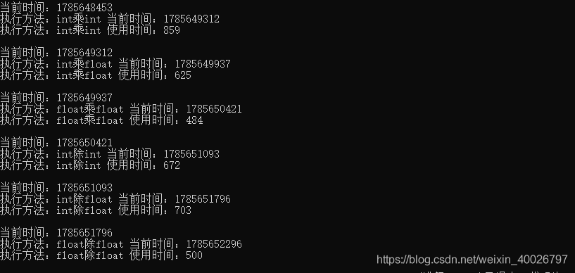
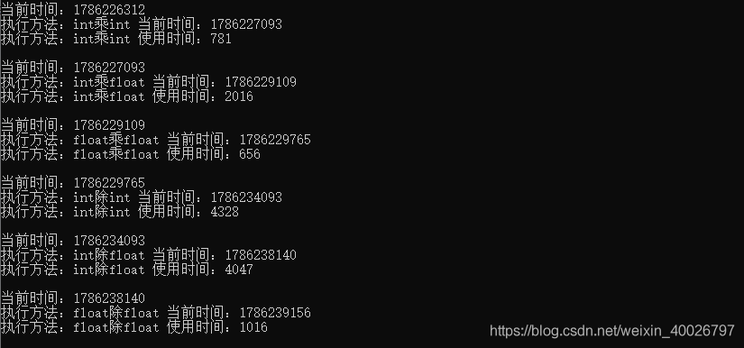
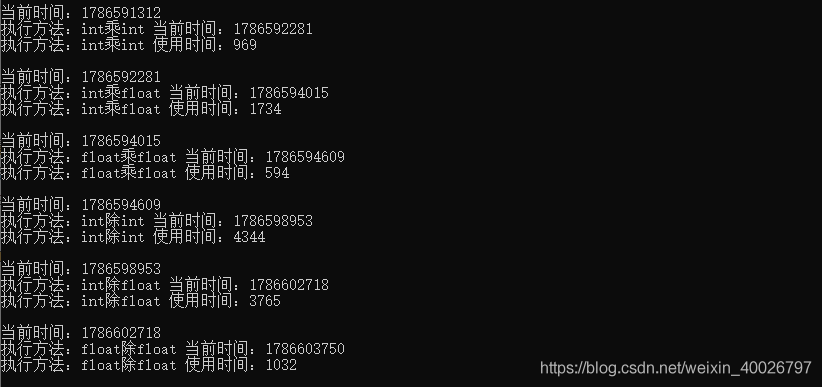
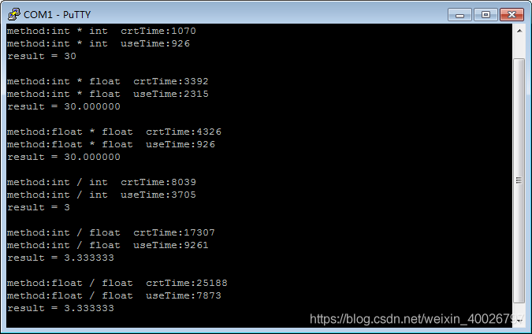
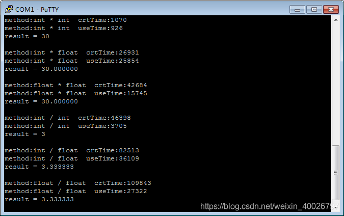

## 1 前言

在前不久的转正面谈中，提到一个问题：计算机中 int 和 float 的运行到底那个更快？按想当然的理解，当然是int更快，但是我自己也没真正去测试过，不是很清楚，在实际测试后发现结果与想象大不相同。因此，本文记录一下对这个问题的思考与实践。

## 2 int和float的储存结构

要解答这个问题，首先需要知道 int 和 float 的储存结构。int 和 float 都是4个字节，但存储结构不一样，并且表示范围也不一样。紧接着就出现了一个疑问，到底哪些 int 值是 float 不能表示的呢？

### 2.1 小数十进制与二进制的转换

小数由二进制转换成十进制的原理跟整数一样，例如二进制11.11转换为十进制如下：

```bash
1 * 2^1 + 1 * 2^0 + 1 * 2^(-1) + 1 * 2^(-2) = 3.75
```

十进制转换成二进制：整数部分就不说了，小数部分采用乘2取整的方式，比如3.75的小数部分为0.75，步骤如下：

1. 先用 0.75 乘 2 等于 1.5，取整数部分 1；
2. 再用 1.5 的小数部分 0.5 乘 2 等于 1 ，此时已经没有小数部分了，因此 0.75 对应的二进制为 0.11。

根据以上内容，3.75 对应的二进制为 11.11。注意这里的 3.75 和 11.11 只是浮点数十进制和二进制的不同表现形式，储存结构是一样的，因为本来就是一个数，那么在内存中是如何储存的呢？详见下文。

### 2.2 float的存储结构

float 在内存中占32位，第一位是符号位（sign），符号位后面 8 位是指数位（exponent），最后 23 位是尾数（mantissa）。

float值的二进制表示形式如下（该表达式对应上述二进制存储结构）：

```bash
sign * mantissa * 2 ^ (exponent)
```

- 符号位：表示浮点数的正负，0为正，1为负；
- 指数位：实际上也有正负，但没有单独的符号位，计算机中使用二进制，指数表示的也是 2 的 N 次幂，8 位指数表达的范围是 0至255，而实际上是-127至128，也就是说，实际的指数等于指数位表示的数值减127。
- 尾数位：只表示二进制的小数点后的部分，小数点前的那位被省略了，当指数位全部为0时，省略的是0，否则省略的是1，下面看个例子：

二进制 11.11 表示成指数形式是 `1.111 * 2 ^ 1，0.1111` 表示成指数形式是 `1.111 * 2 ^ (-1)`。由此可见，正常情况下二进制的指数形式是肯定有一个 1 的，所以存储的时候直接省略。但是在指数位全部为0时，指数是-127，这个数字是有特殊含义的，在尾数全部为0时代表的数值是0，省略的那位是0，如果省略的是 1 那么 0 这个数字就没法用float表示了。

### 2.3 float无法表示的int

了解上文内容后，再来看一下 3.75 的储存结构。首先转换为二进制为 11.11，然后转换为二进制的指数形式为 1.111 * 2 ^ 1。由此可以得知尾数部分是 111（将小数点前的1省略了），不足 23 的后边补 0，指数位是 1 + 127 = 128，对应二进制 10000000，所以 3.75 的储存结构如下：

```bash
01000000011100000000000000000000
```

反过来转换一下，符号位是 0，为正数，指数位是128，实际指数是 128 - 127 = 1，尾数是111，再加上省略的那位就是 1.111，所以对应的二进制指数形式为 1.111 * 2 ^ 1，转换为十进制是 3.75。

到这里可以看出，实际上尾数位决定了浮点数的精度，尾数只有23位，加上省略的那位就是24位，如果一个 int 类型的值小于等于 2 ^ 24，那么 float 是完全可以表示的，否则就不一定了。

假如一个 int 数值的二进制表示形式是 100000000000000000000000，表示成指数形式是 1.00000000000000000000000 * 2 ^ 23，对应的 float 的类型，尾数位全部为 0，指数位是 23 + 127 = 150，这样完全没有问题。

假如一个 int 数值的二进制表示形式是 1000000000000000000000001，表示成指数形式是 1.000000000000000000000001 * 2 ^ 24，对应的float的类型尾数位是 000000000000000000000001 一共24位，这样就完全超出了 float 最多容纳 23 位尾数的能力。所以就不能正确表达这个 int 值了。

**由此也可以得出不能被 float 准确表达的最小 int 值是2 ^ 24 + 1**。

我们再将1000000000000000000000001的值加1，变成1000000000000000000000010，这样变换为指数形式可以看出尾数又变为了23位，**也就是说25位的二进制整数最后一位是0才能被float准确表示，每2个数就有一个不能被准确表示。如果是26位的二进制整数最后两位都是0才可以被float准确表达，每4个数就有3个不能被准确表示，以此类推。**

## 3 int 和 float 的运算性能

### 3.1 PC上的性能测试

了解完 int 和 float 的储存结构区别后，我们先来测试一下PC上二者的运算性能，CPU型号为AMD R74800H，此处主要测试二者做乘除法运算的性能，代码如下，需要注意的是此处单纯的使用主线程进行运算，查看运算时间的差异（各做100000000000次运算）。

> 注意：
> 1. 不使用线程是因为线程有资源优先级的问题，要排除这个影响。
> 2. 同时，不使用数值类型强转，避免其他性能消耗影响 。
> 3. 最后，为了普适化，使用 10 和 3 这种除不尽的数值。

```cpp
#include <iostream>
#include <Windows.h>
#include <string.h>

using namespace std;

#define COUNT 100000000000;
static DWORD crtTime = 0;

void PrintCrtTime()
{
	crtTime = GetTickCount();
	cout << endl;
	cout << "当前时间：" << crtTime << endl;
}

void PrintElapseTime(string method)
{
	DWORD crt = GetTickCount();
	cout << "执行方法：" << method.c_str() << " 当前时间：" << crt << endl;
	cout << "执行方法：" << method.c_str() << " 使用时间：" << crt - crtTime << endl;
}

void IntMultiplyInt()
{
	PrintCrtTime();
	int count = COUNT;
	int a = 10;
	int b = 3;
	int c;
	while (count > 0)
	{
		a * b;
		//c = (int)(a * b);
		count--;
	}
	PrintElapseTime("int乘int");
}

void IntMultiplyFloat()
{
	PrintCrtTime();
	int count = COUNT;
	int a = 10;
	float b = 3.0;
	int c;
	while (count > 0)
	{
		a * b;
		//c = (int)(a * b);
		count--;
	}
	PrintElapseTime("int乘float");
}

void FloatMultiplyFloat()
{
	PrintCrtTime();
	int count = COUNT;
	float a = 10.0;
	float b = 3.0;
	int c;
	while (count > 0)
	{
		a * b;
		//c = (int)(a * b);
		count--;
	}
	PrintElapseTime("float乘float");
}

void IntDivisionInt()
{
	PrintCrtTime();
	int count = COUNT;
	int a = 10;
	int b = 3;
	int c;
	while (count > 0)
	{
		a / b;
		//c = (int)(a / b);
		count--;
	}
	PrintElapseTime("int除int");
}

void IntDivisionFloat()
{
	PrintCrtTime();
	int count = COUNT;
	int a = 10;
	float b = 3.0;
	int c;
	while (count > 0)
	{
		a / b;
		//c = (int)(a / b);
		count--;
	}
	PrintElapseTime("int除float");
}

void FloatDivisionFloat()
{
	PrintCrtTime();
	int count = COUNT;
	float a = 10.0;
	float b = 3.0;
	int c;
	while (count > 0)
	{
		a / b;
		//c = (int)(a / b);
		count--;
	}
	PrintElapseTime("float除float");
}

int main()
{
	IntMultiplyInt();
	IntMultiplyFloat();
	FloatMultiplyFloat();

	IntDivisionInt();
	IntDivisionFloat();
	FloatDivisionFloat();

	return 0;
}
```

运算结果如下：



可以看出，int 乘 int 消耗时间最多，float数据做运行的速度甚至比 int 要快那么一点点，但是从整体看来，区别不大，所以在100000000000次运算下，可以说单纯的乘除运算，int 和 float 的性能几乎一样。

但是，通常情况下，使用代码进行数值运算后，肯定要储存结果，那么就存在数据转换问题，接下来我们使用 int c 储存结果，看看运算的性能差别，修改代码：

```cpp
int c; c = (int)(a * b); c = (int)(a / b);
```

运算结果如下：



可以看得出来以下三点：

1. int 除 int 消耗性能最高； 
2. 乘除法运算中，不同类型相乘除相对比较耗时； 
3. 都使用float运算，耗时最少，性能最高；

那如果把 c 改成 float 呢？修改代码：

```cpp
float c; c = (float)(a * b); c = (float)(a / b);
```

运行结果如下：



可以看出，不同类型运算依旧相对比较耗时，同时，float 类型做乘除运算都比 int 要快一些，特别是除法运算，性能更高。

### 3.2 嵌入式开发板上的性能测试

我们都知道PC上的CPU，只要不是特别古董，通常都是带有FPU（浮点运算单元），那如果关闭该模块，结果会是怎样的呢？接下来我们在嵌入式开发板（STM32F767igtx）上测试二者的运算性能，该开发板使用M7芯片，可关闭或开启FPU功能，代码如下：

> 注意：使用Keil编译程序时要设置代码优化等级为0，否则影响测试结果。

```c
#include "stdio.h"
#include "awtk.h"
#include "tkc/platform.h"

#define count_sum 10000 * 10000;
static uint64_t crt_time = 0;

static void PrintCrtTime()
{
  crt_time = get_time_ms64();
}

static void PrintElapseTime(const char *method)
{
  uint64_t crt = get_time_ms64();
  printf("method:%s  crtTime:%llu\r\n", method, crt);
  printf("method:%s  useTime:%llu\r\n", method, crt - crt_time);
}

static void IntMultiplyInt()
{
  int count = count_sum;
  int a = 10;
  int b = 3;
  int c;
  PrintCrtTime();
  while (count > 0)
  {
    c = a * b;
    count--;
  }
  PrintElapseTime("int * int");
  printf("result = %d \r\n\r\n", c);
}

static void IntMultiplyFloat()
{
  int count = count_sum;
  int a = 10;
  float b = 3.0;
  float c;
  PrintCrtTime();
  while (count > 0)
  {
    c = a * b;
    count--;
  }
  PrintElapseTime("int * float");
  printf("result = %f \r\n\r\n", c);
}

static void FloatMultiplyFloat()
{
  int count = count_sum;
  float a = 10.0;
  float b = 3.0;
  float c;
  PrintCrtTime();
  while (count > 0)
  {
    c = a * b;
    count--;
  }
  PrintElapseTime("float * float");
  printf("result = %f \r\n\r\n", c);
}

static void IntDivisionInt()
{
  int count = count_sum;
  int a = 10;
  int b = 3;
  int c;
  PrintCrtTime();
  while (count > 0)
  {
    c = a / b;
    count--;
  }
  PrintElapseTime("int / int");
  printf("result = %d \r\n\r\n", c);
}

static void IntDivisionFloat()
{

  int count = count_sum;
  int a = 10;
  float b = 3.0;
  float c;
  PrintCrtTime();
  while (count > 0)
  {
    c = a / b;
    count--;
  }
  PrintElapseTime("int / float");
  printf("result = %f \r\n\r\n", c);
}

static void FloatDivisionFloat()
{
  int count = count_sum;
  float a = 10.0;
  float b = 3.0;
  float c;
  PrintCrtTime();
  while (count > 0)
  {
    c = a / b;
    count--;
  }
  PrintElapseTime("float / float");
  printf("result = %f \r\n\r\n", c);
}

/* 初始化 */
ret_t application_init(void)
{
  widget_t *win = window_open("home_page");
  IntMultiplyInt();
  IntMultiplyFloat();
  FloatMultiplyFloat();

  IntDivisionInt();
  IntDivisionFloat();
  FloatDivisionFloat();
  return RET_OK;
}

/* 退出 */
ret_t application_exit(void)
{
  log_debug("application_exit\n");
  return RET_OK;
}
```

先来看看开启FPU的结果，如下图：



可以看出 int 和 float 做乘法运算的性能时一样的，但除法都慢了很多，特别是 float 的除法，比 int 慢了将近一倍。

接下来看看关闭FPU后的结果，如下图：



可以看出没有FPU时，int 明显更快，性能差距有十几倍，而且 float 的除法还是明显比乘法慢。

## 4 总结

 经过以上测试，在平时写代码的时候，想提高代码运行的效率，总结如下：

1. 无论在任何平台，尽量使用同类型进行运算，这样相对比较快，节省了类型转化的时间。
2. 在高端平台（比如PC，CPU性能较强），不用特别在意 float 的乘除问题，float单纯做乘除法的运行性能差距不大，不需要特意将除法改写为乘法，反而特意改写后可能会造成多次复合运算后的精度不准确。但在低端平台（比如CPU为M4、M7等），float 的乘法明显比除法快，建议通过改写来提升效率。
3. 在高端平台上（比如PC，CPU性能较强），float 的乘除运算速度比 int 要快，很多人潜意识都觉得 float 的使用更消耗性能，好多时候都会强转成 int，没必要，不仅运算更慢，还不精确。当然，也不是说用 float 就是最好的选择，还需要考虑到 float 无法准确表示某些 int 数值的情况。
4. 在低端平台上（比如CPU为M4、M7等），开启FPU时，int 和 float 做乘法性能几乎一样；关闭FPU后，int 更快，且性能差距有十几倍。无论是否开启FPU，二者做除法运算都很慢，特别 float 的除法最慢，要避免使用。
